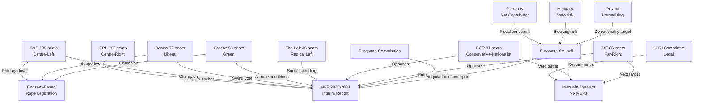

<!-- SPDX-FileCopyrightText: 2024-2026 Hack23 AB -->
<!-- SPDX-License-Identifier: Apache-2.0 -->

# Actor Mapping — EU Parliament April 28, 2026

**Date:** 2026-04-29 | **Article Type:** breaking | **Confidence:** 🟢 HIGH
**Admiralty Grade:** B2 | **Source:** EP MCP tools + prior run analysis

---

## Actor Roster

### Tier 1 — Primary Legislative Actors (direct participants in April 28 decisions)

| Actor | Type | Role | Alignment |
|-------|------|------|-----------|
| EPP (185 seats) | Political Group | Coalition anchor on MFF and immunity decisions | Centre-right, pro-EU |
| S&D (135 seats) | Political Group | Co-sponsor of MFF, champion of consent legislation | Centre-left, pro-EU |
| Renew Europe (77 seats) | Political Group | Swing vote on MFF; liberal on rights | Liberal, pro-EU |
| Greens/EFA (53 seats) | Political Group | Climate conditions on MFF; rights champion | Green-progressive, pro-EU |
| The Left (46 seats) | Political Group | Social spending advocate; anti-militarisation | Radical left, pro-EU |
| ECR (81 seats) | Political Group | Fiscal conservative; immunity victim (Jaki, Obajtek, Buczek) | Conservative-nationalist |
| PfE (85 seats) | Political Group | Sovereignist; immunity victim (Şoşoacă) | Far-right, sovereignist |
| NI (remaining) | Non-attached | Immunity victim (Braun); no coherent position | Mixed |

### Tier 2 — Institutional Actors

| Actor | Type | Role | Alignment |
|-------|------|------|-----------|
| European Commission | EU Institution | MFF proposal; consent legislation legal basis | Pro-integration |
| European Council | Intergovernmental | MFF final decision; member state interests | Variable |
| JURI Committee | EP Committee | Immunity waiver decisions; legal framework | Procedural-neutral |
| BUDG Committee | EP Committee | MFF interim report primary drafter | Budget-expansionist |
| CONT Committee | EP Committee | Budget oversight; accountability | Control-focused |

### Tier 3 — Member State Actors

| Actor | Type | Role | Alignment |
|-------|------|------|-----------|
| Germany | Member State | Net contributor; fiscal anchor | Fiscal conservative |
| France | Member State | Strategic autonomy advocate; industrial policy | Variable |
| Poland | Member State | Net beneficiary; conditionality target | Post-PiS normalising |
| Hungary | Member State | Conditionality opponent; veto threat | Anti-conditionality |
| Netherlands | Member State | Net contributor; fiscal restrictive | Fiscal conservative |
| Sweden | Member State | Net contributor | Fiscal conservative |
| Spain/Italy | Member States | Net beneficiaries; pro-expansion | Social spending |

### Tier 4 — External and Civil Society Actors

| Actor | Type | Role |
|-------|------|------|
| Women's Rights NGOs | Civil Society | Consent legislation advocacy |
| PKN Orlen (state company) | Corporate | Subject of Obajtek accountability proceedings |
| Polish Judicial System | National Institution | Accountability proceedings recipient |
| Romanian National Prosecution | National Institution | Şoşoacă proceedings recipient |
| IMF | International Organisation | Economic context for MFF projections |
| European Institute for Gender Equality (EIGE) | EU Agency | Data support for consent legislation |

---

## Influence Network

---

## Alliance Matrix

| Actor | EPP | S&D | Renew | Greens | Left | ECR | PfE |
|-------|-----|-----|-------|--------|------|-----|-----|
| **EPP** | — | Centrist coalition | Centrist coalition | Issue-by-issue | Limited | Competitive | Opposed |
| **S&D** | Centrist coalition | — | Progressive | Progressive | Progressive | Opposed | Opposed |
| **Renew** | Centrist coalition | Progressive | — | Issue-by-issue | Limited | Competitive | Opposed |
| **Greens** | Issue-by-issue | Progressive | Issue-by-issue | — | Occasional | Opposed | Opposed |
| **Left** | Limited | Progressive | Limited | Occasional | — | Opposed | Opposed |
| **ECR** | Competitive | Opposed | Competitive | Opposed | Opposed | — | Issue alignment |
| **PfE** | Opposed | Opposed | Opposed | Opposed | Opposed | Issue alignment | — |

**Coalition Reading:** On the April 28 session:
- MFF interim report: EPP + S&D + Renew + Greens (550 seats, 76%) — strong majority
- Immunity waivers: EPP + S&D + Renew + Greens + Left — supermajority
- Consent legislation: EPP (split) + S&D + Renew + Greens + Left — majority, some ECR/PfE dissent

---

## Vulnerability Assessment

| Actor | Vulnerability | Risk Level |
|-------|-------------|------------|
| Patryk Jaki (ECR/PL) | Criminal proceedings enabled — Warsaw court jurisdiction restored | 🔴 Critical |
| Daniel Obajtek (ECR/PL) | PKN Orlen investigation — financial misconduct allegations | 🔴 Critical |
| Tomasz Buczek (ECR/PL) | National proceedings restored | 🟠 High |
| Diana Iovanovici Şoşoacă (NI/RO) | Romanian prosecution — extremism-related charges | 🟠 High |
| Grzegorz Braun (NI/PL) | Hate crime/public order charges — Poland | 🟠 High |
| ECR Group (collectively) | Key Polish members face accountability — organisational disruption | 🟡 Medium |
| German Government | MFF position under domestic pressure — coalition fragility | 🟡 Medium |
| Hungarian Government | Rule-of-law proceedings + MFF conditionality — isolation risk | 🟡 Medium |

---

## Reader Briefing

**For Citizens:** The April 28 plenary involved a complex web of actors. The mainstream pro-EU parties (EPP, S&D, Renew, Greens) worked together on the budget framework and accountability decisions. Meanwhile, far-right groups (ECR, PfE) were directly affected — six of their members lost their legal immunity so courts in Poland and Romania can investigate serious allegations against them. Understanding who the key players are and what they stand to gain or lose from each decision is essential to making sense of European Parliament politics. The most important relationships are: (a) the pro-EU centrist coalition that makes decisions; (b) the far-right opposition that resists and challenges; and (c) the member state governments whose fiscal decisions will ultimately determine whether Parliament's ambitious budget vision succeeds.

---

## Data Sources & Provenance

| Source | Tool | Date |
|--------|------|------|
| EP MEPs | `get_meps` | 2026-04-29 |
| Political Groups | `generate_political_landscape` | 2026-04-29 |
| Adopted Texts | `get_adopted_texts_feed` | 2026-04-29 |
| Coalition Analysis | `analyze_coalition_dynamics` | 2026-04-29 |
| Stakeholder Analysis | intelligence/stakeholder-map.md | 2026-04-29 |

---

*EU Parliament Monitor | Actor Mapping | 2026-04-29*
