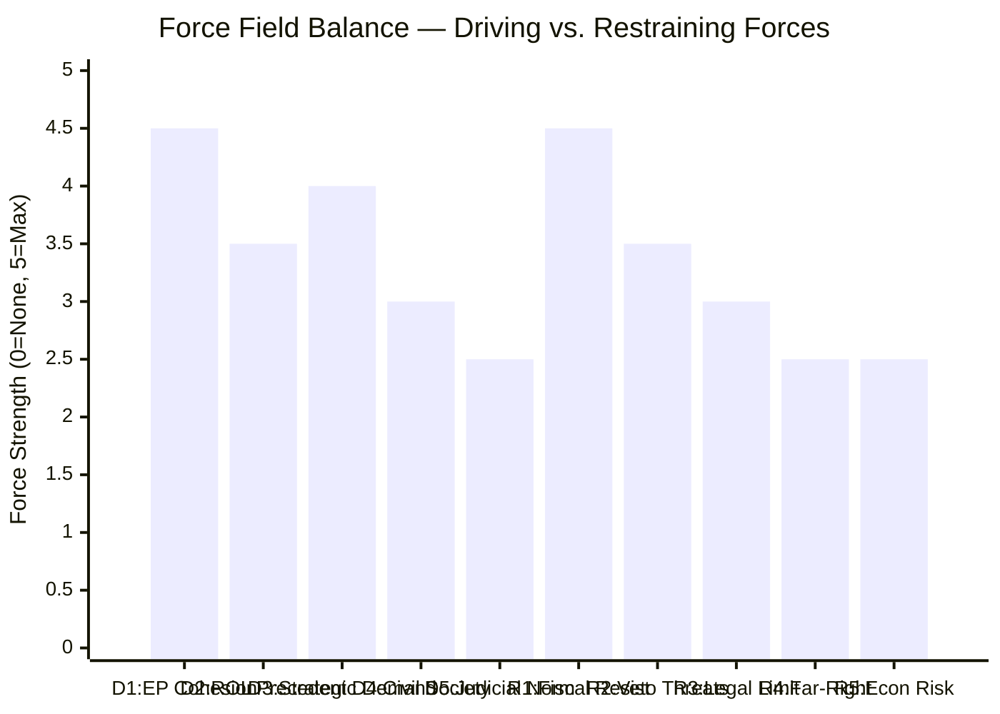

<!-- SPDX-FileCopyrightText: 2024-2026 Hack23 AB -->
<!-- SPDX-License-Identifier: Apache-2.0 -->

# Forces Analysis — EU Parliament April 28, 2026

**Date:** 2026-04-29 | **Article Type:** breaking | **Confidence:** 🟢 HIGH
**Admiralty Grade:** B2 | **Methodology:** Lewin Force Field Analysis + Structured Analytic Techniques

---

## Issue Frame

The April 28, 2026 European Parliament plenary session crystallised a fundamental contest over EU institutional identity across three simultaneous domains: (1) fiscal architecture for the 2028–2034 multiannual financial framework; (2) rule-of-law accountability enforcement via six immunity waivers targeting Eastern European nationalist politicians; and (3) gender justice norm-setting through a consent-based rape legislation resolution.

The session represents a macro-level test of whether the pro-European centrist coalition (EPP/S&D/Renew/Greens) can maintain agenda-setting dominance against sovereignist resistance (ECR/PfE/NI), and whether EU institutional authority is expanding, contracting, or holding steady across these three dimensions.

---

## Driving Forces (Towards Deeper EU Integration / Accountability)

### Force D1: Parliamentary Majority Cohesion on Budget Architecture
**Strength:** 🔴 Very Strong | **Evidence:** Cross-group consensus on MFF interim report reflects unusual alignment between EPP, S&D, Renew, and Greens on headline figures and own resources framework.
**Mechanism:** The April 28 session demonstrated that on existential EU-level questions (budget, defence, climate), the four-group centrist coalition maintains sufficient discipline to pass ambitious legislation despite internal tensions.
**Trajectory:** Expected to hold through 2026 negotiations, though cracks may emerge if economic shock materialises.

### Force D2: Rule-of-Law Precedent from Previous Term
**Strength:** 🟠 Strong | **Evidence:** The six immunity waivers apply established JURI jurisprudence from multiple prior terms. The legal framework is now mature — waivers are procedurally routine rather than exceptional.
**Mechanism:** Accumulated precedent normalises accountability proceedings against nationalist MEPs. JURI independence is institutionally protected.
**Trajectory:** Likely to continue — accountability proceedings may intensify as more PiS-era figures face domestic judicial action.

### Force D3: Member State Demand for EU Strategic Investment
**Strength:** 🟠 Strong | **Evidence:** Defence capability gaps, energy security vulnerabilities, and digital competitiveness deficits create genuine member state demand for EU-level investment that only an expanded MFF can provide.
**Mechanism:** Even net-contributor member states that resist budget expansion domestically face pressure to fund strategic investment at EU scale — individual national budgets are too small for the emerging security and technology challenges.
**Trajectory:** Growing — trade tensions (US tariffs) and security environment reinforce the case for EU strategic autonomy spending.

### Force D4: Civil Society Mobilisation on Gender Rights
**Strength:** 🟡 Medium | **Evidence:** Sustained NGO campaigning has maintained pressure for consent-based legislation across multiple parliamentary terms. The April 28 resolution reflects accumulated civil society input.
**Mechanism:** Feminist organisations, academic networks, and national advocacy groups have built a durable coalition that keeps gender legislation on the EP agenda even in the face of legal constraints.
**Trajectory:** Will intensify if Commission pursues revised legal basis for binding legislation.

### Force D5: Judicial Normalisation Momentum in Post-PiS Poland
**Strength:** 🟡 Medium | **Evidence:** The Tusk government's judicial normalisation programme creates domestic conditions in which EU-level immunity proceedings can translate into effective national accountability.
**Mechanism:** EP waiver decisions are actionable in Poland in a way they were not under the PiS government when the judicial system was compromised.
**Trajectory:** Dependent on Tusk coalition stability — a return to PiS governance would reverse this momentum.

---

## Restraining Forces (Against Deeper Integration / Accountability)

### Force R1: Net Contributor Fiscal Resistance
**Strength:** 🔴 Very Strong | **Evidence:** Germany, Netherlands, Austria, Sweden, and Denmark maintain domestic political pressure to minimise EU budget contributions. German fiscal constitutionalism (Schuldenbremse) constrains what Berlin can accept.
**Mechanism:** Council unanimity or qualified majority requirements mean net contributors can block or significantly dilute MFF ambitions. German political economy creates structural resistance to GNI contribution increases.
**Trajectory:** Persistent — will require significant political compromise to overcome.

### Force R2: Hungarian/Polish Veto Threats on Conditionality
**Strength:** 🟠 Strong | **Evidence:** Hungary has systematically used its Council veto power to block or delay EU rule-of-law enforcement. Under PiS, Poland did similarly; current Polish government is cooperative but fragile.
**Mechanism:** Council unanimity on MFF allows any single member state to hold negotiations hostage, particularly on conditionality provisions.
**Trajectory:** Hungary's Orbán government shows no sign of accommodation; Polish position depends on 2027 election outcome.

### Force R3: Constitutional Limits on EU Criminal Law Competence
**Strength:** 🟡 Medium | **Evidence:** CJEU jurisprudence limits EU competence in criminal law to areas with direct cross-border implications. Sexual violence legislation faces a genuine constitutional barrier that legal creativity has not yet overcome.
**Mechanism:** Article 83 TFEU and its limitations constrain binding EU sexual violence legislation absent a unanimous Council decision on new legal bases.
**Trajectory:** Stable — this constraint is structural until Treaties are revised.

### Force R4: ECR/PfE Coalition Resistance to Accountability
**Strength:** 🟡 Medium | **Evidence:** The far-right bloc will use every available procedural mechanism to protect members from immunity proceedings, cast proceedings as "political persecution," and seek judicial nullification.
**Mechanism:** Legal challenges, media narrative management, domestic party mobilisation, and international far-right solidarity networks all constrain the effectiveness of accountability proceedings.
**Trajectory:** Will intensify as proceedings advance, but unlikely to reverse EP decisions already taken.

### Force R5: Economic Uncertainty Undermining Budget Ambition
**Strength:** 🟡 Medium | **Evidence:** Global trade disruption (US tariffs), energy price volatility, and potential German recession create economic headwinds that make political agreement on expanded EU budgets harder.
**Mechanism:** Economic stress narrows the political space for ambitious fiscal commitments; austerity narratives gain traction when growth disappoints.
**Trajectory:** IMF April 2026 WEO projects EU growth at ~1.7% — moderate. Downside risks elevated.

---

## Net Pressure Assessment

**Overall Net Pressure:** The driving forces for EU institutional consolidation are marginally stronger than restraining forces in the short term, primarily because the centrist parliamentary coalition maintains internal cohesion. However, the structural fiscal constraints (net contributor resistance, constitutional limits) prevent decisive, rapid advancement. The equilibrium is likely a negotiated middle ground on MFF, incremental progress on accountability, and symbolic advancement on gender rights.

**Key Tipping Point:** The German government's final position on the MFF expansion. If Berlin offers a moderate compromise (€1.35–1.45 trillion, accepting CBAM/ETS own resources), the driving forces gain decisive advantage. If Germany holds a maximally restrictive position, expect Scenario 2 (Gridlock) as the likely outcome.

---

## Intervention Points

The most strategically leveraged points for changing the force balance:

1. **German Budget Coalition Dynamics:** Key opportunity window in Q3 2026 when the German government formulates its formal MFF position. Engaging the Bundestag's EU budget committee could shift the German opening offer.

2. **Council Rule-of-Law Procedure (Article 7):** Escalating formal proceedings against Hungary creates negotiating leverage that the Council can use to break Orbán's MFF veto threats.

3. **Commission MFF Proposal Framing:** If the Commission pitches its formal proposal as a "competitiveness and security" budget rather than a "social spending" budget, it may secure net-contributor support for the headline figures.

4. **Polish Judicial Cooperation Incentives:** EU financial support for Poland's judicial normalisation programme can be structured to build domestic momentum in Warsaw ahead of the immunity proceedings.

5. **Legal Basis Innovation on Gender Rights:** A Commission-CJEU advisory opinion process could identify new legal pathways for consent legislation that sidestep Article 83 constraints.

---

## Reader Briefing

**For Citizens:** The EU's budget and accountability decisions don't happen in a vacuum — they are shaped by powerful competing pressures. Wealthy northern member states (Germany, Netherlands) resist paying more into the EU's budget. Nationalist politicians fight to protect themselves from accountability proceedings. Constitutional rules limit what the EU can legislate on. But on the other side: there is genuine demand for EU-level defence and digital investment, a mature framework for rule-of-law enforcement, and sustained civil society advocacy for rights. The April 28 session shows the pro-EU forces winning this particular round — but structural resistance remains strong.

---

## Data Sources & Provenance

| Source | Tool | Date |
|--------|------|------|
| EP Political Landscape | `generate_political_landscape` | 2026-04-29 |
| EP Adopted Texts | `get_adopted_texts_feed` | 2026-04-29 |
| MFF Analysis | Prior run synthesis-summary.md | 2026-04-29 |
| Coalition Dynamics | Prior run coalition-dynamics.md | 2026-04-29 |

---

*EU Parliament Monitor | Forces Analysis | 2026-04-29*
