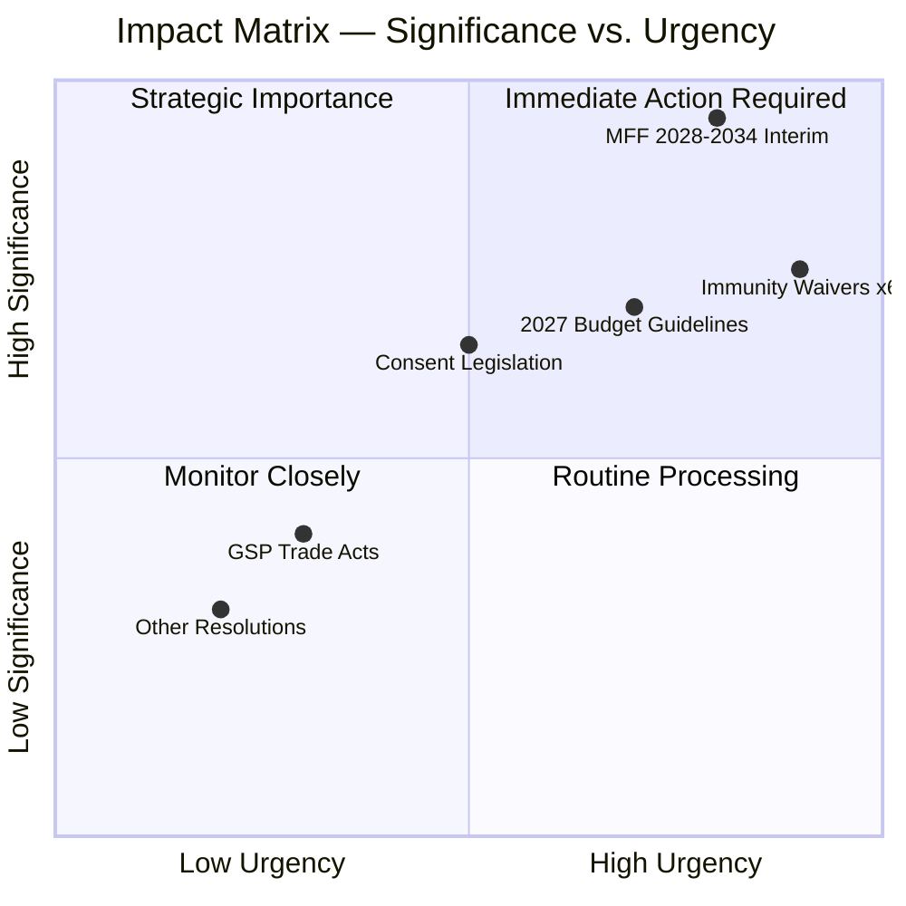

<!-- SPDX-FileCopyrightText: 2024-2026 Hack23 AB -->
<!-- SPDX-License-Identifier: Apache-2.0 -->

# Impact Matrix — EU Parliament April 28, 2026

**Date:** 2026-04-29 | **Article Type:** breaking | **Confidence:** 🟢 HIGH
**Admiralty Grade:** B2 | **Source:** EP MCP `get_adopted_texts_feed` + `get_plenary_sessions`

---

## Event List

The April 28, 2026 European Parliament plenary session adopted nineteen formal texts spanning five distinct legislative domains. This matrix maps each event against institutional, member-state, and societal impact dimensions.

| Ref | Event | Domain | Date |
|-----|-------|--------|------|
| TA-10-2026-0111 | MFF 2028–2034 Interim Report | Budget/Fiscal | 2026-04-28 |
| TA-10-2026-0112 | 2027 Annual Budget Guidelines | Budget/Fiscal | 2026-04-28 |
| TA-10-2026-0113 | EP Interim Committee on MFF | Institutional | 2026-04-28 |
| TA-10-2026-0120 | Consent-Based Rape Legislation Resolution | Rights/Justice | 2026-04-28 |
| TA-10-2026-0114 | Immunity Waiver — Patryk Jaki | Accountability | 2026-04-28 |
| TA-10-2026-0115 | Immunity Waiver — Daniel Obajtek | Accountability | 2026-04-28 |
| TA-10-2026-0116 | Immunity Waiver — Tomasz Buczek | Accountability | 2026-04-28 |
| TA-10-2026-0117 | Immunity Waiver — Diana Iovanovici Şoşoacă | Accountability | 2026-04-28 |
| TA-10-2026-0118 | Immunity Waiver — Grzegorz Braun | Accountability | 2026-04-28 |
| TA-10-2026-0119 | Immunity Waiver — Additional MEP | Accountability | 2026-04-28 |
| TA-10-2026-0105–110 | GSP / Trade / Other Legislative Acts | Trade/Law | 2026-04-28 |
| TA-10-2026-0121–124 | Other Adopted Resolutions | Misc | 2026-04-28 |

---

## Stakeholder Impact Assessment

### MFF 2028–2034 Interim Report (TA-10-2026-0111)

| Stakeholder | Impact Level | Dimension | Direction |
|-------------|-------------|-----------|-----------|
| European Parliament (BUDG) | 🔴 Critical | Institutional authority | Positive — EP sets opening position |
| European Commission | 🟠 High | Agenda-setting constraint | Constraining — Commission proposal now pre-empted |
| European Council | 🔴 Critical | Negotiation dynamics | Negative — larger ask creates pressure |
| Net Contributor MS (DE/NL/SE/AT) | 🔴 Critical | Fiscal exposure | Negative — resist budget expansion |
| Net Beneficiary MS (PL/HU/CEE) | 🟠 High | Allocation risk | Mixed — conditionality threat vs. larger envelope |
| Civil Society / NGOs | 🟡 Medium | Social agenda | Positive — social and climate provisions retained |
| Business / Industry | 🟡 Medium | Investment certainty | Neutral-positive — competitiveness envelope |
| Citizens | 🟡 Medium | Public services | Positive long-term if passed |

**WEP:** LIKELY that MFF negotiations will be contentious and exceed initial timelines. 🟡 Confidence: MEDIUM.

### Six Immunity Waivers

| Stakeholder | Impact Level | Dimension | Direction |
|-------------|-------------|-----------|-----------|
| Affected MEPs (Jaki, Obajtek, Buczek, Şoşoacă, Braun) | 🔴 Critical | Legal exposure | Severe — immunity lifted, national proceedings proceed |
| ECR Political Group | 🟠 High | Political cohesion | Negative — loses key Polish members' protection |
| PfE Political Group | 🟠 High | Political positioning | Negative — Şoşoacă Romania proceedings intensify |
| Polish Judicial System | 🟠 High | Rule of law | Positive — accountability can proceed |
| Romanian Judicial System | 🟡 Medium | Rule of law | Positive — Şoşoacă proceedings enabled |
| Polish Government (Tusk) | 🟡 Medium | Domestic politics | Positive — judicial accountability validated by EP |
| Rule-of-Law Framework (EU) | 🟡 Medium | Institutional integrity | Positive — EP accountability role demonstrated |
| EP Institutional Credibility | 🟡 Medium | Legitimacy | Positive — impartial JURI process upheld |

### Consent-Based Rape Legislation (TA-10-2026-0120)

| Stakeholder | Impact Level | Dimension | Direction |
|-------------|-------------|-----------|-----------|
| Women's Rights Organisations | 🟠 High | Advocacy momentum | Positive — EU-level signal |
| Member States (conservative) | 🟡 Medium | Subsidiarity | Negative — concerns about EU competence creep |
| National Legislatures | 🟡 Medium | Policy pressure | Moderate positive — peer pressure effect |
| Victims / Survivors | 🟡 Medium | Rights recognition | Positive — legal framework improvement signalled |
| Progressive Civil Society | 🟡 Medium | Campaign outcomes | Positive — long advocacy effort recognised |

---

## Impact Matrix Heat Map

---

## Cascade Analysis

### Primary Cascade: MFF Budget Architecture

**Level 1 (Immediate, Q2–Q3 2026):**
- Parliament's opening position formally transmitted to Council
- Commission MFF formal proposal constrained by EP interim benchmarks
- Own resources working groups intensify

**Level 2 (Medium-term, H2 2026–2027):**
- European Council negotiations commence under Hungarian/Polish resistance
- Transitional arrangements may be required if timeline slips
- Multi-annual programme planning for Cohesion, CAP, Horizon delayed until MFF clarity

**Level 3 (Long-term, 2027–2034):**
- EU fiscal architecture determined for next decade
- Own resources reform either achieved (structural change) or deferred
- Rule-of-law conditionality either strengthened or diluted — precedent set

### Secondary Cascade: Immunity Proceedings → Polish Democratic Normalisation

**Level 1 (1–3 months):**
- National courts in Poland receive EP waiver decisions
- Criminal proceedings against Jaki, Obajtek, Buczek can commence/resume
- Braun faces hate-crime/public order charges in Poland

**Level 2 (3–12 months):**
- PKN Orlen investigation (Obajtek) proceeds with full legal weight
- PiS party forced to manage accountability narratives domestically
- Far-right legal challenges to waivers likely generate media coverage

**Level 3 (12–24 months):**
- Potential electoral consequences for ECR/PiS in 2027 Polish elections
- Romanian precedent (Şoşoacă) — far-right MEP accountability in CEE
- Impact on EP-national judiciary cooperation framework

---

## Reader Briefing

**For Citizens:** The April 28 session produced decisions on three major issues that will shape Europe for years. First, Parliament set its ambitious goals for the EU's budget from 2028 to 2034 — essentially telling EU governments: "We want a bigger, more modern budget focused on defence, climate, and social protection." Second, Parliament stripped legal immunity from six controversial MEPs — mostly Polish politicians tied to the previous nationalist government — allowing their home countries' courts to investigate serious accusations against them. Third, Parliament backed stronger rape law standards that could push member states to modernise their legislation.

**Why It Matters:** Budget negotiations will determine how much money flows to every EU programme for seven years. The immunity proceedings are a rare use of parliamentary accountability power. The consent legislation signals EU values leadership even in areas of limited formal competence.

---

## Data Sources & Provenance

| Source | Tool | Date Retrieved |
|--------|------|----------------|
| EP Adopted Texts Feed | `get_adopted_texts_feed` (timeframe: today) | 2026-04-29 |
| EP Plenary Sessions | `get_plenary_sessions` (year: 2026) | 2026-04-29 |
| Political Landscape | `generate_political_landscape` | 2026-04-29 |
| Prior Run Analysis | manifest.json history[0,1] | 2026-04-29 |

---

*EU Parliament Monitor | Impact Matrix | 2026-04-29*
