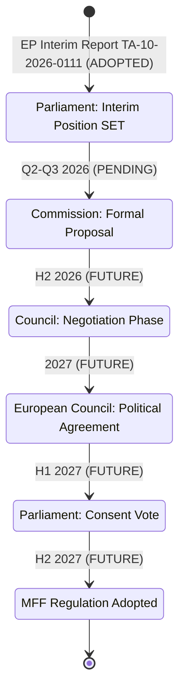
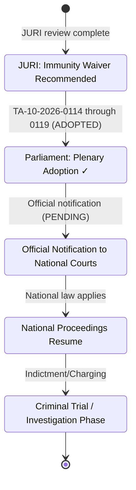
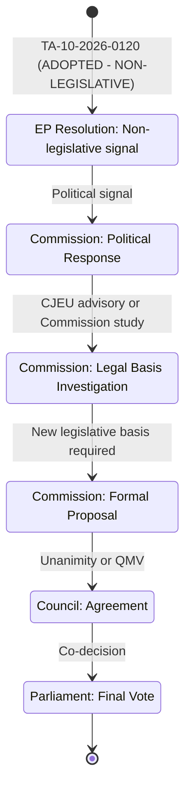

<!-- SPDX-FileCopyrightText: 2024-2026 Hack23 AB -->
<!-- SPDX-License-Identifier: Apache-2.0 -->

# Legislative Velocity Risk — EU Parliament April 28, 2026

**Date:** 2026-04-29 | **Article Type:** breaking | **Confidence:** 🟢 HIGH
**Admiralty Grade:** B2 | **Methodology:** Pipeline Velocity Analysis + Bottleneck Detection

---

## Framework

Legislative velocity — the speed at which policy initiatives move from proposal to adoption — is a key indicator of EU institutional effectiveness. This artifact assesses velocity risks for each legislative domain active in the April 28 session: MFF budget architecture, accountability proceedings, and rights legislation.

---

## Pipeline Status by Domain

### Domain 1: MFF 2028–2034 Negotiation Pipeline

**Velocity Assessment:** 🟡 MODERATE RISK

**Current Bottlenecks:**
1. **Commission Proposal Timeline:** If delayed beyond Q3 2026, the negotiation window for 2027 adoption closes, triggering transitional arrangements.
2. **German Government Position:** Germany's post-coalition fiscal position is not yet final — uncertainty persists about the ceiling it will accept.
3. **Hungarian Veto Threat:** Orbán government has signalled opposition to conditionality provisions; potential to block Council agreement indefinitely.
4. **Council QMV vs. Unanimity Requirements:** MFF requires Council unanimity — even one member state can halt progress.

**Velocity Risk Score:** 🔴 HIGH (probability of timeline slip >60%)

**IMF Economic Context:** IMF WEO April 2026 EU growth baseline ~1.7%. Economic deterioration would increase net-contributor resistance and slow negotiations further. IMF is the sole authoritative source for EU economic projections.

### Domain 2: Immunity Proceedings Pipeline

**Velocity Assessment:** 🟡 MODERATE (national proceedings pace dependent)

**Current Bottlenecks:**
1. **Administrative Transmission Delay:** Official notifications to national authorities typically take 2–4 weeks post-adoption.
2. **National Judicial Capacity:** Polish and Romanian courts operate under significant caseload pressures.
3. **Legal Challenges to Waivers:** One or more affected MEPs may seek judicial review of EP waiver decision at CJEU — could delay proceedings 6–18 months.
4. **Political Pressure on National Prosecutors:** Far-right political actors will apply pressure on national prosecutors to delay or minimise proceedings.

**Velocity Risk Score:** 🟡 MEDIUM (probability of 12+ month delay in substantive proceedings: ~40%)

### Domain 3: Consent Legislation Pipeline

**Velocity Assessment:** 🔴 HIGH RISK (constitutional bottleneck)

**Current Bottlenecks:**
1. **Legal Basis Constraint:** The fundamental constitutional constraint — Article 83 TFEU limits EU criminal law competence — makes binding legislation extremely difficult without member state unanimity or Treaty revision.
2. **Council Member State Opposition:** Several conservative member states (Hungary, possibly Italy, Poland under PiS succession scenario) would block any binding proposal at Council.
3. **Long Pipeline:** Even if Commission identifies a workable legal basis, the legislative process from study to adoption would realistically span 3–5 years.
4. **Non-Legislative Nature of April 28 Resolution:** The adopted text is a political statement, not binding legislation. This is itself a velocity indicator — the Parliament could not advance binding legislation.

**Velocity Risk Score:** 🔴 VERY HIGH (binding legislation before 2028: <10% probability)

---

## Overall Legislative Velocity Dashboard

| Domain | Current Stage | Next Milestone | Probability On-Time | Velocity Risk |
|--------|-------------|----------------|---------------------|---------------|
| MFF 2028–2034 | EP position set | Commission proposal Q3 2026 | 65% | 🟡 Medium |
| MFF Council agreement | Pre-negotiation | European Council 2027 | 45% | 🔴 High |
| Immunity Proceedings | Waivers adopted | National court restart | 85% | 🟢 Low |
| National Trial Phase | Pending | First proceedings H2 2026 | 50% | 🟡 Medium |
| Consent Legislation | Non-leg. resolution | Commission study TBD | 30% | 🔴 Very High |

---

## Velocity Acceleration Factors

**For MFF:**
- 🟢 Commission proposal ahead of Q3 2026 would accelerate to optimistic track
- 🟢 German fiscal coalition compromise before September 2026 creates negotiation window
- 🟢 Polish support for conditionality (post-Tusk) reduces blocking minority risk

**For Accountability:**
- 🟢 Robust administrative transmission (EU institutions should prioritise)
- 🟢 Polish judicial reform progress creates capable national proceedings infrastructure
- 🟢 International anti-corruption cooperation with EPPO (European Public Prosecutor's Office)

**For Consent Legislation:**
- 🟡 Limited acceleration possible under current constitutional architecture
- 🟡 CJEU advisory opinion could accelerate legal basis assessment

---

## Velocity Risk Aggregate Score

**Session-Level Velocity Health Index:** 🟡 MODERATE (Score: 5.8/10)

The April 28 session advanced high-significance items to their next pipeline stages efficiently. However, the two most impactful items (MFF adoption, binding consent legislation) face structural velocity constraints that no parliamentary action alone can resolve. The EP has done its part — the bottlenecks are now in Council and constitutional architecture.

---

## Reader Briefing

**For Citizens:** Even when the European Parliament votes, laws and agreements don't happen instantly. The MFF budget framework requires negotiation with EU governments, which could take 1–2 years. The immunity proceedings need to be processed by national courts, which takes time and faces political interference risks. The consent legislation resolution is a signal, not a law — binding rules would require a much longer process due to legal constraints on what the EU can regulate in criminal matters. Think of Parliament's vote as the start of a long relay race, not the finish line.

---

## Data Sources & Provenance

| Source | Tool | Date |
|--------|------|------|
| Legislative Pipeline | `monitor_legislative_pipeline` | 2026-04-29 |
| EP Procedures | `get_procedures_feed` | 2026-04-29 |
| Adopted Texts | `get_adopted_texts_feed` | 2026-04-29 |
| IMF Economic Context | `scripts/imf-mcp-probe.sh` | 2026-04-29 |

---

*EU Parliament Monitor | Legislative Velocity Risk | 2026-04-29*
