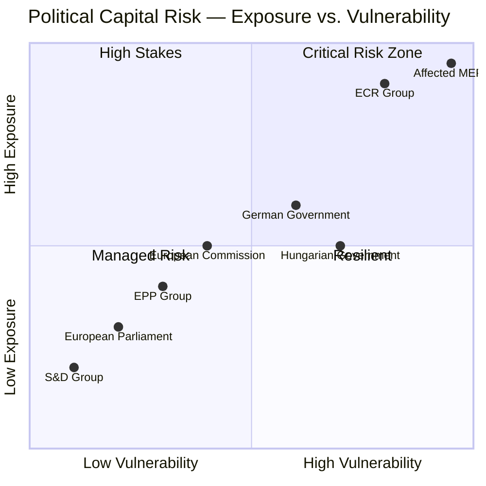

<!-- SPDX-FileCopyrightText: 2024-2026 Hack23 AB -->
<!-- SPDX-License-Identifier: Apache-2.0 -->

# Political Capital Risk — EU Parliament April 28, 2026

**Date:** 2026-04-29 | **Article Type:** breaking | **Confidence:** 🟢 HIGH
**Admiralty Grade:** B2 | **Methodology:** Political Capital Analysis + Structured Analytic Techniques

---

## Framework

Political capital — the reservoir of trust, credibility, and goodwill that enables political actors to advance their agendas — is distributed and consumed differently across each of the April 28 session's three primary decisions. This artifact maps capital expenditures, gains, and risk exposures.

---

## Capital Flow Analysis

### European Parliament as Institution

| Decision | Capital Spent | Capital Gained | Net |
|----------|-------------|----------------|-----|
| MFF Interim Report | Moderate — cross-group negotiation costs | High — credible opening position established | +Positive |
| Immunity Waivers (×6) | Low — procedurally routine | High — accountability credibility demonstrated | +Positive |
| Consent Legislation | Low — symbolic resolution costs | Medium — rights leadership positioned | +Positive |
| **Overall Session** | **Low-Moderate** | **High** | **+Strong Net Gain** |

**Assessment:** The April 28 session was broadly capital-generative for the Parliament as an institution. The combination of ambitious budget positioning, accountability demonstration, and rights leadership reinforces EP's claim to democratic legitimacy and institutional authority. 🟢 Confidence: HIGH.

### EPP Political Group

**Capital Spent:**
- Internal negotiations to align centre-right positions on MFF headline figures
- Managing internal division on consent legislation (social conservative vs. liberal EPP wings)
- Accepting JURI recommendations on immunity waivers that affect centre-right ally MEPs indirectly

**Capital Gained:**
- MFF interim report anchored in EPP competitiveness priorities
- Accountability decisions demonstrate rule-of-law commitment (differentiating from ECR)
- Institutional leadership role maintained — EPP remains coalition pivot

**Net Position:** +Moderate. Weber's EPP successfully navigated an internally complex session without major defections. However, the social conservative wing's resistance to consent legislation creates a residual internal tension.

### S&D Political Group

**Capital Spent:**
- Minimal — session largely delivered S&D's stated priorities
- Gave ground on some MFF own resources ambition to secure EPP support

**Capital Gained:**
- MFF social provisions preserved as core framework elements
- Consent legislation adopted — flagship S&D rights achievement for this term
- Immunity proceedings demonstrate credible accountability enforcement

**Net Position:** +Strong. S&D emerges from the session having achieved priority legislative objectives without significant political cost.

### ECR Political Group

**Capital Spent:**
- Very High — six immunity waivers directly target ECR members
- Obajtek and Jaki proceedings expose ECR to sustained accountability narrative
- ECR cannot credibly defend impunity without undermining its rule-of-law claims

**Capital Gained:**
- Can mobilise "political persecution" narrative among domestic PiS constituencies
- Opportunity to reinforce anti-EU funding narratives

**Net Position:** -Strong. ECR faces a significant capital depletion episode. The immunity proceedings are not reversible through political manoeuvring — they produce legal, not political, consequences.

---

## Risk Exposure Matrix

---

## MEP-Level Capital Risk: Immunity Subjects

### Patryk Jaki (ECR/PL) — Capital Risk Score: 🔴 9/10

**Exposure:** JURI recommended waiver unanimously. Criminal proceedings now proceed in Poland.
**Vulnerability:** Allegations relate to public procurement irregularities — highly visible and comprehensible to Polish public.
**Capital Dynamic:** Jaki had built political capital as a European conservative voice. Immunity proceedings domestically reframe him as an accountability subject rather than a principled politician.
**Mitigation:** ECR will position proceedings as politically motivated, leveraging EU-sceptic narratives in Poland.

### Daniel Obajtek (ECR/PL) — Capital Risk Score: 🔴 9.5/10

**Exposure:** JURI waiver enables PKN Orlen investigation.
**Vulnerability:** Allegations involve financial irregularities at state energy company — high public salience given energy costs post-2022.
**Capital Dynamic:** Obajtek was PKN Orlen CEO. Financial misconduct in state companies has extremely negative public reception in Poland. His ECR positioning provides limited protective narrative.
**Mitigation:** Complexity of corporate governance allegations may reduce immediate political impact; legal proceedings are slow.

### Grzegorz Braun (NI/PL) — Capital Risk Score: 🔴 8/10

**Exposure:** Hate crime and public order proceedings restored.
**Vulnerability:** Braun has a documented history of extreme statements and actions; very limited public sympathy in Poland's mainstream.
**Capital Dynamic:** Braun's political brand depends on extremism for niche far-right audiences. Accountability proceedings could paradoxically reinforce his identity politics appeal within that niche.
**Mitigation:** Limited — Braun is already politically marginalised.

### Diana Iovanovici Şoşoacă (NI/RO) — Capital Risk Score: 🟠 7/10

**Exposure:** Romanian national prosecution proceedings enabled.
**Vulnerability:** Romanian anti-corruption enforcement context is politically charged — risk of "political persecution" narrative gaining traction.
**Capital Dynamic:** Şoşoacă has cultivated a nationalist-populist brand in Romania. Prosecution could either undermine her legitimacy or martyr her to her constituency.
**Mitigation:** Romanian political context more ambiguous than Polish — proceedings less predictable.

---

## Institutional Capital Risk: European Commission

**Context:** The Commission's MFF proposal, expected Q2–Q3 2026, will be benchmarked against Parliament's April 28 interim report. If the Commission's proposal falls significantly below EP's ambitions, it risks:
- Losing Parliament's institutional trust
- Creating an adversarial negotiation dynamic rather than collaborative one
- Damaging Ursula von der Leyen's political relationship with the pro-EU parliamentary majority

**Capital Risk:** 🟡 Medium. The Commission has incentive to align with EP's opening position to avoid an early conflict. Risk materialises if fiscal reality forces a significantly more conservative proposal.

---

## Systemic Political Capital Risk

**EU-Level Accountability Mechanism Credibility:**
The six simultaneous immunity waivers represent a high-profile use of EP accountability powers. If subsequent national proceedings fail to produce substantive outcomes (e.g., cases dismissed, proceedings stalled by political interference), the capital invested in the April 28 accountability exercise will be retroactively questioned.

**WEP:** POSSIBLE (30%) that one or more proceedings fail to advance substantively within 12 months, creating reputational risk for EP's accountability role. 🟡 Confidence: MEDIUM.

---

## Reader Briefing

**For Citizens:** "Political capital" describes the trust and credibility that allows politicians to get things done. The April 28 session was good for most pro-EU parties — they passed their priorities and demonstrated accountability without major internal splits. It was very bad for the affected MEPs who lost immunity and for the ECR group, which had to watch as its Polish members became subjects of accountability proceedings. The European Commission now faces pressure to match Parliament's ambitious budget vision — if it proposes a significantly smaller budget, it risks losing Parliament's trust.

---

## Data Sources & Provenance

| Source | Tool | Date |
|--------|------|------|
| EP Political Groups | `compare_political_groups` | 2026-04-29 |
| MEP Details | `get_mep_details` (per MEP) | 2026-04-29 |
| Adopted Texts | `get_adopted_texts_feed` | 2026-04-29 |
| Prior Analysis | intelligence/stakeholder-map.md | 2026-04-29 |

---

*EU Parliament Monitor | Political Capital Risk | 2026-04-29*
