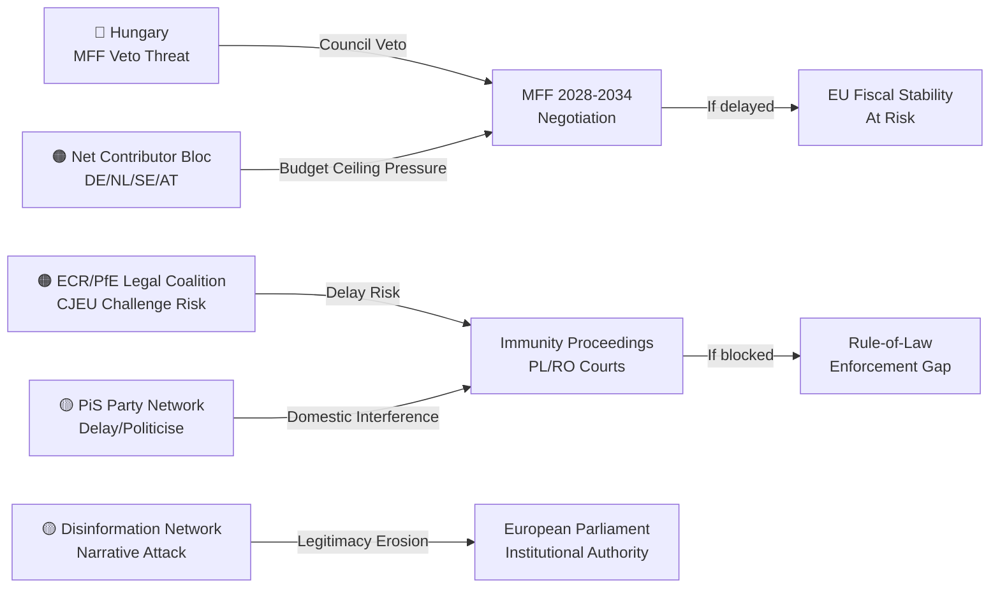

<!-- SPDX-FileCopyrightText: 2024-2026 Hack23 AB -->
<!-- SPDX-License-Identifier: Apache-2.0 -->

# Actor Threat Profiles — EU Parliament April 28, 2026

**Date:** 2026-04-29 | **Article Type:** breaking | **Confidence:** 🟢 HIGH
**Admiralty Grade:** B2 | **Methodology:** Threat Actor Profiling + SAT (Structured Analytic Techniques)

---

## Overview

This artifact profiles the key actors whose actions constitute threats to the legislative objectives, institutional stability, or policy outcomes identified in the April 28 session. Threats are assessed across capability, intent, and opportunity dimensions.

---

## Threat Actor Profile 1: Hungarian Government (Viktor Orbán)

**Threat Designation:** 🔴 PRIMARY ADVERSARIAL ACTOR — MFF Negotiations

**Capability:**
- Council unanimity requirement gives Hungary de facto veto power over MFF adoption
- Demonstrated willingness and ability to block or delay EU decisions (Article 7 proceedings, COVID recovery fund)
- Access to domestic media control allows narrative management against EU conditionality
- Legal and financial resources to pursue CJEU challenges against EU conditionality enforcement

**Intent:**
- Explicitly stated opposition to rule-of-law conditionality in EU funding
- Seeks to use MFF negotiations as leverage for Article 7 proceedings suspension
- Domestic political incentive to maintain "defending Hungary against EU" narrative
- WEP: LIKELY (65–75%) that Hungary will actively obstruct conditionality provisions in MFF negotiations

**Opportunity:**
- Council unanimity creates structural opportunity for indefinite delay
- European Council format provides bilateral deal-making opportunities
- Weaknesses in other member states' fiscal positions create potential blocking minorities

**Threat Level:** 🔴 Critical — primary bottleneck for MFF timeline

**Mitigating Factors:**
- Hungary receives substantial EU cohesion funds that create countervailing financial incentive
- Article 7 proceedings have limited immediate effect but constrain Hungarian room for manoeuvre
- Other V4 member states (Poland) are in different relationship with EU under Tusk

**Intelligence Indicators:**
- European Council summit communiqués mentioning Hungary's MFF position
- Hungarian government legal filings related to conditionality regulation
- Orbán bilateral meeting requests with Commission or other heads of government

---

## Threat Actor Profile 2: ECR/PfE Legal Challenge Coalition

**Threat Designation:** 🟠 SECONDARY ADVERSARIAL ACTOR — Immunity Proceedings

**Capability:**
- Access to EU and national court systems for legal challenges to immunity waivers
- Network of sympathetic law firms and legal academics in Poland, Romania, and EU-sceptic member states
- International far-right legal solidarity networks (including US connections)
- Media platforms capable of sustained "political persecution" narrative

**Intent:**
- WEP: LIKELY-POSSIBLE (40–55%) that one or more affected MEPs will file CJEU challenge to waiver decision
- Seek to delegitimise proceedings as politically motivated by "globalist" institutions
- Create legal uncertainty that delays national proceedings
- Generate domestic electoral benefit from victimhood narrative

**Opportunity:**
- CJEU appeal period post-adoption typically available
- Polish/Romanian domestic political environments provide "persecution" narrative soil
- European Court of Human Rights possible additional avenue for delay

**Threat Level:** 🟠 High — significant capacity to delay but unlikely to reverse EP decisions

**Mitigating Factors:**
- JURI immunity waiver jurisprudence is well-established and procedurally robust
- EP has successfully defended immunity waivers in prior CJEU challenges
- Polish Tusk government has strong incentive to rebut "persecution" narrative domestically

**Intelligence Indicators:**
- Filing of CJEU applications by affected MEPs
- Media statements announcing legal challenge strategy
- Polish PiS party formal communications on proceedings

---

## Threat Actor Profile 3: Net Contributor Fiscal Bloc (Germany-Netherlands-Austria-Sweden-Denmark)

**Threat Designation:** 🟠 STRUCTURAL ADVERSARIAL COALITION — MFF Scale

**Capability:**
- Combined blocking minority in Council (well above 35% required)
- Domestic political legitimacy to resist EU budget expansion
- Technical capacity to propose budget ceiling reductions backed by economic analysis
- German constitutional court (Bundesverfassungsgericht) can constrain German government positions

**Intent:**
- Aligned in resistance to significant GNI contribution increases
- German Schuldenbremse (debt brake) creates constitutional constraint on budget expansion
- Dutch, Austrian, Swedish domestic fiscal politics favour budget minimalism
- WEP: HIGHLY LIKELY (75–85%) that net-contributor bloc will seek significant reduction from Parliament's MFF interim position

**Opportunity:**
- Council negotiating structure allows fiscal conservative coordination
- Each government can veto in European Council format
- Economic data (slow growth, fiscal consolidation) supports narrative of budget restraint

**Threat Level:** 🟠 High — most structurally significant constraint on MFF scale

**Mitigating Factors:**
- Defence and strategic autonomy investment needs create genuine case for expansion
- Some net-contributor member states benefit significantly from EU programmes (Germany: single market, Horizon)
- Commission can structure proposals to align with net-contributor competitiveness interests

**Intelligence Indicators:**
- German government's formal MFF position paper (expected Q3 2026)
- Netherlands, Austria, Sweden joint statements on EU budget
- European Council meeting conclusions mentioning budget ceiling preferences

---

## Threat Actor Profile 4: Polish PiS Party Post-Immunity Manoeuvre Network

**Threat Designation:** 🟡 MEDIUM — Accountability Proceedings Integrity

**Capability:**
- Residual judicial networks from PiS era in some Polish institutions
- Strong media presence via aligned outlets (private media and residual public media connections)
- International solidarity with ECR and other right-wing parties
- Legal resources for challenge and delay strategies

**Intent:**
- Protect Obajtek, Jaki, Buczek from substantive criminal accountability
- Weaponise proceedings for 2027 Polish election campaign
- Undermine Tusk government credibility by positioning proceedings as selective prosecution
- WEP: POSSIBLE (30–45%) that PiS succeeds in delaying substantive proceedings beyond 2027 elections

**Opportunity:**
- Polish legal system still has some PiS-era appointees creating procedural ambiguity
- Election calendar (2027) creates natural horizon for politicisation
- European Court of Human Rights challenges can generate years of delay

**Threat Level:** 🟡 Medium — significant for Polish democratic accountability; limited EU-level impact

**Mitigating Factors:**
- Tusk government has strong incentive to advance judicial normalisation
- European Public Prosecutor's Office (EPPO) has jurisdiction over EU-funded corruption
- Polish public opinion broadly supportive of accountability for PiS-era officials

---

## Threat Actor Profile 5: Coordinated Far-Right Media Disinformation Network

**Threat Designation:** 🟡 MEDIUM — Narrative / Legitimacy Threat

**Capability:**
- Pan-European far-right media ecosystem (RT equivalents, domestic populist outlets)
- Social media coordination across multiple national markets
- Amplification via international allies (US MAGA media, Hungarian state media)
- Sophisticated narrative production capacity

**Intent:**
- Frame immunity waivers as "EU persecuting conservative politicians"
- Frame MFF ambitions as "Brussels power grab"
- Frame consent legislation as "EU social engineering"
- Generate sufficient narrative traction to damage EP electoral prospects in 2024+

**Opportunity:**
- April 28 session provides multiple simultaneous "persecution" narratives (six waivers)
- Economic stress creates receptive audience for anti-EU narratives
- 2027 elections in Poland create exploitation window

**Threat Level:** 🟡 Medium — narrative threat does not reverse legislative outcomes but affects long-term institutional legitimacy

**Mitigating Factors:**
- Pro-EU media ecosystem remains larger and more credible in most member states
- EP communications office has matured its counter-narrative capacity
- Accountability decisions are factually robust and procedurally defensible

---

## Composite Threat Landscape

---

## Reader Briefing

**For Citizens:** Not everyone wants the April 28 decisions to succeed. Hungary's government is the most powerful obstacle to the EU's budget ambitions because it can veto the final agreement. The politicians who lost their immunity will fight hard in courts to delay or reverse the proceedings. A group of wealthy member states will push to significantly reduce the budget Parliament is asking for. And a network of far-right media outlets will try to frame all of this as the EU oppressing national sovereignty. Understanding these threats helps explain why EU decisions — even when Parliament votes clearly — take years to fully implement.

---

## Data Sources & Provenance

| Source | Tool | Date |
|--------|------|------|
| EP Political Groups | `compare_political_groups` | 2026-04-29 |
| Coalition Dynamics | `analyze_coalition_dynamics` | 2026-04-29 |
| Early Warning System | `early_warning_system` | 2026-04-29 |
| Prior Analysis | intelligence/threat-model.md | 2026-04-29 |

---

*EU Parliament Monitor | Actor Threat Profiles | 2026-04-29*
