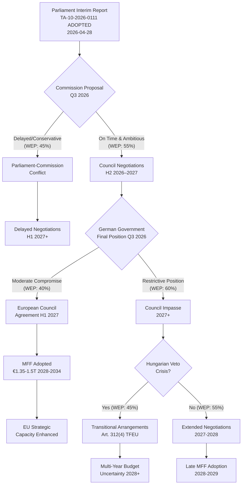
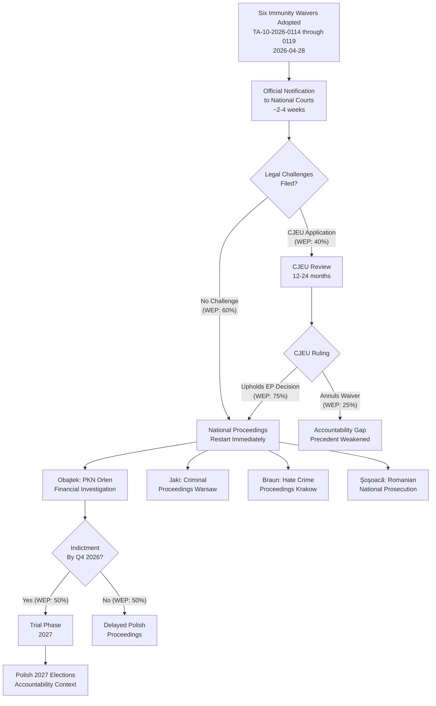
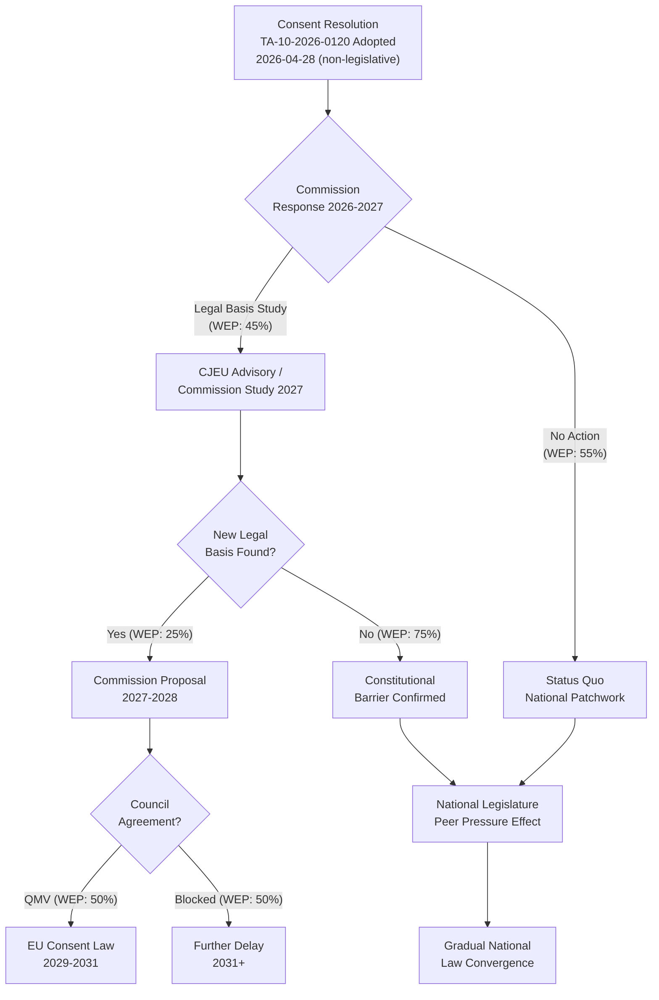

<!-- SPDX-FileCopyrightText: 2024-2026 Hack23 AB -->
<!-- SPDX-License-Identifier: Apache-2.0 -->

# Consequence Trees — EU Parliament April 28, 2026

**Date:** 2026-04-29 | **Article Type:** breaking | **Confidence:** 🟢 HIGH
**Admiralty Grade:** B2 | **Methodology:** Decision Tree Analysis + Consequence Mapping

---

## Framework

Consequence trees map the branching causal pathways from the April 28 session's key decisions to potential medium- and long-term outcomes. Each branch represents a decision node or contingency point with assigned probability estimates (WEP methodology).

---

## Tree 1: MFF 2028–2034 Negotiation Trajectory

**Key Consequence Nodes:**

| Node | WEP | EU Strategic Consequence |
|------|-----|--------------------------|
| Commission on-time + ambitious proposal | 55% | Negotiations can proceed to 2027 adoption |
| German moderate compromise | 40% | Key unlocking condition for Council agreement |
| Hungarian veto materialises | 45% | Triggers transitional arrangements, investment gap |
| MFF adopted by 2027 | 35% | Full EU strategic capacity from 2028 |
| Transitional arrangements triggered | 30% | Budget uncertainty, programme disruption |

---

## Tree 2: Immunity Waiver Accountability Pathway

**Key Consequence Nodes:**

| Node | WEP | Accountability Consequence |
|------|-----|----------------------------|
| No CJEU challenge | 60% | Proceedings proceed immediately |
| CJEU upholds EP | 75% of challenges | Waivers confirmed, proceedings fully enabled |
| Obajtek indicted Q4 2026 | 50% | Major Polish political consequence |
| Proceedings reach trial 2027 | 35% | Accountability narrative into elections |

---

## Tree 3: Consent Legislation Legislative Pathway

**Key Consequence Nodes:**

| Node | WEP | Rights Policy Consequence |
|------|-----|---------------------------|
| Commission launches legal basis study | 45% | Active legislative pursuit |
| New legal basis found | 25% of studies | Binding legislation possible |
| Binding EU consent law by 2031 | 11.25% overall | Structural change in EU criminal law |
| National peer pressure effect | 70% | Gradual improvement absent binding law |

---

## Aggregate Consequence Landscape

### High-Probability Outcomes (>60% WEP)

1. **MFF negotiations extend beyond 2027 initial target:** LIKELY (65%) — structural constraints prevent rapid agreement
2. **CJEU upholds EP immunity waivers if challenged:** HIGHLY LIKELY (75%) — jurisprudence robust
3. **Consent legislation produces no binding EU law in current mandate:** HIGHLY LIKELY (80%) — constitutional barrier too high
4. **National legal peer pressure produces some consent law reform in 2+ member states:** LIKELY (70%) — political signal has normative effect

### Medium-Probability Outcomes (30–60% WEP)

5. **MFF adopted with significant reduction from Parliament's position:** POSSIBLE (50%) — compromise inevitable
6. **Obajtek proceedings reach indictment phase by Q4 2026:** POSSIBLE (50%)
7. **Economic shock disrupts MFF negotiations:** POSSIBLE (25–30%)
8. **At least one waiver subject files CJEU challenge:** POSSIBLE (40%)

### Low-Probability, High-Impact Outcomes (10–30% WEP)

9. **MFF adopted on time at near-Parliament ambition level:** UNLIKELY-POSSIBLE (20%)
10. **Commission identifies viable legal basis for consent legislation:** UNLIKELY-POSSIBLE (25%)
11. **Hungarian veto triggers transitional arrangements:** POSSIBLE (30%)
12. **CJEU annuls one or more immunity waivers:** UNLIKELY-POSSIBLE (10–15%)

---

## Reader Briefing

**For Citizens:** The April 28 votes don't have fixed outcomes — they're the starting points of complex processes with many possible endpoints. The most important "branches" to watch: Will the EU's budget be set on time or slip past 2027? (Good: one-third chance of on-time adoption; poor: two-thirds chance of delay.) Will the immunity proceedings actually reach criminal trials, or will legal challenges delay them for years? (Moderate odds they reach trial; real risk of years-long delays.) Will the consent legislation produce any binding EU law? (Very unlikely in the current mandate, but the resolution creates peer pressure for national reforms.) These uncertainties are not failures — complex democratic and legal processes are necessarily uncertain. The value of the April 28 session is in the directions it sets, not just its immediate outcomes.

---

## Data Sources & Provenance

| Source | Tool | Date |
|--------|------|------|
| Scenario Forecast | intelligence/scenario-forecast.md | 2026-04-29 |
| Legislative Pipeline | `monitor_legislative_pipeline` | 2026-04-29 |
| Coalition Dynamics | `analyze_coalition_dynamics` | 2026-04-29 |
| Actor Threat Profiles | threat-assessment/actor-threat-profiles.md | 2026-04-29 |

---

*EU Parliament Monitor | Consequence Trees | 2026-04-29*
