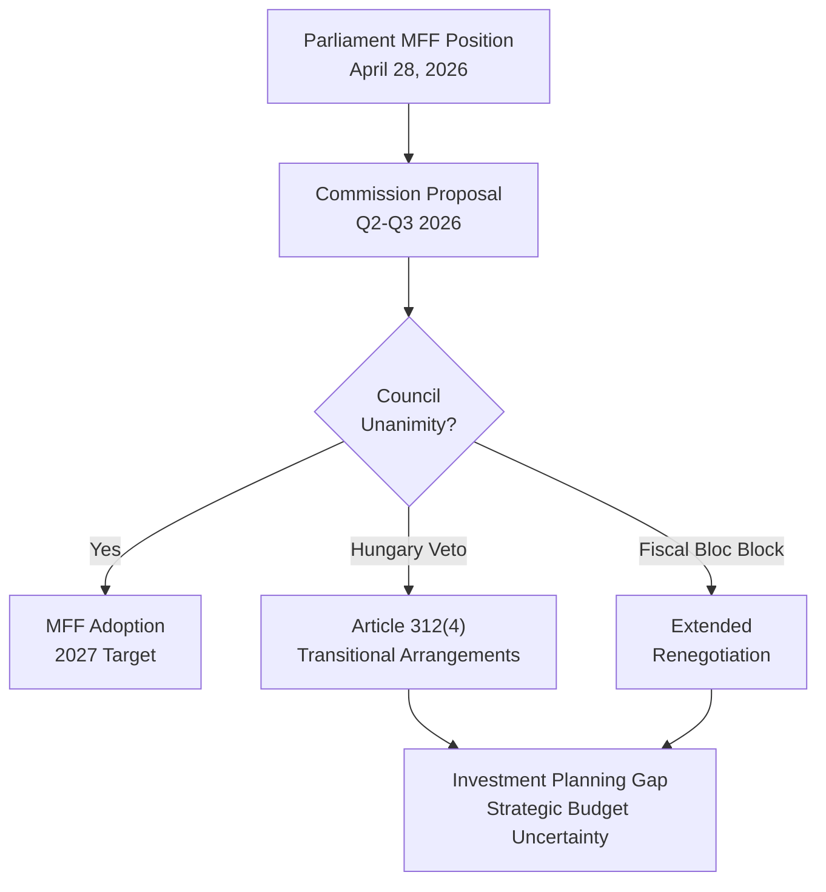

<!-- SPDX-FileCopyrightText: 2024-2026 Hack23 AB -->
<!-- SPDX-License-Identifier: Apache-2.0 -->

# Legislative Disruption Assessment — EU Parliament April 28, 2026

**Date:** 2026-04-29 | **Article Type:** breaking | **Confidence:** 🟢 HIGH
**Admiralty Grade:** B2 | **Methodology:** Legislative Risk Analysis + Disruption Scenario Mapping

---

## Framework

Legislative disruption occurs when external events, political dynamics, or institutional failures prevent legislative processes from reaching their intended outcomes. This artifact maps disruption vectors for each of the April 28 session's primary legislative outcomes.

---

## Disruption Vector Analysis

### Vector 1: MFF 2028–2034 — Council Deadlock

**Disruption Probability:** 🟠 HIGH (55–65%)

**Disruption Mechanism:**
The MFF regulation requires unanimity in the European Council. Even one member state holdout can prevent adoption by the 2027 target deadline, triggering Article 312(4) TFEU transitional arrangements that extend the 2021–2027 MFF ceiling for one year at a time. This is technically legal but operationally disruptive — multi-year programmes cannot plan effectively, investment pipelines stall, and conditionality enforcement operates in legal limbo.

**Disruption Pathway:**
1. Hungary refuses to accept conditionality provisions → European Council deadlock
2. Net-contributor bloc demands headline reduction below Commission proposal → Package failure
3. Own resources disagreement → Deal blocked on fiscal architecture

**Impact if Disrupted:**
- EU investment programmes (Cohesion, CAP, Horizon, Defence) operate in annual uncertainty
- EU capacity to fund strategic priorities (AI, clean energy, defence) constrained
- Political damage to Commission and pro-EU parties ahead of 2029 elections
- IMF assessment of EU fiscal governance credibility degraded

**Disruption Severity:** 🔴 Critical | **Reversibility:** Partial (transitional arrangements provide continuity but not ambition)



---

### Vector 2: Immunity Waivers — Legal Challenge Delay

**Disruption Probability:** 🟡 MEDIUM (35–45%)

**Disruption Mechanism:**
CJEU challenge to one or more immunity waiver decisions. Even a preliminary CJEU ruling accepting jurisdiction and ordering a provisional stay could suspend national proceedings for 12–24 months. Additional disruption vectors: national court procedural challenges (Article 6 ECHR fair trial arguments), administrative delays in official notification, Polish/Romanian domestic political interference.

**Disruption Pathway:**
1. Affected MEP files CJEU application challenging procedural fairness of JURI process
2. CJEU issues provisional measures stay → national proceedings suspended
3. Full CJEU proceedings run for 18+ months
4. If CJEU rules for applicant → proceedings collapsed; accountability gap

**Impact if Disrupted:**
- Accountability proceedings fail to reach substantive phase before 2027 elections
- Narrative victory for PiS "political persecution" frame
- Precedent weakening EP immunity waiver authority — future proceedings more difficult
- Polish democratic normalisation partially stalled

**Disruption Severity:** 🟠 High (accountability failure) | **Reversibility:** Partial

**Mitigating Factors:**
- JURI jurisprudence is procedurally solid; CJEU historically defers to EP on internal procedures
- EP Legal Service would vigorously defend waivers
- Polish Tusk government would support EP in CJEU proceedings

---

### Vector 3: Consent Legislation — Commission Inaction

**Disruption Probability:** 🔴 VERY HIGH (65–80%)

**Disruption Mechanism:**
The April 28 resolution is non-legislative — it cannot compel Commission action. If the Commission determines that no viable legal basis exists for binding consent legislation (or if it determines the political cost of pursuing such legislation exceeds the benefit given Council resistance), the resolution produces no legislative follow-through.

**Disruption Pathway:**
1. Commission legal services assess Article 83 TFEU constraint as definitive
2. Commission signals no formal proposal in current mandate
3. Resolution becomes historical record rather than legislative catalyst
4. Next Commission mandate (2029+) may or may not return to issue

**Impact if Disrupted:**
- Progressive rights agenda on gender fails its test case for Commission responsiveness
- Sets precedent that EP non-legislative resolutions on rights don't catalyse Commission proposals
- National legislation remains fragmented across member states

**Disruption Severity:** 🟡 Medium (symbolic loss; practical status quo continues) | **Reversibility:** Full (legal constraint is structural, not political)

---

### Vector 4: Economic Shock Disrupting All Three Domains

**Disruption Probability:** 🟡 MEDIUM (20–30%)

**Disruption Mechanism:**
An economic shock (US tariff escalation, energy price spike, financial contagion from Italian debt stress) would simultaneously:
- Make MFF budget expansion politically harder (fiscal consolidation narratives intensify)
- Distract political bandwidth from accountability proceedings
- Reduce public salience of rights legislation relative to economic concerns

**Impact if Activated:**
- MFF negotiations forced to restart at lower ambition level
- Accountability proceedings deprioritised in national media
- Parliament's April 28 agenda reframed as "out of touch" with economic reality

**Disruption Severity:** 🟠 High | **Reversibility:** Partial (budget decisions can be revised)

---

## Disruption Resilience Assessment

```mermaid
radar
    title Legislative Disruption Resilience by Domain
    MFF Budget Architecture
    Immunity Proceedings
    Consent Legislation
    Economic Shock Resistance
    Institutional Cohesion
    "MFF Budget Architecture" : 40
    "Immunity Proceedings" : 65
    "Consent Legislation" : 25
    "Economic Shock Resistance" : 55
    "Institutional Cohesion" : 75
```

**Interpretation:**
- **Highest resilience:** Institutional cohesion (centrist coalition demonstrated strong discipline)
- **Moderate resilience:** Immunity proceedings, economic shock resistance
- **Lowest resilience:** Consent legislation (constitutional constraint), MFF budget architecture (unanimous Council required)

---

## Disruption Early Warning Indicators

| Indicator | Domain | Signal Level | Monitoring Frequency |
|-----------|--------|-------------|----------------------|
| Commission MFF proposal delay beyond October 2026 | MFF | 🟠 High | Monthly |
| Hungary formal veto statement on conditionality | MFF | 🔴 Critical | Weekly |
| CJEU application filed by Obajtek/Jaki | Immunity | 🟡 Medium | Weekly |
| German government formal budget ceiling position paper | MFF | 🟠 High | Monthly |
| Commission legal services opinion on Art.83 TFEU | Consent | 🟡 Medium | Quarterly |
| EU GDP growth falls below 1% two consecutive quarters | Economic Shock | 🟠 High | Monthly |
| European Council MFF session fails (no conclusions) | MFF | 🔴 Critical | Per summit |

---

## Reader Briefing

**For Citizens:** Just because Parliament voted doesn't mean the outcomes are guaranteed. The EU's budget ambitions face a high probability of delay or reduction because every EU government has to agree — and some (Hungary, fiscally conservative northern states) will resist strongly. The immunity proceedings could be legally challenged by the affected politicians, potentially delaying accountability for years. The consent legislation resolution may never become law because of fundamental legal constraints on what the EU can regulate. These disruption risks are not reasons for despair — Parliament did its job effectively on April 28 — but they explain why EU policymaking is a long game requiring sustained pressure and negotiation, not a single vote.

---

## Data Sources & Provenance

| Source | Tool | Date |
|--------|------|------|
| Legislative Pipeline | `monitor_legislative_pipeline` | 2026-04-29 |
| Early Warning | `early_warning_system` | 2026-04-29 |
| Coalition Analysis | `analyze_coalition_dynamics` | 2026-04-29 |
| Prior Analysis | intelligence/scenario-forecast.md, threat-model.md | 2026-04-29 |

---

*EU Parliament Monitor | Legislative Disruption Assessment | 2026-04-29*
