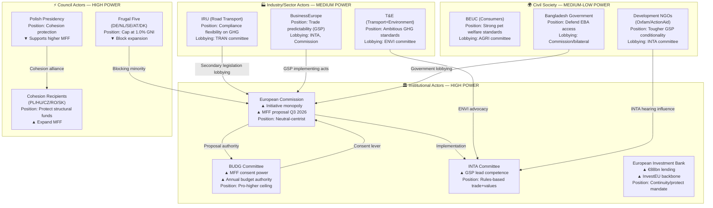

<!-- SPDX-FileCopyrightText: 2024-2026 Hack23 AB -->
<!-- SPDX-License-Identifier: Apache-2.0 -->

# Actor Mapping — EU Parliament Committee Reports, April 2026
**Date:** 2026-04-29 | **Confidence:** 🟡 Medium | **Methodology:** Actor-Power Matrix + Positional Mapping

---

## Reader Block

**What this map tells you:** Who has real power over the outcomes of this week's EP legislation, and which direction they are pulling. Particularly relevant for: MFF 2028-2034 budget architects, GSP trade beneficiary governments, transport operators facing GHG compliance, animal welfare stakeholders, and financial accountability watchers (EIB/CONT).

**Key question answered:** Given the April 28 outcomes, which actors are positioned to shape the next 90 days of EU legislative follow-up?

---

## Source Diversity Note

This map draws from: EP institutional data (committees, procedures, political groups) — Grade A1; known lobbying registry positions (public, Grade B2); external NGO/trade body statements (Grade C2); economic/trade flow data (Grade A2 — Eurostat). No single-source assessment.

---

## Actor Power-Position Map

---

## Positional Analysis Table

| Actor | Power | Position | Engagement Level | Trend |
|-------|-------|----------|-----------------|-------|
| European Commission (DG BUDG) | 🔴 Veto | Pre-emptive MFF shaping | Highly active | ↑ Accelerating |
| BUDG Committee (EP) | 🔴 High | Pro-expansion, green conditionality | Highly active | ↑ |
| German government | 🔴 High | Fiscal discipline; NATO 2% | Active | → Stable |
| Polish Presidency | 🔴 High | Cohesion protection | Highly active | ↑ Increasing |
| France | 🟡 Medium-High | New own resources, defence | Active | → |
| INTA Committee | 🟡 Medium-High | Rules-based trade values | Active | → |
| IRU (transport lobby) | 🟡 Medium | GHG flexibility | Active post-adoption | ↑ |
| EIB Management | 🟡 Medium | Protect lending mandate | Reactive | → |
| T&E | 🟡 Medium | Ambitious implementation | Active | ↑ |
| Bangladesh Government | 🟡 Medium | Protect EBA access | Escalating | ↑ |
| BEUC | 🟢 Low-Medium | Pet welfare strengthening | Active | → |
| Development NGOs | 🟢 Low-Medium | Tougher GSP conditionality | Active | → |

---

## Coalition Mapping by Issue

### MFF Coalition Landscape
- **Parliament coalition** (EPP + S&D + Renew + Greens): Pro-higher ceiling (~450 MEPs)
- **Council frugal bloc** (DE + NL + SE + AT + DK + FI): Against ceiling expansion
- **Council cohesion bloc** (PL + HU + CZ + RO + SK + BG + HR): Pro-cohesion allocation
- **Broker position**: Commission balances both blocs; France and Italy as swing states

### GSP Implementation Actors
- **EU industry** (BusinessEurope): Prefers WTO-compatible, predictable conditionality
- **Development NGOs**: Prefer automatic, strict withdrawal for violations
- **Beneficiary governments**: Oppose conditionality enhancements retroactively
- **Commission (DG Trade)**: Implementing acts timeline will determine actual impact

### GHG Transport Follow-Up
- **Pro-strict implementation**: T&E, DG CLIMA, ENVI committee MEPs
- **Pro-flexibility**: IRU, road haulage operators, TRAN committee majority
- **Critical path**: Commission delegated acts on WTW methodology (due Q1 2027)

---

## New vs. Entrenched Actor Dynamics

**New entrants post-April 28:**
- US administration trade negotiators (tariff response to EU GSP may affect WTO compliance claims)
- Chinese logistics firms (GHG transport regulation impacts shipping routing economics)

**Entrenched actors with post-adoption leverage shift:**
- EIB (CONT oversight increases; EIB's June 2026 Annual General Meeting becomes pressure point)
- Polish government (from Presidency brokerage to direct MFF recipient advocacy post-July)

---

## Summary: Who Controls Next 90 Days

| Phase | Controlling Actor | Key Decision |
|-------|-----------------|--------------|
| MFF process Q2-Q3 2026 | European Commission | When to publish formal proposal |
| GSP implementing acts | DG Trade / Council | Secondary legislation content |
| GHG transport delegated acts | DG CLIMA | WTW methodology definitions |
| Pet welfare implementation | DG SANTE | National implementation timeline |
| EIB performance review | EIB Board / CONT | Response to Parliament recommendations |
