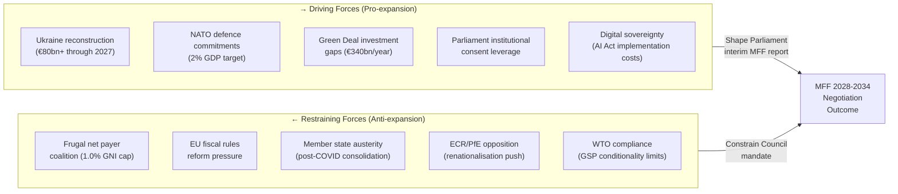

<!-- SPDX-FileCopyrightText: 2024-2026 Hack23 AB -->
<!-- SPDX-License-Identifier: Apache-2.0 -->

# Forces Analysis — EU Parliament Committee Reports, April 2026
**Date:** 2026-04-29 | **Confidence:** 🟡 Medium | **Methodology:** Porter's Five Forces (Adapted) + Institutional Force Field Analysis

---

## Reader Block

**What this analysis tells you:** The structural forces that shaped the April 28 plenary outcomes — and will continue to shape the legislative and political follow-through. Particularly relevant for understanding why Parliament voted as it did, and which structural pressures will intensify vs. diminish over the next 6 months.

---

## Force Field Diagram — Key MFF Negotiation Forces

---

## Five-Force Analysis Applied to EU Parliament Legislative Environment

### Force 1: Institutional Power Balance (Parliament vs. Council vs. Commission)

**Strength of force:** 🔴 VERY HIGH

The April 28 session demonstrates Parliament exercising institutional power at its maximum: adopting an interim MFF report before the Commission's formal proposal creates a "first mover" negotiating baseline.

**Dynamics:**
- Parliament's consent requirement on MFF gives it effective veto power
- Commission's legislative monopoly constrains Parliament but can be pre-empted by non-binding positions
- Council's unanimity requirement on own resources means any new revenue stream faces the hardest possible approval bar
- **Net force direction:** Tilts toward Parliament's opening demand being taken seriously, but Council unanimity means ceiling likely lower than Parliament wants

**Evidence from this session:** BUDG committee's rapid sprint (committee adoption April 15 → plenary April 28 = 13 days) signals Parliament deliberately front-loading its position before Commission acts.

---

### Force 2: Geopolitical Pressure (Ukraine, Defence, US Tariffs)

**Strength of force:** 🔴 VERY HIGH

All three MFF-related votes this session (interim report, budget guidelines, defence references) reflect the structural realignment of EU spending toward strategic security:

- **Ukraine:** Parliament has voted €50bn+ in 2025-2026 tranches; MFF must absorb multi-year Ukraine reconstruction need
- **NATO:** Most EU member states committed to 2% of GDP by 2025; EU-level defence fund (ReArm Europe) creates new MFF heading pressure
- **US tariffs:** Trump administration's trade posture creates import substitution pressure and industrial policy imperative (strategic autonomy investment)

**Net force direction:** Strong upward pressure on total MFF envelope; creates political space for higher ceiling that otherwise frugal states would resist.

---

### Force 3: Regulatory Maturation of the Green Deal (GHG Transport + Climate Files)

**Strength of force:** 🟡 MEDIUM-HIGH

The GHG Transport Accounting Regulation (2023/0266) is one of the last major Green Deal implementation regulations. The force here has shifted from **legislative adoption** to **implementation friction**:

- Green Deal primary legislation is largely complete (European Climate Law, CBAM, EU ETS reform, LULUCF)
- Force now acts through: delegated acts, compliance timelines, SME exemptions, and monitoring/reporting burden
- Green Deal as budget lever: EP's MFF report will likely require "climate-proofing" of 35-40% of all expenditures

**Net force direction:** Green Deal ambition is a legislative ceiling-raiser (more investment needed) but implementation friction is a timeline-stretcher (compliance takes longer than planned).

---

### Force 4: Trade Policy in the Era of Geoeconomic Fragmentation (GSP Reform)

**Strength of force:** 🟡 MEDIUM-HIGH

The GSP Reform (2021/0297) was adopted in a trade environment fundamentally different from its drafting context (2021, post-COVID, pre-Ukraine, pre-Trump tariffs). By April 2026, the forces shaping its implementation are:

- **EU-US trade tension:** US tariffs on EU exports create EU incentive to diversify toward GSP beneficiary country supply chains → reduces EU appetite to tighten conditionality that might disrupt these supply chains
- **Nearshoring imperative:** Post-COVID supply chain resilience doctrine pushes EU firms toward GSP+ markets in MENA and North Africa
- **Human rights compliance pressure:** Uyghur labour concerns (China linkage) and ILO audits of South Asian garment industries create countervailing pressure for stronger conditionality

**Net force direction:** Competing forces roughly balance; implementation will be contested in the secondary legislation (implementing regulations) rather than the primary regulation text.

---

### Force 5: Democratic Accountability and Oversight Pressure (EIB + CONT)

**Strength of force:** 🟡 MEDIUM

CONT's dual oversight pressure (EIB annual report + performance instruments) represents a structural strengthening of parliamentary oversight that has been building since the Qatargate scandal (2022-2023):

- EP internal reform (new Ethics Body, financial disclosure requirements) creates more credible oversight capacity
- EIB's growing role in InvestEU and Ukraine reconstruction makes it a more politically visible institution
- CONT committee has been increasingly willing to condition EIB support on transparency milestones

**Net force direction:** Gradual institutional learning curve toward more effective oversight. No immediate threat to EIB mandate, but reputational stakes are rising.

---

## Force Summary Matrix

| Force | Direction | Intensity | Trend | Policy Implication |
|-------|-----------|-----------|-------|-------------------|
| Institutional power balance | Parliament forward | HIGH | ↑ Increasing | MFF negotiations will be extended; EP's consent leverage increases with each electoral cycle |
| Geopolitics/defence | Pro-expansion | VERY HIGH | ↑ Accelerating | MFF ceiling above 1.0% more likely than three years ago |
| Green Deal maturation | Implementation friction | MEDIUM | → Stable | Secondary legislation becomes the battlefield |
| Trade policy fragmentation | Competing | MEDIUM | → Complex | GSP implementation will be genuinely contested |
| Democratic oversight | Strengthening | MEDIUM | ↑ Gradual | EIB and other financial bodies face higher scrutiny |

**Overall force assessment:** The April 28 session was shaped by strong institutional momentum (Parliament acting proactively) in a geopolitically demanding environment. The structural forces favour a higher MFF ceiling than in any previous MFF negotiation cycle, but Council unanimity on own resources remains the immovable constraint.
