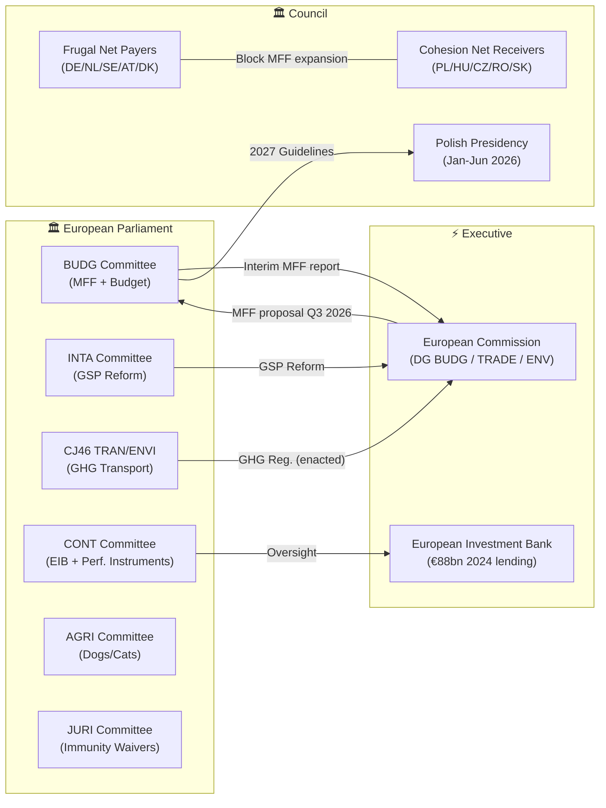

<!-- SPDX-FileCopyrightText: 2024-2026 Hack23 AB -->
<!-- SPDX-License-Identifier: Apache-2.0 -->

# Stakeholder Map — EU Parliament Committee Reports, April 28–29, 2026
**Date:** 2026-04-29 | **Confidence:** 🟡 Medium | **Methodology:** Actor-Network Analysis + Interest Group Mapping

---

## Primary Institutional Stakeholders

### European Parliament — Committee Cluster

**BUDG (Committee on Budgets)**
- **Role:** Lead committee on both adopted MFF interim report (2025/0571R) and 2027 budget guidelines (2025/2246)
- **Rapporteur(s):** Not retrievable from current EP API data (enrichment failure noted)
- **Composition:** 44 members; EPP-dominated with S&D as second force
- **Strategic position:** Parliament as co-budgetary authority is leveraging its consent role (MFF requires EP majority for adoption) to front-load its demands before Commission proposal
- **Power assessment:** 🟢 HIGH — BUDG holds formal co-decision powers over annual budgets and consent on MFF
- **Evidence:** Procedure 2025/0571R timeline shows BUDG adopting report April 15, tabled to plenary April 21, adopted April 28 — rapid legislative sprint signals institutional urgency

**INTA (Committee on International Trade)**
- **Role:** Lead committee on GSP reform (2021/0297)
- **Strategic position:** Strong consensus culture; trade files usually command EPP-S&D-Renew coalition
- **Power assessment:** 🟢 HIGH — INTA has exclusive legislative competence over common commercial policy (Art. 207 TFEU)
- **Key dynamic:** Last-minute amendment surge (4 separate batches in final week) signals late-stage trilogue compromise contested within the committee

**TRAN/ENVI Joint (CJ46) — GHG Transport Accounting**
- **Role:** Joint committee on GHG transport regulation (2023/0266)
- **Power assessment:** 🟡 MEDIUM — joint committee format reduces any single committee's dominance
- **Key tension:** TRAN prioritises operator compliance flexibility; ENVI prioritises environmental ambition. Trilogue outcome (Dec 2025) was a compromise.

**AGRI (Committee on Agriculture)**
- **Role:** Lead on dogs/cats welfare (shared with ENVI via opinion); opinion on 2027 budget guidelines; opinion on MFF
- **Strategic position:** AGRI traditionally cross-partisan on CAP/agricultural files but divided on animal welfare regulation
- **Key dynamic:** AGRI opinion on MFF critical to securing sufficient CAP appropriations in 2028-2034

**CONT (Committee on Budgetary Control)**
- **Role:** EIB annual report (2025/2237) and performance-based instruments report (2025/2032)
- **Power assessment:** 🟡 MEDIUM — CONT has oversight/scrutiny powers but no direct legislative authority
- **Investigative capacity:** CONT can summon EIB management, Commission, and implementing bodies for hearings

**JURI (Committee on Legal Affairs)**
- **Role:** All five immunity waiver decisions
- **Strategic position:** JURI follows established fumus persecutionis doctrine; decisions are largely procedural
- **Political sensitivity:** Cluster of Polish MEP waivers reflects Polish judicial proceedings involving former PiS-linked officials

---

## Executive Branch Stakeholders

**European Commission (DG BUDG — Budget Directorate-General)**
- **Interest:** Control MFF timeline; avoid Parliament pre-empting Commission proposal
- **Position:** Commission has not yet published formal MFF 2028-2034 proposal (expected Q3 2026)
- **Tactical response:** Commission will attempt to frame Parliament's interim report as "consultative" rather than binding, but consent procedure means Parliament has effective veto
- **Influence:** 🟢 HIGH — Commission holds proposal monopoly; Parliament cannot formally amend without Commission's revised proposal

**European Investment Bank (EIB Group)**
- **Interest:** Maintain Parliament's confidence; avoid critical audit findings that constrain its mandate
- **2024 lending:** €88bn total; €37bn climate-related; InvestEU backbone
- **Accountability pressure:** CONT report on performance-based instruments and EIB annual report together create dual oversight pressure
- **Response capacity:** EIB has strong lobbying infrastructure in Brussels; quarterly CONT hearings provide anticipatory management channel

---

## Council and Member State Stakeholders

**Council Presidency (Poland, January–June 2026)**
- **Interest:** Cohesion policy protection; balance between EU fiscal consolidation and Polish structural fund receipts
- **Key position:** Poland is the largest net recipient of EU cohesion funds (~€76bn in MFF 2021-2027); President Tusk navigating between EU pro-spending position and domestic fiscal consolidation
- **Tactical approach:** Council will seek to delay MFF negotiations until Commission proposal is on table, resisting Parliament's interim report as negotiating baseline

**Net Contributor Member States (DE, NL, SE, AT, DK, FI)**
- **Interest:** Cap MFF ceiling at ≤1.0% of EU GNI; resist new own resources financing defence
- **Coalition capacity:** "Frugal Five" (+ Finland) can form blocking minority in Council under qualified majority voting (QMV)
- **Tension with Parliament:** Parliament's interim report almost certainly calls for higher ceilings than frugal states will accept

**Net Recipient Member States (PL, HU, CZ, RO, SK, BG, HR)**
- **Interest:** Protect cohesion fund allocations; resist renationalisation of structural funds
- **Coalition capacity:** Can form QMV blocking minority if threatened collectively
- **MFF dynamic:** Critical battleground — defence spending surge may crowd out cohesion in final MFF envelope

**France and Germany (Joint leadership)**
- **Interest:** Balance defence investment (both committed to NATO 2%) with MFF fiscal responsibility
- **Germany:** Post-constitutional reform, €100bn off-balance-sheet defence fund reduces pressure on MFF defence heading
- **France:** Pushing for EU-level fiscal capacity; supports new own resources (including carbon border adjustment redistribution)

---

## Civil Society and Private Sector Stakeholders

**BusinessEurope / Eurochambres (EU Business)**
- **Interest:** GSP tariff predictability; opposition to trade-disruptive conditionality; competitive supply chains
- **Position on GSP:** Support reform if human rights conditionality is clear, predictable, and WTO-compatible
- **EIB relationship:** Major beneficiary of EIB financing instruments; supports InvestEU continuation

**T&E (Transport & Environment)**
- **Interest:** Ambitious GHG transport accounting standards; WTW (Well-to-Wheel) methodologies; phase-out of fossil fuel exceptions
- **Position:** Broadly supportive of the regulation but monitoring implementation decrees
- **Credibility:** 🟢 HIGH — leading EU transport-climate NGO; Admiralty Grade B (reliable, moderate source corroboration)

**IRU (International Road Transport Union)**
- **Interest:** Compliance burden minimisation; flexibility for SME freight operators
- **Position:** Supported final compromise on GHG transport regulation; prefers TTW (Tank-to-Wheel) over WTW
- **Influence:** 🟡 MEDIUM — strong in TRAN committee; less influential with ENVI MEPs

**BEUC (European Consumer Organisation)**
- **Interest:** Dogs/cats welfare regulation; traceability for online pet trade
- **Position:** Strongly supportive; pushed for stricter import controls and earlier implementation dates
- **Key concern:** Cross-border enforcement capacity in Central/Eastern Europe where puppy mills concentrate

**Development NGOs (Oxfam, ActionAid, CONCORD)**
- **Interest:** GSP conditionality on labour rights and environmental standards
- **Position:** Critical of final GSP text as insufficiently robust; prefer automatic withdrawal for serious violations
- **Admiralty Grade:** C2 (credible source, single advocacy perspective)

**Developing Country Governments (GSP beneficiaries)**
- **Bangladesh:** Largest EBA beneficiary; RMG sector employs 4 million workers; opposes stricter conditionality that risks EBA graduation
- **Pakistan:** GSP+ beneficiary under scrutiny for labour rights compliance; recent ILO assessment flagged child labour concerns
- **Cambodia:** EBA beneficiary under "Enhanced Engagement" since 2020 political crisis; monitoring by Commission

---

## Intelligence Gaps

| Gap | Severity | Mitigation |
|-----|---------|-----------|
| Exact vote counts for April 28 session | 🟡 Medium | Roll-call data delayed 4-6 weeks; estimated coalition math above |
| Identity of BUDG rapporteurs for MFF report | 🟡 Medium | EP API enrichment failure; likely senior EPP/S&D veteran |
| Commission's formal MFF 2028-2034 timetable | 🔴 High | Not yet published; Q3 2026 estimate based on institutional pattern |
| GSP beneficiary country reaction | 🟡 Medium | Diplomatic responses will emerge post-publication |
| EIB management response to CONT recommendations | 🟡 Medium | Formal EIB response expected within 6 months per EP-EIB framework agreement |

---

## Network Topology

---

## For Citizens — Plain Language Summary

**What happened this week?** The European Parliament voted on dozens of important laws and reports in Strasbourg. The most significant were:

1. **The EU's next 7-year budget (MFF 2028-2034):** Parliament voted on its "opening position" — what it wants the budget to look like. This is like Parliament saying "here's what we're asking for" before the real negotiations start. The current budget ends in 2027.

2. **2027 annual budget guidelines:** Parliament voted on priorities for next year's budget — more money for defence, continued support for Ukraine, protection of social programmes.

3. **Fair trade for developing countries:** Parliament updated rules on which poor countries get lower trade tariffs when selling goods to Europe, with stronger conditions on workers' rights and environmental standards.

4. **Greener transport:** New rules require shipping, trucking, and aviation companies to accurately measure and report their CO2 emissions — making it harder to "greenwash" their environmental impact.

5. **Pet welfare:** New EU-wide rules mean all dogs and cats must be microchipped and registered in a database — making it easier to trace sick animals and tackle the illegal puppy trade.

6. **Checking the EU's bank:** Parliament reviewed how the European Investment Bank spent its €88 billion in 2024 loans, and called for more transparency on how performance targets are measured.
