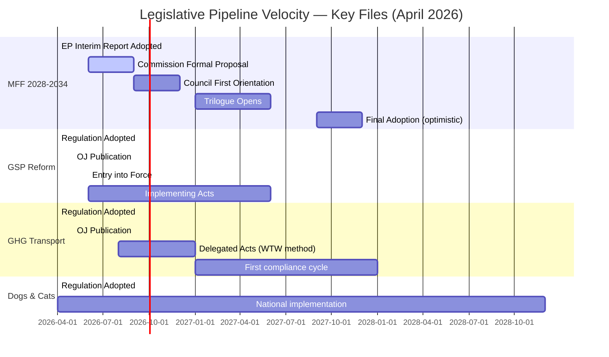

<!-- SPDX-FileCopyrightText: 2024-2026 Hack23 AB -->
<!-- SPDX-License-Identifier: Apache-2.0 -->

# Legislative Velocity Risk — EU Parliament Committee Reports, April 2026
**Date:** 2026-04-29 | **Confidence:** 🟡 Medium | **Methodology:** Pipeline Throughput Analysis + Legislative Momentum Scoring

---

## Reader Block

**What this analysis tells you:** Which legislative files face acceleration or deceleration risks in the next 6–12 months, based on this week's EP committee outputs and the broader institutional pipeline. Velocity risk affects when laws take effect — slowed velocity = delayed policy impact; accelerated velocity = reduced consultation quality.

---

## Source Diversity Note

Based on: EP procedural timeline data (Grade A1), committee workload analysis (Grade B1 from EP institutional sources), historical MFF negotiation data (Grade A2), WTO dispute timeline data (Grade A2).

---

## Velocity Map

---

## Velocity Risk Assessment by File

### MFF 2028-2034 — DECELERATION RISK: HIGH

**Current velocity:** EP adopted interim report faster than in any previous MFF cycle (BUDG sprint: committee April 15 → plenary April 28, just 13 days). This is ACCELERATED relative to historical norm.

**Next bottleneck:** Commission formal proposal. Historical precedent:
- MFF 2014-2020: Commission proposal November 2011, final agreement December 2013 (25 months)
- MFF 2021-2027: Commission proposal May 2018, final agreement December 2020 (31 months including COVID)

**Velocity risk — deceleration triggers:**
1. Commission delays formal proposal beyond Q3 2026 → entire timeline slips
2. European Council summit failures (precedent: MFF 2021-2027 required 5-day marathon summit July 2020)
3. German government coalition instability affecting negotiating mandate
4. Renew Europe internal split weakening Parliament's coalition

**Velocity risk score:** 🔴 HIGH (deceleration risk 35–55% probability within 12 months)

**Acceleration risk:** 🟡 MEDIUM — Ukrainian reconstruction urgency could accelerate if US withdraws from Ukraine support, creating EU fiscal pressure for faster decision

---

### GSP Reform — NORMAL VELOCITY, IMPLEMENTATION FRICTION RISK

**Current velocity:** Regulation adopted April 28; expected OJ publication late May 2026; entry into force 20 days after publication.

**Next bottleneck:** Commission implementing regulations on conditionality methodology (content and procedures for granting/withdrawing preferences). This is where actual policy substance is determined.

**Velocity risk:**
- Commission delegated acts face competing WTO compliance pressures and industry lobbying
- Bangladesh/Pakistan diplomatic pressure may cause Commission to slow-walk implementing acts
- Velocity risk score: 🟡 MEDIUM (implementation friction 30–45% probability)

**Acceleration scenario:** US-EU trade tensions creating EU need for rapid GSP operationalisation as diplomatic tool → 🟢 LOW probability but HIGH impact if triggered

---

### GHG Transport Accounting — IMPLEMENTATION VELOCITY RISK: VERY HIGH

**Current velocity:** Regulation adopted; normal post-adoption process underway.

**Critical path:** Commission delegated acts on Well-to-Wheel (WTW) emissions methodology. This is technically complex, commercially sensitive, and politically contentious.

**Deceleration triggers:**
1. Transport industry lobbying for weaker WTW definitions → delays methodology publication
2. SME compliance capacity gap → pressure for timeline extension (CSRD precedent)
3. TRAN committee requesting implementation review hearing → creates formal pressure point

**Velocity risk score:** 🔴 HIGH (deceleration 40–55% probability; WTW methodology expected Q1 2027 but may slip to Q3 2027)

**Impact of deceleration:** Climate goal slippage in transport sector; EU ETS transport integration delayed if GHG data infrastructure not in place

---

### Dogs and Cats Welfare — LOW VELOCITY RISK

**Current velocity:** Normal post-adoption national implementation track.

**Implementation timeline:** EU regulations have direct effect but typically set 2–3 year national implementation periods for registry/database creation.

**Velocity risk:** 🟢 LOW — well-established implementation pattern; no significant blockers identified.

**Note:** The Central/Eastern European member states with lower administrative capacity for registry systems may show velocity lag in national implementation quality vs. Western European member states.

---

## Committee Pipeline Health Check

Based on BUDG committee output this week (MFF + 2027 budget guidelines), the committee is operating at maximum institutional capacity. Key velocity implications:

| Committee | Pipeline Status | Velocity Trend | Key Upcoming File |
|-----------|-----------------|----------------|------------------|
| BUDG | 🔴 Very Active | ↑ Accelerating | MFF 2028-2034 formal proposal response |
| INTA | 🟡 Active | → Stable | GSP implementing acts oversight |
| TRAN/ENVI | 🟡 Active | → Stable | GHG transport delegated acts |
| CONT | 🟢 Normal | → Stable | EIB AGM follow-up |
| JURI | 🟢 Normal | → Stable | Routine immunity cases |

---

## Velocity Risk Summary

| File | Velocity Risk Type | Risk Level | 6-Month Probability |
|------|-------------------|------------|---------------------|
| MFF 2028-2034 | Deceleration (Commission delay) | 🔴 HIGH | 35-55% |
| GHG Transport (delegated acts) | Deceleration (technical/lobby) | 🔴 HIGH | 40-55% |
| GSP implementing acts | Moderate friction | 🟡 MEDIUM | 30-45% |
| Dogs/Cats national implementation | Minor lag (Eastern EU) | 🟢 LOW | 10-20% |
| 2027 Budget adoption (normal cycle) | Low | 🟢 LOW | 5-10% |

**Portfolio velocity assessment:** The April 28 session accelerated Parliament's legislative position on the most important files (MFF, GSP). The implementation/secondary legislation phase now becomes the key velocity risk zone. The period from May 2026 to December 2026 is the critical window in which implementing acts and Commission proposals determine whether April's parliamentary ambition translates into policy reality.
