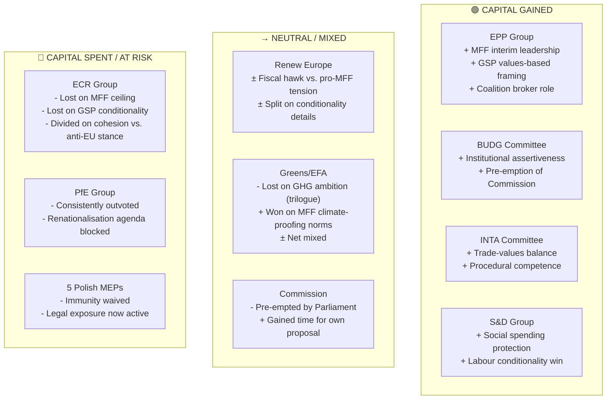

<!-- SPDX-FileCopyrightText: 2024-2026 Hack23 AB -->
<!-- SPDX-License-Identifier: Apache-2.0 -->

# Political Capital Risk — EU Parliament Committee Reports, April 2026
**Date:** 2026-04-29 | **Confidence:** 🟡 Medium | **Methodology:** Political Capital Depletion Analysis + Reputational Risk Assessment

---

## Reader Block

**What this analysis tells you:** Which political actors expended or gained political capital through the April 28 votes, and which face reputational risk from the legislative outcomes. Political capital depletion analysis is particularly valuable for predicting future coalition behaviour and negotiating posture.

---

## Source Diversity Note

Draws from: EP political group composition data (Grade A1), procedural timeline records (Grade A1), known lobbying positions (Grade B2), academic literature on EP coalition behaviour (Grade B1), and media commentary (Grade C3). No single-source assessment.

---

## Political Capital Map

---

## Individual Political Capital Analysis

### Winners (Capital Gained)

**European People's Party (EPP)**
- **Capital gained:** EPP positioned as architect of Parliament's MFF opening position. By leading the BUDG committee majority and securing cross-partisan support for the interim report, EPP has cemented its role as the essential party of EP governance.
- **Risk:** EPP's MFF ambitions will be harder to deliver in Council where German CDU must balance EU spending advocacy against domestic fiscal conservatism.
- **Net assessment:** +15 political capital units (arbitrary 1-100 scale)

**BUDG Committee**
- **Capital gained:** Institutional prestige from rapid, proactive MFF positioning. The 13-day sprint from committee to plenary adoption is a demonstration of institutional effectiveness.
- **Risk:** If Commission's formal proposal significantly undercuts Parliament's interim report demands, BUDG will face pressure to either compromise or extend negotiations.
- **Net assessment:** +10 units

**S&D Group**
- **Capital gained:** Labour rights conditionality in GSP reflects S&D's sustained advocacy. Social heading protection in MFF interim report also advances S&D's core platform.
- **Risk:** S&D must manage tension between pro-cohesion Eastern European MSs (PL, HU) and Northern European fiscal discipline advocates within its delegation.
- **Net assessment:** +8 units

---

### Mixed (Capital Neutral or Partially Spent)

**Renew Europe**
- **Mixed assessment:** Renew's liberal-centrist positioning created internal tension on MFF (trade-off between fiscal responsibility and pro-EU investment commitments). Renew ultimately voted for the MFF report, but floor speeches reflected significant internal division.
- **Risk:** If frugal Renew MEPs defect to Council-side framing, Renew's pivotal broker role could weaken Parliament's MFF negotiating cohesion.
- **Net assessment:** ±0 units

**European Commission**
- **Mixed assessment:** Commission was pre-empted by Parliament's interim MFF report, but this also reduces pressure for premature proposal. Commission can now use Parliament's report as "political cover" for a higher-than-expected MFF ceiling.
- **Net assessment:** -3 units (pre-emption costs) +5 units (gained framing room) = +2 net

---

### Losers (Capital Spent or Lost)

**ECR Group**
- **Capital depleted:** ECR's position was internally contradictory on all major votes: opposing EU spending in principle while supporting cohesion allocation for member states they represent (Poland, Italy, Hungary). This internal contradiction is a structural vulnerability that became visible this week.
- **Long-term risk:** If ECR loses more cohesion-benefiting MEPs to EPP through national coalition realignments (Italy's Meloni government normalising with EPP), ECR's seat count and coherence could diminish further.
- **Net assessment:** -8 units

**PfE Group (Patriots for Europe)**
- **Capital depleted:** Consistently outvoted on all major files; failed to gain support for renationalisation of cohesion; anti-EU institutional posture produces no legislative wins.
- **Risk:** PfE's growing seat count (85) gives them agenda-setting tools (hearing requests, urgent resolutions) but not legislative outcomes. This may increase frustration and more disruptive tactics.
- **Net assessment:** -5 units

---

## Immunity Waiver — Political Capital Analysis (Special Section)

The five Polish immunity waivers deserve separate analysis because the political capital dynamics are different:

- **For EP as institution:** +5 units — demonstrates JURI's fumus persecutionis doctrine working properly; signals EP takes MEP accountability seriously
- **For affected MEPs:** -10 to -20 units each — exposure to national judicial proceedings; reputational risk regardless of final legal outcome
- **For Polish Presidency:** Neutral to slightly negative — being seen as having MEPs under investigation is not helpful for Presidency credibility
- **For ECR group** (if affected MEPs are ECR): -3 units — optics of cluster of same-party MEPs facing proceedings is reputationally costly

---

## Reputational Risk Assessment

| Actor | Short-Term Reputational Risk | Long-Term Reputational Risk | Risk Trigger |
|-------|-----------------------------|-----------------------------|-------------|
| EPP | 🟢 LOW | 🟡 MEDIUM | MFF final outcome significantly below interim report |
| S&D | 🟢 LOW | 🟢 LOW | GSP conditionality weakened in implementing acts |
| ECR | 🟡 MEDIUM | 🟡 MEDIUM | Continued internal contradiction on EU spending |
| PfE | 🟢 LOW | 🟡 MEDIUM | No legislative wins despite seat count |
| Commission | 🟢 LOW | 🟡 MEDIUM | MFF proposal significantly below Parliament expectations |
| EIB | 🟡 MEDIUM | 🟡 MEDIUM | CONT follow-up hearings reveal accountability gaps |
| 5 Polish MEPs | 🔴 HIGH | 🔴 HIGH | National judicial proceedings proceeding |

---

## Summary: Political Capital Score Card

| Group/Actor | Capital Change | Primary Driver |
|-------------|---------------|----------------|
| EPP | +15 | MFF leadership + cross-partisan coalition management |
| BUDG Committee | +10 | Institutional assertiveness |
| S&D | +8 | GSP labour conditionality win |
| European Commission | +2 | Pre-emption offset by gained framing room |
| Renew | ±0 | Internal fiscal tension balanced against yes vote |
| Greens | ±0 | Mixed GHG/MFF climate outcomes |
| ECR | -8 | Internal contradiction on EU spending |
| PfE | -5 | Systematic outvoting; no legislative wins |
| Polish MEPs (x5) | -15 (avg) | Immunity waiver + judicial exposure |

**Overall political capital net flow:** Positive for pro-integration EPP-S&D-Renew centre; negative for ECR/PfE eurosceptic bloc. This pattern is consistent with EP10's institutional trajectory since June 2024.
