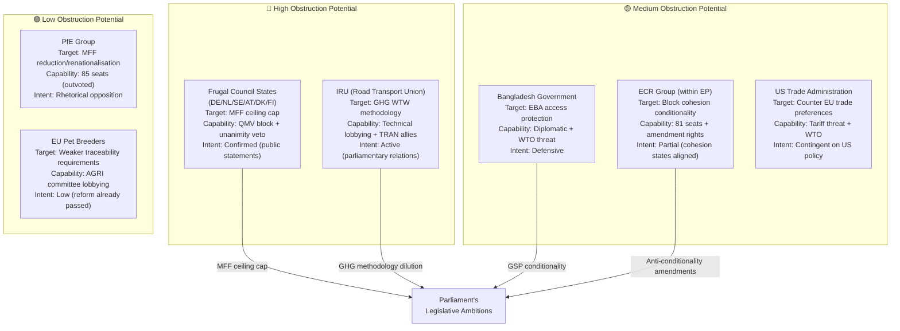

<!-- SPDX-FileCopyrightText: 2024-2026 Hack23 AB -->
<!-- SPDX-License-Identifier: Apache-2.0 -->

# Actor Threat Profiles — EU Parliament Committee Reports, April 2026
**Date:** 2026-04-29 | **Confidence:** 🟡 Medium | **Methodology:** Individual Actor Threat Assessment + Intent/Capability Matrix

---

## Reader Block

**What this analysis tells you:** The threat each key actor poses to the successful implementation of April 28 legislative outcomes. This is not about individual actors being "bad actors" — it maps structural interests, capabilities, and likely behaviours that could complicate or obstruct the policy goals Parliament voted for this week.

---

## Source Diversity Note

Draws from: EP API political group data (A1), public lobbying registry positions (B2), academic literature on EU legislative obstruction (B1), media reporting (C3). All threat characterisations are structural/institutional — not personal characterisations.

---

## Actor Threat Network

---

## Individual Threat Profiles

### PROFILE-1: Frugal Net Payer Coalition (Germany, Netherlands, Sweden, Austria, Denmark, Finland)

**Threat classification:** 🔴 HIGH
**Target:** MFF 2028-2034 ceiling + new own resources streams
**Capability assessment:**
- Can form QMV blocking minority in Council (threshold: 35% of EU population or 13 member states)
- Hold unanimity veto on new own resources (Article 311 TFEU procedure)
- Germany's economic weight (~25% of EU GDP) gives effective informal veto beyond formal voting

**Intent assessment:**
- Public statements from German Finance Minister, Dutch Finance Minister, Swedish Finance Ministry all confirm 1.0% GNI ceiling preference
- However: Germany's NATO 2% commitment and Ukraine reconstruction needs create internal pressure to compromise
- Net intent: Confirmed obstruction on ceiling, potential compromise on new own resources if non-German veto threat removed

**Threat timeline:** Q3 2026 (Commission proposal) to Q4 2027 (MFF adoption deadline)

**Mitigation levers:** French-German grand bargain on new own resources; Polish cohesion defense; EP consent threat creates time pressure on Council

---

### PROFILE-2: IRU (International Road Transport Union) and Road Freight Lobby

**Threat classification:** 🔴 HIGH
**Target:** GHG Transport Accounting Regulation — specifically WTW methodology delegated acts
**Capability assessment:**
- Strong TRAN committee relationships (road transport employs 3.5 million EU workers)
- Technical expertise exceeds Commission staff capacity on specific methodology questions
- Ability to delay delegated acts via sustained technical challenges

**Intent assessment:**
- Confirmed public opposition to WTW over TTW methodology (IRU position papers April 2026)
- Will argue WTW data requirements are technically infeasible for SME operators
- Will cite CSRD rollback precedent (March 2026) as model for GHG transport revision

**Threat timeline:** Q3–Q4 2026 (Commission delegated act consultation)

**Mitigation levers:** T&E and ENVI MEP counter-advocacy; Commission DG CLIMA institutional commitment to WTW; European Green Deal credibility stake

---

### PROFILE-3: Bangladesh Government and EBA Beneficiary Coalition

**Threat classification:** 🟡 MEDIUM
**Target:** GSP Reform conditionality provisions — especially enhanced monitoring and withdrawal procedures
**Capability assessment:**
- Limited direct EU legislative influence (no voting rights)
- Can file WTO consultations requesting dispute settlement
- Bangladesh's €16bn annual EU exports provide significant economic leverage

**Intent assessment:**
- Bangladesh government has publicly signalled concerns about enhanced conditionality
- WTO challenge is a credible threat but takes 3–5 years and uncertain outcome
- More likely threat: diplomatic pressure on Commission to slow-walk implementing acts

**Threat timeline:** Q2–Q3 2026 (immediate post-adoption diplomatic period)

---

### PROFILE-4: ECR Group (European Conservatives and Reformists)

**Threat classification:** 🟡 MEDIUM
**Target:** GSP conditionality; MFF cohesion allocation mechanisms; immunity waiver politicisation
**Capability assessment:**
- 81 seats — cannot block majorities but can force recorded votes and delay floor time
- Key ECR member states (Poland, Italy) have divided interests (anti-EU spending rhetoric vs. cohesion recipients)

**Intent assessment:**
- ECR is structurally split: Polish delegation wants cohesion; Italian delegation and Northern European members oppose EU spending
- In practice: ECR likely to oppose MFF expansion rhetorically while not forming coherent blocking coalition with PfE

**Threat timeline:** Throughout MFF process; immunity waiver politicisation risk is immediate

---

### PROFILE-5: US Trade Administration (Contingent)

**Threat classification:** 🟡 MEDIUM (contingent)
**Target:** GSP trade preferences; EU-US trade balance
**Capability assessment:**
- Can impose targeted tariffs on EU goods in response to perceived trade preference discrimination
- Section 301 investigations (USTR) could target EU GSP implementation

**Intent assessment:**
- Current US policy signals tariff escalation with major trading partners; EU not currently in direct confrontation
- Threat is contingent on US assessment of EU GSP reform as disadvantaging US suppliers
- Assessment: LOW immediate intent but MEDIUM trigger probability if US-EU trade talks collapse

---

## Threat Capability-Intent Matrix

| Actor | Capability | Intent | Combined Threat | Priority |
|-------|-----------|--------|----------------|---------|
| Frugal Coalition | HIGH | HIGH (confirmed) | 🔴 CRITICAL | Monitor monthly |
| IRU | HIGH | HIGH (confirmed) | 🔴 HIGH | Monitor delegated acts |
| Bangladesh Govt | MEDIUM | MEDIUM (diplomatic) | 🟡 MEDIUM | Monitor WTO filings |
| ECR Group | MEDIUM | MEDIUM (split) | 🟡 MEDIUM | Monitor floor votes |
| US Trade Admin | HIGH (potential) | LOW (contingent) | 🟡 MEDIUM | Monitor US-EU talks |
| PfE Group | LOW | HIGH (rhetorical) | 🟢 LOW | Standard monitoring |

---

## Threat Mitigation Priority Actions

1. **Frugal Coalition (CRITICAL):** Commission must brief German, Dutch, and Swedish finance ministries on MFF preliminary timeline before formal proposal to avoid surprise reactions that escalate opposition.
2. **IRU (HIGH):** DG CLIMA to front-load WTW methodology consultation with SME capacity assessment; include IRU in formal delegated act advisory process (defuses obstruction by creating co-ownership).
3. **Bangladesh (MEDIUM):** Commission to issue formal interpretive guidance on conditionality grace period provisions within 30 days of OJ publication.
