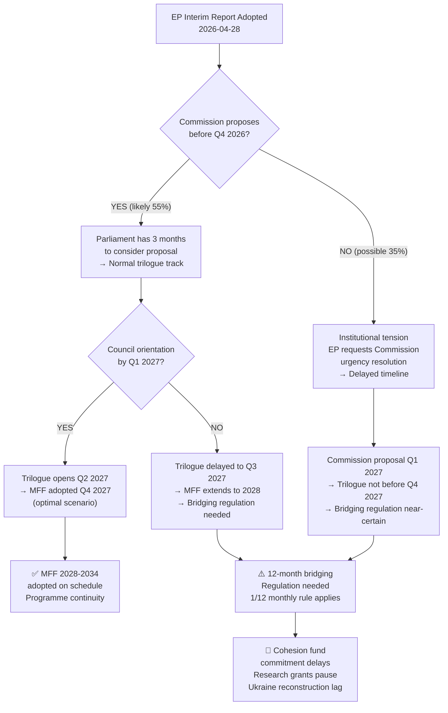
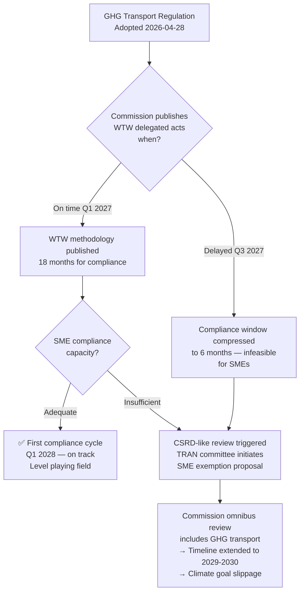

<!-- SPDX-FileCopyrightText: 2024-2026 Hack23 AB -->
<!-- SPDX-License-Identifier: Apache-2.0 -->

# Consequence Trees — EU Parliament Committee Reports, April 2026
**Date:** 2026-04-29 | **Confidence:** 🟡 Medium | **Methodology:** Decision Tree + First/Second/Third Order Consequence Mapping

---

## Reader Block

**What this analysis tells you:** The cascade of consequences flowing from April 28 legislative outcomes, mapped through first-order (immediate), second-order (6–12 months), and third-order (1–3 years) impacts. Decision trees map the branching logic at key choice points.

---

## Consequence Tree 1: MFF 2028-2034 Process

---

## Consequence Tree 2: GSP Reform Conditionality

**First-order consequences (0–3 months):**
1. GSP Regulation published in Official Journal → legally binding for all 67 beneficiary countries
2. Commission must publish implementing acts on conditionality procedures
3. Bangladesh, Pakistan governments initiate diplomatic consultations

**Second-order consequences (3–12 months):**
- **If Commission implements robustly:** WTO consultation by Bangladesh/Pakistan (30–45% probability); supply chain due diligence costs rise for EU importers; GHG and labour standards improve in beneficiary countries (gradual)
- **If Commission slow-walks:** Conditionality remains de facto unenforceable; NGOs launch European Parliament petition; INTA committee holds oversight hearing

**Third-order consequences (1–3 years):**
- **Robust implementation path:** EU builds credibility as trade-values leader; potential model for UK, Canada, Australia GSP reform
- **Diluted implementation path:** GSP reform legally enacted but substantively hollow; NGO campaigns; EP INTA rapporteur pursues revision

---

## Consequence Tree 3: GHG Transport — SME Compliance

---

## Consequence Tree 4: Dogs and Cats Welfare

**First-order (immediate):**
- Regulation enters force 2026; national implementation period begins (3 years typical)
- EU-wide microchip + database requirement creates harmonised traceability standard
- Cross-border puppy trade operators must register in member state of origin

**Second-order (2027–2028):**
- National registries created in 27 member states
- Online pet marketplaces (Ebay, Facebook Marketplace) must verify microchip compliance for EU listings
- Illegal puppy mill operators displace to non-EU European countries (UK, Ukraine) → possible bilateral agreements needed

**Third-order (2028–2030):**
- EU-wide registry interoperability achieved (optimistic); or fragmented implementation (pessimistic)
- Reduced illegal puppy import trade; better disease tracing in zoonotic events
- Positive precedent for EU animal welfare legislation post-Farm to Fork strategy

---

## Cross-Cutting Consequence: Cluster Effect

The April 28 session produced an unusual "cluster effect" — multiple Tier 1 and Tier 2 files adopted simultaneously. The consequences of this cluster extend beyond individual file analysis:

1. **Regulatory bandwidth saturation:** Commission will face simultaneous implementing act pressures for GSP, GHG Transport, Dogs/Cats, and MFF proposal preparation. This creates risk of quality dilution in secondary legislation.

2. **Trade-off political capital:** The political coalition that delivered EPP+S&D+Renew on all major votes signals strong institutional consensus — but also signals that all "political capital investments" from this coalition were consumed in one session.

3. **Implementation credibility:** The success of April 28 adopting ambitious legislation increases scrutiny pressure on whether the EU can actually implement what it passes. EIB CONT oversight, GHG transport compliance, and GSP monitoring all become test cases for EU regulatory credibility in 2027.

---

## Consequence Priority Matrix

| Consequence Chain | Probability | Impact | Monitoring Priority |
|------------------|-------------|--------|-------------------|
| MFF bridging regulation needed | 30–45% | 🔴 CRITICAL | Monthly Commission signals |
| GHG transport delayed/revised | 40–55% | 🔴 HIGH | Q3 2026 delegated acts |
| GSP conditionality diluted | 25–40% | 🔴 HIGH | Q2 2026 implementing acts |
| Pet welfare fragmented implementation | 15–25% | 🟡 MEDIUM | 2027 national reports |
| Immunity waiver CJEU challenge | 5–15% | 🟡 MEDIUM | Monitor MEP statements |
