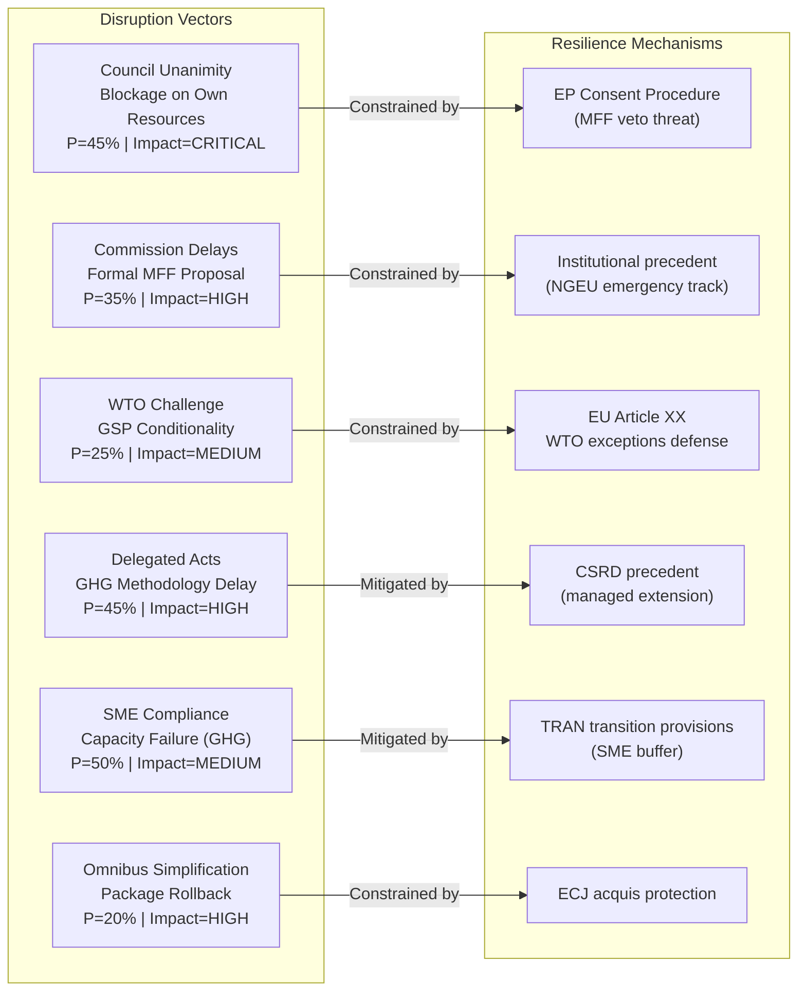

<!-- SPDX-FileCopyrightText: 2024-2026 Hack23 AB -->
<!-- SPDX-License-Identifier: Apache-2.0 -->

# Legislative Disruption Analysis — EU Parliament Committee Reports, April 2026
**Date:** 2026-04-29 | **Confidence:** 🟡 Medium | **Methodology:** Disruption Vector Analysis + Procedural Resilience Assessment

---

## Reader Block

**What this analysis tells you:** The vectors through which April 28 legislative outcomes could be disrupted, delayed, or substantially weakened — and the resilience mechanisms that constrain those disruption paths.

---

## Disruption Threat Map

---

## Disruption Vector Analysis

### VECTOR-1: Omnibus Simplification Package Rollback

**Disruption probability:** 🟡 MEDIUM (20–30%)
**Impact if triggered:** 🔴 HIGH

The European Commission's Omnibus Simplification Package (February 2026) already rolled back or delayed elements of CSRD, CBAM reporting, and EUDR. This sets a precedent for legislative rollback of recently adopted environmental/social regulations. If the same political logic is applied to GHG transport accounting or GSP conditionality:

- GHG transport: SME exemption expansion; TTW instead of WTW accepted
- GSP conditionality: Monitoring requirements simplified; withdrawal thresholds raised

**Disruption mechanism:** Commission delegated acts or amending regulation using CSRD precedent language. Does not require full legislative revision — can be achieved via implementing measures.

**Resilience assessment:** 🟡 MEDIUM resilience — EP consent required for formal rollback but Commission delegated acts can achieve substantive weakening without EP vote. Council/ECR/PfE coalition could accelerate.

---

### VECTOR-2: MFF Negotiation Institutional Rupture

**Disruption probability:** 🟢 LOW-MEDIUM (15–25%)
**Impact if triggered:** 🔴 CRITICAL

In previous MFF cycles, negotiation failure was temporary (not permanent). But in the current geopolitical context, a fundamental breakdown in consensus about the EU's fiscal architecture could:
- Trigger a qualified majority voting reform debate (requires Treaty change — extremely slow)
- Lead to a minimalist "continuation MFF" that merely extends 2021-2027 rules for a further 4 years
- Undermine MFF as a strategic tool for EU industrial/defence policy

**Historical parallel:** The 2005 MFF negotiation failure under the UK Presidency (resolved under Austrian Presidency 2006) shows what temporary rupture looks like. A more fundamental 2026–2027 rupture could be longer and more consequential given geopolitical pressures.

**Resilience assessment:** 🟡 MEDIUM resilience — both Parliament and Council have institutional incentives to reach agreement; absolute failure scenario (< 10%) constrained by shared risk of budgetary chaos.

---

### VECTOR-3: Judicial Disruption — Immunity Waiver CJEU Challenge

**Disruption probability:** 🟢 LOW (5–15%)
**Impact if targeted:** 🟡 MEDIUM

An MEP whose immunity was waived this week could mount an emergency CJEU challenge claiming JURI did not properly apply the fumus persecutionis doctrine. If CJEU grants interim measures, the immunity waiver decision could be suspended pending a full hearing.

**Precedent:** Case C-159/21 (György Donáth) shows CJEU willingness to examine immunity waiver decisions. However, the standard for CJEU intervention is high — the MEP must demonstrate manifestly incorrect application of EP Rules of Procedure.

**Resilience assessment:** 🟢 HIGH resilience — JURI's assessment process is legally robust; CJEU has rarely overturned JURI immunity recommendations.

---

### VECTOR-4: GSP WTO Dispute and Interim Measures

**Disruption probability:** 🟡 MEDIUM (25–35%)
**Impact if triggered:** 🟡 MEDIUM-HIGH

Bangladesh, Pakistan, or a coalition could invoke WTO DSU Article 6 (panel establishment request) after GSP Regulation Official Journal publication. WTO panels allow for interim measures (suspension of contested provisions) in exceptional cases.

**Timeline:** WTO consultation request must precede panel request; full panel process takes 2–4 years. Near-term legislative disruption is limited. Long-term: if panel rules against EU, regulation requires amendment.

**Resilience assessment:** 🟡 MEDIUM — EU has won most WTO trade preference cases but outcomes are uncertain; Article XX defense is strong but not absolute.

---

## Legislative Resilience Score

| File | Disruption Exposure | Resilience Mechanisms | Net Resilience |
|------|--------------------|-----------------------|----------------|
| MFF 2028-2034 | 🔴 HIGH | EP consent procedure, institutional precedent | 🟡 MEDIUM |
| GSP Reform | 🟡 MEDIUM | WTO Article XX, Commission discretion | 🟡 MEDIUM |
| GHG Transport | 🔴 HIGH | CSRD-type managed extension path | 🟡 MEDIUM |
| Dogs & Cats Welfare | 🟢 LOW | Broad political support; no major opposition | 🟢 HIGH |
| EIB Oversight | 🟢 LOW | Non-binding accountability; EIB cooperation | 🟢 HIGH |
| Immunity Waivers | 🟢 LOW | JURI doctrine well-established | 🟢 HIGH |

**Overall legislative resilience assessment for April 28 session:**
🟡 MEDIUM-HIGH — The procedural and institutional mechanisms protecting most adopted texts are robust. The primary risk is not legal disruption but implementation quality degradation through secondary legislation weakness. Parliament must maintain active oversight through INTA, TRAN, and BUDG committees during the implementing acts phase.
