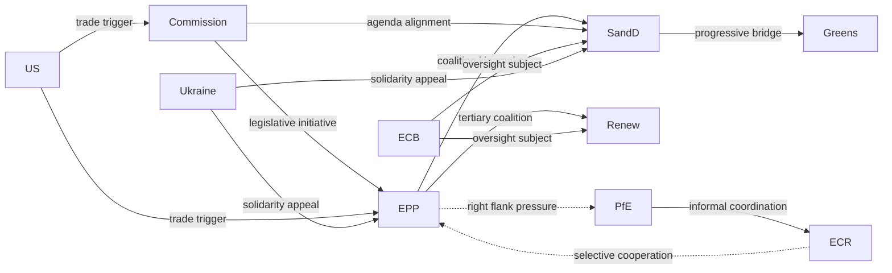

<!-- SPDX-FileCopyrightText: 2024-2026 Hack23 AB -->
<!-- SPDX-License-Identifier: Apache-2.0 -->

# Actor Mapping — EU Parliament Month in Review: April 2026

**Framework:** Structural actor influence mapping and relationship analysis  
**Sources:** EP MCP data (group composition), stakeholder-map.md, coalition-dynamics.md  
**Confidence:** 🟢 High (structural data confirmed; individual MEP behavior inferred from group dynamics)

---

## Actor Classification Framework

Actors are classified by:
- **Power type:** Formal (official institutional role), Informal (influence without formal authority), Technical (specialized expertise), External (non-EP actors)
- **Disposition:** Pro-EU deepening, Status quo, EU reform/sovereignty, Anti-EU
- **Activity level in period:** Active (key vote/text sponsor), Reactive (responded to others), Passive (low profile)

---

## Tier A — Dominant Institutional Actors

### EPP (European People's Party Group)
- **Power:** Formal, 185 seats (25.7%), essential for all majorities
- **Key figures:** Manfred Weber (Group President, DE, CSU)
- **Disposition:** Status quo / pro-EU on institutional questions; sovereignty-conscious on social policy
- **Period activity:** ACTIVE — sponsored or co-sponsored Budget Guidelines, Budget texts
- **Leverage:** Coalition kingmaker; 19x largest group vs. smallest (ESN)
- **Vulnerability:** Internal right-wing pressure from PfE/ECR; center-left faction (housing) vs. right faction (sovereignty)
- **Key relationships:** → S&D (essential coalition partner), → Renew (secondary coalition), → ECR (right-flank pressure), → Commission (institutional ally)

### S&D (Socialists and Democrats)
- **Power:** Formal, 135 seats (18.8%), largest left-of-center bloc
- **Key figures:** Iratxe García Pérez (Group President, ES, PSOE)
- **Disposition:** Pro-EU deepening; social rights; European federalism; climate ambition
- **Period activity:** ACTIVE — housing resolution driver, workers' rights text, Ukraine solidarity
- **Leverage:** Essential for majority formation; can block right-leaning majority without EPP
- **Vulnerability:** Must maintain EPP partnership despite policy divergence on social issues
- **Key relationships:** → EPP (coalition partner despite tensions), → Renew (progressive coalition), → Greens (left flank coordination), → GUE/NGL (sporadic coordination)

### Commission (European Commission)
- **Power:** Formal (legislative initiative monopoly), External to EP
- **Key figures:** Ursula von der Leyen (President, 2nd mandate); relevant Commissioners by policy area
- **Disposition:** Pro-EU institutionally; agenda-setting; shapes EP legislative calendar
- **Period activity:** ACTIVE — Budget Guidelines respond to Commission proposals; Trade defense implementation; Housing White Paper expected
- **Leverage:** Exclusive right of legislative initiative; EP cannot formally advance legislation without Commission proposal
- **Key relationships:** → EPP (historical alignment); → S&D (2nd term coalition); → Council (co-legislator); → ECB (monetary policy dialogue)

---

## Tier B — Significant Institutional Actors

### PfE (Patriots for Europe)
- **Power:** Formal, 84 seats (11.7%); blocking/pressure actor
- **Key figures:** Viktor Orbán (HU, Fidesz), Jordan Bardella (FR, RN)
- **Disposition:** EU reform; national sovereignty; anti-immigration; conditional on EU membership
- **Period activity:** REACTIVE — opposed Ukraine loan, housing resolution; possible support for tariff adjustment
- **Leverage:** Coalition spoiler role; can prevent EPP-right majorities; Orbán's Council veto leverage amplifies EP presence
- **Vulnerability:** Internal coherence relies on Orbán's discipline; Bardella/RN may diverge on specific issues
- **Key relationships:** → ECR (informal right-wing coordination), → EPP (pressure from right), → Council/Orbán (institutional amplification)

### ECR (European Conservatives and Reformists)
- **Power:** Formal, 79 seats (11%); pragmatic right actor
- **Key figures:** Nicola Procaccini (IT, FdI); Jadwiga Wiśniewska (PL, PiS)
- **Disposition:** Conservative reform; sovereignty; anti-federalism; internally divided on Ukraine
- **Period activity:** REACTIVE — trade defense alignment, budget cooperation; Ukraine split
- **Leverage:** Swing vote that can tip EPP-center majorities or right-wing configurations
- **Vulnerability:** Ukraine divergence (eastern members vs. Orbán-adjacent western members) weakens cohesion
- **Key relationships:** → EPP (selective cooperation), → PfE (right-wing proximity), → Council members (national government alignment)

### Renew Europe
- **Power:** Formal, 76 seats (10.6%); pivotal centrist actor
- **Key figures:** Valérie Hayer (FR, Renaissance); various national party leaders
- **Disposition:** Liberal; pro-EU; free trade; digital; NATO; Ukraine solidarity
- **Period activity:** ACTIVE — trade defense coalition, AI/copyright resolution, ECB oversight
- **Leverage:** Completes the EPP-S&D-Renew grand coalition; without Renew, no stable majority
- **Vulnerability:** Macron's political weakness in France reduces Renew's institutional anchor; internal diversity (eastern liberals vs. western social liberals)
- **Key relationships:** → EPP (coalition partner), → S&D (occasional progressive majority), → Commission (alignment)

---

## Tier C — Issue-Specific Actors

### Greens/EFA — 53 seats
- **Period focus:** Housing resolution (driver), climate budget, Ukraine
- **Coalition role:** Progressive majority completion on social/climate files
- **Leverage:** Can withdraw from progressive coalition if climate ambition insufficient

### GUE/NGL — 46 seats
- **Period focus:** Workers' subcontracting rights, housing, trade skepticism
- **Coalition role:** Left-flank, occasional S&D alignment
- **Notable:** EU-Mercosur CJEU request may have had GUE/NGL support (agricultural left-wing opposition to Mercosur)

### ECB (European Central Bank)
- **Power:** Technical, monetary policy independence
- **Period relevance:** Annual Report 2025 (TA-10-2026-0034), Vice-President appointment (TA-10-2026-0060), Supervisory Board (TA-10-2026-0033)
- **Relationship to EP:** EP oversight function; Christine Lagarde testimony before ECON committee

---

## Tier D — External Non-EP Actors

### United States (Trump Administration)
- **Period relevance:** Tariff adjustment regulation (TA-10-2026-0096) — direct legislative response to US trade actions
- **Leverage over EP:** None directly; but US actions create the political conditions that EP responds to
- **Risk:** Escalation risk assessed in wildcards-blackswans.md (12% trade war escalation)

### Ukraine (Government)
- **Period relevance:** Ukraine loan enhancement (TA-10-2026-0010)
- **Lobbying target:** EP Ukraine-support coalition (EPP + S&D + Renew + Greens + ECR Eastern)
- **Leverage:** Geopolitical urgency; Ukrainian diaspora in EU member states

### EU Council Member States
- **Period relevance:** Budget Guidelines (TA-10-2026-0112) — will require Council's response
- **Key national positions:** Germany (fiscal restraint), France (spending ambition), Eastern members (defence priority)

---

## Actor Relationship Network

---

## Actor Summary Assessment

The April 2026 actor landscape is characterized by **EPP's structural centrality** and **bilateral pressure from both flanks** (progressive S&D/Renew/Greens demanding social action; conservative PfE/ECR demanding sovereignty protection). This creates a dynamic where EPP must simultaneously manage internal coherence and external coalition demands — a historically novel stress test for the centre-right group.
