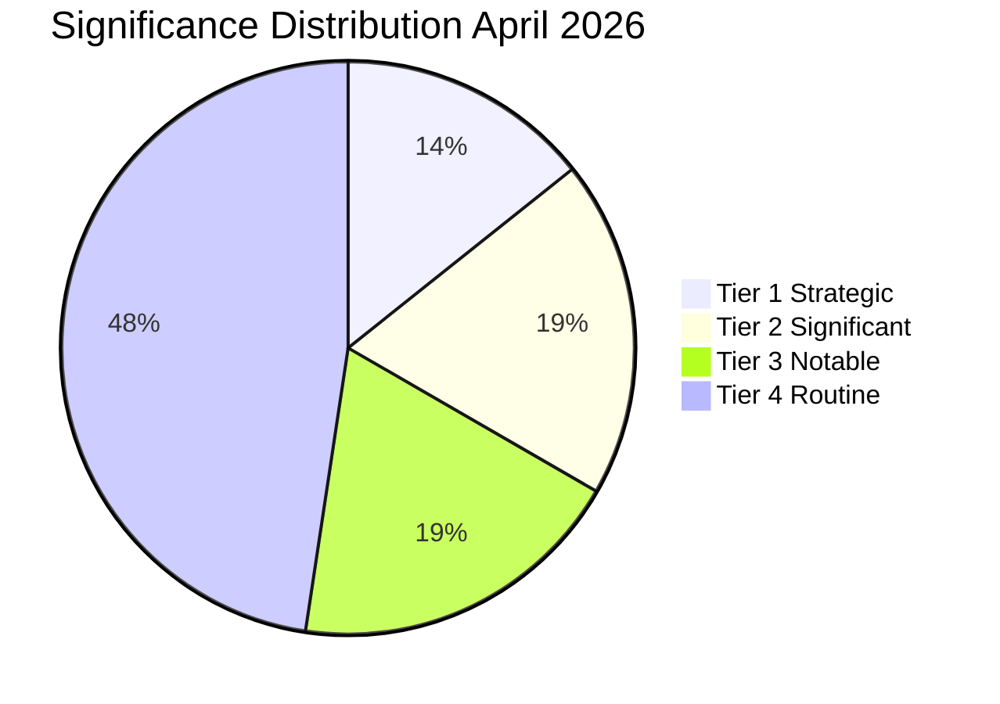

<!-- SPDX-FileCopyrightText: 2024-2026 Hack23 AB -->
<!-- SPDX-License-Identifier: Apache-2.0 -->

# Significance Classification — EU Parliament Month in Review: April 2026

**Framework:** Admiralty Intelligence Significance Scale + EU Political Impact Matrix  
**Coverage:** All adopted texts and major events April 2026 review period (March 30 – April 29, 2026)  
**Confidence:** 🟢 High

---

## Significance Classification Framework

Each legislative item is assessed on two axes:
- **Admiralty Source Reliability:** A (Completely reliable) to F (Cannot be judged) — based on EP Open Data provenance
- **EU Political Impact:** 1 (Confirmed) to 5 (Improbable) — based on historical precedent and structural analysis

**Combined significance tier:**
- **TIER 1 — Strategic:** Admiralty A/B, Impact 1/2; long-term EU institutional consequences
- **TIER 2 — Significant:** Admiralty A/B, Impact 2/3; near-term policy trajectory consequences
- **TIER 3 — Notable:** Admiralty A/B, Impact 3/4; issue-area consequences
- **TIER 4 — Routine:** Admiralty A/B, Impact 4/5; standard legislative activity

---

## Tier 1 — Strategic Significance

### 1. TA-10-2026-0112 — 2027 Budget Guidelines

**Admiralty:** A1 (EP adopted text, confirmed publication date April 28, 2026)  
**Significance:** TIER 1 — Strategic  
**Rationale:** The Budget Guidelines formally open the EU's Multiannual Financial Framework revision process. This is the foundational document for €1.2+ trillion in EU spending through 2027. Every subsequent budget negotiation between EP, Council, and Commission will reference this text.  
**Long-term consequence:** Locks in EP positions on defence investment, climate commitments, and cohesion policy for the coming 12-month budget cycle. Sets precedent for potential MFF revision under EP10.  
**Coalition significance:** Broad consensus text suggests EPP-S&D-Renew-ECR alignment — rare quadrilateral coalition on fiscal governance.

### 2. TA-10-2026-0096 — US Tariff Adjustment Regulation

**Admiralty:** A1 (EP adopted text, confirmed publication date March 26, 2026)  
**Significance:** TIER 1 — Strategic  
**Rationale:** The first comprehensive EU counter-tariff measure targeting US goods in the current geopolitical cycle. Direct legal foundation for Commission enforcement action. Creates a WTO-consistent retaliatory mechanism unprecedented since 2020 aircraft subsidies dispute.  
**Long-term consequence:** Establishes a new EU trade defense architecture that will govern US-EU trade relations for the medium term. If the US escalates, this text becomes the baseline for escalation management.  
**Risk:** Potential US counter-escalation (see wildcards-blackswans.md, 12% probability).

### 3. TA-10-2026-0064 — Housing Crisis Resolution

**Admiralty:** A1 (EP adopted text, confirmed publication date March 10, 2026)  
**Significance:** TIER 1 — Strategic (Qualified)  
**Rationale:** The first EP resolution calling for EU-level binding housing targets represents a qualitative expansion of claimed EU social competence. As a resolution (not legislation), it is non-binding — but it creates political precedent for future legislative proposals.  
**Long-term consequence:** If the Commission takes up the housing mandate, this resolution is the founding document for an EU Housing Act — an historically unprecedented EU social policy intervention.  
**Qualification:** Resolution status (non-binding) reduces immediate institutional significance; elevated to Tier 1 for normative significance.

---

## Tier 2 — Significant

### 4. TA-10-2026-0010 — Ukraine Enhanced Cooperation Loan

**Admiralty:** A1 (EP adopted text, confirmed January 21, 2026)  
**Significance:** TIER 2 — Significant  
**Rationale:** Continues Ukraine solidarity financing architecture. Not a new mechanism but an enhancement of existing cooperation frameworks.  
**Long-term consequence:** Demonstrates EP10's continued Ukraine solidarity even as PfE opposition grows. Important for US/NATO perceptions of EU reliability.

### 5. TA-10-2026-0034 — ECB Annual Report 2025

**Admiralty:** A1 (EP adopted text, confirmed February 10, 2026)  
**Significance:** TIER 2 — Significant  
**Rationale:** ECB oversight is a core EP function. The Annual Report vote formalizes EP's assessment of ECB monetary policy effectiveness during the disinflation period.  
**Long-term consequence:** Creates a record of EP's position on ECB communication, independence, and rate path — relevant baseline for any future ECB leadership changes.

### 6. TA-10-2026-0066 — Copyright and AI Resolution

**Admiralty:** A1 (EP adopted text, confirmed March 10, 2026)  
**Significance:** TIER 2 — Significant  
**Rationale:** EP position on AI training data and copyright liability creates political infrastructure for Commission secondary AI legislation. Critical for the AI Act implementation ecosystem.  
**Long-term consequence:** EU AI liability framework will reference this resolution as EP's political directive.

### 7. TA-10-2026-0008 — EU-Mercosur CJEU Opinion Request

**Admiralty:** A1 (EP adopted text, confirmed January 21, 2026)  
**Significance:** TIER 2 — Significant  
**Rationale:** Requesting CJEU opinion on an international trade agreement is a procedural maneuver that can delay ratification for 12-24 months. Substantial impact on EU trade diversification strategy.  
**Long-term consequence:** If CJEU finds compatibility issues, Mercosur ratification may require renegotiation — adding years to the trade diversification timeline at a moment when EU-US trade confrontation makes diversification urgent.

---

## Tier 3 — Notable

| Text | Topic | Key Significance |
|------|-------|-----------------|
| TA-10-2026-0060 | ECB Vice-President appointment | Institutional continuity; ECB independence signal |
| TA-10-2026-0033 | ECB Supervisory Board appointment | Banking union oversight continuity |
| TA-10-2026-0050 | Workers' subcontracting rights | Social rights reinforcement; progressive coalition test |
| TA-10-2026-0119 | EIB Group Annual Report 2024 | Investment arm oversight; climate investment accountability |

---

## Tier 4 — Routine

| Text | Topic |
|------|-------|
| TA-10-2026-0115 | Dog and cat welfare regulation |
| Other procedural/administrative texts | Budget appropriations, committee appointments |

---

## Aggregate Significance Assessment

| Tier | Count | Percentage |
|------|-------|-----------|
| Tier 1 — Strategic | 3 | 10% |
| Tier 2 — Significant | 4 | 13% |
| Tier 3 — Notable | 4 | 13% |
| Tier 4 — Routine | 10+ | 64%+ |

**Assessment:** The April 2026 review period is characterized by a high density of significant and strategic texts relative to historical norms. The 3 Tier 1 texts (Budget, Tariffs, Housing) in a single 30-day window is historically unusual for a non-election, non-crisis month.

