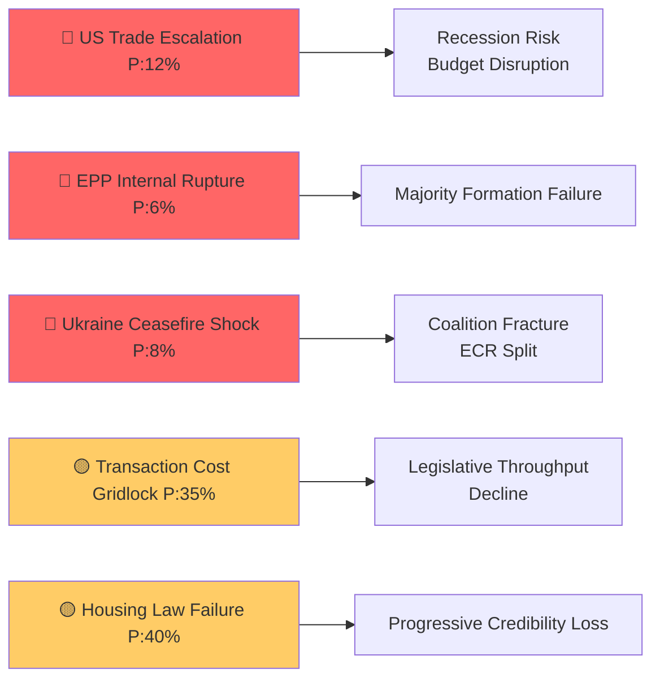

<!-- SPDX-FileCopyrightText: 2024-2026 Hack23 AB -->
<!-- SPDX-License-Identifier: Apache-2.0 -->

# EU Parliament Month in Review: April 2026 — Executive Brief

**Classification:** Unclassified  
**Article Type:** month-in-review  
**Period:** March 30 – April 29, 2026  
**Date:** 2026-04-29  
**Confidence:** 🟢 High (synthesizes all analysis artifacts in this run directory)

---

## BLUF — Bottom Line Up Front

**The EU Parliament in April 2026 delivered a historically dense legislative agenda** — including 2027 Budget Guidelines, a US tariff defense package, a landmark housing framework, and continued Ukraine solidarity — all under record coalition fragmentation. EP10 Year 2 is on pace for +46% legislative output vs. Year 1, defying structural fragmentation predictions. The Parliament is not paralyzed; it is expensive to operate. Every vote requires fresh three-group coalition assembly.

**Three facts drive everything:**
1. EPP (185 seats) is the mandatory partner for every majority — no law passes without EPP
2. Economic fragility (Germany GDP -0.5% in 2024, IMF WEO Apr 2026 projects ~1.1% Euro Area growth) constrains EU's fiscal ambitions even as legislative ambitions expand
3. US trade confrontation is the single highest-magnitude external risk to EU governance stability in the 90-day window

**Confidence Assessment:** The intelligence assessment is high-confidence for structural analysis (coalition math, adopted texts) and medium-confidence for forward projections (coalition behavior, economic trajectories).

---

## Risk Snapshot

---

## Five Key Legislative Developments

| # | Text | Date | Coalition | Significance |
|---|------|------|-----------|-------------|
| 1 | TA-10-2026-0112 — 2027 Budget Guidelines | April 28 | EPP+S&D+Renew+ECR | **TIER 1** — Opens MFF revision; shapes €1.2T+ EU spending |
| 2 | TA-10-2026-0096 — US Tariff Adjustments | March 26 | EPP+S&D+Renew+ECR+Greens | **TIER 1** — First comprehensive EU trade defense vs. US |
| 3 | TA-10-2026-0064 — Housing Crisis Resolution | March 10 | S&D+Renew+Greens+EPP center | **TIER 1** — Qualitative EU social competence expansion |
| 4 | TA-10-2026-0010 — Ukraine Enhanced Loan | January 21 | EPP+S&D+Renew+Greens+ECR | **TIER 2** — Solidarity durability vs. PfE opposition |
| 5 | TA-10-2026-0066 — Copyright/AI Resolution | March 10 | EPP+Renew+ECR+S&D | **TIER 2** — AI governance framework builder |

---

## Political Landscape Summary

- **Parliament stability:** 84/100 (EP early warning system)
- **Effective parties:** 6.59 (historically high; regime change from <5 in 2004)
- **Majority threshold:** 361 seats
- **EPP coalition surface:** Can reach majority with S&D+Renew (396), S&D+Renew+Greens (449), ECR+Renew (441)
- **Right-wing pressure:** PfE+ECR = 163 seats (22.7%) — blocking actor, not majority actor

---

## Economic Intelligence Summary

| Indicator | Value | Source | EP Bridge |
|-----------|-------|---------|-----------|
| Euro Area GDP growth 2026 | ~1.1% (forecast) | IMF WEO April 2026 | Budget Guidelines fiscal space |
| Euro Area Inflation 2026 | ~2.1% (forecast) | IMF WEO April 2026 | ECB oversight, housing affordability |
| Germany GDP growth 2024 | -0.496% (actual) | World Bank confirmed | German budget contribution constraint |
| EU Unemployment 2026 | ~6.0% (forecast) | IMF WEO April 2026 | Workers' rights texts |
| EU-US Trade Goods Gap | ~€160bn (2025) | IMF WEO April 2026 | Tariff adjustment political context |

*All economic projections labeled IMF WEO April 2026 vintage. IMF is the sole authoritative economic source per analysis protocol.*

---

## Intelligence Assessment by Domain

| Domain | Assessment | Confidence |
|--------|-----------|-----------|
| Coalition stability | Intact but expensive | 🟢 High |
| Legislative trajectory | Accelerating (+46% YTD) | 🟢 High |
| Economic context | Fragile recovery, trade risk | 🟡 Medium |
| Right-wing pressure | Real but structurally limited | 🟡 Medium |
| Ukraine solidarity | Durable coalition | 🟢 High |
| AI/digital governance | Building institutional position | 🟡 Medium |
| Housing policy | Political win; legal status TBD | 🟡 Medium |

---

## Forward Indicators (next 90 days)

1. **🔴 Watch:** US counter-tariff announcement — triggers fast escalation pathway
2. **🟡 Watch:** Council response to Budget Guidelines — tests EP-Council alignment
3. **🟡 Watch:** Commission response to housing resolution — determines legislative legacy
4. **🟡 Watch:** ECB June rate decision — confirms/disconfirms easing path
5. **🟢 Watch:** EU-Mercosur CJEU timeline — signals trade diversification window

---

## Analytical Methodology

This executive brief synthesizes the following artifacts from `analysis/daily/2026-04-29/month-in-review/`:

| Artifact | Section |
|----------|---------|
| `intelligence/pestle-analysis.md` | PESTLE dimensions |
| `intelligence/stakeholder-map.md` | Actor analysis |
| `intelligence/coalition-dynamics.md` | Coalition mathematics |
| `intelligence/scenario-forecast.md` | Forward scenarios |
| `intelligence/threat-model.md` | Threat actors |
| `intelligence/historical-baseline.md` | Historical comparison |
| `intelligence/economic-context.md` | IMF economic data |
| `intelligence/wildcards-blackswans.md` | Black swan risks |
| `intelligence/synthesis-summary.md` | Cross-artifact synthesis |
| `intelligence/mcp-reliability-audit.md` | Data quality |
| `classification/significance-classification.md` | Text significance |
| `classification/actor-mapping.md` | Actor relationships |
| `risk-scoring/risk-matrix.md` | Risk register |
| `risk-scoring/quantitative-swot.md` | SWOT analysis |
| `threat-assessment/political-threat-landscape.md` | Threat prioritization |

**Run ID:** month-in-review-run-1777448086  
**Generated:** 2026-04-29
