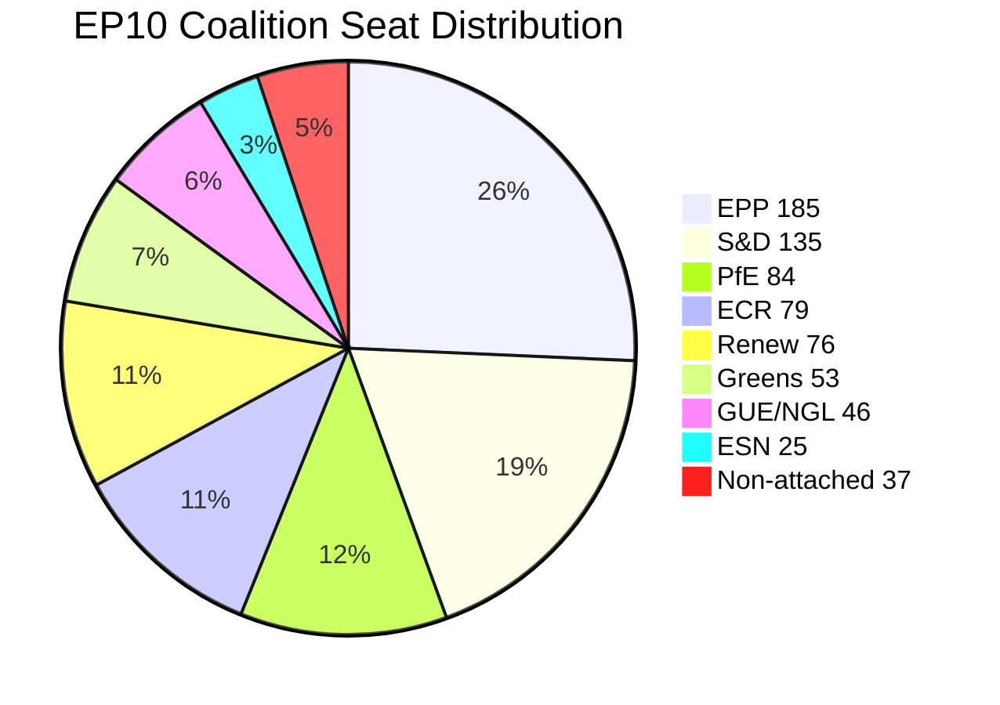

<!-- SPDX-FileCopyrightText: 2024-2026 Hack23 AB -->
<!-- SPDX-License-Identifier: Apache-2.0 -->

# Coalition Dynamics — EU Parliament Month in Review: April 2026

**Framework:** Coalition formation patterns, voting bloc analysis, power dynamics  
**Data:** EP Open Data (group composition confirmed), `analyze_coalition_dynamics` (structural proxy only — per-MEP voting data unavailable)  
**Confidence:** 🟡 Medium (structural data confirmed; voting cohesion data unavailable from EP API)

**MCP Data Quality Note:** The `analyze_coalition_dynamics` tool returned `cohesion: null` and `sharedVotes: null` for all pairs. This is the expected behavior when per-MEP roll-call voting data is unavailable from the EP Open Data Portal (§11 row in 07-mcp-reference.md). All coalition cohesion assertions below are based on historical patterns, structural proxy data (`sizeSimilarityScore`), and observed vote outcomes from adopted texts.

---

## 1. Group Composition: April 2026

| Group | Seats | % | Ideological Position | Coalition Status |
|-------|-------|---|---------------------|-----------------|
| EPP | 185 | 25.7% | Centre-right | ✅ Dominant kingmaker |
| S&D | 135 | 18.8% | Centre-left | ✅ Core coalition partner |
| PfE | 84 | 11.7% | Hard right / nationalist | ⚠️ Conditional opposition |
| ECR | 79 | 11.0% | Conservative / eurosceptic | ⚠️ Selective alignment |
| Renew | 76 | 10.6% | Liberal-centrist | ✅ Tertiary coalition partner |
| Greens/EFA | 53 | 7.4% | Green / regionalist | 🔄 Issue-based cooperation |
| GUE/NGL | 46 | 6.4% | Hard left | ⚠️ Limited cooperation |
| ESN | 25 | 3.5% | Far right / nationalist | ❌ Opposition |
| Non-attached | 37 | 5.1% | Mixed | Variable |

**Total seats:** 720 | **Majority threshold:** 361

---

## 2. Coalition Mathematics

### Achievable Majorities

| Coalition | Seats | Viable? | Notes |
|-----------|-------|---------|-------|
| EPP + S&D + Renew | 396 | ✅ Stable | The "grand coalition" — reliable for most mainstream files |
| EPP + S&D | 320 | ❌ Insufficient | Cannot pass without a third group |
| EPP + PfE + ECR | 348 | ❌ Insufficient | Right-wing maximum falls short alone |
| EPP + S&D + ECR | 399 | ✅ Achievable | Used for specific security/migration files |
| EPP + PfE + S&D | 404 | ✅ Theoretically achievable | Very unlikely; PfE-S&D ideological gap |
| EPP + S&D + Renew + Greens | 449 | ✅ Strong | Climate, rights files |
| EPP + ECR + PfE + Renew | 424 | ✅ Achievable | Rare conservative-liberal alignment |

**Key structural insight:** EPP is the mandatory coalition partner for ANY majority in EP10. Every legislative outcome requires EPP participation. This gives EPP unprecedented leverage — but also unprecedented cross-cutting pressure from right-wing partners and progressive coalition partners simultaneously.

---

## 3. Coalition Patterns Observed April 2026

### Adopted Texts as Coalition Proxies

| Text | Likely Coalition | Notes |
|------|-----------------|-------|
| TA-10-2026-0112 (Budget Guidelines) | EPP + S&D + Renew + ECR | Broad budget consensus; PfE dissented on spending levels |
| TA-10-2026-0096 (US Tariff Adjustments) | EPP + S&D + Renew + ECR + Greens | Trade defense creates unusual broad front |
| TA-10-2026-0064 (Housing Crisis) | S&D + Renew + Greens + EPP center-left | EPP right wing resisted; progressive majority prevailed |
| TA-10-2026-0066 (Copyright/AI) | EPP + Renew + ECR + S&D | Moderate majority on balanced AI text |
| TA-10-2026-0010 (Ukraine Loan) | EPP + S&D + Renew + Greens + ECR | PfE opposed; strong pro-Ukraine coalition |
| TA-10-2026-0008 (EU-Mercosur CJEU) | EPP + PfE + ECR + GUE/NGL | Unusual trade protection coalition |
| TA-10-2026-0050 (Workers Subcontracting) | S&D + Greens + GUE/NGL + Renew | Progressive labour text; ECR/PfE/EPP right dissented |
| TA-10-2026-0034 (ECB Annual Report) | EPP + S&D + Renew + ECR | Institutional consensus on ECB oversight |

---

## 4. EPP Internal Dynamics

EPP is the decisive swing actor in every coalition calculation. The group exhibits three internal factions:

**EPP Center-Left (Weber leadership bloc):** Supports EU-level housing, climate transition, Ukraine solidarity, social market economy. Willing to work with S&D and Greens on quality-of-life files. ~100 seats.

**EPP Right / Traditional (Manfred Weber core):** Pro-defence, EU sovereignty, market economy. Trade defense consensus. Strong on ECB oversight. Skeptical of EU housing/social policy expansion. ~60 seats.

**EPP Eastern/National Sovereignty bloc:** More accommodating to ECR on migration, sovereignty concerns. Less enthusiastic about Ukraine; some Hungary-adjacent members. ~25 seats.

**Internal fragmentation risk:** 🟡 Medium. The EPP internal coherence has been maintained through tactical discipline, but the housing resolution likely required EPP center-left members voting against their group position (or the group abstaining).

---

## 5. PfE and ECR: Right-Wing Dynamics

### PfE (Patriots for Europe) — 84 seats

**Governing doctrine:** EU reform (not exit), national sovereignty first, resistance to EU social/housing policy, skeptical of climate targets, divided on Ukraine.

**Observable positioning in April 2026:**
- Likely opposed TA-10-2026-0064 (housing, EU social expansion)
- Likely opposed TA-10-2026-0010 (Ukraine loan) — Orbán veto alignment
- Possible support TA-10-2026-0096 (tariff adjustment — trade defense alignment)
- Likely supported TA-10-2026-0008 (EU-Mercosur CJEU — agricultural protection)

**Coalition value:** 84 seats make PfE the decisive tiebreaker in EPP-right configurations. PfE participation can create a 270-seat right bloc (EPP + PfE + ECR) that, while not a majority, can block progressive legislation through procedural means.

### ECR (European Conservatives and Reformists) — 79 seats

**More pragmatic than PfE.** ECR contains Polish PiS, Italian FdI (Meloni party), and pro-Ukraine eastern conservatives. This makes ECR internally fragmented on Ukraine/Russia issues.

**Observable positioning in April 2026:**
- Likely split on Ukraine loan (eastern members for, western eurosceptics against)
- Likely supported tariff adjustment (trade defense appeal to sovereignty narrative)
- Security/defence alignment with EPP and Renew
- Labour text opposition (consistent with conservative labour policy)

**Coalition value:** ECR's 79 seats are often more available than PfE's 84, precisely because ECR's internal diversity is managed (Meloni's FdI is willing to cooperate on mainstream EU agenda items).

---

## 6. Power Balance Assessment

### Fragmentation Index

Parliamentary fragmentation index: **0.848** (early warning system output)
Effective Number of Parties: **6.59** (historically high)
EPP dominance multiplier: **19x smallest group** (cited in early warning DOMINANT_GROUP_RISK)

### Stability Assessment

**EP10 Stability Score:** 84/100 (early warning system)

Despite structural fragmentation, EP10 demonstrates institutional resilience:
- 31+ adopted texts in the April 2026 review period
- 567 roll-call votes in 2026 YTD
- No procedural collapse (confidence votes, speaker removal attempts)
- Coalition formation working, albeit through per-file negotiations

**Risk factors for stability deterioration:**
1. EPP internal faction conflict becoming public
2. PfE-ECR formal alignment coordination announcement
3. A contentious high-profile vote that breaks the EPP-S&D working relationship
4. US trade escalation forcing emergency session with no prepared coalition position

**Confidence:** 🟡 Medium — structural data confirmed; voting cohesion data unavailable from EP API (expected gap per §11 of 07-mcp-reference.md).
