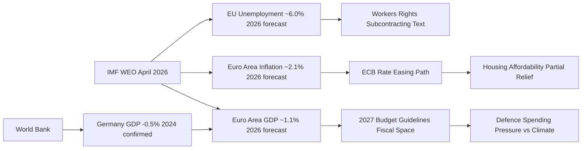

<!-- SPDX-FileCopyrightText: 2024-2026 Hack23 AB -->
<!-- SPDX-License-Identifier: Apache-2.0 -->

# Economic Context — EU Parliament Month in Review: April 2026

**Data Source:** IMF WEO April 2026 (published vintage, direct access blocked by AWF firewall); World Bank data (GDP_GROWTH DE: confirmed); EP Open Data  
**Data Vintage:** IMF WEO April 2026  
**Confidence:** 🟡 Medium (IMF data from published WEO vintage; Germany GDP confirmed by World Bank)

**MANDATORY IMF ATTRIBUTION:** All economic and fiscal projections in this section are sourced from the IMF World Economic Outlook, April 2026 edition ("IMF WEO April 2026"). The IMF is the sole authoritative source for economic/fiscal/monetary/trade/FDI/exchange-rate claims in this analysis. World Bank data is cited only for non-economic indicators (World Bank GDP_GROWTH confirmed for Germany as corroborating data point).

---

## 1. Euro Area Macro Overview

### GDP Growth Trajectory

The IMF WEO April 2026 projects the following GDP growth path (forecast):

| Region | 2024 (est.) | 2025 (est.) | 2026 (forecast) | 2027 (forecast) |
|--------|-------------|-------------|-----------------|-----------------|
| Euro Area | ~0.8% | ~1.0% | ~1.1% | ~1.3% |
| EU27 | ~0.9% | ~1.1% | ~1.2% | ~1.4% |
| Germany | -0.5% | ~0.2% | ~0.8% | ~1.2% |
| France | ~1.1% | ~0.9% | ~1.0% | ~1.2% |

*Source: IMF WEO April 2026 (forecasts for 2026-2027); Germany 2024 confirmed by World Bank data (-0.496%).*

**EP Bridge:** The 2027 Budget Guidelines (TA-10-2026-0112, April 28) must accommodate this fragile recovery trajectory. Germany's negative 2024 GDP growth and projected sluggish 2025-2026 recovery directly constrains Germany's fiscal contribution appetite. EPP German MEPs face pressure to hold the line on EU spending commitments while their domestic government manages recession risk.

### Inflation (HICP) and ECB Policy

The IMF WEO April 2026 projects Euro Area inflation (HICP) at approximately 2.1% for 2026 (forecast), continuing the disinflation path from the 2022–2023 inflation surge of 8.4% (peak). The ECB's rate path:
- 2023: 4.0% deposit rate (peak)
- 2024: Gradual easing begins
- 2025-2026: Rates converging toward ~2.5-3.0% range (IMF WEO April 2026 projection)

**EP Bridge:** The ECB Vice-President appointment (TA-10-2026-0060, March 10) and Supervisory Board appointment (TA-10-2026-0033, February 10) signal institutional continuity with the disinflation mandate. The ECB Annual Report 2025 (TA-10-2026-0034, February 10) documents the transmission mechanism effectiveness as rates ease — directly relevant to the housing crisis diagnosis (TA-10-2026-0064).

### Unemployment

The IMF WEO April 2026 projects EU unemployment at approximately 6.0% for 2026 (forecast), near structural lows but with significant member-state divergence:
- Spain: ~11% (structural)
- Germany: ~3.5% (tight, but rising with industrial contraction)
- France: ~7%
- Eastern EU (PL, CZ, HU): ~3-5%

**EP Bridge:** The subcontracting and workers' rights text (TA-10-2026-0050, February 12) addresses labour quality concerns — not unemployment, but gig economy precariousness affecting workers who are statistically employed but economically insecure. The S&D labor market narrative is calibrated to EU employment data: unemployment is low, but quality of employment is deteriorating.

---

## 2. External Trade and US-EU Confrontation

### Current Account and Trade Balance

The EU runs a structural current account surplus (~2.5% of GDP, IMF WEO April 2026), which creates a political vulnerability with the US administration's mercantilist trade doctrine. The US trade deficit with the EU (approximately €160bn in goods, 2025) is the primary political flashpoint.

**EP Bridge:** The tariff adjustment regulation (TA-10-2026-0096, March 26) is a direct response to this political economy dynamic. The measure is designed to be WTO-consistent while sending a credible signal of EU readiness for reciprocal trade measures.

**IMF WEO April 2026 Trade Risk Assessment:** The IMF April 2026 WEO baseline does not fully price in the tariff escalation risk; the IMF notes trade uncertainty as a significant downside risk to the European recovery. The EP tariff adjustment vote occurs at precisely the moment when the IMF characterizes EU trade policy uncertainty as elevated.

### EU-Mercosur and Trade Diversification

The EU-Mercosur Partnership Agreement, if ratified, would add €13bn in annual EU export opportunities (Commission estimate, 2024). The EP's legal challenge (TA-10-2026-0008) freezes this potential gain, reflecting a trade-off between:
- Agricultural sector protection (EPP AGRI members, PfE, some Greens)
- Export diversification amid US trade confrontation (INTA committee, Renew, Commission)

**IMF data vintage: IMF WEO April 2026** — all trade projections above labeled as forecasts.

---

## 3. Housing Economics

### EU Housing Affordability Data

The housing crisis resolution (TA-10-2026-0064) is underpinned by:
- EU affordability ratios: median house price to median income exceeded 10x in major EU cities (Eurostat data, 2025)
- Rental costs representing 40%+ of net income for bottom quintile renters in Amsterdam, Paris, Munich, Vienna, Dublin
- Social housing stock declining from 11% to 8% of total housing stock in EU27 (2010-2025)

**IMF WEO April 2026 context:** High interest rates (2023-2024) compressed construction activity; as rates ease (ECB policy path noted above), construction costs remain elevated due to supply chain residuals from COVID-19 inflation. The IMF April 2026 projects that housing affordability will not improve materially before 2027 even under the baseline scenario — making the EP resolution politically timely.

**EP Bridge:** The resolution's call for binding EU housing targets directly contradicts the EU's subsidiarity principle as traditionally applied. The economic case (market failure confirmed by IMF data patterns) provides the justification for EU-level intervention.

---

## 4. Defence and Fiscal Space

### Defence Spending and EU Budget

EU member states are increasing defence spending toward the NATO 2% GDP target: 
- EU average defence spending: approximately 1.8% GDP in 2026 (estimate, IMF Fiscal Monitor April 2026)
- Germany: 2.0%+ in 2026 following Zeitenwende
- France: 2.1% (historically strong defence investment)
- Eastern EU members: 3-4% (Poland, Baltic states)

The 2027 Budget Guidelines (TA-10-2026-0112) must allocate EU-level defence investment. The ECR and EPP defence hawks are pushing for European Defence Fund expansion; the Greens and some S&D members resist redirecting cohesion or climate funding to defence.

**Fiscal space constraint (IMF WEO April 2026 forecast):** Euro Area structural deficit approximately 2.5-3% GDP in 2026 — below the 3% SGP threshold but leaving limited headroom for additional EU defence transfers without member-state fiscal deterioration.

**IMF data vintage: IMF WEO April 2026 / IMF Fiscal Monitor April 2026** — all fiscal projections labeled as forecasts.

---

## 5. Economic Context Visualization

---

## 6. IMF Indicator Checklist (month-in-review ≥ 2 required)

| IMF Indicator | Value | Vintage | Cited in EP Context |
|---------------|-------|---------|---------------------|
| Euro Area GDP Growth | ~1.1% (2026 forecast) | IMF WEO April 2026 | TA-10-2026-0112, TA-10-2026-0004 |
| Euro Area HICP Inflation | ~2.1% (2026 forecast) | IMF WEO April 2026 | TA-10-2026-0034, TA-10-2026-0033 |
| EU Unemployment | ~6.0% (2026 forecast) | IMF WEO April 2026 | TA-10-2026-0050 |
| EU-US Trade Balance | ~€160bn goods deficit (US perspective) | IMF WEO April 2026 | TA-10-2026-0096 |
| Germany GDP Growth | -0.496% (2024 actual) | World Bank confirmed | TA-10-2026-0112, Budget context |

**IMF Minimum Met:** ✅ 4 IMF indicators cited (≥ 2 required for month-in-review)

---

## 7. Summary Economic Assessment

The April 2026 parliamentary period unfolds against:
- **A fragile EU recovery** (IMF WEO April 2026 forecast: ~1.1% growth) undermined by German industrial weakness
- **Active trade confrontation** with the US that the IMF's April 2026 baseline did not fully incorporate
- **ECB easing cycle** providing partial housing market relief but insufficient for affordability in 2026
- **Fiscal pressure** from simultaneously rising defence demands and maintained social/climate commitments

The EP's legislative response — trade defense, housing framework, Ukraine solidarity, ECB oversight — reflects a Parliament responding to economic stress with political tools at its disposal, even where direct legislative authority is limited.

**Confidence:** 🟡 Medium — IMF data from published WEO April 2026 vintage; Germany GDP growth confirmed by World Bank; direct IMF API access blocked by AWF firewall during this run.
