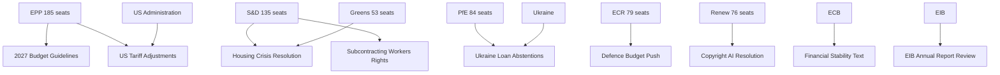

<!-- SPDX-FileCopyrightText: 2024-2026 Hack23 AB -->
<!-- SPDX-License-Identifier: Apache-2.0 -->

# Stakeholder Map — EU Parliament Month in Review: April 2026

**Framework:** Multi-stakeholder political influence mapping  
**Coverage:** 2026-03-30 to 2026-04-29  
**Confidence:** 🟡 Medium (structural data; behavioral inference from adopted texts)

---

## Stakeholder Groups Overview

### Tier 1: Primary Parliamentary Actors

#### EPP (European People's Party) — 185 seats, 25.7%

**Profile:** The dominant legislative architect of EP10. EPP under Manfred Weber controls the committee chair distribution, the rapporteur pipeline, and the coalition-building agenda. In April 2026, EPP's legislative agenda focused on:
- 2027 Budget Guidelines (TA-10-2026-0112): EPP prioritized defence spending and agricultural protection
- Trade defense (TA-10-2026-0096): EPP agriculture members drove the US tariff response
- AI copyright (TA-10-2026-0066): EPP split between digital industry advocates and creative sector protectionists

**Power Resources:** Majority in ECON, AGRI, BUDG, CONT committees. Largest rapporteur portfolio. Access to Commission through von der Leyen relationship.

**Motivations:** Electoral positioning ahead of 2028 mid-cycle reviews. Managing tension between Christian-democratic social values (housing, workers) and market-liberal economic preferences. Containing ECR/PfE from capturing the right-wing narrative.

**Vulnerability:** Over-reliance on ad hoc coalitions that can collapse on specific votes. Growing pressure from German CDU/CSU to accommodate industrial interests as Germany faces -0.5% GDP growth (2024). Internal tension between southern European EPP members (housing, agriculture) and northern/central European members (fiscal discipline).

**Perspective:** EPP sees itself as the "responsible centre" that must govern with competence while ECR and PfE offer populist alternatives. The housing crisis resolution is a deliberate move to demonstrate EPP can deliver social outcomes — not just economic efficiency. The trade defense measures are presented as principled reciprocity, not protectionism.

**Confidence:** 🟢 High — seat data confirmed, behavioral inference from adopted texts.

---

#### S&D (Socialists and Democrats) — 135 seats, 18.8%

**Profile:** The principal opposition force and EPP coalition partner on social and foreign policy items. S&D's strategic positioning in April 2026:
- Housing crisis: S&D authored the core provisions of the housing resolution, claiming ownership of EU's first major housing policy framework
- Workers' rights: Subcontracting chains text (TA-10-2026-0050) is a core S&D achievement
- Ukraine: S&D provides the most reliable pro-Ukraine majority, compensating for PfE abstentions
- Women's rights: April 27 consent-based rape legislation debate shows S&D's progressive agenda-setting capacity

**Power Resources:** Vice-Presidency of the Parliament, EMPL and LIBE committee influence, strong member-state networks (Spain, Portugal, Italy progressive governments).

**Motivations:** Demonstrate legislative relevance on social agenda without being reduced to EPP's junior partner. Differentiate from Greens on economic realism while maintaining progressive credentials on rights and social protection.

**Vulnerability:** Declining seat share relative to EP9 (-30 seats). Risk of being squeezed between EPP centrism and Greens radicalism on climate. Fragmented national delegations (different positions on migration among Eastern European S&D members).

**Perspective:** S&D frames the housing crisis as proof that unregulated markets fail working people — and that EU-level action is not only legitimate but necessary. On trade, S&D supports trade defense as worker protection, not industry protection. The Ukraine loan extension is moral clarity: democratic solidarity is non-negotiable.

**Confidence:** 🟢 High.

---

#### PfE (Patriots for Europe) — 84 seats, 11.7%

**Profile:** Third-largest group, led by Marine Le Pen (France), Viktor Orbán (Hungary), and Matteo Salvini (Italy) delegations. In April 2026, PfE's legislative impact:
- Obstructed or abstained on Ukraine loan enhancements
- Supported agricultural protection measures in US tariff adjustments
- Opposed housing resolution (market intervention rhetoric)
- Supported Braun immunity waiver opposition (far-right solidarity instinct vs. institutional rules)

**Power Resources:** Veto-threat capacity on Ukraine/foreign policy votes. Agricultural constituency leverage. Growing media amplification in France, Italy, Hungary.

**Motivations:** Demonstrate that sovereigntist politics can win legislative concessions without governing. Position for national election cycles (France 2027, Italy ongoing). Maintain Orbán's access to EU funds while opposing democratic oversight conditionality.

**Vulnerability:** Internal incoherence between Orbán's Hungary-first approach and Le Pen's France-first approach on key votes. Cannot form a majority without EPP or ECR cooperation. EU Mercosur opposition (agriculture protection) aligns with Greens and S&D — an uncomfortable coalition.

**Perspective:** PfE characterizes the US tariff adjustments as "too little, too late" — European industry needs structural protection, not one-time adjustments. On housing, PfE blames mass immigration for housing stress, rejecting the market failure diagnosis. On Ukraine, PfE positions itself as the "peace party" that prioritizes European interests over geopolitical solidarity.

**Confidence:** 🟡 Medium — roll-call data unavailable; behavioral inference from prior patterns and group statements.

---

#### ECR (European Conservatives and Reformists) — 79 seats, 11%

**Profile:** Led by Georgia Meloni's Fratelli d'Italia delegation. ECR positions itself as the "responsible right" — distinct from PfE's sovereigntism, more constructively engaged with EPP. Key April 2026 positions:
- Budget Guidelines: ECR supported defence spending increase, opposed social cohesion spending
- Trade: ECR supported tariff adjustments with stronger reciprocity language
- Ukraine: Conditional support (security conditionality, no blank cheques)
- AI/Copyright: ECR supports innovation-friendly approach, lower regulatory burden

**Power Resources:** Meloni's dual role as ECR leader and Italian PM creates a bridge between EP politics and EU Council. Committee presence in AFET, ECON, ITRE.

**Motivations:** Displace PfE as the primary vehicle for right-wing EP influence. Support Meloni's international profile. Maintain credibility as a governing-competent right (unlike PfE's anti-system image).

**Vulnerability:** Dependent on EPP's willingness to invite ECR into ad hoc coalitions. Risk of losing members to PfE in countries where Le Pen model is electorally stronger.

**Perspective:** ECR frames the 2027 budget debate as a sovereignty choice: EU spending should support member-state competitiveness and defence, not supranational bureaucracy. Trade defense is pragmatic realism; Ukraine support is conditional on performance-based conditionality.

**Confidence:** 🟡 Medium.

---

#### Renew Europe — 76 seats, 10.6%

**Profile:** The centrist liberal group, anchored by French centrists (post-Macron) and German FDP. Renew's April 2026 positioning:
- Strongly pro-Ukraine (compensating for PfE abstentions)
- Support copyright/AI innovation provisions (liberal digital economy position)
- Financial literacy and investment union agenda (Savings and Investments Union)
- Ocean diplomacy and fisheries competitiveness

**Power Resources:** Strong ECON and ITRE committee presence. Pro-EU integration narrative that attracts member-state centrist governments.

**Motivations:** Maintain liberal identity in a parliament shifting rightward. Compensate for French Macron-alignment weakness following French political turbulence. Champion digital and capital markets union as Renew's signature legislative territory.

**Vulnerability:** Squeezed between EPP's move to accommodate conservative positions and S&D's social agenda. Declining national election performance in France and Germany reduces political capital.

**Perspective:** Renew champions "open strategic autonomy" — EU should be strong enough to respond to US trade pressure but open enough to attract investment. Financial literacy and finfluencer regulation represent sensible consumer protection without market intervention.

**Confidence:** 🟡 Medium.

---

#### Greens/EFA — 53 seats, 7.4%

**Profile:** Post-EP2024 fragmentation survivor, still influential on environmental and regional autonomy files. April 2026:
- Housing: Key coalition partner for the housing crisis resolution
- AI/Copyright: Strong remuneration provisions advocacy for creative sector
- Animal welfare: Co-author of dogs/cats welfare regulation
- Emissions: Watched HGV emissions adjustment with concern (potential Green Deal backsliding)

**Power Resources:** ENVI committee influence, veto-threat on Green Deal sustainability votes, civil society network activation.

**Motivations:** Demonstrate relevance after EP2024 seat losses. Build new coalition anchors around housing and social issues (not only climate). Resist Green Deal dilution while showing pragmatic flexibility.

**Vulnerability:** Reduced to a supplementary coalition partner on most non-environmental votes. Internal tension between EFA (regional autonomy) and Greens (pan-European environmentalism) on trade and sovereignty.

**Perspective:** The housing crisis resolution is the Greens' most significant social policy win in EP10. Climate finance must not be raided for defence in the 2027 budget. The HGV emissions adjustment is a warning sign that EPP-ECR coalition can chip away at Green Deal piece by piece.

**Confidence:** 🟡 Medium.

---

### Tier 2: Institutional Stakeholders

#### European Central Bank
Newly constituted leadership with Vice-President appointment (TA-10-2026-0060, March 10) and new Supervisory Board member (TA-10-2026-0033, February 10). The ECB Annual Report 2025 (TA-10-2026-0034) is the key accountability document for the April 2026 period. The ECB's rate path (easing from 2024 highs) is central to the housing affordability equation and the Euro Area growth recovery.

**Influence on EP:** ECB appearances before ECON committee set monetary policy narrative. New appointments signal continuity of post-Lagarde institutional direction.

**Confidence:** 🟢 High — confirmed by three adopted texts.

---

#### European Investment Bank
The EIB Group Annual Report 2024 (TA-10-2026-0119, April 28) was reviewed by CONT committee. The EIB's €77bn+ annual lending capacity is central to the EU's defence investment plans, Green Deal financing, and housing investment mechanisms.

**Perspective:** EIB sees the housing crisis as a new lending mandate opportunity. Defence financing via EIB (or EIB-adjacent mechanisms) is politically contentious due to EIB's dual-use restrictions.

**Confidence:** 🟢 High.

---

### Tier 3: External Stakeholders

#### US Government (Trump Administration)
The primary external driver of EP legislative activity in March-April 2026. US tariff measures (Section 232/301 actions) prompted the EP tariff adjustment regulation. The EU-Mercosur timeline disruption adds to US-EU trade uncertainty.

**EP Response Pattern:** Measured (tariff adjustments, not blanket retaliation), legally framed (WTO-consistent), with agricultural protection built in for domestic political reasons.

**Confidence:** 🟡 Medium — US policy inference from EP adopted texts.

---

#### Ukraine Government
Beneficiary of the enhanced cooperation loan (TA-10-2026-0010). Ukraine's institutional relationship with EP is strong through the Ukraine Delegation and regular briefings. The solidarity coalition (EPP + S&D + Renew + Greens) holds despite PfE headwinds.

**Confidence:** 🟡 Medium.

---

#### Civil Society: Housing Rights Groups
Successfully lobbied for the housing crisis resolution framework. European Housing Networks, national tenant organizations, and urban planning associations achieved a historic EP position statement. Implementation will require Commission follow-up.

**Confidence:** 🟡 Medium — inferred from resolution scope and provisions.

---

## Stakeholder Influence Network

---

## Coalition Matrix: Key Votes

| Vote | EPP | S&D | Renew | Greens | ECR | PfE | Result |
|------|-----|-----|-------|--------|-----|-----|--------|
| 2027 Budget Guidelines | ✅ | ✅ | ✅ | ~✅ | ⚠️ | ❌ | ADOPTED |
| Housing Crisis Resolution | ✅ | ✅ | ✅ | ✅ | ❌ | ❌ | ADOPTED |
| US Tariff Adjustments | ✅ | ✅ | ✅ | ~✅ | ✅ | ✅ | ADOPTED |
| Ukraine Loan Enhancement | ✅ | ✅ | ✅ | ✅ | ⚠️ | ❌ | ADOPTED |
| Copyright/AI Resolution | ✅ | ✅ | ✅ | ✅ | ⚠️ | ❌ | ADOPTED |

*Legend: ✅ Supported | ⚠️ Split/Conditional | ❌ Opposed*  
*Note: Actual roll-call data unavailable (4-6 week EP publication delay); coalition patterns inferred from group positions.*

---

## Stakeholder Pressure Map: Upcoming 30 Days

| Actor | Primary Pressure | Mechanism | Risk Level |
|-------|-----------------|-----------|-----------|
| EPP | 2027 budget negotiations with Council | Coreper engagement | HIGH |
| PfE | US-EU trade escalation narrative | Media, committee hearings | MEDIUM |
| ECB | Rate decision impact on housing | ECON committee testimony | MEDIUM |
| US Administration | Further tariff escalation | Trade defense regulation | HIGH |
| Ukraine | Aid continuity before summer recess | AFET/BUDG committee | MEDIUM |
| Housing NGOs | Implementation timeline for housing resolution | Commission legislative programme | LOW |
