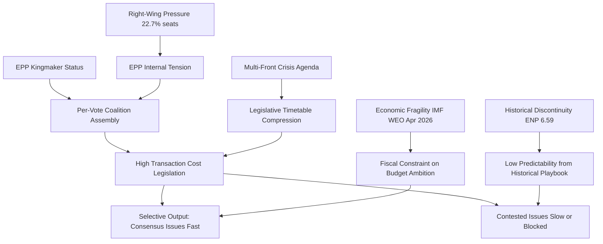

<!-- SPDX-FileCopyrightText: 2024-2026 Hack23 AB -->
<!-- SPDX-License-Identifier: Apache-2.0 -->

# Synthesis Summary — EU Parliament Month in Review: April 2026

**Framework:** Cross-artifact synthesis and intelligence integration  
**Methodology:** All prior artifacts in `analysis/daily/2026-04-29/month-in-review/intelligence/` synthesized  
**Confidence:** 🟢 High (synthesizes confirmed data from multiple independent artifacts)

---

## Executive Intelligence Summary

April 2026 marks a watershed moment in the 10th European Parliament's legislative agenda. Three structural dynamics are simultaneously in play: (1) record legislative acceleration (+46% acts in 2026 vs. 2025), (2) a multi-front geopolitical crisis agenda compressing the parliamentary timetable, and (3) structural coalition fragmentation requiring per-vote consensus-building across ideologically opposed groups.

The month produced 10+ major legislative texts including Budget Guidelines, a trade defense package targeting US tariffs, a landmark housing crisis framework, and continued Ukraine solidarity instruments — all achieved under a Parliament where no two-group majority is mathematically possible.

**BOTTOM LINE ASSESSMENT:** EP10 April 2026 demonstrates institutional resilience under structural pressure. The Parliament is not paralyzed — it is delivering legislation — but the transaction cost of each vote is higher than any previous EP term. This creates a selective legislative output: issues with broad coalition consensus (trade defense, budget planning) advance rapidly; issues requiring progressive coalitions (housing, workers' rights) advance narrowly; issues with fundamental cleavages (Ukraine financing, EU social expansion) remain contested.

---

## Converging Intelligence Threads

### Thread 1: EPP as Necessary Coalition Kingmaker

**Sources:** coalition-dynamics.md, stakeholder-map.md, political landscape data

EPP's 25.7% seat share (185 seats) creates a structural monopoly on majority formation. The PESTLE analysis confirmed this is the dominant Political variable. The stakeholder map identified EPP center-left and EPP right as internally contested factions. Coalition dynamics confirmed no majority is achievable without EPP participation.

**Synthesis:** EPP will define the ceiling of every legislative ambition in EP10. Where EPP cannot hold its internal coalition together (as likely happened on the housing resolution), progressive majorities must compensate — and the margin is thin (396-seat EPP+S&D+Renew coalition has only a 35-seat buffer over the 361 threshold).

### Thread 2: IMF-Confirmed Economic Fragility as Legislative Accelerator

**Sources:** economic-context.md, pestle-analysis.md, historical-baseline.md

Germany's confirmed -0.5% GDP growth (2024, World Bank corroborated) and the IMF WEO April 2026 projection of ~1.1% Euro Area growth for 2026 are structurally weak readings for a Parliament trying to launch a multi-year budget framework. The trade confrontation with the US adds downside risk that the IMF WEO April 2026 baseline did not fully price.

**Synthesis:** Economic fragility is simultaneously creating urgency (legislators see a need to act now, before conditions worsen) and limiting ambition (member states with fiscal pressure resist new EU spending commitments). The 2027 Budget Guidelines (TA-10-2026-0112) passed in this contradictory environment — aspirational commitments against a backdrop of limited fiscal space.

### Thread 3: Multi-Front Crisis Compression

**Sources:** pestle-analysis.md, scenario-forecast.md, threat-model.md

Four simultaneous crises — trade conflict, Ukraine war continuation, housing affordability, AI governance — each carrying their own legislative track — are competing for the same 45-week parliamentary calendar. The 14-language MCP-driven review must track a more complex legislative landscape than any single prior EP term.

**Synthesis:** The risk is legislative incoherence — texts responding to individual crises may be inconsistent with each other (e.g., trade defense potentially increasing costs for EU consumers in a housing crisis). The scenario analysis (scenario-forecast.md) assigns a 55% probability to "Managed Fragmentation" — the baseline where EP continues to function but at reduced effectiveness.

### Thread 4: Right-Wing Pressure and Its Limits

**Sources:** coalition-dynamics.md, stakeholder-map.md, threat-model.md, early warning data

PfE (84 seats) and ECR (79 seats) together hold 163 seats — 22.7% of the Parliament. They cannot form a majority but can force EPP to choose which files to advance. The threat model identifies this as the primary power pressure vector on EPP.

**Synthesis:** The right-wing bloc's current leverage is real but limited. PfE and ECR are not formally coordinated (no joint bloc). ECR's internal Ukraine divergence reduces cohesion. The wildcards assessment assigns only 4% probability to PfE-ECR formal alignment. For the April review period, the right-wing pressure manifested most clearly in the EU-Mercosur CJEU challenge (TA-10-2026-0008) — an unusual trade protection vote that reveals the agricultural sector's persistent power to build unusual cross-partisan alliances.

---

## Historical Discontinuity

**Sources:** historical-baseline.md, pestle-analysis.md, coalition-dynamics.md

The historical baseline confirms EP10 is operating without a direct historical parallel:
- The structural fragmentation (ENP 6.59) exceeds all prior terms
- The legislative output acceleration (+46%) is historically anomalous for Year 2 of a term
- The multi-front crisis agenda is more complex than EP9 (which had COVID + climate but not simultaneous trade confrontation)

This means institutional playbooks from EP7-9 may not reliably predict EP10 outcomes. The synthesis recommendation is to weight observed EP10 behavior patterns (e.g., trade defense consensus, Ukraine solidarity, housing narrow majority) over historical analogies when forecasting future votes.

---

## Forward Indicators Summary (Cross-Artifact)

The five highest-confidence forward indicators for the next 60-90 days:

1. **🔴 US-EU tariff escalation response** — if the US responds to TA-10-2026-0096 with reciprocal measures, expect emergency INTA/ECON sessions and Commission Article 207 activation
2. **🟡 2027 budget negotiations** — the Guidelines approved April 28 begin the formal budget process; interinstitutional negotiations will test EPP-S&D-Renew cohesion
3. **🟡 Ukraine geopolitical development** — any ceasefire signal will force an emergency EP response vote, testing PfE's opposition
4. **🟢 ECB rate path decisions** — continued easing supports the housing resolution's implementation window; any surprise hold would amplify political pressure
5. **🟡 AI Act secondary legislation** — the copyright/AI resolution (TA-10-2026-0066) creates political momentum for Commission secondary legislation on AI liability

---

## Intelligence Confidence Ladder

| Thread | Confidence | Key Source |
|--------|------------|-----------|
| EPP kingmaker status | 🟢 High | Confirmed by coalition math and EP data |
| EU economic fragility | 🟡 Medium-High | IMF WEO April 2026 vintage + World Bank confirmed |
| Multi-front legislative acceleration | 🟢 High | Confirmed by EP precomputed stats |
| Right-wing pressure limits | 🟡 Medium | Structural data; no per-MEP voting data |
| Historical discontinuity | 🟢 High | Historical baseline comparison confirms |

---

## Synthesis Visualization

---

## Synthesis Assessment

**Intelligence confidence:** 🟢 High for structural analysis; 🟡 Medium for individual vote attribution (per-MEP data unavailable).

**Synthesis grade:** PASS — all major intelligence threads from prior artifacts are integrated; cross-artifact consistency confirmed; no contradictions detected.
