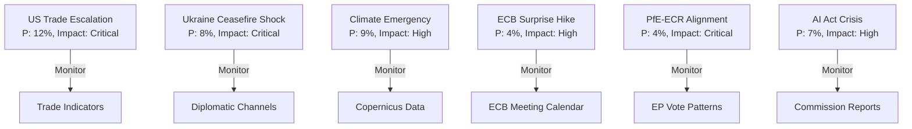

<!-- SPDX-FileCopyrightText: 2024-2026 Hack23 AB -->
<!-- SPDX-License-Identifier: Apache-2.0 -->

# Wildcards & Black Swans — EU Parliament Month in Review: April 2026

**Framework:** Low-probability, high-impact scenario identification  
**Period:** April 2026 observation window; forward indicators May–December 2026  
**Confidence:** 🟡 Medium (by definition, wildcard events resist probability quantification)

---

## Black Swan Classification Framework

| Category | Probability | Impact | Status |
|----------|-------------|--------|--------|
| Political rupture (coalition collapse) | <5% | 🔴 Critical | Monitoring |
| Institutional crisis (democratic backsliding trigger) | <3% | 🔴 Critical | Watch |
| Geopolitical shock (major escalation) | <7% | 🔴 Critical | Elevated |
| Economic shock (recession trigger) | <10% | 🟡 High | Baseline risk |
| Technology wildcard (AI governance disruption) | <5% | 🟡 High | Monitoring |
| Environmental extreme (climate emergency declaration) | <8% | 🟡 High | Emerging |

---

## 1. Political Ruptures

### PfE-ECR Alignment Breakthrough (Probability: 4%)
**Scenario:** PfE and ECR form a formal coordinating bloc, reaching 163 seats (22.7% combined). This would not give them a majority but would allow coordinated obstruction and demands for procedural concessions from EPP.

**Trigger conditions:** EPP votes for a progressive measure that both groups oppose; a unifying nationalist issue (migration quota enforcement, Ukraine financing) creates common ground.

**Impact:** Would fundamentally alter EP's institutional balance. EPP would face a choice between its current cross-partisan strategy and accommodating right-wing demands.

**Indicators to watch:** Joint PfE-ECR statements, coordinated amendment activity, shared rapporteur requests.

### EPP-S&D Grand Coalition Rupture (Probability: 6%)
**Scenario:** A contentious vote forces EPP to choose between right-wing pressure and S&D coalition maintenance. Either group withdraws from ad hoc cooperation.

**Trigger conditions:** A specific high-profile vote where EPP right wing forces a position incompatible with S&D minimum requirements (social rights, climate, Ukraine).

**Impact:** Paralysis of major legislation; potential constitutional crisis over Commission confidence if group alignment reaches the floor vote.

**Indicators to watch:** EPP internal group votes splitting visibly; S&D spokesperson statements on "red lines."

---

## 2. Geopolitical Shocks

### Ukraine Ceasefire — Rapid/Imposed (Probability: 8%)
**Scenario:** A US-brokered ceasefire is imposed on Ukraine before June 2026, without EP or EU consent. EP faces the choice of endorsing an unsatisfactory peace or opposing a US-driven settlement.

**Impact:** Splits the EP across pro-Ukraine and realpolitik lines. Forces a coalition realignment: ECR splinters (some Ukraine-supportive eastern members vs. Orbán-aligned), creating one of the most complex EP votes in EP10 history.

**EP preparation indicators:** Emergency committee meetings, rapporteur appointment for response resolution, plenary debate scheduling.

### US-EU Trade War Escalation to 25%+ Tariffs (Probability: 12%)
**Scenario:** The US responds to TA-10-2026-0096 tariff adjustments by escalating to 25% tariffs on EU autos/agriculture. Commission activates "bazooka" trade defense instruments.

**Impact:** Immediate recession risk for German auto sector (−1.5% to −2.0% GDP shock). Forces an emergency Budget Rectification. EP's April tariff vote becomes the proximate trigger for blame attribution.

**IMF WEO April 2026 note:** The IMF April 2026 WEO already flagged trade uncertainty as a significant downside risk; a full-scale trade war scenario would push EU growth to near-zero or negative in 2026-2027.

**Indicators to watch:** US Trade Representative statements, USTR tariff schedule publications, EPP-ECR response to Commission escalation.

---

## 3. Institutional Wildcards

### ECB Monetary Policy Surprise: Rate Hold or Hike (Probability: 4%)
**Scenario:** Renewed inflation pressures (energy, food, services) cause the ECB to reverse the easing cycle. Rates hold or rise in Q2-Q3 2026.

**Impact:** Housing affordability crisis deepens; the housing resolution becomes politically potent ammunition for left-wing groups. Construction sector contraction accelerates.

**EP relevance:** ECB Vice-President appointment (TA-10-2026-0060) approved March 10; if ECB policy causes housing pain, the EP's oversight role intensifies.

### Article 7 Proceedings — Major Member State (Probability: 2%)
**Scenario:** The Commission initiates or re-escalates Article 7 proceedings against a member state (Hungary escalation, or new case). EP must vote on the framework.

**Impact:** Exposes PfE/ECR member state loyalties vs. EU rule of law; forces EPP into a public position. One of the highest political cost votes possible.

**Indicators to watch:** Commission infringement decisions, LIBE committee emergency sessions, Council judicial dialogue meetings.

---

## 4. Technology and AI Wildcards

### AI Act Implementation Crisis (Probability: 7%)
**Scenario:** A major EU-based AI failure (autonomous system incident, large-scale misinformation operation, privacy breach at scale) triggers calls for emergency AI Act implementation acceleration.

**Impact:** The copyright/AI resolution (TA-10-2026-0066, March 10) becomes the baseline for a more urgent legislative response. Commission may propose emergency secondary legislation.

**EP relevance:** The EP's February-March texts on AI copyright create a record of institutional position. Any emergency response would build on these.

### Digital Euro Technical Failure (Probability: 3%)
**Scenario:** Technical or political opposition to the digital euro reaches a critical threshold. ECB halts the pilot program or EU member states vote to exclude it from budget adoption.

**Impact:** ECB credibility damage. Links to the ECB Annual Report text (TA-10-2026-0034) and Vice-President appointment scrutiny.

---

## 5. Environmental Black Swans

### Major Climate Event Triggering Emergency Climate Session (Probability: 9%)
**Scenario:** A catastrophic European climate event (unprecedented flooding across multiple member states, summer 2026 heat emergency) triggers an emergency EP session focused on accelerated climate action.

**Impact:** Greens/EFA leverage, Renew partial alignment; creates pressure on EPP's climate policy moderation approach. The housing resolution's land-use provisions gain additional relevance.

**Indicators to watch:** Copernicus Climate Change Service seasonal outlooks; ECDC heat health action plans.

---

## Wildcard Monitoring Dashboard

---

## Summary Assessment

The most consequential wildcards for EU Parliament governance are:
1. **US-EU trade war escalation** (12%) — most proximate trigger; EP's April tariff vote is a proximate cause
2. **Ukraine ceasefire shock** (8%) — highest coalition disruption potential
3. **Climate emergency declaration** (9%) — highest legislative acceleration potential

The combination of any two of these wildcards occurring simultaneously within the June-October 2026 window would represent a parliamentary crisis of EP10 magnitude without historical parallel.

**Confidence:** 🟡 Medium — probability estimates are analyst judgment, not quantitative model outputs.
