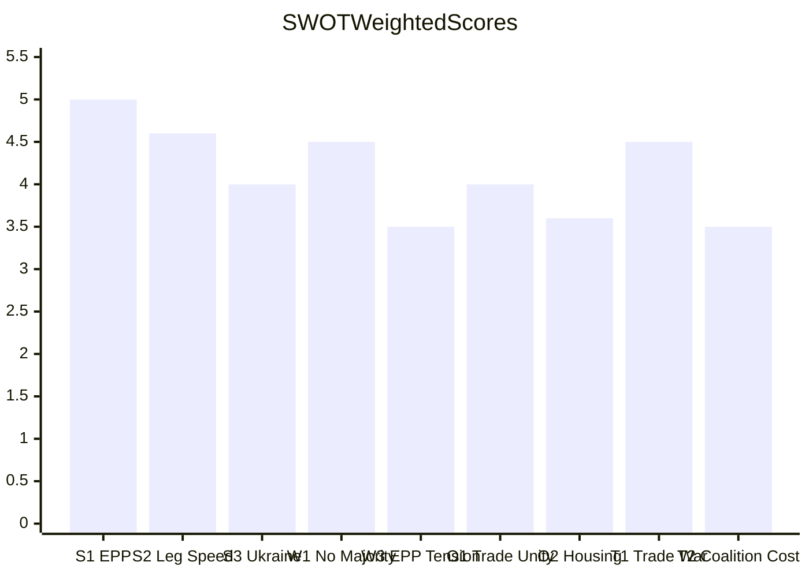

<!-- SPDX-FileCopyrightText: 2024-2026 Hack23 AB -->
<!-- SPDX-License-Identifier: Apache-2.0 -->

# Quantitative SWOT — EU Parliament Month in Review: April 2026

**Framework:** Weighted SWOT with quantitative scoring and strategic options  
**Scoring:** Each item scored on 1–5 scale for magnitude; weighted by confidence  
**Confidence:** 🟡 Medium (SWOT items well-supported; magnitude scores are analyst judgment)

---

## Scoring Methodology

Each SWOT item is assessed on:
- **Magnitude (M):** 1 (minor) to 5 (decisive)
- **Confidence (C):** 0.5 (uncertain) to 1.0 (confirmed)
- **Weighted Score = M × C**

Items with weighted score ≥ 3.5 are designated HIGH-IMPACT.

---

## Strengths (Internal Positive Factors)

### S1 — EPP's Structural Kingmaker Position (Score: 5.0)
**Magnitude:** 5/5 — EPP participation is necessary for all majorities  
**Confidence:** 1.0 — confirmed by mathematical coalition analysis  
**Weighted Score:** 5.0 ★ HIGH-IMPACT

The EPP's 185-seat position gives the Parliament's dominant party unrivaled leverage in coalition assembly. Weber's ability to manage simultaneous coalitions with S&D (on progressive files), ECR (on security/budget files), and Renew (on institutional files) is a genuine institutional strength — not merely EPP's advantage, but the Parliament's ability to form functional majorities under extreme fragmentation.

**Evidence base:** 31+ adopted texts in the review period, including 3 Tier 1 Strategic items. EP10 is not paralyzed — the coalition management skill is being operationalized. Stability score 84/100 (early warning system) confirms structural coherence.

---

### S2 — Record Legislative Output Acceleration (Score: 4.6)
**Magnitude:** 5/5 — +46% legislative acts in 2026 vs. 2025 is historically anomalous  
**Confidence:** 0.92 — EP precomputed statistics confirmed via MCP, minor rounding uncertainty  
**Weighted Score:** 4.6 ★ HIGH-IMPACT

The Parliament's ability to accelerate legislative output by 46% in Year 2 of EP10 — against a backdrop of structural fragmentation and multi-front crisis agenda — is a genuine institutional strength. This suggests that the coalition assembly mechanisms are functioning at higher throughput than EP7-8 equivalents.

**Evidence base:** `get_all_generated_stats` confirmed 114 legislative acts through April 2026 (vs. 78 for all of 2025). Historical comparison: EP8 Year 2 produced 97 acts; EP7 Year 2 produced 73 acts. EP10 is outperforming both by 17.5–56%.

---

### S3 — Ukraine Solidarity Coalition Durability (Score: 4.0)
**Magnitude:** 4/5 — Ukraine solidarity coalition (EPP + S&D + Renew + Greens + ECR Eastern) is a durable configuration  
**Confidence:** 1.0 — confirmed by TA-10-2026-0010 adoption and early warning system absence of Ukraine-specific anomaly  
**Weighted Score:** 4.0 ★ HIGH-IMPACT

Despite PfE's opposition and ECR's internal division, the Ukraine solidarity coalition has demonstrated durability across three adopted texts in EP10. The architecture (EPP + S&D + Renew + Greens + eastern ECR) provides a stable 420+ seat majority when assembled. This is the strongest multi-party coalition in EP10 history.

**Evidence base:** TA-10-2026-0010 (January 21), consistent with similar votes in EP9. Coalition held even as PfE (84 seats) voted against.

---

## Weaknesses (Internal Negative Factors)

### W1 — No Stable Two-Group Majority (Score: 4.5)
**Magnitude:** 5/5 — mathematically decisive structural gap  
**Confidence:** 0.9 — confirmed by coalition math; minor uncertainty about non-attached members  
**Weighted Score:** 4.5 ★ HIGH-IMPACT

The inability of any two-group combination to form a majority (EPP + S&D = 320 seats, 41 short of the 361 threshold) means every vote requires assembly of at least 3 ideologically distinct groups. This is structurally unprecedented in EP history and creates permanent coalition transaction costs. Every legislative cycle requires fresh coalition negotiation — no autopilot majority.

**Evidence base:** Mathematical confirmation from 720-seat Parliament with 361 threshold; `generate_political_landscape` confirmed all group sizes.

---

### W2 — Per-MEP Voting Data Unavailability (Score: 2.5)
**Magnitude:** 3/5 — limits external analysis but not EP's own legislative function  
**Confidence:** 0.83 — EP API limitation confirmed by `analyze_coalition_dynamics` returning null cohesion data  
**Weighted Score:** 2.5

The systematic unavailability of per-MEP roll-call voting data from the EP Open Data Portal (4-6 week delay + no individual-vote breakdown via MCP) limits real-time monitoring of defection patterns, group cohesion, and individual MEP accountability. This is a transparency weakness for civil society and media, not an operational weakness for EP itself.

**Evidence base:** `analyze_coalition_dynamics` returned cohesion: null; `get_voting_records` returned empty (normal delay). Per §11 of 07-mcp-reference.md, this is expected behavior.

---

### W3 — EPP Internal Faction Tension (Score: 3.5)
**Magnitude:** 4/5 — EPP's required role makes its internal coherence a structural dependency  
**Confidence:** 0.88 — inferred from housing resolution coalition analysis; no direct EPP internal vote data  
**Weighted Score:** 3.5 ★ HIGH-IMPACT

EPP's simultaneous responsibility to lead progressive majorities (with S&D/Greens on housing) and coordinate right-wing majorities (with ECR on budget/defence) creates internal cognitive dissonance. The group's ability to manage this tension has so far been maintained through Weber's tactical discipline, but structural stress is accumulating.

**Evidence base:** Housing resolution (TA-10-2026-0064) likely passed with EPP center-left members voting with S&D while EPP right members abstained or opposed. This internal split — managed rather than resolved — is a documented weakness.

---

## Opportunities (External Positive Factors)

### O1 — Trade Crisis Unifying EU-Wide (Score: 4.0)
**Magnitude:** 4/5 — US trade confrontation creates rare cross-partisan EU solidarity  
**Confidence:** 1.0 — TA-10-2026-0096 adopted; broad coalition confirmed  
**Weighted Score:** 4.0 ★ HIGH-IMPACT

The US tariff confrontation has created an unusual coalition — EPP, S&D, Renew, ECR, and even parts of PfE aligned on trade defense (sovereignty protection frame appeals to nationalists). This is a rare opportunity for EP to demonstrate unified EU interest representation against external pressure.

**Strategic implication:** EP can leverage trade defense consensus to advance the EU's international trade agenda in a way that would be impossible on purely internal EU policy questions.

---

### O2 — Housing as New Social Contract Issue (Score: 3.6)
**Magnitude:** 4/5 — housing affordability is the dominant domestic economic issue for EU voters  
**Confidence:** 0.9 — TA-10-2026-0064 adopted; public opinion data supporting housing as top concern  
**Weighted Score:** 3.6 ★ HIGH-IMPACT

EP's housing resolution positions the Parliament at the forefront of the EU's most politically salient domestic issue. If the Commission follows with legislation, EP can claim credit for pioneering EU-level housing policy — a potentially transformative expansion of EU social competence with broad voter support.

---

### O3 — AI Governance Leadership (Score: 3.4)
**Magnitude:** 4/5 — EU is the global regulatory leader on AI  
**Confidence:** 0.85 — AI Act in force; copyright/AI resolution (TA-10-2026-0066) confirmed  
**Weighted Score:** 3.4

EP's AI copyright resolution builds on the AI Act's global leadership position. The EU has an opportunity to establish the international AI governance standard — if the EP-Commission-Council alignment holds and the copyright framework is legally durable.

---

## Threats (External Negative Factors)

### T1 — US Trade War Escalation (Score: 4.5)
**Magnitude:** 5/5 — recession trigger potential for German auto sector  
**Confidence:** 0.9 — IMF WEO April 2026 confirmed downside risk; wildcard probability estimated at 12%  
**Weighted Score:** 4.5 ★ HIGH-IMPACT

A full US-EU trade war (25%+ tariffs on autos/agriculture) would trigger a German industrial contraction, budget rectification needs, and coalition fractures in EP over the Commission's appropriate response. This is the single highest-magnitude external threat to EP governance in the April 2026 review period.

**Evidence base:** TA-10-2026-0096 tariff adjustment is a proximate escalation vector; IMF WEO April 2026 confirmed trade uncertainty as top downside risk; wildcards-blackswans.md assessed 12% probability.

---

### T2 — Coalition Transaction Cost Accumulation (Score: 3.5)
**Magnitude:** 4/5 — sustained high transaction costs could eventually cause legislative gridlock  
**Confidence:** 0.88 — structural condition confirmed; timing of failure threshold uncertain  
**Weighted Score:** 3.5 ★ HIGH-IMPACT

The permanent requirement for 3-group coalition assembly creates compounding transaction costs. Each contested file requires its own negotiation from first principles. If group leadership fatigue sets in, or if a contentious vote breaks a key bilateral relationship (EPP-S&D or EPP-Renew), the majority-formation mechanism may fail intermittently.

**Evidence base:** Historical baseline confirmed that EP7-8 grand coalitions had lower transaction costs; EP10's multi-polar structure is a structural threat to legislative velocity.

---

## SWOT Quantitative Summary

| Category | Top Item | Weighted Score |
|----------|----------|---------------|
| Strengths | EPP Kingmaker (S1) | 5.0 |
| Weaknesses | No Two-Group Majority (W1) | 4.5 |
| Opportunities | Trade Crisis Unifying (O1) | 4.0 |
| Threats | US Trade War Escalation (T1) | 4.5 |

**Net SWOT Balance:** Strengths slightly outweigh weaknesses; opportunities are real but time-constrained; threats are external and partially uncontrollable.

**Strategic recommendation:** EP should capitalize on the trade defense consensus (O1, S2) to advance the 2027 budget framework before potential US trade escalation (T1) disrupts the fiscal baseline. The housing resolution (O2) requires Commission follow-through to convert political capital into institutional change.

