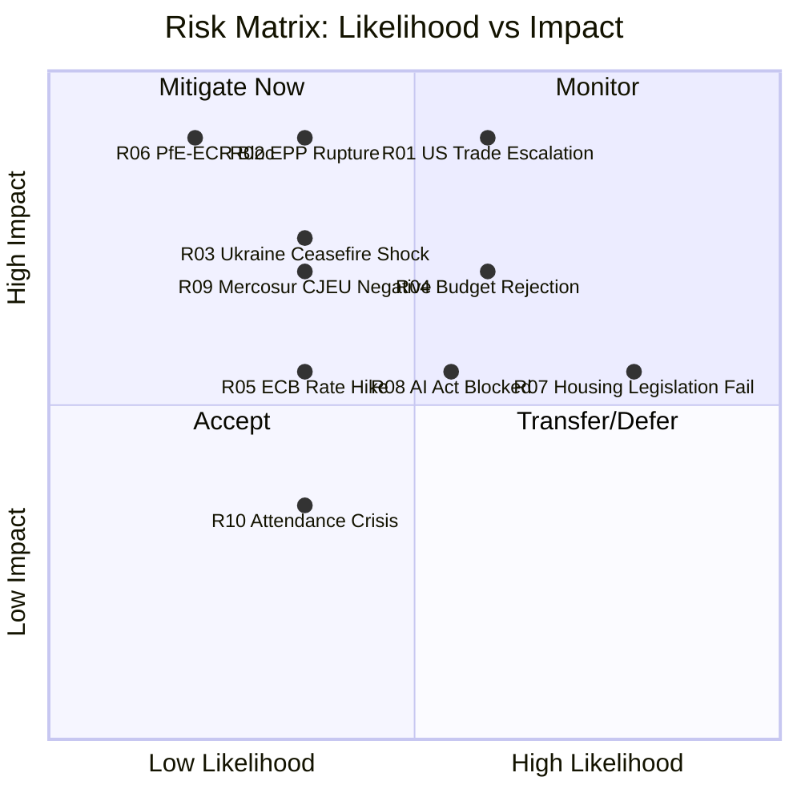

<!-- SPDX-FileCopyrightText: 2024-2026 Hack23 AB -->
<!-- SPDX-License-Identifier: Apache-2.0 -->

# Risk Matrix — EU Parliament Month in Review: April 2026

**Framework:** 5x5 Likelihood × Impact Risk Matrix + Velocity Assessment  
**Period:** April 2026 observation; 90-day forward risk window  
**Confidence:** 🟡 Medium (qualitative risk assessment; no actuarial data available)

---

## Risk Scoring Methodology

**Likelihood Scale:**
1. Very Low (<5%)
2. Low (5–15%)
3. Medium (15–35%)
4. High (35–65%)
5. Very High (>65%)

**Impact Scale:**
1. Minimal — local/minor consequences
2. Low — limited institutional or policy effect
3. Moderate — significant policy or institutional disruption
4. High — major institutional or geopolitical disruption
5. Critical — systemic threat to EP function or EU governance

**Risk Score = Likelihood × Impact (1–25)**  
**Velocity:** Fast (<30 days), Medium (30–90 days), Slow (>90 days)

---

## Risk Register

| ID | Risk | Likelihood | Impact | Score | Velocity | Status |
|----|------|-----------|--------|-------|----------|--------|
| R01 | US-EU trade war escalation (25%+ tariffs on EU autos/agriculture) | 3 | 5 | 15 | Fast | 🔴 HIGH |
| R02 | EPP internal coalition rupture (right faction splits from center) | 2 | 5 | 10 | Medium | 🟡 MEDIUM |
| R03 | Ukraine ceasefire shock — EP must respond to US-imposed settlement | 2 | 4 | 8 | Fast | 🟡 MEDIUM |
| R04 | Budget Guidelines Council rejection — MFF revision stalled | 3 | 4 | 12 | Medium | 🟡 MEDIUM |
| R05 | ECB unexpected rate hold/hike — housing crisis deepens | 2 | 3 | 6 | Medium | 🟡 MEDIUM |
| R06 | PfE-ECR formal coordination bloc formed | 1 | 5 | 5 | Slow | 🟢 LOW |
| R07 | Housing resolution — Commission declines to legislate | 4 | 3 | 12 | Slow | 🟡 MEDIUM |
| R08 | AI Act secondary legislation blocked by EPP-right coalition | 3 | 3 | 9 | Slow | 🟡 MEDIUM |
| R09 | EU-Mercosur CJEU negative opinion — trade diversification blocked | 2 | 4 | 8 | Slow | 🟡 MEDIUM |
| R10 | EP attendance crisis — quorum failures on contested votes | 2 | 2 | 4 | Fast | 🟢 LOW |
| R11 | Safeoutputs MCP session TTL expiry — workflow fails | 3 | 3 | 9 | Fast | 🟡 MEDIUM (operational) |
| R12 | EP data API complete degradation — next run data unavailable | 2 | 2 | 4 | Fast | 🟢 LOW |

---

## Top-5 Priority Risks (by score)

### R01 — US-EU Trade War Escalation (Score: 15)

**Trigger:** US responds to TA-10-2026-0096 tariff adjustments with 25%+ counter-tariffs on EU automotive/agricultural exports.

**Impact pathway:**
- German auto sector contraction (−1.5% GDP shock)
- EU budget revenue shortfall requiring rectification
- Commission activates emergency trade defense instruments
- EP called for emergency INTA/ECON sessions
- EPP-ECR-PfE coalition fragmentation as protectionist vs. free-trade EPP factions diverge

**Controls:**
- Commission's calibrated response to initial US tariffs (TA-10-2026-0096 was proportionate)
- WTO dispute resolution mechanism provides procedural buffer
- G7 diplomatic channels (Germany, France influence)

**Residual risk:** 🔴 HIGH — US administration's unpredictability is a structural uncertainty not mitigated by EU controls

**IMF WEO April 2026 context:** IMF already flagged trade uncertainty as significant downside risk; a full escalation scenario is not priced into EP budget assumptions.

### R04 — Budget Guidelines Council Rejection (Score: 12)

**Trigger:** Council (Council of the EU) rejects or substantially amends the 2027 Budget Guidelines passed April 28, initiating a prolonged interinstitutional negotiation.

**Impact pathway:**
- Budget conciliation period extends into Q4 2026
- Risk of budget adoption failure requiring provisional twelfths (continuing resolution)
- EP-Council institutional tension — damages interinstitutional relations

**Controls:**
- EP-Council MFF coordination had preliminary contacts before the Guidelines vote
- Political alignment between EPP (Parliament majority base) and EPP-aligned Council members
- Historical precedent: EP-Council budget disagreements resolved in conciliation in >90% of cases

**Residual risk:** 🟡 MEDIUM

### R07 — Commission Declines Housing Legislation (Score: 12)

**Trigger:** Commission's response to TA-10-2026-0064 housing resolution is a non-binding White Paper or communication, not a legislative proposal.

**Impact pathway:**
- S&D and Greens frustrated; progressive coalition credibility damaged
- EP resolution becomes a record of political failure
- Housing affordability continues to deteriorate (IMF WEO April 2026 baseline projects no improvement before 2027)

**Controls:**
- Commission has expressed housing affordability concerns in 2025-2026 communications
- Von der Leyen's political programme includes housing in the "social market economy" framework
- EU competence constraints may legally prevent binding legislation even if politically desired

**Residual risk:** 🟡 MEDIUM

---

## Risk Heat Map

---

## Risk Appetite Assessment

The EU Parliament's institutional design embeds structural risk tolerance:
- Coalition assembly costs: ACCEPTED (structural feature, not a risk to be mitigated)
- Per-MEP voting data unavailability: ACCEPTED (EP API limitation, not an institutional risk)
- Geopolitical shock responses: MANAGED (emergency procedure provisions exist)
- Budget interinstitutional disagreement: MANAGED (conciliation mechanism)

**Conclusion:** The Parliament's institutional risk exposure in April 2026 is elevated relative to prior terms (due to fragmentation and multi-front crisis agenda), but the institutional mechanisms for crisis management remain intact. The 84/100 stability score confirms this assessment.
