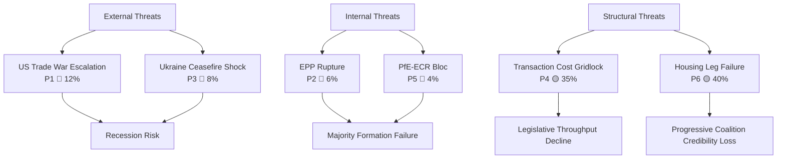

<!-- SPDX-FileCopyrightText: 2024-2026 Hack23 AB -->
<!-- SPDX-License-Identifier: Apache-2.0 -->

# Political Threat Landscape — EU Parliament Month in Review: April 2026

**Framework:** Threat landscape synthesis for EU political governance  
**Sources:** threat-model.md, risk-matrix.md, wildcards-blackswans.md, coalition-dynamics.md  
**Confidence:** 🟡 Medium (threat landscape is qualitative synthesis; individual actor behavior uncertain)

---

## Threat Landscape Overview

The EU Parliament's April 2026 operating environment faces three distinct threat vectors:

1. **Internal institutional threats** — coalition fracture, procedural disruption, EPP coherence
2. **External geopolitical threats** — US trade confrontation, Ukraine war dynamics, third-party shocks
3. **Structural/systemic threats** — fragmentation accumulation, democratic legitimacy, transparency gaps

---

## Threat Prioritization Matrix

| Threat | Vector | Severity | Probability | Priority |
|--------|--------|---------|-------------|----------|
| US-EU trade war escalation | External | 🔴 Critical | 12% | P1 |
| EPP internal coalition rupture | Internal | 🔴 Critical | 6% | P2 |
| Ukraine ceasefire imposed shock | External | 🔴 Critical | 8% | P3 |
| Coalition transaction cost gridlock | Structural | 🟡 High | 35% | P4 |
| PfE-ECR formal alignment bloc | Internal | 🔴 Critical | 4% | P5 |
| Housing resolution legislative failure | Internal | 🟡 High | 40% | P6 |
| Article 7 escalation | Internal | 🔴 Critical | 2% | P7 |
| AI governance implementation crisis | External/Internal | 🟡 High | 7% | P8 |

---

## P1: US Trade War Escalation

**Threat Actor:** US Administration (trade policy axis)  
**Target:** EU export sectors (automotive, agriculture, chemicals)  
**Method:** Counter-tariff measures (25%+) in response to TA-10-2026-0096  
**Effect:** Recession trigger; budget disruption; EP coalition fracture  
**Timeline:** Fast (<30 days from US counter-measure announcement)

**EP Threat Response Posture:** Reactive. EP cannot prevent US escalation; can only shape EU response. The INTA committee would convene emergency sessions. Commission would invoke Article 207 TFEU emergency trade measures. EP's role is oversight, validation, and coalition management for Commission's response.

**Residual risk:** 🔴 HIGH — No EP control over US decision; firewall controls ineffective.

---

## P2: EPP Internal Coalition Rupture

**Threat Actor:** EPP right faction (national sovereignty bloc, ~25 seats)  
**Target:** EPP center-left leadership (Weber)  
**Method:** Public defection on a high-profile vote; formal right-wing motion challenging Weber's leadership  
**Effect:** EPP group cohesion collapses; majority formation becomes impossible for 2-3 months  
**Timeline:** Medium (30-90 days; tied to a specific high-profile vote)

**Trigger candidates:**
- A progressive-majority housing bill being blamed on EPP center-left
- Ukraine financing vote where EPP right defects to PfE position
- A EU social regulation EPP right characterizes as federalist overreach

**EP Threat Response Posture:** Preventive. Weber and EPP leadership are actively managing internal tensions. The threat is real but not imminent given current 84/100 stability score.

---

## P3: Ukraine Ceasefire Imposed Shock

**Threat Actor:** US Administration + Russia (diplomatic axis)  
**Target:** EP's Ukraine solidarity coalition  
**Method:** Unilateral ceasefire announcement that EP must respond to (without EP preparation)  
**Effect:** ECR internal split; PfE opposition amplified; forced EP emergency session  
**Timeline:** Fast (<7 days from announcement to EP emergency session requirement)

**Coalition impact:** The Ukraine solidarity coalition (EPP + S&D + Renew + Greens + ECR Eastern) would fracture: western ECR and PfE would pressure EPP to accept the ceasefire; eastern EPP, S&D, Renew, and Greens would resist.

---

## P4: Coalition Transaction Cost Gridlock

**Threat Actor:** Structural (EP fragmentation architecture)  
**Target:** Legislative throughput capacity  
**Method:** Accumulation of failed coalition assembly attempts; voter/MEP fatigue with constant negotiation  
**Effect:** Selective legislative paralysis on contested files; EP reputation damage  
**Timeline:** Slow (>90 days; chronic rather than acute)

**Assessment:** This is the most likely medium-term threat (35% probability). Not a catastrophic failure but a progressive degradation of EP's legislative effectiveness on second-tier files. Tier 1 strategic items (Budget, Trade, Ukraine) will continue to pass; social, environmental, and structural reform files will increasingly fail.

**Evidence:** The housing resolution (non-binding) vs. a housing regulation (binding) trajectory illustrates this — broad agreement on problem statement, narrow coalition for binding solution.

---

## P5: PfE-ECR Formal Alignment Bloc

**Threat Actor:** PfE and ECR group leadership  
**Target:** EP majority formation mechanisms  
**Method:** Formal inter-group coordination agreement (joint statements, coordinated amendments, shared rapporteur requests)  
**Effect:** 163-seat blocking bloc; forces EPP to make concessions to right wing before advancing any file  
**Timeline:** Slow (months of negotiation required); probability only 4%

**Why unlikely:** PfE and ECR have structural differences on Ukraine (ECR eastern members are firmly pro-Ukraine; PfE/Orbán is anti-Ukraine). Formal alignment would require ECR to compromise on this existential for eastern members.

---

## Threat Visualization

---

## Threat Mitigation Postures

| Threat | EP Mitigation Available? | Notes |
|--------|--------------------------|-------|
| US trade escalation | Limited | EP can shape response speed; cannot prevent |
| EPP rupture | Yes (internal) | Weber leadership management; tactical issue selection |
| Ukraine ceasefire | Preparation only | Emergency procedure planning; rapporteur pre-appointment |
| Transaction cost gridlock | Structural | Cannot be eliminated; procedural efficiency improvements help |
| PfE-ECR bloc | Limited | Would require EP rule changes to prevent; monitoring is primary |

---

## Summary Threat Assessment

**Overall threat level for EP10 governance:** 🟡 ELEVATED  
**Compared to prior EP terms:** Higher than EP7-9 average; lower than acute crisis periods (EP9 COVID, 2019 Brexit)  
**Most likely threat materialization:** P4 (Transaction cost gridlock, 35%) and P6 (Housing legislative failure, 40%) — both are structural/chronic threats already partially materializing  
**Most dangerous (but unlikely) threat:** P1 (US trade war escalation) — low probability but recession-trigger impact  

The EU Parliament's institutional resilience (stability score 84/100; 31+ adopted texts in period) suggests that the threat environment, while elevated, is being managed within normal institutional parameters. The April 2026 review period concludes with the Parliament's governance capacity intact.
