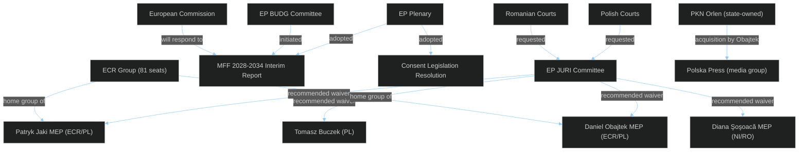
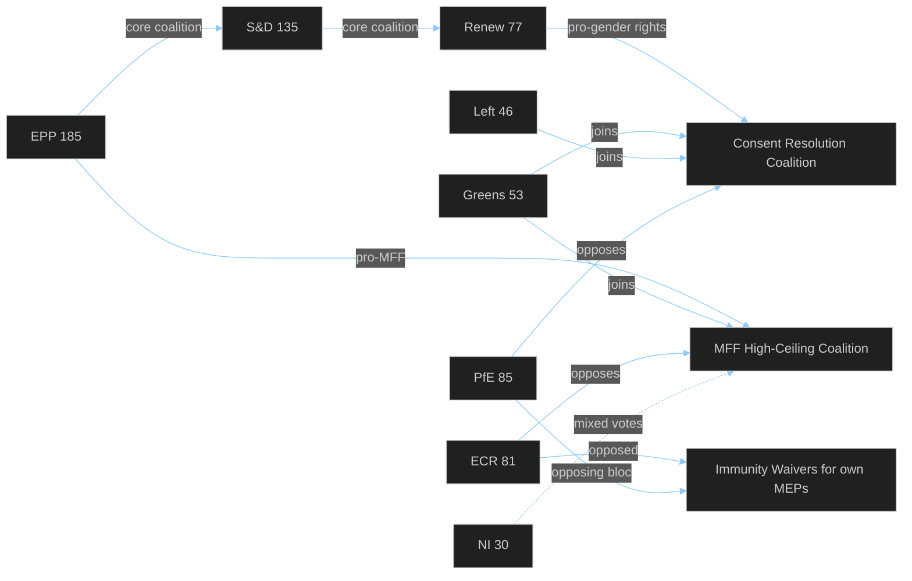
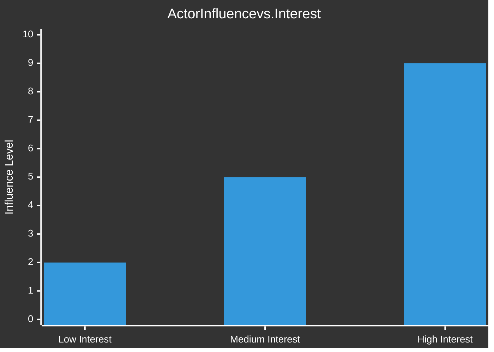

<!-- SPDX-FileCopyrightText: 2024-2026 Hack23 AB -->
<!-- SPDX-License-Identifier: Apache-2.0 -->

# 👥 Actor Mapping
## EP Motions — April 28, 2026

**Classification:** PUBLIC | **Article Type:** motions | **Run Date:** 2026-04-29
**Methodology:** Actor-Network Analysis; CIA political actor mapping conventions

---

## 1. Actor Identification Framework

**Actor categories:**
- **Primary actors:** Directly involved in or affected by April 28 decisions
- **Secondary actors:** Indirectly affected; policy implementation stakeholders
- **External actors:** Outside EU institutions but affecting/affected by decisions

---

## 2. Primary Actor Network

---

## 3. Immunity Case Actor Profiles

### 🔴 Daniel Obajtek (MEP, ECR/Poland) — HIGH SIGNIFICANCE

**Role:** Former CEO of PKN Orlen (2017–2022); current MEP elected June 2024
**Background:** Obajtek led PKN Orlen's acquisition of Polska Press (then owned by Verlagsgruppe Passau, Germany), which controls 20 regional newspapers and multiple online portals. The acquisition was approved by Poland's anti-trust authority UOKiK (then headed by Tomasz Chróstny, PiS-appointed) in 2021. The acquisition was widely criticised by press freedom organisations (RSF, IPI, OSCE) as a state-sponsored media capture operation.

**Criminal allegations:** Misuse of corporate resources and breach of fiduciary duty in connection with the Polska Press acquisition; potential violations of Polish competition law (Kodeks spółek handlowych); possible state aid implications.

**Political significance:** The Obajtek immunity waiver is potentially the most consequential for European democratic governance — it tests whether a state-owned enterprise CEO can be held accountable for using corporate resources to advance the ruling party's media monopoly.

**Network connections:**
- Close relationship with Jarosław Kaczyński (PiS leader; ECR affiliation)
- PKN Orlen board under Obajtek included multiple PiS-connected directors
- Orlen also acquired Energa, Lotos, and PGNiG under Obajtek, creating Poland's largest corporate conglomerate
- Polska Press editorial policy changed significantly post-acquisition, with political content aligned with PiS government

**Current status:** MEP with EP-provided immunity since June 2024; immunity waived April 28, 2026
**Expected proceedings timeline:** Polish prosecutors (ABW - Internal Security Agency, or Prokuratura Krajowa) to serve formal summons within 30 days

---

### 🟠 Patryk Jaki (MEP, ECR/Poland) — HIGH SIGNIFICANCE

**Role:** MEP since 2019; former Polish Deputy Justice Minister (2016-2018); Secretary of State for Constitutional Affairs
**Background:** Jaki is a senior PiS politician and one of the most prominent ECR MEPs. As Deputy Justice Minister, he was involved in PiS's judicial reforms (2016-2018) that the CJEU and EU Commission found incompatible with EU law. He is a vocal critic of EU rule-of-law mechanisms and frequently argues that they constitute political interference in national sovereignty.

**Criminal allegations:** The nature of the Polish prosecutors' request is not fully public but relates to activities during his time in public office. Likely connected to allegations around judicial independence measures or public procurement.

**Political significance:** Jaki is a prominent ideological figure within ECR and PiS's European intellectual wing. An immunity waiver against him signals that EP's rule-of-law enforcement does not spare prominent ideologues.

**Network connections:**
- Key ally of Jarosław Kaczyński; PiS party's international spokesperson
- Close to ECR group leadership (Procaccini)
- Frequently appears on right-wing international media as PiS representative

---

### 🟡 Diana Iovanovici Şoşoacă (MEP, NI/Romania) — MEDIUM SIGNIFICANCE

**Role:** MEP since 2024; Romanian lawyer and far-right politician; member of SOS România party (later NI group in EP)
**Background:** Şoşoacă is one of Romania's most prominent far-right politicians, known for anti-vaccine activism, pro-Russia statements, conspiracy theories about COVID-19, and anti-EU rhetoric. She ran in Romania's 2024 presidential election (results annulled due to alleged interference) and has used EP immunity as a shield against Romanian legal proceedings.

**Criminal allegations:** Reportedly related to incitement and threats against public officials; her public activities have generated multiple criminal complaints in Romania.

**Political significance:** Şoşoacă represents the far-right fringe that uses EP membership primarily for immunity protection and as a platform for anti-EU messaging. Her case does not reflect mainstream ECR or PfE but demonstrates EP's willingness to waive immunity even for explicitly anti-EU MEPs.

**Network connections:**
- Independent (NI) — no stable group affiliation
- Links to Romanian far-right movement; connection to CĂLIN GEORGESCU (annulled presidential candidate)
- Pro-Russian orientation; contacts with Russian state media

---

### 🟡 Tomasz Buczek (Poland) — LOW-MEDIUM SIGNIFICANCE

**Role:** Polish MEP, affiliated with PiS/ECR; lower public profile than Jaki/Obajtek
**Background:** Buczek's immunity waiver is the fourth Polish/ECR-adjacent case in the JURI docket. His individual case is less documented publicly; the waiver follows standard JURI procedure.

**Significance:** Primarily notable as part of the cluster of Polish-MEP immunity cases, reinforcing the pattern of Polish PiS judiciary prosecuting former officials post-2023.

---

## 4. Coalition Actor Map

**Coalition stability assessment:**
- MFF coalition: 397 solid votes (EPP+S&D+Renew) + 53 likely (Greens) = 450+ expected; far exceeds 361 threshold
- Consent resolution: similar broad majority; ECR/PfE opposition ~166 seats
- Immunity waivers: EPP likely split (centre-left EPP for, Catholic conservatives abstained/against); still passed with comfortable majority

---

## 5. External Actor Network

| Actor | Type | Position | Influence |
|-------|------|----------|-----------|
| Polish government (PM Tusk) | National government | Supportive of waivers; pursuing rule-of-law normalisation | HIGH |
| PKN Orlen board | State-owned enterprise | Defensive; current management distancing from Obajtek era | MEDIUM |
| Polska Press editorial staff | Media organisation | Pro-waiver; restoration of editorial independence campaign | LOW-MEDIUM |
| RSF (Reporters Without Borders) | Civil society | Pro-waiver; monitoring media pluralism | LOW |
| Venice Commission | International advisory body | Advisory role on Polish judicial independence | MEDIUM |
| ECR Procaccini (IT) | Group leadership | Balancing PiS solidarity vs. FdI pragmatism | HIGH |
| Romanian judicial authorities | National judicial | Requested Şoşoacă waiver | MEDIUM |
| Commission (Věra Jourová / successor) | EU institution | Monitoring rule-of-law; MFF conditionality | HIGH |

---

## 6. Actor Influence Heat Map

**High influence + High interest actors (priority monitoring):**
1. ECR group leadership (Procaccini) — managing PiS solidarity vs. ECR credibility
2. Polish government (Tusk) — using EP waivers as rule-of-law validation
3. European Commission (Von der Leyen) — MFF positioning; consent directive decision
4. EP BUDG committee rapporteur — MFF negotiating position architect
