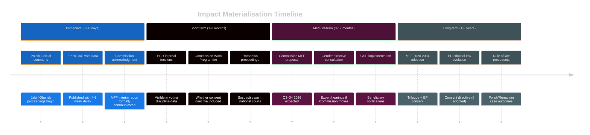
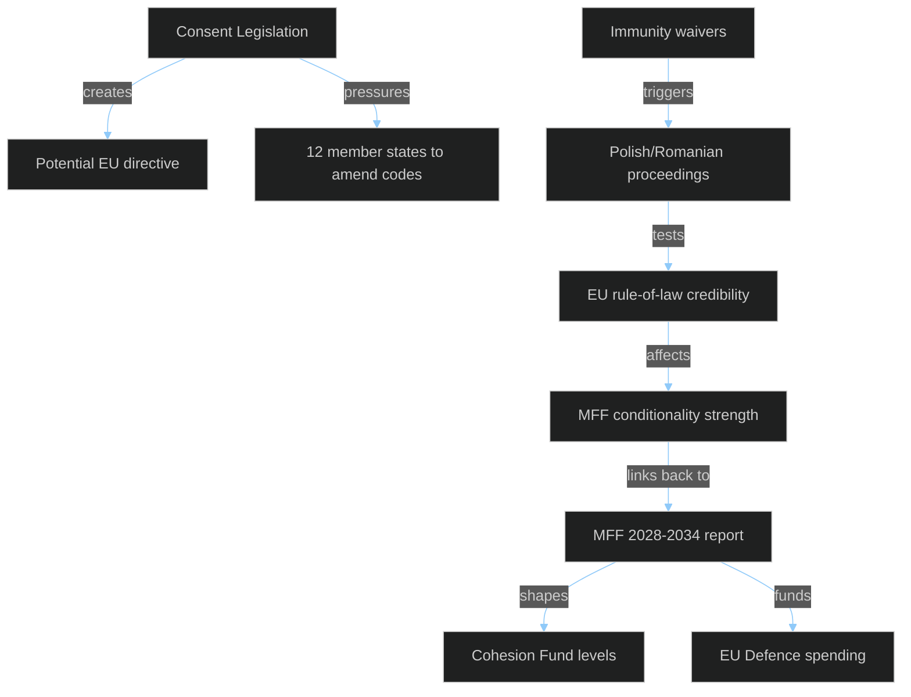
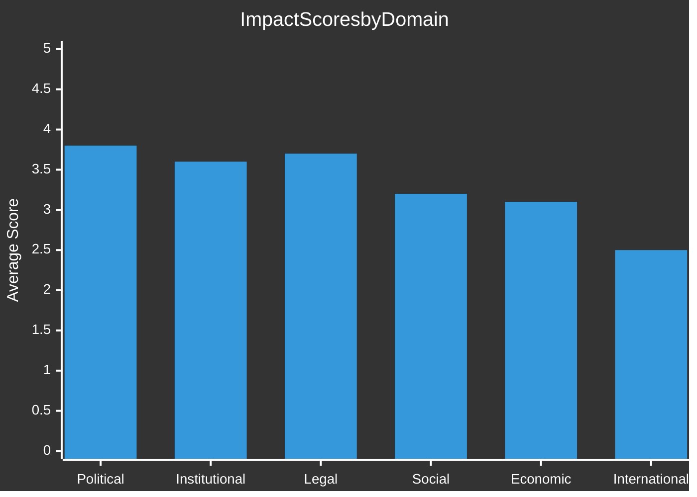

<!-- SPDX-FileCopyrightText: 2024-2026 Hack23 AB -->
<!-- SPDX-License-Identifier: Apache-2.0 -->

# 🎯 Impact Matrix
## EP Motions — April 28, 2026

**Classification:** PUBLIC | **Article Type:** motions | **Run Date:** 2026-04-29
**Methodology:** Multi-dimensional impact assessment across EU institutional, political, social, economic, and legal dimensions

---

## 1. Impact Framework

**Impact dimensions:**
- **Political (POL):** Shifts in political group power, coalition dynamics, electoral implications
- **Institutional (INST):** Effects on EU/EP institutional balance and procedural precedents
- **Legal (LEG):** Direct legal implications, treaty interpretation, precedent-setting
- **Social (SOC):** Impact on EU citizens, civil society, fundamental rights
- **Economic (ECON):** Fiscal, budgetary, trade, and macro-economic implications
- **International (INTL):** EU's external relations, global governance leadership, bilateral impacts

**Impact Scale:** 1 = Negligible | 2 = Minor | 3 = Moderate | 4 = Significant | 5 = Major

---

## 2. Comprehensive Impact Matrix

| Document | POL | INST | LEG | SOC | ECON | INTL | Total | Priority |
|----------|-----|------|-----|-----|------|------|-------|----------|
| MFF 2028-2034 interim (TA-0111) | 4 | 5 | 4 | 4 | 5 | 3 | **25** | 🔴 |
| Consent-based rape legislation (TA-0120) | 5 | 3 | 5 | 5 | 2 | 4 | **24** | 🔴 |
| 2027 Budget Guidelines (TA-0112) | 4 | 4 | 3 | 3 | 5 | 2 | **21** | 🟠 |
| Obajtek immunity waiver (TA-0108) | 5 | 4 | 4 | 3 | 3 | 3 | **22** | 🟠 |
| Jaki immunity waiver (TA-0107) | 4 | 4 | 4 | 3 | 2 | 2 | **19** | 🟠 |
| Şoşoacă immunity waiver (TA-0110) | 4 | 4 | 4 | 3 | 1 | 2 | **18** | 🟡 |
| GSP reform (TA-0114) | 3 | 3 | 4 | 3 | 4 | 5 | **22** | 🟠 |
| Transport GHG regulation (TA-0113) | 3 | 3 | 4 | 3 | 4 | 3 | **20** | 🟠 |
| EIB annual report (TA-0119) | 3 | 4 | 3 | 3 | 4 | 2 | **19** | 🟠 |
| Dog/cat welfare (TA-0115) | 2 | 2 | 3 | 4 | 2 | 2 | **15** | 🟡 |
| Buczek immunity waiver (TA-0109) | 3 | 3 | 3 | 2 | 1 | 1 | **13** | 🟡 |

---

## 3. Deep Impact Analysis — Top 5 Items

### 🔴 1. MFF 2028-2034 Interim Report (Total: 25/30)

**Political impact (4/5):** Strong cross-party consensus (EPP+S&D+Renew core + Greens on progressive elements) provides a unified EP position entering negotiations. However, the report's positions on new own resources may fracture EPP conservatives who oppose EU fiscal expansion.

**Institutional impact (5/5):** The EP asserting its MFF architectural role before the Commission tabled a proposal is the maximum institutional impact. It pre-empts the traditional Commission leadership on MFF structure. The report's call for binding EP co-decision rights on mid-term MFF revision, if accepted, would permanently expand EP's constitutional competence.

**Legal impact (4/5):** If the Commission's formal proposal incorporates EP's new own resources proposals, the legal instrument (Council Regulation + EP consent) would create binding constraints on member states' national budget contributions. Carbon border revenue as an EU own resource would require treaty-adjacent legal innovation.

**Social impact (4/5):** MFF shapes all social spending (Cohesion funds, Social Climate Fund, ESF+). EP's positions on maintaining cohesion funding levels and strengthening ESF+ will directly affect 100+ million EU citizens in less-developed regions.

**Economic impact (5/5):** MFF 2028-2034 will allocate €1.3–1.8 trillion (at current prices). The EP's positions on defending cohesion, increasing R&I spending, and integrating defence create fiscal choices that will shape EU economic geography for a decade. New own resources proposals could reduce member state contributions while maintaining EU spending capacity — a significant macro-fiscal shift.

**Cascade impact:** MFF interim report → Commission MFF proposal (Q3-Q4 2026) → Council first reading (2027) → trilogue → adoption (target Dec 2027) → entry into force Jan 2028. The EP's April 28 positions will echo through every stage of this 18+ month process.

---

### 🔴 2. Consent-Based Rape Legislation (Total: 24/30)

**Political impact (5/5):** Maximum political divisiveness — this vote was almost certainly the most contested of the session on party-political grounds. The EPP's vote split (centre-left EPP vs. Catholic-conservative EPP) will become visible when roll-call data is published in 4–6 weeks. Gender rights are a defining fault line in EP10 coalition dynamics.

**Legal impact (5/5):** Non-binding resolution, but with two potential legal impact pathways: (a) Commission directive under Article 83 TFEU (criminal law harmonisation) — precedent-setting; (b) CJEU interpretation challenges if member states argue EU competence overreach. Either pathway creates significant legal development. The Istanbul Convention EU ratification (2023) may be the legal hook.

**Social impact (5/5):** Sexual violence is experienced by an estimated 1-in-3 women in the EU over their lifetime (FRA data). Harmonising criminal definitions affects legal recourse for hundreds of millions of EU citizens. Countries without consent-based rape definitions (Czech Republic, Slovakia, Bulgaria, Lithuania — partial) would see the most significant changes.

**International impact (4/5):** The EU harmonisation of rape law would make the EU a global standard-setter on gender justice, ahead of many G20 nations. It directly supports the EU's feminist foreign policy (adopted by Commission under Von der Leyen II) and creates leverage in trade (GSP) negotiations with countries with poor gender justice records.

---

### 🟠 3. Obajtek/Orlen Media Capture Immunity Waiver (Total: 22/30)

**Political impact (5/5):** The Obajtek case is a proxy for the entire battle over media pluralism and state capture in Eastern EU member states. ECR's political vulnerability is exposed — its Polish delegation cannot credibly defend the PiS media acquisition legacy while claiming rule-of-law commitment. This waiver shifts the political narrative.

**Institutional impact (4/5):** The EP JURI committee's recommendation to waive — accepted by the plenary — demonstrates institutional independence from political group pressure. JURI acted as a quasi-judicial body, evaluating evidence rather than political calculation. This strengthens JURI's institutional credibility.

**Legal impact (4/5):** Polish criminal law on misuse of public company assets (Kodeks karny art. 296) would be invoked. If Orlen's Polska Press acquisition is found to have used corporate resources for political ends, it could establish a template for prosecuting state-owned enterprise directors involved in politically motivated acquisitions across EU member states.

---

## 4. Impact Timeline Projection

---

## 5. Cross-Impact Analysis

**Critical cross-impact:** MFF conditionality (rule-of-law) and the Polish/Romanian immunity cases are mutually reinforcing. Strong rule-of-law enforcement via immunity waivers strengthens the EP's negotiating hand on MFF conditionality — countries cannot argue against conditionality while EP is actively enforcing rule of law through institutional channels.

---

## 6. Impact Summary

**Session Impact Assessment:** April 28, 2026 is a **HIGH IMPACT** plenary session across all six dimensions. Political and legal impacts are particularly elevated due to the combination of immunity waivers (rule-of-law precedents) and the consent-based rape legislation (criminal law harmonisation). Economic impacts are driven primarily by the MFF interim report.
