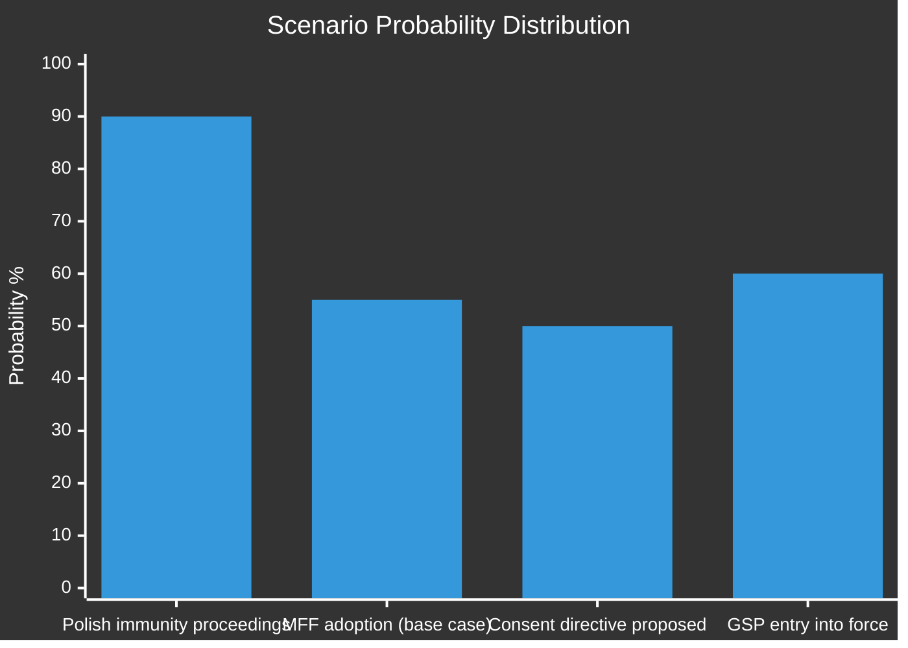

<!-- SPDX-FileCopyrightText: 2024-2026 Hack23 AB -->
<!-- SPDX-License-Identifier: Apache-2.0 -->

# 📈 Scenario Forecast
## EP Motions — April 28, 2026 | Forward-Looking Intelligence

**Classification:** PUBLIC | **Article Type:** motions | **Run Date:** 2026-04-29
**Confidence basis:** ICD 203 estimative language; WEP probability bands; Kent scale

---

## 1. Scenario Framework

This forecast covers four key scenarios emerging from the April 28 plenary decisions, projecting developments over a 30–90 day horizon.

---

## 2. Scenario A — Polish Immunity Cases Accelerate: Rule-of-Law Reckoning (HIGH PRIORITY)

**Trigger:** EP adopts immunity waivers for Jaki, Obajtek, and Buczek
**Time horizon:** 30–90 days
**WEP:** *Highly Likely* (85–95%) that Polish prosecutors will formally serve summons within 30 days

### Base Case (60% probability)
Polish judicial authorities proceed with standard criminal proceedings against Jaki and Obajtek. ECR issues statements criticising proceedings as politically motivated while avoiding direct confrontation with the EP. Obajtek case focuses on Orlen/Polska Press media acquisition investigation. Polish government under PM Tusk uses EP waiver as international validation. EU-Poland relations improve marginally on rule-of-law metrics.

### Optimistic Case (25% probability — EU Rule of Law perspective)
Polish proceedings are transparent, swift, and lead to preliminary hearings within 60 days. The Obajtek/Orlen case becomes a landmark for EU press freedom enforcement. EP JURI committee is briefed; rule-of-law conditionality in MFF negotiations strengthened. ECR faces internal pressure to distance itself from PiS's legacy.

### Pessimistic Case (15% probability)
Polish judicial proceedings face procedural delays or ECR mobilises European-level political pressure to delegitimise them. ECR/PfE/ESN bloc uses the cases to argue that EP immunity waivers are politically weaponised. This scenario increases inter-institutional tensions and could affect ECR's future cooperation in EP coalition formation.

**Key indicator to watch:** Whether ECR group leader Procaccini formally protests the immunity waivers within 14 days of adoption.

---

## 3. Scenario B — MFF 2028–2034 Negotiation Opens: EP Position Impact

**Trigger:** EP interim report (TA-0111) formally communicated to Commission and Council
**Time horizon:** 60–180 days
**WEP:** *Almost Certain* (>95%) that Commission will respond with formal communication within 90 days

### Base Case (55% probability)
Commission acknowledges EP interim report and integrates key EP priorities (higher ceilings for defence/innovation, new own resources, stronger conditionality) into its formal MFF proposal, expected late 2026. EP-Council negotiations begin in 2027. EP maintains its negotiating position — as it did successfully in MFF 2021-2027 — extracting concessions from Council on spending levels and programme priorities.

### Optimistic Case (30% probability — EP influence perspective)
EP interim report carries unusual weight because Commission (Von der Leyen II) has a strong interest in maintaining EP support. EP and Commission align on key asks (new own resources through carbon border adjustment revenue, digital levy). Council of member states faces pressure to accept higher overall MFF ceiling in exchange for flexibility on spending headings. EP secures binding co-decision rights on mid-term MFF revision.

### Pessimistic Case (15% probability)
Council net contributors (Germany, Netherlands, Austria, Sweden) form a blocking minority against higher MFF ceilings. EP interim report is dismissed as aspirational. Negotiations drag into 2028 with risk of MFF gap (as happened at 2020-2021 transition). EP leverage is limited; final MFF represents minimal increase from 2021-2027.

**Key indicators:**
- Commission communication date (target: Q3 2026)
- German coalition position on MFF ceiling (post-Scholz period — Schmidt government's fiscal conservatism)
- Whether new own resources proposal has qualified majority in Council

---

## 4. Scenario C — Consent-Based Rape Legislation: From Resolution to Directive

**Trigger:** TA-0120 adopted; Commission facing pressure to introduce binding legislation
**Time horizon:** 6–18 months
**WEP:** *Likely* (55–75%) that Commission will table a legislative proposal within 12 months

### Base Case (50% probability)
Commission uses EP resolution as political impetus to publish a directive proposal harmonising rape definitions across EU member states. The proposal faces Article 83 TFEU jurisdictional challenges. Council split: Northern European states (Nordic, Germany, Netherlands, Spain) support; Eastern European states (Hungary, Poland subset, Romania, Bulgaria) oppose. Legislative process takes 24–36 months. Final directive likely covers minimum standards, leaving member states discretion on exact formulations.

### Optimistic Case (30% probability — rights perspective)
Commission tables comprehensive gender-based violence directive including consent definition within 6 months. Strong majority in EP LIBE committee. Council qualified majority secured with progressive member states. Implementation timeline: 3 years. Approximately 12 EU member states would need to amend criminal codes. This would be a landmark achievement for EU gender rights policy.

### Pessimistic Case (20% probability)
Legal challenges (Article 83 competence) delay or block Commission proposal. Member states invoke subsidiarity principle. EP resolution remains non-binding. Cultural and political resistance in Eastern EU states proves insurmountable at Council level. Issue returns to EP agenda without legislative progress for 3+ years.

**Key indicators:**
- Commission Work Programme for 2027 (inclusion of gender-violence directive)
- Council presidency position (Hungary presidency 2024, Poland 2025 — both sceptical; future presidencies TBD)
- CJEU advisory opinion timeline on Article 83 scope

---

## 5. Scenario D — EU Trade Policy: GSP and Geopolitical Trade Architecture

**Trigger:** TA-0114 GSP reform adopted
**Time horizon:** 12–24 months
**WEP:** *Likely* (60–75%) that reformed GSP enters into force within 18 months

### Base Case (60% probability)
Reformed GSP increases ESG conditionality (ILO core labour standards, Paris Agreement commitments) for maintaining preferential access. 67 beneficiary countries adjust compliance strategies. Some graduation decisions (removing preferences from countries that have developed economically) create diplomatic tensions. EU-Bangladesh, EU-Cambodia, EU-Myanmar tensions continue around labour standards.

### Optimistic Case (25% probability — trade justice perspective)
GSP reform genuinely incentivises labour rights improvements in beneficiary countries. Cambodia and Bangladesh improve compliance with ILO conventions to maintain preferences. Carbon Border Adjustment Mechanism (CBAM) and GSP create coherent EU sustainability trade architecture. EU global trade leadership is reinforced.

### Pessimistic Case (15% probability)
US tariff policy disruptions under 2025 trade architecture create pressure to weaken GSP conditionality to preserve EU market share. Several beneficiary countries challenge GSP conditionality at WTO. EU-developing world diplomatic tensions rise around perceived trade colonialism. Reform becomes diluted before implementation.

**Key indicators:**
- WTO 14th Ministerial Conference outcomes (Yaoundé, March 2026 — already occurred)
- US-EU trade framework negotiations timeline
- EU-Mercosur partnership agreement final ratification

---

## 6. Forecast Confidence Calibration

| Scenario | 30-day Trigger | 90-day Development | 6-month Outcome | Key Uncertainty |
|----------|---------------|-------------------|----------------|----------------|
| Polish immunity | Polish summons served | Preliminary hearings begin | Trial dates set OR proceedings stayed | Polish court capacity; ECR political pressure |
| MFF 2028-2034 | Commission communication | EP-Commission alignment | Council first reading | German fiscal position; new own resources |
| Consent legislation | Commission Work Programme entry | Expert consultation | Legislative proposal published | Article 83 competence; Council QMV |
| GSP reform | OJ publication | Beneficiary notifications | First compliance reviews | WTO challenges; US trade policy |

---

## 7. Structural Political Forecast — EP Coalitions 2026-2027

**Context:** The April 28 votes demonstrate the continuing importance of the EPP-SD-Renew "grand coalition" for most institutional and legislative decisions, while the right-nationalist bloc (ECR+PfE+ESN) remains a substantial minority but cannot govern.

**6-month outlook:**
- EPP-SD-Renew coalition *Almost Certain* to remain the dominant legislative force
- ECR faces internal tensions over Polish MEP immunity cases — *Likely* to reduce ECR's coalition-building appeal with EPP on rights/rule-of-law issues
- PfE (Orbán-aligned) remains in opposition on most EP business; its 85 seats limit its influence to blocking amendments
- Greens/EFA and The Left will continue providing progressive majority top-up on rights and environment

**Wildcard — ECR potential fracture:** If the Jaki/Obajtek cases become major Polish political issues, Polish PiS MEPs may create friction within ECR on voting discipline. *About Even* (40-60%) that ECR defection rates increase on rule-of-law votes in H2 2026.

**Confidence:** 🟡 MEDIUM overall; individual scenario probabilities carry ±15 pp uncertainty.
