<!-- SPDX-FileCopyrightText: 2024-2026 Hack23 AB -->
<!-- SPDX-License-Identifier: Apache-2.0 -->

# 📊 Stakeholder Map
## EP Motions — April 28, 2026 Strasbourg Session

**Classification:** PUBLIC | **Article Type:** motions | **Run Date:** 2026-04-29

---

## 1. Primary Institutional Stakeholders

### 1.1 Committee on Legal Affairs (JURI) — Immunity & Legislative Oversight

**Role:** JURI is the lead committee for all four immunity waiver cases and for the consent-based rape legislation resolution. JURI's recommendations carry high persuasive authority — the plenary almost always follows committee recommendations on immunity waivers.

**Position:** Consistently recommends waiving immunity when national proceedings are credible and not politically motivated. JURI operates under Rules of Procedure strict standards — immunity is not a shield against domestic law. The committee's report for each waiver case details the legal basis (Article 8/9 of the Protocol on Privileges and Immunities of the EU).

**Key figures:** JURI committee coordinates rapporteurs for immunity cases. Shadow rapporteurs from all major groups prepare opposing views. The waiver of Daniel Obajtek's immunity is particularly sensitive given his role as PKN Orlen CEO and ongoing investigations into media acquisitions.

**Intelligence assessment:** 🟢 HIGH confidence JURI recommended all four waivers. 🟡 MEDIUM confidence the plenary adopted all with wide margins (standard practice when JURI recommends).

---

### 1.2 Committee on Budgets (BUDG) — MFF & Budget Guidelines Leadership

**Role:** BUDG is the lead committee for TA-0111 (MFF 2028-2034 interim), TA-0112 (2027 budget guidelines), and TA-0119 (EIB annual report control), TA-0122 (performance-based instruments).

**Position:** BUDG's interim report on MFF 2028-2034 establishes the EP's opening position. Key demands likely include: (a) raising MFF ceilings above the Commission's initial proposal; (b) increased flexibility between headings for crises; (c) ring-fenced defence spending; (d) stronger conditionality for rule-of-law compliance; (e) new own resources to fund programmes without member state contribution increases.

**Key dynamics:** The MFF is co-decided by EP and Council (unanimity in Council). EP has historically sought higher ceilings than Council agrees; the interim report signals where EP will press. With Von der Leyen Commission having a closer relationship with EPP-led EP, there is more scope for EP-Commission alignment against Council.

**Intelligence assessment:** 🟢 HIGH confidence on BUDG leadership; 🟡 MEDIUM on specific positions pending publication of full report text.

---

### 1.3 European People's Party (EPP) — 185 Seats, Group of Government

**Perspective:** EPP is the dominant force in EP10. EPP group leader Manfred Weber sets strategic direction. On immunity waivers, EPP's rule-of-law commitment (central to its identity post-2022 when it expelled Fidesz) means voting FOR waivers against ECR and NI members. On budget matters, EPP pushes for competitiveness, defence, and innovation while restraining social spending growth. On consent legislation, EPP is internally divided — German CDU/CSU MEPs are more progressive; Eastern European EPP members (Croatian HDZ, Polish KO) are more conservative.

**Quantified interests:** With 185 MEPs (25.7% of seats), EPP needs SD+Renew (or SD+ECR or Renew+ECR) to reach majority. EPP's internal discipline score is estimated >85% on most votes (based on historical EP10 patterns).

**Forward indicators:** EPP's position on MFF 2028-2034 will be critical — EPP rapporteur's interim report will frame the entire parliamentary position for years.

**Confidence:** 🟢 HIGH (group position well-documented in plenary debates and press releases)

---

### 1.4 Socialists and Democrats (S&D) — 135 Seats, Progressive Driver

**Perspective:** S&D drives the consent-based rape resolution and pushes for expanded EGF and MFF social spending. Under group leadership (Iratxe García Pérez), S&D maintains strong discipline on rights and fiscal matters. S&D's shadow rapporteur on BUDG will have pushed for higher overall MFF ceilings and stronger social cohesion heading.

**Quantified interests:** S&D needs to be part of winning coalitions to maintain relevance. On most April 28 adopted texts, S&D was part of the winning majority. The consent resolution required active S&D leadership to navigate EPP sensitivities.

**Confidence:** 🟢 HIGH

---

### 1.5 ECR (81 Seats) — Immunity Waivers as Unprecedented Internal Crisis

**Perspective:** ECR faces a unique challenge: immunity waivers against its own MEPs (Jaki, Obajtek) put the group in an impossible position. ECR leader Nicola Procaccini (Italy, Fratelli d'Italia) and co-chair Joachim Brudziński must decide whether to advocate for ECR MEPs' immunity or follow the rule-of-law line. Both options carry costs: opposing immunity waivers signals corruption tolerance; supporting them means endorsing Polish judicial proceedings that ECR-aligned Polish politicians control (a complex recursive issue).

**Intelligence assessment:** *Likely* (C3) that ECR abstained or split on Jaki and Obajtek immunity waivers. Şoşoacă is NI (not ECR), so ECR can vote FOR her waiver without internal conflict.

**Forward indicators:** If ECR voted against immunity waivers for its own MEPs, this will be highlighted in rule-of-law reports and may affect EPP's coalition calculus with ECR.

**Confidence:** 🟡 MEDIUM (no roll-call data to confirm)

---

### 1.6 Diana Iovanovici Şoşoacă — NI (Romania) — Subject of Immunity Waiver

**Profile:** Şoşoacă is a Romanian lawyer and MEP elected on the SOS Romania platform. She has been the subject of multiple Romanian legal investigations, including allegations related to spreading disinformation about COVID-19 vaccines, incitement, and connections to Russian influence networks. She is one of the most controversial MEPs in EP10, having been sanctioned by the EP President for disruptive behaviour during plenary sessions.

**Implications of waiver:** If immunity is waived, Romanian courts can proceed with any pending criminal charges. Şoşoacă would need to appear before Romanian judicial authorities. Given ongoing Romanian anti-corruption proceedings and the EU-Romania rule-of-law monitoring, the waiver signals EP alignment with Romanian judicial independence.

**Confidence:** 🟢 HIGH (public record clearly documented)

---

### 1.7 Patryk Jaki — ECR (Poland) — Subject of Immunity Waiver

**Profile:** Patryk Jaki is a prominent Polish MEP from ECR's Polish PiS delegation. He served as Secretary of State for Justice under the previous PiS government. Polish legal proceedings relate to actions during his tenure, connected to ongoing accountability probes following the PiS government's exit from power after 2023 elections.

**Implications:** The immunity waiver is part of broader Polish accountability efforts by the Tusk government. ECR views these as politically motivated; the Polish government and EPP view them as legitimate rule-of-law proceedings. This creates a sharp EU-Polish sovereignty debate within ECR.

**Confidence:** 🟢 HIGH (public record)

---

### 1.8 Daniel Obajtek — ECR (Poland) — Subject of Immunity Waiver

**Profile:** Daniel Obajtek was CEO of PKN Orlen (Poland's state energy company) during the PiS government and played a central role in PKN Orlen's controversial acquisition of media outlets, including Polska Press. These media acquisitions are central to Polish investigations into misuse of state resources and press freedom violations. Obajtek became an MEP after PiS's 2023 election loss.

**Implications:** The immunity waiver enables Polish prosecutors to continue the media capture investigation. This is among the most politically significant of the four waivers — the Orlen/Polska Press case has been a focal point for EU press freedom advocates and the Council of Europe.

**Confidence:** 🟢 HIGH (public record)

---

## 2. Broader Stakeholder Impact Map

```mermaid
%%{init: {"theme":"dark","themeVariables":{"primaryColor":"#1565C0","primaryTextColor":"#ffffff","lineColor":"#90CAF9"}}}%%
graph TD
    A["EP April 28 Plenary"] --> B["Immunity Waivers ×4"]
    A --> C["MFF 2028-2034 Interim"]
    A --> D["2027 Budget Guidelines"]
    A --> E["Consent Rape Legislation"]
    A --> F["GSP Trade Reform"]
    
    B --> B1["Polish Government (+)"]
    B --> B2["Polish Opposition MEPs (-)"]
    B --> B3["Romanian Judicial System (+)"]
    B --> B4["Press Freedom NGOs (+)"]
    B --> B5["ECR Group (-)"]
    
    C --> C1["Commission (+/-)"]
    C --> C2["Member States Council (-)"]
    C --> C3["EU Cohesion Regions (+)"]
    C --> C4["Defence Industry (+)"]
    
    E --> E1["Women's rights NGOs (+)"]
    E --> E2["Conservative religious groups (-)"]
    E --> E3["National governments MIXED"]
    
    F --> F1["Developing country exporters (+)"]
    F --> F2["EU industry (MIXED)"]
```

---

## 3. Stakeholder Impact Assessment by Adopted Text

| Adopted Text | Primary Beneficiaries | Adversely Affected | Net EU Political Impact |
|-------------|----------------------|-------------------|------------------------|
| Immunity waivers (×4) | Rule of law advocates; Polish/Romanian judicial systems | Implicated MEPs; ECR solidarity | 🟢 Positive for democratic norms |
| MFF 2028-2034 interim | EP institutional role; cohesion regions; innovation agenda | Net budget contributors (Germany, Netherlands, Austria, Sweden) | 🟡 Neutral-positive |
| 2027 Budget guidelines | Commission budget officers; programme beneficiaries | Fiscal conservative member states | 🟡 Neutral |
| Consent rape legislation | Women's rights organisations; 14 EU states that lack consent definition | Conservative governments (Hungary, Poland subset) | 🟢 Positive for rights |
| GSP reform | Developing country exporters; EU consumers | EU producers in sensitive sectors | 🟡 Neutral-positive on trade |
| Transport GHG accounting | Environmental NGOs; clean transport sector | Heavy transport operators (logistics, aviation) | 🟢 Positive for climate |
| EGF workers (TA-0116) | Displaced workers in eligible sectors | None direct | 🟢 Positive for labour market |
| Dog/cat welfare (TA-0115) | Animal welfare organisations; companion animal owners | Puppy mills; irresponsible breeders | 🟢 Positive for animal welfare |
| Ocean diplomacy (TA-0121) | Coastal EU states; fishing industry | Third-country fishing competitors | 🟢 Positive for EU fisheries |

---

## 4. Civil Society & External Stakeholder Perspectives

### NGO/Civil Society Reactions (Expected)
- **Transparency International Europe:** Will welcome immunity waivers as rule-of-law enforcement; will track follow-through with Polish/Romanian investigations
- **Article 19 / Reporters Without Borders:** Will highlight Obajtek/Polska Press case as landmark for media freedom
- **European Women's Lobby:** Will celebrate consent legislation resolution; will press for binding legislation
- **COPA-COGECA (farmers):** Watching GSP reform for impact on agricultural imports from developing countries
- **Eurogroup of Animal Welfare:** Will welcome dog/cat welfare traceability regulation

### Member State Governments (Expected Reactions)
- **Poland (Tusk government):** Welcomes immunity waivers as validation of judicial proceedings; will accelerate cases
- **Romania (Ciolacu government):** Welcomes Şoşoacă waiver; will use EP backing for credibility
- **Germany (Schmidt government):** Broadly supportive of MFF process, cautious on ceiling increases
- **Hungary (Orbán government):** May object to rule-of-law conditionality in MFF; likely to try blocking consent legislation implementation
