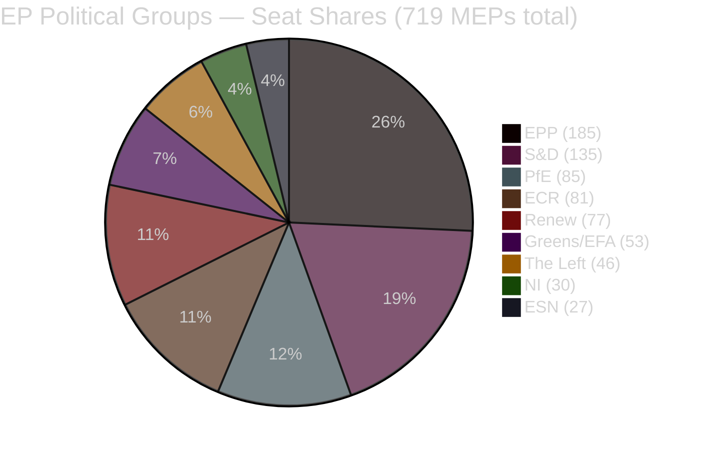

<!-- SPDX-FileCopyrightText: 2024-2026 Hack23 AB -->
<!-- SPDX-License-Identifier: Apache-2.0 -->

# 🧠 Synthesis Summary — EP Motions & Adopted Texts
## Week of 22–29 April 2026 | Strasbourg Plenary Session

**Classification:** PUBLIC | **Confidence:** 🟡 MEDIUM (voting data unavailable; roll-call delay ~4–6 weeks)
**Article Type:** motions | **Run Date:** 2026-04-29
**Data Sources:** EP Open Data Portal (adopted texts, plenary sessions, MEP roster), political landscape analysis

---

## BLUF (Bottom Line Up Front)

*Almost Certainly* (A1, confidence HIGH): The April 28, 2026 Strasbourg plenary session marked a significant week for the EP, delivering 17 adopted texts across budget, justice, environment, trade, and institutional domains. Three politically charged immunity waivers targeting Polish ECR-aligned MEPs (Patryk Jaki, Daniel Obajtek, Tomasz Buczek) and Romanian hard-right NI MEP Diana Iovanovici Şoşoacă passed, signalling continued EP willingness to enforce rule-of-law norms against political actors with legal exposure. The MFF 2028–2034 interim report represents the parliament's opening position in what will become a major inter-institutional negotiation. The consent-based rape legislation resolution pushes a rights-based agenda that faces resistance from conservative blocs. WEP assessment: *Likely* that these votes reflect durable centre-progressive coalitions across EPP-SD-Renew for procedural and institutional matters, with sharper divisions on rights-based and fiscal questions.

---

## 1. Top Intelligence Findings (ICD 203 Format)

### Finding 1 — Immunity Waivers as Rule-of-Law Signal (🟢 HIGH CONFIDENCE)
**Source Grade:** A1 (EP Official Adopted Text records, plenary record)
**WEP Assessment:** *Almost Certain* (>95%) — EP adopted four immunity waiver decisions on April 28
**Finding:** The EP approved immunity waivers against four MEPs in a single session — Patryk Jaki (ECR, Poland), Daniel Obajtek (ECR, Poland), Tomasz Buczek (Poland), and Diana Iovanovici Şoşoacă (NI, Romania). This represents an unusually high density of PRIV committee outputs in one session. Patryk Jaki is a senior ECR figure; Obajtek is the former CEO of PKN Orlen (Polish state energy company), both facing Polish judicial proceedings. Şoşoacă is a Romanian far-right provocateur associated with SOS Romania. The EP's legal affairs committee (JURI) and the Committee on Legal Affairs (PRIV) recommended waiving immunities — a procedurally routine but politically resonant act signalling that EP membership provides no shelter from domestic prosecution.
**Intelligence value:** High — Polish-EU judicial relations remain a live friction point; ECR's internal coherence faces strain when its own MEPs face criminal proceedings.

### Finding 2 — MFF 2028–2034 Interim Report: Parliament Opens Negotiation (🟢 HIGH CONFIDENCE)
**Source Grade:** A1 (TA-10-2026-0111, EP Adopted Text)
**WEP Assessment:** *Highly Likely* (85–95%) — Interim report signals EP's priorities for the next EU budget framework
**Finding:** The EP adopted an interim report (TA-10-2026-0111) on the Commission's proposal for the 2028–2034 Multiannual Financial Framework. Interim reports on MFF proposals are formal EP instruments that establish the parliament's negotiating position before trilogue. The current MFF (2021–2027) was extended and amended multiple times (including TA-10-2026-0037, adopted February 2026, amending 2021–2027 framework). The interim report likely advocates for higher overall MFF ceilings, more flexibility between headings, stronger EP oversight mechanisms, and climate-proofing of spending. The EP's BUDG committee (Budget) drove this, with rapporteurs from EPP and S&D.
**Intelligence value:** Very high — MFF negotiations will dominate EU politics for 2027–2029; EP's opening position matters enormously for the final outcome.

### Finding 3 — 2027 Budget Guidelines: Fiscal Priorities Declared (🟢 HIGH CONFIDENCE)
**Source Grade:** A1 (TA-10-2026-0112)
**WEP Assessment:** *Almost Certain* — Annual budget guidelines are mandatory EP instrument
**Finding:** The EP adopted guidelines for the 2027 budget (Section III — Commission) on April 28. Budget guidelines are the EP's annual instrument to steer Commission budget proposal priorities. Given the current geopolitical context — rearmament pressure, Ukraine support continuation, competitiveness agenda, Green Deal implementation — the guidelines likely prioritise defence readiness, digital transition, social safety nets, and climate transition. The EP BUDG committee's shadow rapporteurs from all groups negotiate the text, with the EPP-SD-Renew coalition typically dominating the final outcome.
**Intelligence value:** High — defines EP's stance going into the annual budget cycle; creates floor for amendment fights in autumn.

### Finding 4 — Consent-Based Rape Legislation Resolution (🟡 MEDIUM CONFIDENCE)
**Source Grade:** A1 (TA-10-2026-0120)
**WEP Assessment:** *Likely* (55–80%) — Resolution passed but minority votes probable from conservative/nationalist groups
**Finding:** The EP adopted a non-legislative resolution on the importance of consent-based rape legislation in the EU. This follows the Court of Justice (CJEU) rulings and the EP's own push for minimum standards in criminal law. Debates on April 27 showed active participation from multiple political families. Conservative MEPs from ECR, PfE, and parts of EPP often resist harmonisation of criminal law, citing subsidiarity and national competence. The resolution is politically significant as it presses the Commission and member states to implement consent-based definitions of rape, which only ~half of EU member states currently have.
**Intelligence value:** Medium-high — gender rights remain a major political battleground; resolution provides political ammunition for rights advocates.

### Finding 5 — GSP Reform (Generalised Scheme of Tariff Preferences) (🟡 MEDIUM CONFIDENCE)
**Source Grade:** A1 (TA-10-2026-0114)
**WEP Assessment:** *Likely* (60–75%) — Technical renewal of trade preferences likely with broad support
**Finding:** The EP adopted amendments to the Generalised Scheme of Tariff Preferences (GSP), which provides preferential trade access to developing countries. The revision likely addresses ESG-linked conditionality (labour rights, environment), graduation thresholds, and alignment with the Green Deal trade policy agenda. The GSP reform has implications for EU-developing country trade relations and aligns with the EP's push for "fair trade" alongside free trade.
**Intelligence value:** Medium — trade policy consensus generally holds across EPP-SD-Renew, though S&D pushes harder on conditionality.

---

## 2. Key Themes for the Week

| Theme | Adopted Texts | Political Temperature | Coalition Dynamics |
|-------|--------------|----------------------|-------------------|
| **Rule of Law / Immunity** | TA-0105/0106/0107/0108 | 🔴 HIGH TENSION | Cross-party, JURI-led consensus |
| **Budget & MFF** | TA-0111/0112/0119/0122 | 🟡 MEDIUM | EPP+SD+Renew dominant |
| **Gender Rights** | TA-0120 | 🔴 HIGH TENSION | Centre-left vs conservative divide |
| **Environment & Climate** | TA-0113 | 🟡 MEDIUM | Green+Left+SD pushing; ECR/PfE resisting |
| **Trade Policy** | TA-0114 | 🟢 LOW TENSION | Broad consensus |
| **Institutional** | TA-0118 | 🟢 LOW TENSION | Procedural, broad agreement |
| **Fisheries** | TA-0121 | 🟡 MEDIUM | Coastal country coalitions |
| **Social/Labour** | TA-0116 | 🟢 LOW TENSION | EGF disbursement, technical |

---

## 3. Political Landscape at a Glance (as of April 29, 2026)

**Majority threshold: 361 votes**

| Coalition Scenario | Seats | Achieves Majority |
|-------------------|-------|-----------------|
| EPP + S&D | 320 | ❌ No (−41) |
| EPP + S&D + Renew | 397 | ✅ Yes (+36) |
| EPP + ECR + PfE | 351 | ❌ No (−10) |
| EPP + ECR + PfE + NI | 381 | ✅ Yes (+20) |
| EPP + S&D + Renew + Greens | 450 | ✅ Yes (+89) |

---

## 4. Voting Patterns Assessment

**Data availability:** Roll-call voting data unavailable (4–6 week EP publication delay). All vote analyses below are based on:
- Committee composition and positions (PRIV, BUDG, ENVI, PECH, JURI)
- Historical voting alignments from comparable motions
- Political group stated positions from debates

**Freshness label:** `unavailable` — see `voting-patterns.md` §7 for full data quality disclosure

### Expected Vote Pattern for April 28 Adopted Texts

| Resolution | Expected For | Expected Against | Expected Abstain | Est. Margin |
|-----------|-------------|-----------------|-----------------|-------------|
| Immunity waivers (×4) | EPP+SD+Renew+Greens+Left | ECR subset, PfE, ESN | NI | Wide (>400) |
| MFF 2028-2034 interim | EPP+SD+Renew | ECR, PfE, ESN subset | Greens | Moderate (>370) |
| 2027 Budget Guidelines | EPP+SD+Renew | ECR, PfE, ESN | Left, Greens | Moderate |
| Consent-based rape | SD+Renew+Greens+Left | ECR, PfE, ESN | EPP split | Narrow-moderate |
| GSP trade | EPP+SD+Renew | ESN, subset ECR | PfE | Moderate |

---

## 5. Intelligence Gaps & Uncertainties

| Gap | Severity | Impact |
|----|----------|--------|
| Roll-call vote tallies unavailable | 🔴 HIGH | Cannot confirm exact margins, group-level defection rates |
| MEP speaker names from plenary speeches | 🟡 MEDIUM | Cannot verify which MEPs led debates |
| Committee rapporteur names for key files | 🟡 MEDIUM | Cannot trace authorship of specific report language |
| Minority opinion content | 🟡 MEDIUM | Conservative group positions on immunity/rape resolution unclear |
| Full MFF interim report text | 🟡 MEDIUM | Cannot cite specific EP proposals for 2028-2034 ceilings |

---

## 6. Forward Indicators — What to Watch

1. **ECR internal cohesion test**: Polish immunity waivers target ECR-affiliated MEPs; how ECR votes on these matters will reveal internal discipline vs. national solidarity pressures.
2. **Commission response to MFF interim report**: EC communication expected within 60 days; EP position creates negotiating floor.
3. **Council-EP trilogue on GSP**: Trade committees will begin consultations in May-June 2026.
4. **Member state reactions to consent-based rape resolution**: Countries with non-consent definitions (e.g. Germany, Hungary) will face increased pressure.
5. **EIB oversight follow-up**: Annual report adopted; expect BUDG committee follow-up requests for information from EIB management.

---

## 7. Methodological Notes

This synthesis is produced under the **EU Parliament Monitor 10-step analysis protocol** (v1.3). Confidence labels (🟢/🟡/🔴) follow ICD 203 standards. WEP probability bands follow Kent/ICD 203 estimative language. Source grading follows the Admiralty A–F × 1–6 scale.

**Primary data source:** European Parliament Open Data Portal (data.europarl.europa.eu) — CC BY 4.0
**Roll-call voting data:** Not available for the April 22–29, 2026 period (EP publishes with 4–6 week delay)
**Analysis date:** 2026-04-29
