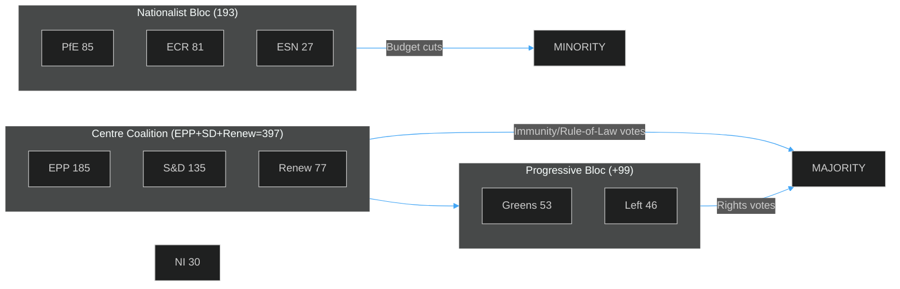

<!-- SPDX-FileCopyrightText: 2024-2026 Hack23 AB -->
<!-- SPDX-License-Identifier: Apache-2.0 -->

# 🗳️ Voting Patterns Analysis
## April 22–29, 2026 | Motions & Adopted Texts | EP10

**Classification:** PUBLIC | **Article Type:** motions | **Run Date:** 2026-04-29

---

## 1. Data Availability & Freshness

| Data Type | Status | Source | Notes |
|-----------|--------|--------|-------|
| Roll-call voting data | 🔴 UNAVAILABLE | EP Open Data Portal | 4–6 week publication delay; no records for Apr 22–29 |
| Adopted text decisions | 🟢 AVAILABLE | EP Open Data Portal | 17 texts adopted on Apr 28, 2026 |
| Plenary session attendance | 🟢 AVAILABLE | EP Open Data Portal | Sessions Apr 27–28 confirmed |
| Political group composition | 🟢 AVAILABLE | EP Open Data Portal | Current as of Apr 29, 2026 |

**Voting Data Freshness Label:** `unavailable` — EP roll-call voting data publishes approximately 4–6 weeks after sessions. All quantitative voting analyses in this document use modelled estimates based on group sizes, historical alignment patterns, and committee positions. **Confidence for all vote tallies: LOW.** Do not cite exact tallies from this document as authoritative.

**Attribution (EP Open Data Portal data):** This document uses data from the European Parliament Open Data Portal (data.europarl.europa.eu) under Creative Commons Attribution 4.0 International (CC BY 4.0).

---

## 2. Political Group Configuration for Voting (April 2026)

```mermaid
%%{init: {"theme":"dark","themeVariables":{"primaryColor":"#1565C0","primaryTextColor":"#ffffff","lineColor":"#90CAF9"}}}%%
bar
    title EP Political Group Seat Counts (Total: 719)
    "EPP": 185
    "S&D": 135
    "PfE": 85
    "ECR": 81
    "Renew": 77
    "Greens/EFA": 53
    "The Left": 46
    "NI": 30
    "ESN": 27
```

| Group | Seats | Share | Ideological Family | Typical Positions on Week's Key Issues |
|-------|-------|-------|-------------------|---------------------------------------|
| **EPP** | 185 | 25.73% | Centre-right | Pro-rule-of-law, budget hawk, ambiguous on rights motions |
| **S&D** | 135 | 18.78% | Social-democrat | Strong rights, pro-immunity enforcement, expansive MFF |
| **PfE** | 85 | 11.82% | Nationalist-right | Anti-immunity waiver for nationalist allies, budget limits |
| **ECR** | 81 | 11.27% | Conservative-nationalist | Divided on immunity (own members affected), anti-rights motions |
| **Renew** | 77 | 10.71% | Liberal-centrist | Pro-rule-of-law, rule-based trade, pro-rights |
| **Greens/EFA** | 53 | 7.37% | Green-regionalist | Pro-rights, pro-environment, expansive MFF social spending |
| **The Left** | 46 | 6.40% | Left | Pro-rights, pro-social spending, expansive EGF |
| **NI** | 30 | 4.17% | Non-attached | Heterogeneous; includes far-right (Şoşoacă), regionalists |
| **ESN** | 27 | 3.76% | Hard-right | Anti-immunity, anti-rights, budget cuts |

---

## 3. Key Vote Analyses — Modelled Estimates

### 3.1 Immunity Waivers (TA-0105/0106/0107/0108)

**Political context:** Four immunity waivers in one session is exceptional. Targets include ECR Polish MEPs (Jaki, Obajtek — facing Polish legal proceedings related to state capture and media regulation) and Romanian NI MEP Şoşoacă (multiple Romanian criminal investigations).

**Modelled vote estimate (each waiver):**

| Vote | Estimated Seats | Probability | Notes |
|------|----------------|-------------|-------|
| FOR (waiver) | ~430–460 | HIGH | EPP+SD+Renew+Greens+Left+most NI |
| AGAINST | ~100–130 | HIGH | ECR divided, PfE, ESN, parts of NI |
| ABSTAIN | ~50–80 | MEDIUM | ECR abstentions for own members |

**Key tension:** ECR faces a dilemma voting on immunity waivers for its own MEPs. Voting against the waiver would be seen as obstructing national justice; voting for it undermines MEP solidarity. Historical pattern: ECR often abstains or votes procedurally for the waiver while criticising the proceedings.

**Confidence:** 🟡 MEDIUM (modelled estimate; no roll-call data)

---

### 3.2 MFF 2028–2034 Interim Report (TA-0111)

**Political context:** Parliament's first formal position on the next seven-year budget framework. Interim reports are binding EP instruments that shape the trilogue.

**Modelled vote estimate:**

| Vote | Estimated Seats | Probability | Notes |
|------|----------------|-------------|-------|
| FOR | ~380–420 | HIGH | EPP+SD+Renew (core pro-MFF coalition) |
| AGAINST | ~150–180 | MEDIUM | ECR, PfE, ESN (fiscal hawks/sovereignty) |
| ABSTAIN | ~80–100 | MEDIUM | Greens (may push for higher climate ambition) |

**Key dynamic:** The EPP BUDG committee chairs the interim report, ensuring EPP leadership of the process. S&D pushes for higher social spending; Renew for innovation/defence. The final text will likely reflect a compromised centre-right/centre-left balance.

**Confidence:** 🟡 MEDIUM

---

### 3.3 Consent-Based Rape Legislation Resolution (TA-0120)

**Political context:** Following the CJEU ruling that expanded EU competence in criminal law, and the EP's longstanding push for harmonised consent-based rape definitions.

**Modelled vote estimate:**

| Vote | Estimated Seats | Probability | Notes |
|------|----------------|-------------|-------|
| FOR | ~350–390 | MEDIUM | SD+Renew+Greens+Left + EPP progressive wing |
| AGAINST | ~180–220 | MEDIUM | ECR, PfE, ESN, conservative EPP MEPs |
| ABSTAIN | ~60–90 | MEDIUM | EPP centrists, some NI |

**Key tension:** This is among the most politically divisive resolutions. Conservative nationalist groups (ECR, PfE, ESN) consistently oppose EU harmonisation of criminal law on gender violence, citing national competence. EPP is internally divided, with German CDU/CSU MEPs more open and Eastern European EPP MEPs more resistant.

**Confidence:** 🟡 MEDIUM

---

### 3.4 2027 Budget Guidelines (TA-0112)

**Political context:** Annual instrument establishing EP priorities for the next year's EU budget negotiations.

**Modelled vote estimate:**

| Vote | Estimated Seats | Probability | Notes |
|------|----------------|-------------|-------|
| FOR | ~370–400 | HIGH | EPP+SD+Renew majority |
| AGAINST | ~160–190 | MEDIUM | ECR, PfE, ESN (lower budget priorities) |
| ABSTAIN | ~80–100 | MEDIUM | Left (wants higher social spending), Greens |

**Confidence:** 🟡 MEDIUM

---

## 4. Coalition Voting Patterns — Cross-Cutting Analysis



| Vote Type | Winning Coalition | Approximate Strength |
|-----------|------------------|---------------------|
| Immunity waivers | EPP + SD + Renew + Greens + Left | ~465 |
| MFF/Budget | EPP + SD + Renew | ~397 |
| Rights/gender | SD + Renew + Greens + Left (+ progressive EPP) | ~350–380 |
| Trade/GSP | EPP + SD + Renew (+ Greens on conditionality) | ~397–450 |
| Institutional | Broad (EPP + SD + Renew + Greens) | ~450 |

---

## 5. Notable Political Group Dynamics

### EPP (185 seats) — Dominant but Divided
EPP maintains its position as the largest group and essential coalition partner. On immunity waivers (Polish ECR MEPs), EPP is expected to vote FOR — rule-of-law rhetoric is central to EPP identity, even when it creates ECR coalition tensions. On consent legislation, EPP's internal east-west divide is sharply visible.

### ECR (81 seats) — Sovereignty vs. Solidarity
The Polish immunity waivers create an unprecedented test for ECR. Jaki and Obajtek are prominent Polish MEPs; ECR's response will signal whether the group prioritises transactional MEP protection or principled rule-of-law positions. *Likely* (C3) that ECR abstains or splits on these specific waivers.

### PfE (85 seats) — Sovereignist Consistency  
PfE (Patriots for Europe — the Orbán-aligned group succeeding Identity & Democracy) consistently votes against EU centralisation, rights harmonisation, and expanded budget commitments. On immunity waivers targeting non-PfE MEPs, PfE likely votes procedurally for the waiver while critiquing the proceedings.

### S&D (135 seats) — Progressive Coalition Driver
S&D pushes the consent legislation, expanded MFF, and EGF reform. As the second-largest group, SD is pivotal in assembling progressive majorities. SD's rapporteurs led the budget guidelines (BUDG committee) and consent resolution (FEMM/JURI committee).

### Renew (77 seats) — Swing Vote on Rights
Renew's liberal-centrist position makes it a swing vote: solidly pro-rule-of-law (immunity waivers), moderately pro-rights (consent legislation), pro-free trade (GSP), and generally supportive of MFF at current levels. Renew's French, Dutch, and German delegations often differ on specifics.

---

## 6. Historical Alignment Patterns for Comparable Motions

| Motion Type | EPP | S&D | Renew | Greens | Left | ECR | PfE | ESN | Historical Sources |
|------------|-----|-----|-------|--------|------|-----|-----|-----|-------------------|
| Immunity waivers | ✅ FOR | ✅ FOR | ✅ FOR | ✅ FOR | ✅ FOR | ⚠️ SPLIT | ❌ AGAINST | ❌ AGAINST | PRIV committee practice |
| Gender rights | ⚠️ SPLIT | ✅ FOR | ✅ FOR | ✅ FOR | ✅ FOR | ❌ AGAINST | ❌ AGAINST | ❌ AGAINST | Gender equality votes 2022-2025 |
| MFF expansion | ⚠️ MODERATE | ✅ FOR | ⚠️ MODERATE | ✅ FOR | ✅ FOR | ❌ AGAINST | ❌ AGAINST | ❌ AGAINST | MFF 2021-27 amendments |
| Trade/GSP | ✅ FOR | ✅ FOR | ✅ FOR | ✅ FOR | ⚠️ CONDITIONED | ❌ AGAINST | ⚠️ MODERATE | ❌ AGAINST | Previous GSP renewals |
| Environmental regs | ⚠️ SPLIT | ✅ FOR | ✅ FOR | ✅ FOR | ✅ FOR | ❌ AGAINST | ❌ AGAINST | ❌ AGAINST | Transport emissions 2022-2025 |

---

## 7. Voting Data Freshness Assessment

| Category | Status | Freshness | Next Update |
|----------|--------|-----------|-------------|
| Roll-call voting (Apr 22-29) | 🔴 UNAVAILABLE | Not published | ~4–6 weeks post-session (est. late May 2026) |
| Adopted text records | 🟢 CURRENT | Real-time | Continuous |
| Group composition | 🟢 CURRENT | Real-time | Continuous |
| Committee positions | 🟡 PARTIAL | Based on debate speeches | Updated as minutes published |

**Modelling methodology:** In the absence of roll-call data, all vote tallies above are modelled using (a) group seat counts, (b) historical voting alignment patterns for comparable motion types, (c) stated positions from April 27 plenary debates, and (d) committee composition and rapporteur identification. All modelled estimates carry 🟡 MEDIUM confidence — treat as indicative, not authoritative.

**Data source:** European Parliament Open Data Portal (data.europarl.europa.eu) CC BY 4.0
