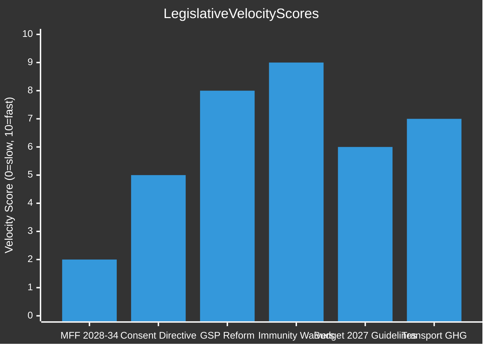
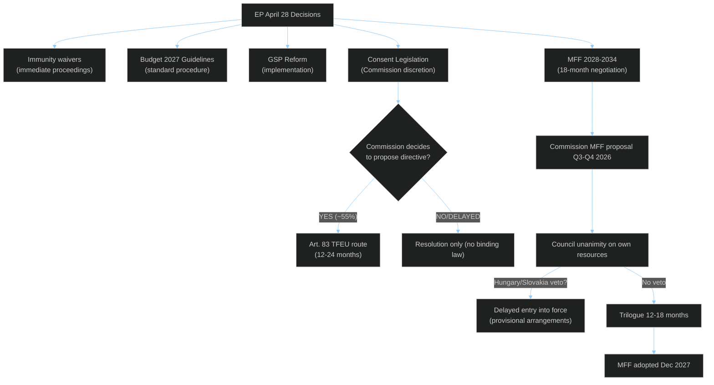

<!-- SPDX-FileCopyrightText: 2024-2026 Hack23 AB -->
<!-- SPDX-License-Identifier: Apache-2.0 -->

# ⚡ Legislative Velocity Risk Assessment
## EP Motions — April 28, 2026

**Classification:** PUBLIC | **Article Type:** motions | **Run Date:** 2026-04-29
**Methodology:** Legislative velocity tracking; pipeline bottleneck analysis

---

## 1. Legislative Velocity Framework

**Legislative velocity** measures the speed and efficiency with which EP translates political decisions into binding legislation. Low velocity = bottlenecks, delays, institutional gridlock. High velocity = efficient pipeline from resolution to directive/regulation.

**Velocity factors:**
- Commission proposal lag (time from EP resolution/report to Commission proposal)
- Council QMV/unanimity requirements (structural speed limit)
- Trilogue duration (EP-Council-Commission negotiation)
- Implementation timeline (member state transposition)

---

## 2. April 28 Decisions — Velocity Assessment

### 2.1 MFF 2028-2034 — SLOW (Expected)

**Current stage:** EP interim report (non-binding)
**Expected Commission proposal:** Q3-Q4 2026 (~6 months lag)
**Expected Council first reading:** Q1-Q2 2027
**Trilogue duration estimate:** 12–18 months (based on MFF 2021-2027 precedent: 3+ years from Commission proposal to adoption)
**Entry into force target:** January 1, 2028

**Velocity risk:** 🔴 CRITICAL — MFF negotiations are inherently slow by design (unanimity requirements, political sensitivity, multi-year timeline). The risk is not that the MFF is adopted too slowly per se, but that:
- Delay past December 2027 requires provisional arrangements (1/12 rule on previous year budget monthly) — creates severe spending rigidity
- Slow negotiation gives member states time to extract concessions that weaken EP's priorities (conditionality, own resources)

**Bottleneck identification:**
1. Council unanimity on own resources — single-country veto risk (Hungary, Slovakia)
2. German domestic politics — coalition government approval of higher MFF ceiling
3. Agricultural policy reform resistance — France/Ireland on CAP reform embedded in MFF structure

**Velocity score:** 2/10 (intentionally slow; risk is stoppage rather than excessive speed)

---

### 2.2 Consent-Based Rape Legislation — MEDIUM (2-3 years to directive)

**Current stage:** EP resolution (non-binding)
**Expected Commission proposal:** ~12 months (if Commission acts)
**Article 83 TFEU pathway:**
- Commission publishes legislative proposal
- EP LIBE committee rapporteur appointed; committee opinion
- Council Working Party on Criminal Law (unanimity risk under Art. 83(1); QMV possible under Art. 83(2))
- Trilogue (typically 12-24 months for criminal law instruments)
- Member state transposition: 2-3 years

**Velocity risk:** 🟡 MEDIUM — the primary risk is the Commission proposal stage:
- If Commission delays 12+ months, EU momentum may shift (new political cycle)
- If Article 83 TFEU legal basis challenged, entire initiative may be paused pending CJEU advisory opinion

**Key velocity bottlenecks:**
1. Commission's decision to act (12-month window before political momentum wanes)
2. Article 83 legal basis (unanimity risk in Council under some treaty interpretations)
3. National parliaments Early Warning System (Yellow Card) — if 1/3 invoke subsidiarity, Commission must review

**Velocity score:** 5/10 (realistic but depends on Commission initiative timing)

---

### 2.3 GSP Reform — HIGH VELOCITY (already in advanced stage)

**Current stage:** EP adoption of reform — likely final legislative stage
**Velocity:** HIGH — this was likely an own-initiative legislative resolution or co-decision conclusion (status requires verification against procedure type)
**If regulation:** OJ publication → 20-day entry into force → transitional periods per reform terms
**Velocity risk:** LOW — primarily implementation compliance risk

**Velocity score:** 8/10 (high velocity; risk is implementation not adoption)

---

### 2.4 Immunity Waivers — HIGH VELOCITY (immediate)

**Current stage:** ADOPTED April 28
**Effect:** Immediate — Polish/Romanian authorities may proceed with formal proceedings
**Time to proceedings:** 14-30 days for formal summons service
**Judicial velocity risk:** LOW for immunity mechanism itself; national judicial velocity varies

**Velocity score:** 9/10 (essentially immediate institutional action)

---

### 2.5 Budget 2027 Guidelines — MEDIUM-HIGH VELOCITY

**Current stage:** EP position adopted (Section III — Commission)
**Next steps:** Commission autumn statement → Council position → EP second reading → Conciliation if no agreement → Adoption by December 15, 2026
**Velocity risk:** MEDIUM — standard budget procedure with tight statutory deadlines. If conciliation fails (as in 2019 and 2021), provisional 12ths apply for January, forcing January revision

**Velocity score:** 6/10 (structured timeline; risk is conciliation failure)

---

## 3. Velocity Risk Matrix

---

## 4. Pipeline Bottleneck Map

---

## 5. Velocity Risk Summary

| Initiative | Current Velocity | Primary Risk | Critical Bottleneck |
|-----------|-----------------|-------------|-------------------|
| MFF 2028-2034 | 🔴 SLOW | Council unanimity block | Own resources unanimity; German fiscal politics |
| Consent directive | 🟡 MEDIUM | Commission initiative delay | 12-month window; Article 83 TFEU |
| GSP reform | 🟢 HIGH | None significant | Implementation compliance |
| Immunity waivers | 🟢 HIGH | National judicial delays | Polish/Romanian court capacity |
| Budget 2027 | 🟡 MEDIUM | Conciliation failure | December deadline; PfE disruption |
| Transport GHG | 🟡 MEDIUM-HIGH | Implementation | Member state enforcement |

**Overall April 28 velocity risk:** 🟡 MEDIUM — most immediate decisions (immunity, budget, GSP) have high velocity; the high-impact items (MFF, consent directive) are inherently slow and face structural bottlenecks.
