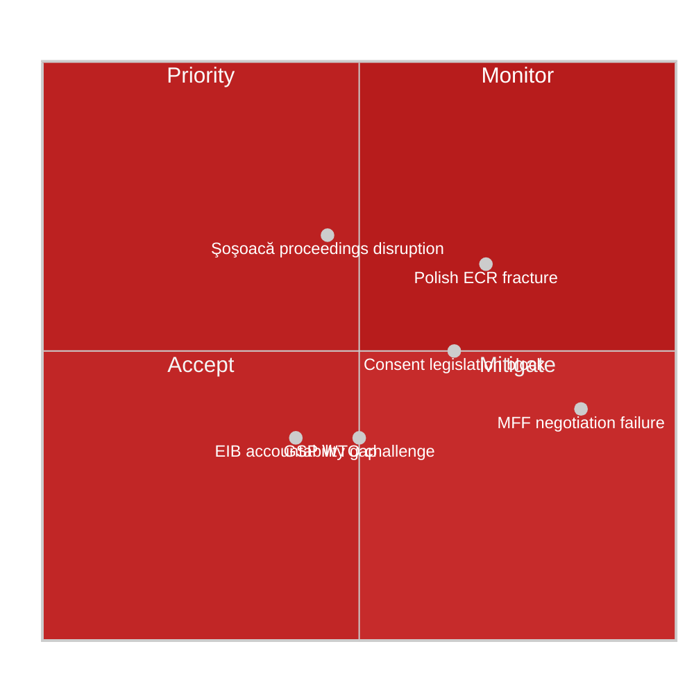
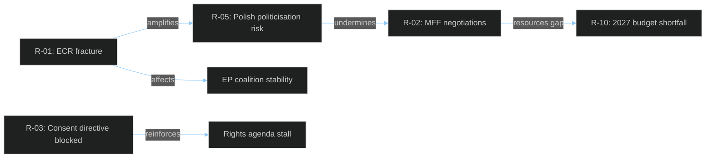

<!-- SPDX-FileCopyrightText: 2024-2026 Hack23 AB -->
<!-- SPDX-License-Identifier: Apache-2.0 -->

# ⚠️ Risk Matrix
## EP Motions — April 28–29, 2026

**Classification:** PUBLIC | **Article Type:** motions | **Run Date:** 2026-04-29
**Methodology:** Likelihood × Impact scoring (1–5 scale); CIA Political Risk methodology

---

## 1. Risk Scoring Framework

| Score | Likelihood | Impact |
|-------|-----------|--------|
| 1 | Rare (<10%) | Negligible |
| 2 | Unlikely (10–30%) | Minor |
| 3 | Possible (30–60%) | Moderate |
| 4 | Likely (60–80%) | Significant |
| 5 | Almost Certain (>80%) | Critical |

**Risk Level = Likelihood × Impact**
- 🔴 CRITICAL: 15–25
- 🟠 HIGH: 10–14
- 🟡 MEDIUM: 5–9
- 🟢 LOW: 1–4

---

## 2. Risk Register

| Risk ID | Risk Description | Likelihood (1-5) | Impact (1-5) | Risk Level | Owner | Mitigation |
|---------|-----------------|-----------------|-------------|------------|-------|-----------|
| R-01 | ECR internal fracture over Polish immunity cases derails coalition formation | 4 | 4 | 🔴 16 | ECR Group; EP President | Monitor ECR voting discipline on subsequent rule-of-law votes |
| R-02 | MFF 2028-2034 negotiations fail or produce inadequate ceiling | 2 | 5 | 🟠 10 | BUDG committee; Council Presidency | EP-Commission alignment strategy; new own resources as incentive |
| R-03 | Consent-based rape directive blocked by Council / never proposed | 3 | 3 | 🟡 9 | Commission; S&D; women's groups | Political mobilisation; EP budget leverage |
| R-04 | Şoşoacă immunity waiver triggers Romanian political crisis | 3 | 3 | 🟡 9 | Romanian government; NI group | Judicial independence messaging; EU monitoring |
| R-05 | Polish judicial proceedings against Jaki/Obajtek seen as politicised | 4 | 3 | 🟠 12 | Polish government; JURI committee | Transparent judicial process; EU monitoring |
| R-06 | GSP reform challenged at WTO by developing country complainants | 2 | 3 | 🟡 6 | INTA committee; Commission | WTO-consistent ESG conditionality framing |
| R-07 | EIB accountability gaps persist despite annual report adoption | 2 | 3 | 🟡 6 | BUDG/CONT committees; EIB Board | CONT committee follow-up hearings |
| R-08 | Transport GHG regulation creates competitive distortion for EU logistics | 3 | 2 | 🟡 6 | TRAN committee; transport industry | Impact assessment; gradual implementation timeline |
| R-09 | Rules of Procedure change (Rule 135) creates unintended agency power imbalance | 2 | 2 | 🟢 4 | AFCO committee; EP Administration | Review clause; implementation monitoring |
| R-10 | 2027 budget guidelines fail to secure adequate resources for new priorities | 3 | 3 | 🟡 9 | BUDG committee; Commission | Supplementary budget instruments; flexibility mechanisms |

---

## 3. Top-5 Priority Risks Deep Dive

### R-01: ECR Internal Fracture (🔴 CRITICAL — Score 16)

**Context:** The simultaneous immunity waivers against three Polish ECR-affiliated MEPs create unprecedented internal group dynamics. ECR's 81 MEPs include a 26-seat Polish delegation (the largest national delegation in ECR), predominantly from PiS. Their collective response to the waivers will test group cohesion.

**Risk pathway:**
1. ECR voting records on immunity waivers published (4–6 weeks post-session)
2. If Polish delegation voted against waivers → EP press scrutiny; rule-of-law questions resurface
3. If Polish delegation abstained or voted FOR → internal PiS accusations of capitulation
4. Either path creates tension between Polish nationalist identity and ECR's EU-pragmatist leadership (Procaccini, Italian FdI)
5. Under stress, Polish MEPs may threaten or execute a voting bloc departure from ECR discipline

**Mitigation capacity:** Low-Medium — ECR leadership has limited tools to enforce discipline on national sovereignty issues.

**Residual risk after mitigation:** 🟡 MEDIUM (Score 9)
**Confidence in risk assessment:** 🟡 MEDIUM

---

### R-05: Polish Proceedings Perceived as Politicised (🟠 HIGH — Score 12)

**Context:** The ECR narrative is that Polish investigations against Jaki and Obajtek are politically motivated by the Tusk government to persecute political opponents. This narrative has some factual basis (the timing of investigations immediately after PiS left power) but ignores substantive evidence of state media capture.

**Risk pathway:**
1. ECR/PfE/ESN bloc publishes joint statement criticising "judicial persecution" of European Parliament members
2. International attention from Rule of Law monitors (Venice Commission, Council of Europe)
3. EU rule-of-law monitoring frameworks must adjudicate — Polish proceedings vs. Tusk government's track record
4. Risk of "who watches the watchmen" perception problem if Polish proceedings appear politically expedited

**Mitigation capacity:** Medium — transparent Polish judicial process; EU monitoring can provide credibility
**Residual risk:** 🟡 MEDIUM (Score 8)
**Confidence:** 🟡 MEDIUM

---

### R-02: MFF Negotiation Failure (🟠 HIGH — Score 10)

**Context:** MFF negotiations always involve a crisis period. The 2021-2027 MFF was adopted only after COVID-19 recovery fund negotiations created unexpected political space. The 2028-2034 MFF faces: (a) defence spending pressures; (b) agricultural policy reform; (c) cohesion fund restructuring; (d) declining UK budget contribution (Brexit legacy); (e) new own resources battles.

**Risk pathway:**
1. Commission proposes MFF at level EP considers inadequate
2. Council net contributors push back against higher ceilings
3. EP interim report position vs. Council position: wide gap
4. Trilogue fails to converge before December 2027 deadline
5. Provisional arrangements or emergency funds bridge gap — legislative chaos for beneficiaries

**Mitigation capacity:** Medium — Von der Leyen's political capital with EPP majority in EP provides some bridging; new own resources as dealmaker
**Residual risk:** 🟡 MEDIUM (Score 8)

---

## 4. Risk Correlation Map

---

## 5. Residual Risk Summary

| Priority | Risk | Current Level | After Mitigation | Action Required |
|----------|------|--------------|-----------------|----------------|
| 1 | ECR fracture over Polish immunity | 🔴 16 | 🟡 9 | Monitor ECR voting discipline; track Polish MEP statements |
| 2 | Polish proceedings seen as politicised | 🟠 12 | 🟡 8 | EU monitoring; transparent judicial process |
| 3 | MFF negotiation failure | 🟠 10 | 🟡 8 | EP-Commission alignment; own resources proposal |
| 4 | Consent directive blocked | 🟡 9 | 🟡 6 | Political mobilisation; use budget leverage |
| 5 | 2027 budget resource gaps | 🟡 9 | 🟡 6 | Supplementary budget instruments |
