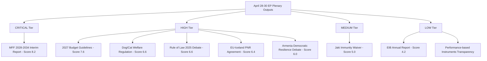

<!-- SPDX-FileCopyrightText: 2024-2026 Hack23 AB -->
<!-- SPDX-License-Identifier: Apache-2.0 -->

# Significance Classification — EP Breaking News: April 28–30, 2026

**Generated:** 2026-04-30T07:25:00Z | **Run:** breaking-2026-04-30  
**Classification:** PUBLIC | **Confidence:** 🟡 MEDIUM

---

## Reader Briefing

This artifact classifies each April 28–30, 2026 EP plenary output by institutional significance level, using the EP Monitor classification framework (CRITICAL / HIGH / MEDIUM / LOW). The classification draws on the significance-scoring.md composite scores and the historical-baseline.md precedent analysis.

---

## Classification Diagram

---

## Classification Table

| Document/Event | Type | Classification | Key Rationale |
|---------------|------|---------------|--------------|
| MFF 2028-2034 Interim Report | Legislative resolution | 🔴 CRITICAL | First EP position on decade-defining €1.4tn budget framework |
| 2027 Budget Guidelines | Annual budget resolution | 🔴 HIGH | Opens formal 2027 conciliation; MFF anchor |
| Dog/Cat Welfare Regulation | Legislative | 🟡 HIGH | First EU horizontal companion animal welfare law — permanent precedent |
| Rule of Law 2025 Annual Report | Political debate | 🟡 HIGH | Annual RL monitoring cycle; MFF conditionality linkage |
| EU-Iceland PNR Agreement | International agreement | 🟡 HIGH | Validates post-Canada ECJ framework; extends PNR network |
| Armenia Democratic Resilience | Political debate | 🟡 HIGH | Eastern neighbourhood signal in context of ongoing security pressure |
| Patryk Jaki Immunity Waiver | Administrative | 🟢 MEDIUM | Routine but politically charged; ECR/PfE implications |
| EIB Annual Report | Oversight | 🟢 LOW | Annual review; limited new policy signal |
| Performance-based Instruments | Legislative | 🟢 LOW | Technical transparency measure |

---

## Institutional Classification by Policy Domain

**Fiscal / Budget:** CRITICAL — MFF interim report sets the EP's formal opening position for the most consequential EU budget negotiation of the decade.

**Rule of Law / Democracy:** HIGH — The annual RL debate contributes to the institutionalised monitoring architecture, but no new enforcement actions were triggered.

**Security / External Relations:** HIGH — PNR agreement and Ukraine/Armenia debates signal continued EP engagement on security governance and neighbourhood policy.

**Animal Welfare / Consumer Policy:** HIGH-PRECEDENT — First-ever EU horizontal companion animal welfare law merits a HIGH classification despite limited immediate political controversy.

---

*Source: EP Open Data Portal; significance-scoring.md; historical-baseline.md. Classification: PUBLIC.*
