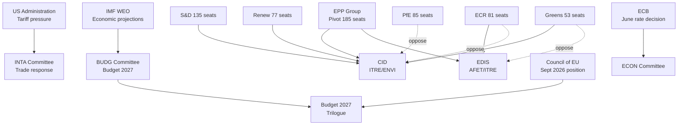

<!-- SPDX-FileCopyrightText: 2024-2026 Hack23 AB -->
<!-- SPDX-License-Identifier: Apache-2.0 -->

# Actor Mapping — EU Parliament: April 30 – May 30, 2026

**Framework:** PMESII-PT Actor Mapping (Political, Military, Economic, Social, Information, Infrastructure + Physical + Time)  
**Date:** 2026-04-30

---

## Key Actor Categories

### Category A: EP Political Group Leaders (Primary Decision-Makers)

| Actor | Role | Stance on CID | Stance on EDIS | Stance on US Trade | Influence Score |
|-------|------|--------------|---------------|-------------------|----------------|
| EPP Group (Manfred Weber leadership) | Pivot group; agenda setter | 🟢 Support (competitiveness frame) | 🟢 Support | 🟡 Managed confrontation | 10/10 |
| S&D Group | Centre-left coalition partner | 🟢 Strong support (jobs/workers) | 🟡 Conditional (social provisions) | 🟢 Active support | 8/10 |
| Renew Europe | Liberal pivot | 🟡 Conditional (free market concerns) | 🟡 Support with caveats | 🟢 Active support (French pressure) | 7/10 |
| PfE (Patriots for Europe) | Hard-right pressure | 🔴 Opposition (energy/industrial costs) | 🟢 Support (nationalist) | 🟡 Ambivalent (US alignment vs. EU interest) | 6/10 |
| ECR | Centre-right alternative | 🔴 Opposition (regulatory burden) | 🟢 Strong support | 🟡 Conditional | 6/10 |
| Greens/EFA | Progressive bloc | 🟢 Strong support (climate) | 🔴 Opposition (militarism concerns) | 🟢 Support (trade defence) | 5/10 |
| The Left | Radical left | 🟢 Partial support (workers) | 🔴 Opposition (strong) | 🟡 Divided | 4/10 |

### Category B: External Institutional Actors

| Actor | Relationship to EP | Key May 2026 Role |
|-------|--------------------|------------------|
| European Commission | Legislative initiator; CID, EDIS drafter | Monitoring committee progress; DG TRADE active on US tariffs |
| European Council (Council of EU) | Budget 2027 counterpart | Preparing Council position (September 2026 expected) |
| European Central Bank | ECON scrutiny target | Rate decision June 12 (FS-2026-007) |
| IMF | Economic authority | WEO April 2026 is the reference; Spring update pending |
| US Administration | External pressure | Tariff confrontation (FS-2026-004); NATO pressure (indirect) |

### Category C: Key MEP Rapporteurs (Tactical Level)

The legislative rapporteurs for CID (ITRE+ENVI co-rapporteurs, names TBC pending committee assignment), EDIS (AFET+ITRE co-rapporteurs), and Budget 2027 (BUDG rapporteur for EP position) are the tactical actors whose negotiation posture will determine the coalition balance in committee. These individuals have delegated influence within their groups to negotiate across party lines.

---

## Actor Influence Flow (Mermaid)

---

## Coalition Architecture by Actor (Summary)

The actor mapping confirms the coalition-dynamics.md assessment: **EPP is the universal veto player** — no legislative item advances without EPP support. The three key actors for May 2026 outcomes are:

1. **EPP Group** (universal veto player, 25.7% of seats)
2. **S&D Group** (Type A coalition anchor, 18.8% of seats)
3. **ECR Group** (EDIS enabler, CID obstacle, 11.0% of seats)

The coalition management challenge is that S&D and ECR are in direct ideological opposition on CID — EPP cannot fully satisfy both simultaneously, forcing dossier-by-dossier switching.

**Confidence:** 🟡 MEDIUM — actor positions are based on group political programmes and historical voting patterns; May 2026 specific positions may evolve as committee processes develop.
