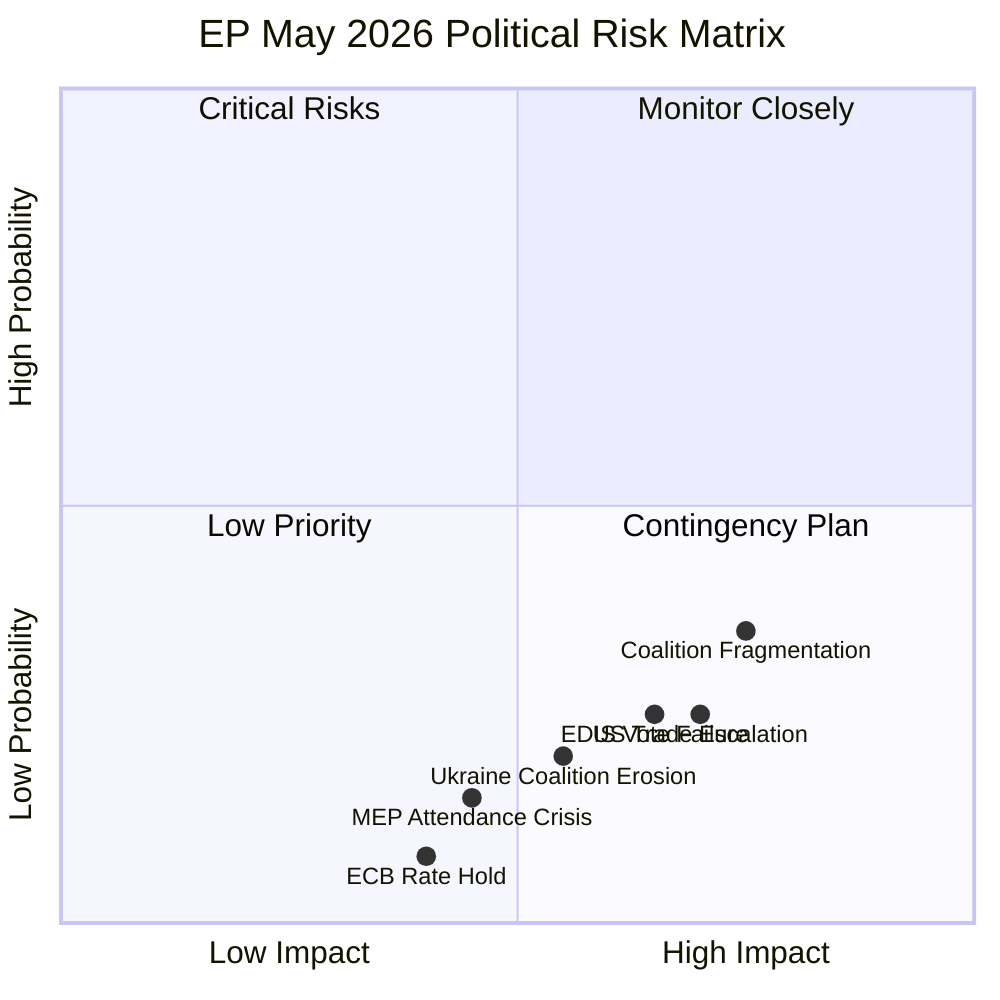

<!-- SPDX-FileCopyrightText: 2024-2026 Hack23 AB -->
<!-- SPDX-License-Identifier: Apache-2.0 -->

# Executive Brief — EU Parliament: April 30 – May 30, 2026

**Classification:** Public | **For:** EU Parliament Monitor Readers  
**Date:** 2026-04-30 | **Article Type:** Month-Ahead  
**Admiralty Rating:** B2 (Credible source, probably true)

---

## BLUF — Bottom Line Up Front

The EU Parliament's next 30 days (April 30 – May 30, 2026) will be dominated by the May 18-21 Strasbourg plenary session, which is the key decision point for three concurrent legislative axes: Clean Industrial Deal implementation, European Defence Industrial Strategy initial votes, and Budget 2027 trilogue preparation. The political environment is characterised by historically high institutional momentum (EP10's output is 46% above typical year-2 averages) combined with historically high coalition fragmentation (ENP 6.59 — highest in EP history). The most likely outcome (55%) is effective legislative delivery, but trade confrontation and coalition management pressures create a meaningful 25-30% probability of significant agenda disruption.

---

## The Three Decisions That Will Define May 2026

### Decision 1: How Does EPP Manage the CID Coalition?

The Clean Industrial Deal (CID) requires EPP to maintain a centre coalition (EPP+S&D+Renew) that can pass green industrial standards against ECR/PfE opposition. This is consistent with EPP's institutional commitments, but ECR will attempt to insert amendments diluting social and environmental provisions.

**Outcome stakes:** If EPP holds the centre coalition, CID moves forward on the July 2026 timeline (FS-2026-006). If EPP accommodates ECR amendments, S&D may break from the coalition, creating a legislative stall.

**Monitoring signal:** First committee votes in ITRE and ENVI by May 21 — watch EPP voting with S&D versus EPP voting with ECR.

### Decision 2: Can the EDIS Find a Workable Majority?

The European Defence Industrial Strategy requires a different coalition configuration — more conservative, including ECR (who support defence spending) but potentially excluding Greens/EFA (who oppose mandatory military integration). This creates a coalition management challenge: EDIS requires different partners than CID, and EPP must manage both simultaneously.

**Outcome stakes:** EDIS passage establishes EU defence industrial capacity through 2030. Failure to pass would be a significant blow to the EU's strategic autonomy narrative, particularly relevant given US-NATO burden-sharing uncertainty.

**Monitoring signal:** Greens/EFA and The Left formal position statements on EDIS — if they commit to opposition, EPP must find a substitute majority through NI members.

### Decision 3: Is the Budget 2027 Trilogue on Track?

The April 28 Budget Guidelines adoption (TA-10-2026-0112) was the EP's formal contribution to the trilogue process. The Council must now adopt its position (expected September 2026). The key question for May is whether EP's budget committee (BUDG) will maintain the guidelines' political assumptions if IMF or the Commission downgrade growth projections under trade shock pressure.

**Outcome stakes:** A revised growth downgrade in May-June 2026 could force Budget 2027 to be reopened — a procedurally complex and politically disruptive process.

**Monitoring signal:** IMF Spring 2026 World Economic Outlook update (expected late April); European Commission Spring Forecast (expected May 2026).

---

## Political Risk Snapshot

**Risk legend:**
- 🔴 Critical: Coalition Fragmentation, US Trade Escalation
- 🟡 Monitor: Ukraine Erosion, EDIS Vote Failure, MEP Attendance
- 🟢 Low: ECB Rate Hold

---

## Key Legislative Milestones (April 30 – May 30)

| Date | Event | Significance |
|------|-------|-------------|
| April 30 (today) | Strasbourg plenary in progress: 21 items (4 debates, 17+ votes) | Coalition test: current session baseline |
| May 5-8 | Plenary not scheduled; committee week | INTA, ITRE, ENVI committee work on trade/CID |
| May 12-15 | Mini-session possible (TBC) | Budget BUDG committee preparatory work |
| May 18-21 | Full Strasbourg plenary session | **KEY DECISION POINT — all three strategic items** |
| May 26-29 | Committee week | Follow-up to May 18-21 decisions |
| May 30 | End of reporting window | Forward statement status updates |

---

## Economic Context (IMF WEO April 2026)

EU GDP growth forecast: **1.3% (2026)** — positive but fragile
- Germany: 0.2% (2025 est.), 0.8% (2026 proj) — exiting technical recession
- France: 1.8% (2025 est.), inflation 2.1% (2026 proj) — at ECB target
- Italy: Unemployment 6.5% (2024), 6.0% proj (2026) — improving

**IMF downside risk:** Trade war scenario (-0.4 to -0.8 pp) could turn EU growth marginally negative. This is the primary economic wildcard for Budget 2027 assumptions.

**ECB rate path:** 25bps cut expected June 2026 (FS-2026-007, 🟡 MEDIUM confidence), subject to April/May inflation data confirmation.

---

## Intelligence Confidence Assessment

| Assessment Area | Confidence | Basis |
|----------------|-----------|-------|
| EP political landscape | 🟢 HIGH | EP MCP data authoritative |
| Legislative calendar | 🟢 HIGH | Adopted texts + plenary sessions confirmed |
| Economic projections | 🟢 HIGH | IMF WEO April 2026 (sole authoritative source) |
| Coalition dynamics | 🟡 MEDIUM | Vote-level cohesion unavailable; seat-share proxy used |
| May 18-21 agenda | 🟡 MEDIUM | No published agenda yet (18 days out) |
| Trade shock timing | 🟡 MEDIUM | US policy signals monitored but uncertain |
| ECB rate decision | 🟡 MEDIUM | Current data supportive but geopolitical uncertainty |

---

## Forward Statements Active (as of 2026-04-30)

| ID | Statement | Confidence | Horizon |
|----|-----------|-----------|---------|
| FS-2026-004 | US-EU automotive tariff negotiations | 🟡 Medium | 2026-06-30 |
| FS-2026-005 | Budget 2027 trilogue launch | 🟢 HIGH | 2026-09-30 |
| FS-2026-006 | CID implementing legislation | 🟡 Medium | 2026-07-31 |
| FS-2026-007 | ECB rate cut 25bps | 🟡 Medium | 2026-06-12 |
| FS-2026-008 | May 18-21 INTA trade response vote | 🟡 Medium | 2026-05-21 |
| FS-2026-009 | Budget 2027 Council position September | 🟢 HIGH | 2026-09-30 |
| FS-2026-010 | CID committee votes May-June 2026 | 🟡 Medium | 2026-06-30 |

---

## One-Sentence Country Implications

- **Germany:** Budget 2027 and CID implementation directly affect German export industries and fiscal framework under the Schuldenbremse — May votes are high-stakes for German MEPs.
- **France:** INTA trade response vote is a priority for French MEPs defending Airbus, luxury goods, and agricultural exports; French Renew delegation is most vocal.
- **Poland/CEE:** EDIS defence vote aligns with CEE security priorities; CID provisions on energy intensity create friction with Polish industrial interests.
- **Nordic countries:** Finland and Sweden MEPs are engaged on Ukraine support maintenance (NATO context) and Budget 2027 fiscal discipline.
