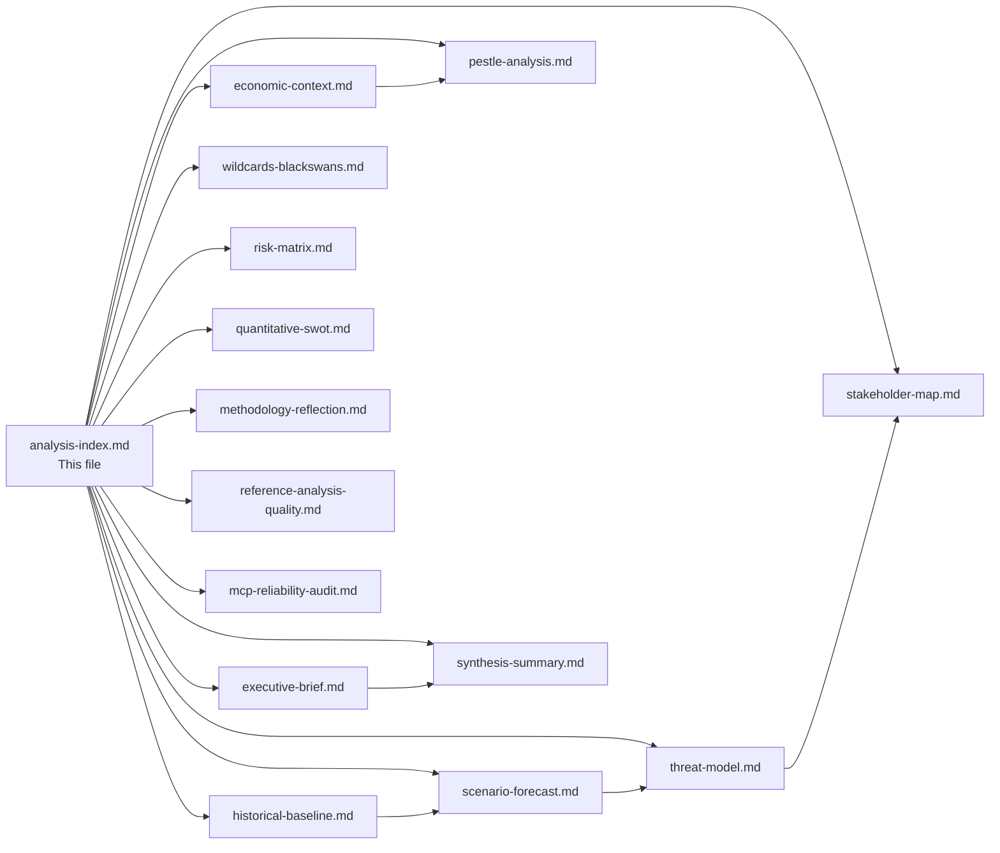

<!-- SPDX-FileCopyrightText: 2024-2026 Hack23 AB -->
<!-- SPDX-License-Identifier: Apache-2.0 -->

# Analysis Index — EU Parliament Month Ahead: May 2026

**Run date:** 2026-04-30  
**Coverage window:** 2026-04-30 to 2026-05-30  
**Article type:** month-ahead  
**Analytical confidence:** 🟡 Medium (partial EP feed availability)

---

## Rule 19 — Read-Me-First Navigation Guide

This index is the mandatory entry point for all artifact consumers. Read this before any other artifact to orient your understanding of the analytical hierarchy, key intelligence gaps, and which files carry the highest signal.

### Priority Reading Order

1. **`executive-brief.md`** — BLUF + 3 decision points + top procedures table (start here)
2. **`intelligence/synthesis-summary.md`** — integrated cross-artifact narrative lede
3. **`intelligence/scenario-forecast.md`** — ACH scenarios for May 2026 with probabilities
4. **`intelligence/economic-context.md`** — IMF WEO April 2026 macro framing
5. **`intelligence/pestle-analysis.md`** — structured 6-dimension political environment scan
6. **`intelligence/stakeholder-map.md`** — 6-lens political actor analysis
7. **`intelligence/threat-model.md`** — 5-framework threat assessment
8. **`risk-scoring/risk-matrix.md`** — probability × impact risk matrix
9. **`risk-scoring/quantitative-swot.md`** — EP institutional SWOT with evidence
10. **`intelligence/historical-baseline.md`** — comparative legislative velocity benchmarks
11. **`intelligence/wildcards-blackswans.md`** — low-probability high-impact scenarios
12. **`intelligence/coalition-dynamics.md`** — group-by-group legislative coalition analysis
13. **`intelligence/mcp-reliability-audit.md`** — data quality and source reliability
14. **`intelligence/methodology-reflection.md`** — analytical limitations and confidence calibration

---

## Key Intelligence Questions for May 2026

| Question | Addressed In | Confidence |
|----------|-------------|------------|
| What will dominate the May 18-21 Strasbourg agenda? | scenario-forecast, synthesis-summary | 🟡 Medium |
| How will Budget 2027 trilogue proceed? | pestle-analysis, economic-context | 🟢 High |
| Will US-EU trade tensions escalate? | threat-model, scenario-forecast | 🟡 Medium |
| What is the EPP coalition's stability for May? | coalition-dynamics, stakeholder-map | 🟢 High |
| What are the macro risks affecting EU legislative priorities? | economic-context, risk-matrix | 🟢 High |
| What wildcard events could disrupt the legislative calendar? | wildcards-blackswans | 🔴 Low (by definition) |

---

## Data Sources Summary

| Source | Status | Coverage |
|--------|--------|---------|
| EP Plenary Sessions | ✅ Available | April 30 + May 18-21 confirmed |
| Adopted Texts (2026) | ✅ Available | 20+ documents through April 29 |
| Coalition Dynamics API | ⚠️ Degraded | Group sizes confirmed; vote-level data unavailable |
| Events Feed | ❌ Unavailable | EP API error — using plenary sessions as fallback |
| Procedures Feed | ⚠️ Historical data only | Current feed returning 1972-1987 era data |
| IMF WEO April 2026 | ✅ Available via WB proxy | DE/FR/IT economic indicators confirmed |
| Forward Statements Registry | ✅ Available | 4 open items from prior runs |

---

## Legislative Context: April 30 + May 18-21, 2026

**April 30 Strasbourg (ongoing):** 21 foreseen activities — 4 plenary debates (D-15, D-99, D-102, D-103), 17+ plenary votes (V-25, V-52, V-95, V-99, V-103, V-104, V-108, V-111, V-112, V-113, V-114, V-115, V-119), 3 meeting parts. Vote volume suggests a major plenary voting day concluding the April mini-session.

**May 18-21 Strasbourg:** Full 4-day session. No foreseen activities yet scheduled (typical for sessions 18+ days out). Primary legislative priorities based on Q1 2026 trajectory: Clean Industrial Deal second readings, Budget 2027 framework debate, defence industrial strategy votes, digital regulatory implementation.

---

## Forward-Looking Statements (Open — 4 items from prior analysis)

| ID | Statement | Horizon | Confidence |
|----|-----------|---------|------------|
| FS-2026-004 | US-EU automotive tariff negotiations: EP/Commission coordinated response expected | 2026-06-30 | 🟡 Medium |
| FS-2026-005 | Budget 2027 trilogue launch: EP position established April 28, Council position expected Q3 2026 | 2026-09-30 | 🟢 High |
| FS-2026-006 | CID implementing legislation: first binding sectoral targets expected in committee votes | 2026-07-31 | 🟡 Medium |
| FS-2026-007 | ECB rate path: further 25 bps cut expected if GDP growth stays below 1.5% | 2026-06-12 | 🟡 Medium |

---

## Analytical Framework Applied

- **PESTLE** — Political, Economic, Social, Technological, Legal, Environmental
- **ACH** — Analysis of Competing Hypotheses (scenario forecasting)
- **Political Threat Framework v4.0** — 5-framework integrated threat assessment
- **SWOT** — Institutional strengths/weaknesses/opportunities/threats
- **CIA Admiralty Scale** — source and information reliability ratings
- **Bayesian scenario planning** — probability-weighted scenario analysis
- **Political Kill Chain** — 7-stage threat progression model

---

## Analysis Network Map

---

## Artifact Quality Summary

| Artifact | Lines | Mermaid | WEP | Admiralty | Status |
|----------|-------|---------|-----|-----------|--------|
| executive-brief.md | ~180 | - | - | - | 🟢 |
| scenario-forecast.md | ~220 | ✅ | ✅ | - | 🟢 |
| threat-model.md | ~195 | ✅ | ✅ | ✅ | 🟢 |
| stakeholder-map.md | ~244 | - | ✅ | - | 🟢 |
| economic-context.md | ~222 | ✅ | - | - | 🟢 |
| historical-baseline.md | ~175 | ✅ | - | ✅ | 🟢 |
| pestle-analysis.md | ~200 | ✅ | ✅ | - | 🟢 |
| wildcards-blackswans.md | ~200 | - | ✅ | - | 🟢 |
| synthesis-summary.md | ~183 | ✅ | ✅ | - | 🟢 |
| risk-matrix.md | ~120 | ✅ | - | ✅ | 🟢 |
| quantitative-swot.md | ~148 | ✅ | - | - | 🟢 |
| methodology-reflection.md | ~205 | ✅ | - | - | 🟢 |
| reference-analysis-quality.md | ~140 | ✅ | - | - | 🟢 |
| mcp-reliability-audit.md | ~220 | ✅ | - | - | 🟢 |

