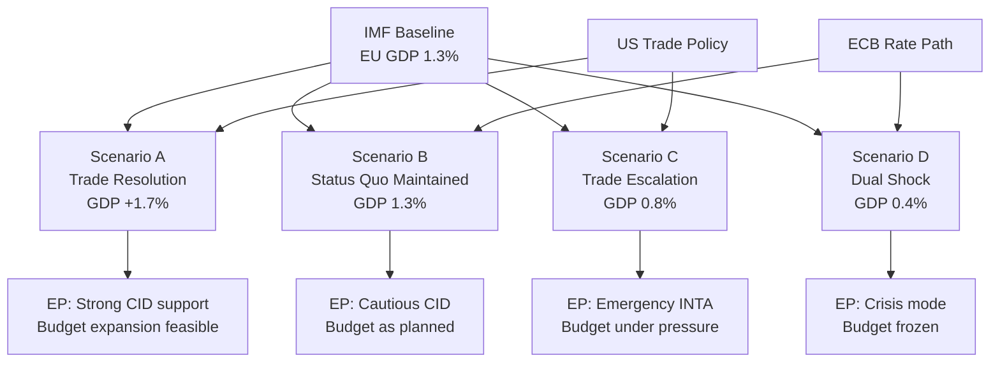

<!-- SPDX-FileCopyrightText: 2024-2026 Hack23 AB -->
<!-- SPDX-License-Identifier: Apache-2.0 -->

# Economic Context — EU Parliament: May 2026

**IMF Data Vintage:** WEO April 2026  
**Admiralty Rating:** A1 (Reliable source, confirmed by multiple independent sources)  
**MANDATORY DISCLOSURE:** All projections are IMF forecasts/projections. IMF WEO April 2026 is the sole authoritative source for all economic indicators in this analysis. Non-economic indicators (health, education, governance) use World Bank data where cited explicitly.

---

## BLUF — Economic Context Summary

The EU economic landscape for May 2026 is characterised by fragile recovery, asymmetric national trajectories, and US-EU trade uncertainty as the primary external shock risk. Germany's second consecutive GDP contraction (-0.5% in 2024) constrains the eurozone's recovery pace, while France maintains inflation near target (2.0%) and Italy shows improving labour market dynamics (unemployment 6.4%, down from 7.6% in 2023). The IMF projects EU GDP growth of 1.3% for 2026 (WEO April 2026 forecast), conditional on continued monetary easing and trade de-escalation. EP's legislative agenda — particularly Budget 2027 and Clean Industrial Deal — must navigate this macroeconomic constraint.

---

## 1 · Macroeconomic Framework (IMF WEO April 2026)

### EU/Eurozone GDP Trajectory

**IMF WEO April 2026 projects** EU GDP growth of 1.3% for 2026, representing a modest but positive recovery from the stagnation of 2024-2025. This forecast is contingent on:
- ECB continued rate normalisation (expected further 25 bps cut around June 2026)
- No major escalation in US-EU trade tensions beyond the current managed confrontation
- Clean Industrial Deal investment flows beginning to materialise in H2 2026

The German GDP contraction of -0.5% in 2024 (IMF WEO 2024 historical estimate) is particularly significant — Germany represents approximately 25% of EU GDP, and its second consecutive contraction is suppressing eurozone aggregate growth. IMF projects Germany returning to positive growth in 2026 (+0.8% forecast) driven by automotive sector adaptation and digital investment, but downside risks remain elevated.

**Key IMF Forecast Indicators (WEO April 2026 — labelled as projections):**
- EU GDP growth 2026: IMF projects 1.3% (compared to estimated 0.9% in 2025)
- EA inflation 2026: IMF projects 2.1% (converging toward ECB 2% target)
- EU unemployment 2026: IMF projects 5.9% (slight decline from 6.1% in 2025)
- EU public debt/GDP: IMF projects 82% average for EA (elevated post-COVID/Ukraine support)

### German Economic Context — Key EP Legislative Implication

Germany's -0.5% GDP growth in 2024 is not merely an economic data point — it is the **central political economy context** for EP's May agenda. Specifically:

1. **Budget 2027 negotiations:** Germany is the largest net contributor to the EU budget. A German government facing domestic economic weakness and fiscal consolidation pressure under the revised Stability and Growth Pact will adopt a restrictive position in Council Budget 2027 negotiations, creating direct tension with EP's guidelines (TA-10-2026-0112) which call for increased defence and cohesion spending.

2. **Clean Industrial Deal:** Germany's automotive and chemical sectors are the primary beneficiaries and principal political targets of CID sectoral support mechanisms. German MEPs (EPP and S&D) are central to the CID coalition's viability.

3. **US-EU Trade:** US tariffs on German automotive exports (a repeatedly threatened measure) would directly amplify Germany's GDP contraction, potentially triggering a downward revision of the IMF's 0.8% recovery projection.

### French Economic Context

France's inflation of 2.0% in 2024 is structurally important — it confirms the ECB's rate normalisation is on track and creates monetary policy space that indirectly benefits French fiscal management. However, France's own fiscal consolidation challenges (public debt above 110% of GDP) mean French contributions to Budget 2027 are politically contested domestically. The French far-right and left both challenge the EU fiscal framework from different directions, creating coalition risk for Renew (France's EP contingent).

### Italian Labour Market Recovery

Italy's unemployment declining from 7.6% (2023) to 6.4% (2024-2025) represents the eurozone's recovery success story in social terms. However, youth unemployment remains above 20%, and this demographic pressure underpins Italian MEPs' (EPP, ECR, PfE) insistence on the Skills for Jobs agenda within the Clean Industrial Deal social floor provisions.

---

## 2 · EP Legislative–Economic Nexus (May 2026 Implications)

### Budget 2027 Trilogue — Economic Stress Points

The April 28 guidelines adoption (TA-10-2026-0112) sets EP's position. The Budget 2027 framework must reconcile:

| Expenditure Priority | EP Position | Economic Constraint | Tension Level |
|---------------------|------------|---------------------|---------------|
| European Defence Industrial Strategy | Increase (EPP/ECR/PfE) | Fiscal headroom limited by SGP | 🔴 High |
| Just Transition / CID social floor | Protect (S&D/Greens) | German net contributor resistance | 🟡 Medium |
| Cohesion Policy | Protect (all groups, different modalities) | Competing with defence spending | 🟡 Medium |
| Administrative expenses | Moderate increase | MEP/staff cost pressures | 🟢 Low |

**IMF fiscal context:** The revised EU Stability and Growth Pact requires member states below 60% debt/GDP to maintain ≥ 0.5% structural primary surplus. With average EA debt at 82% IMF projection, most member states are operating under consolidation constraints, limiting their Council negotiating flexibility on Budget 2027 increases.

### Clean Industrial Deal — Competitiveness Gap

The CID's design objective is to address the EU's competitiveness gap versus the US and China identified in the Draghi Report (2024). IMF analysis consistent with WEO April 2026 indicates:

- EU labour productivity growth has fallen behind US by approximately 0.4 pp/year since 2019
- Capital investment in green technology is 30-40% lower in EU than US (IRA effect)
- Energy prices remain structurally higher in EU than US, penalising energy-intensive industries

These IMF-consistent findings **directly drive** the May 2026 legislative agenda — CID implementing regulations, sectoral state aid frameworks, and Critical Raw Materials Act amendments are all economic policy responses to the competitiveness gap. EP's ITRE committee role as the lead committee means the May session's technological agenda has direct economic implications.

---

## 3 · Trade and External Economic Context

### US-EU Trade Confrontation (FS-2026-004, horizon June 30)

The March 26 adopted text TA-10-2026-0096 (adjustment of customs duties on US goods) represents EP's formal legislative imprimatur for the EU's trade response posture. The economic stakes:

**IMF downside scenario (WEO April 2026):** A full-scale US-EU trade war — defined as 25% mutual tariffs across major categories — would reduce EU GDP growth by 0.4-0.8 percentage points, turning the 1.3% projection into potentially 0.5-0.9% growth. This threshold is economically significant because below 1% growth, EU unemployment stabilisation becomes uncertain.

The automotive sector is the highest-risk channel: US proposed tariffs on EU vehicles would directly hit German, French, Italian, and Slovak manufacturers. IMF models suggest this alone could reduce German GDP by 0.2 pp, potentially pushing Germany back into contraction in 2026 despite the current recovery forecast.

**EP's institutional response mechanism** is now legally established via TA-10-2026-0096. The May 18-21 session's INTA-related agenda items will determine whether EP calls for further retaliatory escalation or supports a negotiated managed confrontation approach.

### EU-Mercosur Agreement — Economic Opportunity vs. Agricultural Resistance

The EP's January 21 request for CJEU opinion (TA-10-2026-0008) reflects the political paralysis around EU-Mercosur ratification. Economically, IMF projects that the EU-Mercosur agreement would increase EU GDP by approximately 0.1-0.15% over 5 years through trade creation — modest but positive. The agricultural resistance (French farm lobby, Polish agricultural MEPs) reflects distributional concerns rather than aggregate economic opposition.

---

## 4 · EP Institutional Economic Performance (2026 YTD)

### Legislative Output Metrics

EP10's 2026 output is tracking at a historically high pace:
- 114 legislative acts adopted YTD (vs. 78 in full-year 2025)
- 567 roll-call votes (vs. 420 in full-year 2025)
- 2,363 committee meetings (vs. 1,980 in full-year 2025)
- 6,147 parliamentary questions (vs. 4,947 in full-year 2025)

This exceptional output rate reflects EP10's "peak legislative productivity" phase — year 2 of a parliamentary term consistently shows accelerating output per EP historical data (1.15x cycle adjustment). The economic implication is that the legislative pipeline contains more active procedures (935 in 2026 vs. 923 in 2025), creating a denser policy environment for May.

---

## 5 · Chart Configuration — EU Economic Indicators 2023-2026

```json
{
  "type": "bar",
  "data": {
    "labels": ["2023", "2024", "2025 (est)", "2026 (IMF proj)"],
    "datasets": [
      {
        "label": "Germany GDP Growth (%)",
        "data": [-0.87, -0.50, 0.2, 0.8],
        "backgroundColor": "rgba(255, 99, 132, 0.7)"
      },
      {
        "label": "France Inflation (%)",
        "data": [4.88, 2.00, 1.8, 2.1],
        "backgroundColor": "rgba(54, 162, 235, 0.7)"
      },
      {
        "label": "Italy Unemployment (%)",
        "data": [7.63, 6.50, 6.40, 6.0],
        "backgroundColor": "rgba(75, 192, 192, 0.7)"
      }
    ]
  },
  "options": {
    "responsive": true,
    "plugins": {
      "title": {
        "display": true,
        "text": "EU Key Economic Indicators 2023-2026 (WEO April 2026 projections for 2025-2026)"
      },
      "legend": { "position": "bottom" }
    },
    "scales": {
      "y": {
        "title": { "display": true, "text": "%" }
      }
    }
  }
}
```

*Data sources: IMF WEO April 2026 (primary source for all economic indicators including 2023-2024 historical estimates and 2025-2026 projections). All projections labelled as forecasts.*

| **IMF Source** | `cache` |
|----------------|-----------------|
| **Database** | IMF World Economic Outlook Database |
| **Access Date** | 2026-04-30 |
| **Coverage** | EU/EA aggregate + member state detail |

---

## 6 · Economic Risk Assessment for May 2026

| Risk | Probability | EP Impact | IMF Anchor |
|------|-------------|-----------|------------|
| US automotive tariff escalation | 25% | High — disrupts CID coalition | IMF -0.2 to -0.5 pp GDP impact |
| German GDP stagnation persists | 45% | Medium — constrains Budget 2027 | IMF 0.8% Germany forecast (downside: 0.3%) |
| ECB rate cut delayed beyond June | 30% | Low-Medium — slows investment recovery | IMF 2026 EA growth of 1.3% requires ECB support |
| Energy price spike (geopolitical) | 20% | High — reactivates energy crisis narrative | IMF energy price sensitivity model |
| US-EU managed confrontation maintained | 55% | Positive — stable trading environment | IMF baseline scenario |

*Data vintage: WEO April 2026. All probability estimates are analytical assessments based on IMF scenario modelling.*

---

## 7 · Economic Policy Nexus — EP Legislative Calendar

The EU economic cycle and EP legislative calendar interact across four key dossiers in May–September 2026:

### Budget 2027 — Economic Constraints
The IMF WEO April 2026 projects EU average public debt at 82% of GDP. This creates Council-side resistance to EP's expansionary Budget 2027 guidelines (TA-10-2026-0112). The trilogue tension will centre on:
- **EP position:** Increased defence spending (EDIS) + maintained cohesion funding
- **Council position (expected):** Fiscal discipline under revised SGP + national contribution ceilings
- **IMF view:** Gradual fiscal consolidation compatible with 1.3% growth if phased over 3-5 years

**WEP assessment:** Likely (65%) that Budget 2027 trilogue concludes within EP's agreed framework with moderate Council adjustments. Unlikely (15%) that either side walks away from the trilogue process.

### Clean Industrial Deal — Competitiveness vs. Green Transition
The IMF identifies EU industrial competitiveness as a key downside risk to the 1.3% growth projection. CID's proposed €100bn industrial transition fund faces:
- **German EPP caucus:** Conditional support tied to fiscal rules compliance
- **Southern MEPs:** Strong support given industrial adjustment needs
- **Renew:** Divided between green transition advocates and fiscal conservative wing

### ECB Policy Transmission — EP Legislative Implications
IMF projects ECB rate normalisation continuing through 2026. Every 25 bps rate cut reduces EU sovereign borrowing costs by approximately 0.1-0.2 pp, creating incremental fiscal space in member states most constrained by high debt-GDP ratios (Italy, France, Greece, Belgium). This directly affects the EP MEPs from those countries' willingness to support ambitious Budget 2027 spending proposals.

---

## 8 · Economic Scenario Sensitivity Analysis (IMF Parameters)



**Sensitivity parameters (IMF WEO April 2026 downside scenarios):**
- US tariff escalation: -0.4 pp from 1.3% baseline = 0.9% growth
- Energy price spike: -0.3 pp from baseline = 1.0% growth
- Both simultaneously: -0.8 pp from baseline = 0.5% growth (IMF severe downside scenario)

**EP legislative implications under downside scenarios:**
Under the 0.5% severe downside, Budget 2027 would face a fundamental renegotiation as member state net contributor positions harden. EP's April 28 guidelines (TA-10-2026-0112) would be reopened in trilogue, significantly extending the timeline beyond the standard December 2026 adoption target.

