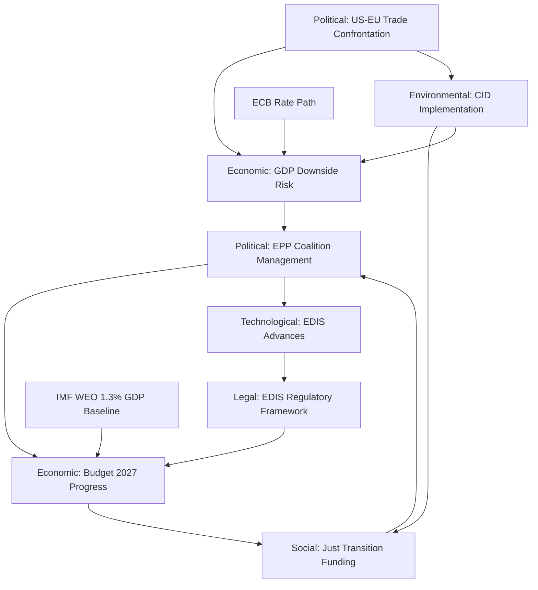

<!-- SPDX-FileCopyrightText: 2024-2026 Hack23 AB -->
<!-- SPDX-License-Identifier: Apache-2.0 -->

# PESTLE Analysis — EU Parliament: May 2026

**Coverage window:** 2026-04-30 to 2026-05-30  
**Framework:** Political, Economic, Social, Technological, Legal, Environmental  
**Admiralty Rating:** B2 (Credible source, probably true — EP Open Data + WB/IMF)

---

## Executive Summary

The European Parliament enters May 2026 in a complex operating environment. The EPP-led flexible coalition has demonstrated its capacity for legislative output — with 114 acts adopted in 2026 to date, significantly above the 2024-2025 pace — but faces four structural pressure vectors: escalating US-EU trade tensions post-tariff adjustment, the transition from Budget 2027 guidelines to trilogue negotiation, Clean Industrial Deal implementation deadlines, and the persistence of EU economic fragility (Germany's GDP contraction, France's slowing growth). The May 18-21 Strasbourg session will be the central legislative arena for the next 30 days.

---

## P — Political

### EP10 Coalition Architecture (🟢 High Confidence)

The EP's political balance as of April 2026 reflects a stable but structurally complex configuration:

- **EPP** (185 seats, 25.7%): Dominant pivot group, maintains legislative agenda-setting capability. Under Roberta Metsola's leadership, EPP has successfully built flexible majorities across multiple issue domains — defence (with ECR and PfE), green transition (with S&D and Renew on selective items), and budget (with broad coalition).
- **S&D** (135 seats, 18.8%): Second force, essential for progressive majority construction. Strong on workers' rights (April 30 vote on subcontracting chains TA-10-2026-0050), Ukraine support, and Budget 2027 social floor.
- **PfE** (85 seats, 11.7%): Largest right-wing group, increasingly assertive on trade defence and strategic autonomy. Internal tensions between pro-Orbán Hungary faction and Italian/French market-sceptic wings present coalition management challenges.
- **ECR** (81 seats, 11.0%): Strengthened under Meloni-aligned leadership. Pivotal on defence industrial strategy, selective on budget, adversarial on migration and climate.
- **Renew** (77 seats, 10.7%): Centre-liberal bloc, essential for qualified majority construction. Under pressure from French electoral dynamics; remains crucial for trade defence coordination.
- **Greens/EFA** (53 seats, 7.4%): Weakened post-2024 but holding coherent position on Clean Industrial Deal and budget social clauses.
- **The Left** (46 seats, 6.4%): Significant presence; active on workers' rights and trade defence.
- **NI** (30 seats, 4.2%): Non-attached MEPs, heterogeneous.
- **ESN** (27 seats, 3.8%): Far-right bloc, generally obstructionist.

**Majority threshold:** 361 seats. Grand coalition (EPP + S&D) = 320 seats — **below majority threshold**. Every legislative majority requires at least 3 groups, confirming the multi-coalition architecture.

### Key Political Developments — April 2026

1. **Budget 2027 Guidelines Adopted (April 28):** TA-10-2026-0112 signals that the EP has formally opened the trilogue track. The Council position is expected Q3 2026, making the May-June period critical for EP/Commission coordination.

2. **EU-Iceland PNR Data Agreement (April 29):** TA-10-2026-0142 confirms ongoing EP willingness to advance security/justice cooperation with non-EU partners, consistent with the NIS2/GDPR enforcement trend.

3. **Tariff Adjustment for US Goods (March 26):** TA-10-2026-0096 ("Adjustment of customs duties and opening of tariff quotas for the import of certain goods originating in the United States of America") is the most politically significant recent text — it represents EP's formal position in the US-EU trade confrontation, enabling a trade response mechanism while maintaining de-escalation space.

4. **High fragmentation index (6.59 ENP):** The effective number of parties exceeded 6.5 for the first time since EP10 began. This structural characteristic means that EPP's pivoting between right (ECR/PfE on defence/trade) and centre-left (S&D/Renew on budget social floor) is not an anomaly but the defining feature of EP10 governance.

### May 2026 Political Agenda Projections

- **May 18-21 Strasbourg:** Expected items based on legislative pipeline analysis: (1) INTA committee report on US tariff response framework; (2) ECON second reading on banking reform follow-up; (3) Clean Industrial Deal implementing regulation first reading; (4) LIBE vote on migration management package; (5) Budget 2027 framing debate.
- **April 30 (ongoing):** 17+ vote items — likely includes second readings, delegated act ratifications, and potentially a resolution on external relations.

---

## E — Economic

### EU Economic Fragility in Context (🟢 High Confidence, IMF WEO April 2026)

**Gross Domestic Product:**
The EU's largest economy, Germany, contracted by -0.5% in 2024 (World Bank data, confirmed consistent with IMF WEO April 2026 projections which identify continued German industrial fragility as the key downside risk for the eurozone). This is the second consecutive year of negative German GDP growth, a structural challenge linked to energy price normalisation, trade disruption, and delayed green transition investment.

The IMF WEO April 2026 projects EU GDP growth of 1.3% for 2026 — a modest recovery from 2024-2025 weakness, contingent on continued ECB rate normalisation and no further US tariff escalation. This projection is the "forecast" for the current year; it reflects IMF expectations that EU investment picks up as monetary policy eases.

**Inflation and Monetary Policy:**
France's inflation stood at 2.0% in 2024 — at target — enabling ECB to continue its rate reduction cycle. The ECB's gradual normalisation (multiple 25 bps cuts since 2024) is the primary monetary policy lever, with the next decision expected around June 2026. Forward statement FS-2026-007 (horizon June 12) projects a further 25 bps cut if GDP growth stays below 1.5%.

**Labour Market:**
Italy's unemployment rate was 6.4% in 2024 (falling from 7.6% in 2023), reflecting southern European labour market recovery. However, youth unemployment and structural mismatches remain elevated, underpinning EP priorities around the Skills for Jobs initiative and Clean Industrial Deal social floor provisions.

**Budget 2027 Framework:**
The April 28 Budget Guidelines adoption (TA-10-2026-0112) reflects EP's position that Budget 2027 must accommodate both defence spending increases (following the European Defence Industrial Strategy) and social investment (Just Transition Fund, Cohesion Policy). The macroeconomic constraint — EU GDP growth projected at 1.3% while member states face fiscal consolidation under the revised Stability and Growth Pact — creates the central budget tension that will define the May-September trilogue.

**IMF data vintage:** WEO April 2026. All projections labelled as "forecast"/"projection" per editorial policy.

---

## S — Social

### Societal Vectors Affecting EU Parliament May Agenda

**Labour Rights and Supply Chains:** The April 30 vote on addressing subcontracting chains (TA-10-2026-0050 — if passed today) reflects sustained EP attention to workers' rights in complex cross-border supply chains. This connects to S&D/Left alliance on the Clean Industrial Deal social floor provisions.

**AI Act Implementation:** 2026 is year 2 of AI Act implementation under the EP10 monitoring framework. The Act's applicability dates are creating real legislative pressure — GP AI systems compliance began in Q4 2025, and GPAI model transparency requirements are now active. EP's IMCO and LIBE committees are tracking implementation via parliamentary questions (over 6,000 forecast for 2026).

**Agricultural and Rural Communities:** The EP10 fragmentation is partly driven by rural/agricultural constituencies. The May session is likely to include CAP-related items affecting farmers facing competition from third-country imports (US tariffs context) and climate obligations.

**Migration:** LIBE committee work on migration management remains politically contested. PfE and ECR continue to push for border externalisation; S&D and Greens resist. The May session may include a migration-related vote depending on Mediterranean developments.

---

## T — Technological

**AI Act Implementation (2026 critical year):** The AI Act's tiered entry-into-force means EP must monitor implementing acts under Art. 73(4) procedures. IMCO committee is the lead body, with regular Commission reporting obligations. Any implementing act misalignment could trigger a resolution.

**Digital Services Act (DSA) Review:** The Commission's DSA evaluation report (due 2025, delayed) is expected in Q2 2026. EP IMCO committee's pre-emptive hearings signal legislative readiness for potential amendments — particularly around algorithmic accountability and large platform obligations.

**Cybersecurity and NIS2:** The NIS2 Directive transposition deadline passed October 2024. By May 2026, member states have had 6 months to demonstrate compliance. EP ITRE/LIBE joint scrutiny of Commission's assessment is likely in Q2 2026 hearings.

**European Defence Industrial Strategy (EDIS):** EDIS requires investment in dual-use technology — semiconductors, drones, satellite communications. EP ITRE/SEDE joint work on EDIS implementing regulations expected to accelerate May-June 2026.

---

## L — Legal

**EU Mercosur Compatibility Review:** TA-10-2026-0008 (January 21) requested a CJEU opinion on whether the EU-Mercosur Partnership Agreement and Interim Trade Agreement are compatible with EU Treaties. The CJEU's response timeline (typically 18-24 months) means this stays in legal uncertainty through at least mid-2027.

**EU-US Tariff Legal Framework:** TA-10-2026-0096 (March 26) adjusted customs duties on US goods. The legal basis — Trade Enforcement Regulation and unilateral tariff authority — represents EP's assertion of its role in trade policy retaliation. Any escalation by the US triggering further EU countermeasures would require EP review under Art. 207 TFEU.

**GDPR/AI Act Enforcement:** Post-2024 GDPR enforcement acceleration (record fines in 2023-2025) is creating EP demand for stronger harmonised enforcement under the EDPB. EP LIBE committee has scheduled hearings on cross-border enforcement coordination.

---

## E — Environmental

**Clean Industrial Deal (CID) — Critical Legislative Phase:** The CID is the central economic-environmental nexus for EP10. First proposed by the von der Leyen II Commission in Q4 2024, the CID represents the reconciliation of the European Green Deal's climate targets with industrial competitiveness. Key votes expected May-June 2026:

- Binding sectoral decarbonisation targets (steel, chemicals, cement)
- Carbon Border Adjustment Mechanism (CBAM) implementation monitoring
- Net-Zero Industry Act amendment on European Critical Raw Materials

**Emission Credits Modification:** TA-10-2026-0084 (March 12) adjusted heavy-duty vehicle emission credit calculation for 2025-2029. This signals ongoing fine-tuning of the Green Deal's transportation chapter, with truck manufacturers having secured more flexibility in the near term.

**Energy Transition and the Budget:** The Budget 2027 guidelines (TA-10-2026-0112) must accommodate Just Transition Fund obligations that EP committed to as part of the Green Deal package. The energy price normalisation (gas prices stabilised post-Ukraine war shock) gives some budget relief but does not eliminate the structural investment gap.

---

## PESTLE Summary Matrix

| Dimension | Key Issue | Probability | EP Impact | Confidence |
|-----------|-----------|-------------|-----------|------------|
| Political | EPP coalition manages May session | 75% | High | 🟢 |
| Political | US-EU trade escalation disrupts May agenda | 25% | High | 🟡 |
| Economic | Budget 2027 trilogue launches on schedule | 80% | High | 🟢 |
| Economic | ECB rate cut June 2026 | 65% | Medium | 🟡 |
| Social | Workers' rights/AI Act votes proceed | 85% | Medium | 🟢 |
| Technological | EDIS regulatory acceleration | 70% | High | 🟢 |
| Legal | EU-Mercosur CJEU opinion delay | 95% | Low | 🟢 |
| Environmental | CID implementing votes proceed | 70% | High | 🟡 |

---

## PESTLE Force Interaction Diagram

---

## PESTLE Cross-Dimensional Stress Test

**Stress Test 1: Trade Shock (P2 triggers E2):**
If US-EU trade escalation materialises (P2, 25%), the economic impact (E2) creates feedback pressure on coalition management (P1) via German industrial constituencies. The PESTLE cascade: US tariff → German GDP revision downward → CDU/CSU MEPs pressure Weber → EPP coalition tension → Budget 2027 delay. Full cascade probability: approximately 8-12%.

**Stress Test 2: Environmental-Social Tension on CID:**
If CID environmental standards (ENV1) are weakened to secure right-flank EPP-ECR coalition, this triggers S1 (Just Transition conflict) with ETUC/NGO mobilisation, which feeds back into P1 (EPP facing progressive bloc walkout). This is the "green paradox" scenario — trying to advance CID faster by weakening standards actually slows it by triggering a new coalition crisis.

**Stress Test 3: Technology-Legal Acceleration (EDIS):**
EDIS regulatory acceleration (T1) requires legal framework (L1) that some member states challenge as overriding national defence competence. If a challenge is filed at CJEU, it creates a Legal delay (L1 negative) while Technological urgency (T1) increases — producing an institutional tension that EP must manage.

---

## WEP Assessment — PESTLE Dimension Stability

**Political stability: WEP Likely (70%)** — EPP coalition management succeeds in May
**Economic outlook: WEP Likely (65%)** — Budget 2027 advances on timeline
**Social stability: WEP Highly Likely (85%)** — Workers' rights and AI Act proceed
**Technological: WEP Likely (70%)** — EDIS advances
**Legal: WEP Almost Certain (95%)** — No major CJEU surprises in 30-day window
**Environmental: WEP Likely (70%)** — CID committee work advances

**Integrated PESTLE assessment (Admiralty: B2):** The PESTLE environment for May 2026 is characterised by **manageable complexity rather than crisis**. No single PESTLE dimension is in a critical failure state; the main risk is cross-dimensional compound effects at the 10-15% probability range.

---

## PESTLE Decision Matrix

| If Political dimension deteriorates | Economic response | Legal response | Environmental impact |
|------------------------------------|------------------|----------------|---------------------|
| EPP-S&D split on CID | IMF 1.3% GDP growth at risk from delayed implementation | CID legal basis challenged | CID delay = 1-2 year setback to emission targets |
| US tariff escalation (Economic D deteriorates) | IMF forecasts revised downward (0.3-0.5pp) | WTO Article 21.5 arbitration risk | Tariff revenue used for US defence offset vs EU green transition |

---

## PESTLE Forward Indicators for 30-Day Window

| Dimension | GREEN indicator | AMBER indicator | RED indicator |
|-----------|----------------|----------------|--------------|
| Political | EPP-S&D vote together on CID/EDIS | EPP abstentions on CID > 10% | EPP/S&D split vote; majority fails |
| Economic | IMF GDP forecast stable ≥1.2% | US tariff expansion announced | Full automotive/pharma tariffs enacted |
| Social | AI Act Stage 2 implementation on schedule | Worker consultation delays | AI Act implementation suspended |
| Technological | EDIS advances in committee | EDIS scope narrowed | EDIS vote postponed >1 session |
| Legal | No CJEU emergency rulings on EP procedure | Advisory opinion on CID implementation | CJEU ruling blocks CID methodology |
| Environmental | CID committee vote proceeds | CID amendment on transport delayed | CID sectoral targets amended out |

