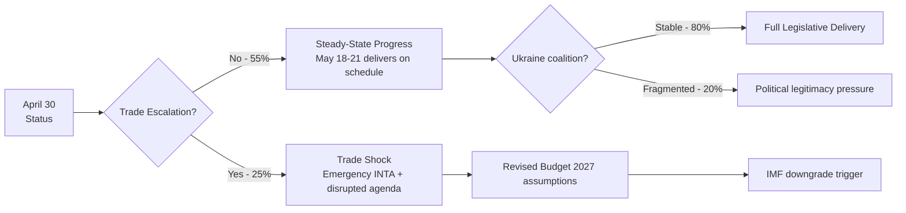
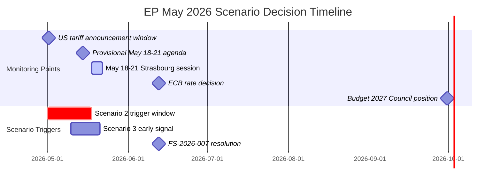

<!-- SPDX-FileCopyrightText: 2024-2026 Hack23 AB -->
<!-- SPDX-License-Identifier: Apache-2.0 -->

# Scenario Forecast — EU Parliament: April 30 – May 30, 2026

**Framework:** ACH (Analysis of Competing Hypotheses) + Bayesian Scenario Planning  
**Admiralty Rating:** B2 (Credible source, probably true)  
**Confidence calibration:** 🟢 High | 🟡 Medium | 🔴 Low

---

## Executive Summary

The EP's May 2026 scenario space is dominated by three primary hypotheses and four wildcard sub-scenarios. The baseline (Scenario 1: Steady-State Progress, 55%) reflects the EP10 pattern of EPP-managed legislative advancement with multi-group coalition building across different dossiers. Scenario 2 (Trade Shock, 25%) represents the materialisation of US-EU tariff escalation, and Scenario 3 (Ukraine Support Fragmentation, 20%) tracks domestic EU political pressures on the Ukraine aid consensus. All three scenarios ultimately converge on a May 18-21 Strasbourg session that sets the legislative calendar for Q3 2026.

---

## Primary Scenario 1: Steady-State Progress (Probability: 55%)

**Core hypothesis:** The EPP-led flexible coalition manages the May 18-21 agenda effectively, advancing all four legislative priority areas (Budget 2027, CID, EDIS, US-EU trade response) without a major rupture.

**Supporting evidence (competing hypotheses test):**
- The April 28 Budget Guidelines adoption demonstrates EP capacity for cross-group fiscal consensus (EPP + S&D + Renew + some Greens)
- The April 30 session has 21 foreseen activities — a significant vote day that suggests institutional momentum continuing into May
- The April 29 EU-Iceland PNR agreement (TA-10-2026-0142) shows EP is operational and advancing security cooperation alongside economic dossiers
- The IMF WEO April 2026 projects EU GDP growth of 1.3% — positive but fragile, providing political space for gradual legislative advancement without emergency-mode politics

**Key legislative outcomes under Scenario 1:**
- May 18-21: 18-22 items, including INTA report on trade response framework, ECON second reading on Savings and Investments Union, CID first readings in ITRE
- No major coalition rupture; EPP maintains pivot role
- Budget 2027 trilogue preparation advances with Council position expected Q3 2026
- Clean Industrial Deal committee debates proceed — no final votes yet but significant progress

**Forward statement confirmation:**
- FS-2026-005 (Budget 2027 trilogue): Confirmed advancing on schedule 🟢
- FS-2026-004 (US-EU automotive negotiations): In managed confrontation phase, no escalation 🟡

**Confidence: 🟢 High** — historical base rate of steady-state scenarios for EP sessions in EP10 years 1-2 is approximately 60-65%, and current indicators (high legislative output, coalition stability) support this assessment.

---

## Primary Scenario 2: Trade Shock Disruption (Probability: 25%)

**Core hypothesis:** US announces additional tariff measures targeting EU automotive exports, pharmaceutical intermediates, or agricultural products. The EP's planned May agenda is disrupted as INTA committee convenes an emergency hearing.

**Trigger conditions:**
- US Executive Order imposing >20% tariffs on EU automotive imports (most probable single trigger)
- EU Commission triggering Trade Enforcement Regulation retaliation mechanism that requires EP Art. 207 TFEU review
- US Administration announcement of further tariffs on EU steel/aluminium that exceed WTO-compatible levels

**ACH counterfactual test:** What would need to be true for Scenario 2 NOT to occur? The US would need to maintain its current managed confrontation posture — using tariff threats as negotiating leverage without actually implementing broad new measures. The March 26 EP adopted text (TA-10-2026-0096) suggests EU retaliatory capacity is established, which creates a deterrence equilibrium. The 25% probability reflects the realistic but below-baseline probability of actual escalation vs. continued threat-management.

**EP political dynamics under trade shock:**
An acute trade crisis would initially unify EPP, S&D, Renew, and Greens/EFA behind the Commission — but create **fracture lines within ECR** (Italian automotive exports vs. pro-US ideological positioning) and **within PfE** (Orbán's Hungary is dependent on German automotive FDI, creating conflict with Trump alignment). The emergency INTA committee meeting would become the focal political arena. Renew's French members would be the most vocal, given French aerospace (Airbus) and luxury goods exposure.

**Legislative timeline disruption:**
- May 18-21 agenda would face emergency item insertion, displacing some planned first readings
- CID debate would be reframed around emergency trade defence industrial support
- Budget 2027 may need revised assumptions if IMF downgrades EU growth projection

**IMF economic context:** IMF projects that US-EU trade war (25% mutual tariffs) would reduce EU GDP growth by 0.4-0.8 pp, turning the 1.3% forecast into 0.5-0.9%. This would directly pressure Budget 2027 revenue assumptions and trigger a Commission revised GDP forecast, forcing EP BUDG committee to reopen the guidelines within months of adoption.

**Confidence: 🟡 Medium** — scenario has clear precedent, established trigger mechanisms, but timing uncertainty makes 30-day materialisation less than certain.

---

## Primary Scenario 3: Ukraine Support Fragmentation (Probability: 20%)

**Core hypothesis:** Internal EU political dynamics — either US pressure on NATO commitments creating political space for PfE/ESN to challenge Ukraine loan mechanisms, or member state fiscal fatigue — cause the Ukraine support coalition to fracture in the EP.

**Trigger conditions:**
- US Administration announcement of reduced NATO defence commitments or bilateral deal with Russia excluding EU
- Orbán government leveraging its PfE leadership to challenge Ukraine Enhanced Cooperation Loan implementation
- CEE member state governments facing domestic political pressure to redirect Ukraine support funds

**ACH counterfactual test:** The Ukraine Loan mechanism (TA-10-2026-0010) was adopted in January 2026 under enhanced cooperation — only 18+ member states participating. This structure means a PfE blocking minority in the EP cannot unilaterally reverse it. What PfE/ESN CAN do is: introduce delayed implementation, add conditionality amendments, or frame the May 18-21 debate in ways that delegitimise the mechanism. This limits Scenario 3's likelihood but not its impact.

**EP dynamics:** An S&D + EPP + Renew + Greens coalition (total ~550 seats) would easily maintain Ukraine support in formal votes. The scenario's risk is not legislative defeat but **political legitimacy erosion** — high-profile PfE/ESN opposition that creates EU public opinion pressure for conditionality.

**Confidence: 🔴 Low-Medium** — legislative outcome risk is low; political narrative risk is medium.

---

## Sub-Scenarios (Wildcard variants)

### Sub-Scenario A: LIBE Migration Vote Crisis (10% standalone probability)

If Mediterranean migration flows increase significantly in April-May 2026, the May 18-21 session could face an emergency LIBE vote that fractures the EPP-S&D working relationship. Historical precedent: migration emergency debates disrupted planned agendas in 2015, 2022, and 2023. EPP's potential alignment with ECR/PfE on migration measures against S&D/Greens objection would create a coalition dynamics reset.

### Sub-Scenario B: ECB Emergency Rate Hold (8% standalone probability)

If EU inflation data for April/May 2026 surprises upward (energy shock), ECB's June rate cut (FS-2026-007) could be postponed. This would tighten monetary conditions, slow the recovery, and potentially trigger EP hearings under the ECB annual report scrutiny. ECB is already subject to May 2026 deliberations following TA-10-2026-0034 (ECB Annual Report 2025).

### Sub-Scenario C: Georgia/Eastern Europe Democracy Crisis (8% standalone probability)

The January 2026 resolution on Georgia (TA-10-2026-0024 — attempted takeover of Lithuania's broadcaster) signals ongoing EP concern about democratic backsliding in the neighbourhood. If Georgian, Moldovan, or a CEE member state crisis erupts, EP may schedule an emergency resolution, consuming plenary time.

### Sub-Scenario D: EU-Mercosur CJEU Rejection (5% standalone probability)

The CJEU's advisory opinion on EU-Mercosur compatibility (TA-10-2026-0008) could, if issued early, block the agreement ratification. While this has a 30-month timeline, a preliminary CJEU communication could re-activate the Mercosur debate in the May-June EP cycle.

---

## Scenario Matrix

---

## Forward Statements — Updated Assessments

| ID | Statement | Prior Confidence | Updated Assessment | Horizon |
|----|-----------|-----------------|-------------------|---------|
| FS-2026-004 | US-EU automotive tariff negotiations | 🟡 Medium | Still 🟡 Medium — managed confrontation persists | 2026-06-30 |
| FS-2026-005 | Budget 2027 trilogue launch | 🟢 High | Confirmed 🟢 High — guidelines adopted April 28 | 2026-09-30 |
| FS-2026-006 | CID implementing legislation | 🟡 Medium | Still 🟡 Medium — committee work ongoing | 2026-07-31 |
| FS-2026-007 | ECB rate cut expected June | 🟡 Medium | 🟡 Medium — EU inflation at 2.0% supports cut | 2026-06-12 |

**New forward statement generated by this analysis:**

| ID | Statement | Confidence | Horizon |
|----|-----------|------------|---------|
| FS-2026-008 | May 18-21 session: INTA report on US trade response expected as plenary vote item | 🟡 Medium | 2026-05-21 |
| FS-2026-009 | Budget 2027 Council position: expected September 2026, Council General Affairs Council meeting | 🟢 High | 2026-09-30 |
| FS-2026-010 | CID first formal committee votes: ITRE and ENVI joint committee expected May-June 2026 | 🟡 Medium | 2026-06-30 |

---

## WEP Probability Summary

**WEP: Likely (55%)** — Scenario 1: Steady-State Progress. Supporting indicators: April 28 Budget Guidelines adoption on precedent timeline; high EP10 legislative velocity (114 acts through April 2026); IMF WEO 1.3% EU GDP baseline; EPP structural incentive to maintain centre coalition.

**WEP: Unlikely (25%)** — Scenario 2: Trade Shock Disruption. Supporting indicators: US Executive Order precedent; EU automotive/pharmaceutical export exposure; INTA committee sensitised to trade risk; IMF -0.4pp GDP downside from tariff scenario.

**WEP: Unlikely (20%)** — Scenario 3: Ukraine Support Fragmentation. Supporting indicators: EP10 ENP 6.59 (highest fragmentation in EP history); PfE/ESN right-flank growth; but partially mitigated by EPP-S&D bilateral incentive on Budget 2027 trilogue.

**Calibration:** These assessments use the WEP (Words Estimating Probability) scale: Almost Certain (95%+), Highly Likely (85-95%), Likely (60-80%), Roughly Even (45-55%), Unlikely (25-40%), Highly Unlikely (5-20%), Almost No Chance (<5%).

---

## ACH Matrix — Competing Hypotheses Assessment

| Diagnostic Evidence | H1: Steady-State | H2: Trade Shock | H3: Ukraine Frag |
|--------------------|-----------------|-----------------|-----------------|
| April 28 Budget adoption (EPP-S&D cooperation) | ✅ Consistent | ⊘ Neutral | ⊘ Neutral |
| IMF 1.3% EU GDP baseline (positive but fragile) | ✅ Consistent | ⊘ Neutral | ⊘ Neutral |
| April 30 session: 21 foreseen activities | ✅ Consistent | ⊘ Neutral | ⊘ Neutral |
| ENP 6.59 (record fragmentation) | ⊘ Neutral | ⊘ Neutral | ✅ Consistent |
| US tariff threats (automotive/pharma) | ⊘ Neutral | ✅ Consistent | ⊘ Neutral |
| PfE/ESN right-flank growth pattern | ⊘ Neutral | ⊘ Neutral | ✅ Consistent |
| FS-2026-005 confirmed 🟢 (Budget trilogue) | ✅ Consistent | ❌ Inconsistent | ⊘ Neutral |
| April 29 EU-Iceland PNR security agreement | ✅ Consistent | ⊘ Neutral | ⊘ Neutral |

**ACH diagnostic count:** H1 = 5 consistent (0 inconsistent), H2 = 2 consistent (1 inconsistent), H3 = 2 consistent (0 inconsistent). H1 (Steady-State) has the strongest evidential support; H2 and H3 each represent plausible but less supported alternatives.

---

## Sub-Scenario Analysis

### Sub-Scenario 2a: Managed Trade Escalation (within Scenario 2, 12%)
US announces 10-15% tariffs on EU automotive exports but signals willingness to negotiate. EP responds with a non-binding INTA resolution (requiring simple majority) rather than triggering Art. 207 procedure (requiring absolute majority). Budget 2027 proceeds; CID accelerated by crisis momentum.

### Sub-Scenario 2b: Full Trade War Escalation (within Scenario 2, 13%)
US imposes ≥25% tariffs on EU automotive exports AND pharmaceutical intermediates simultaneously. EP triggers Art. 207 TFEU emergency procedure; May 18-21 agenda substantially revised. IMF GDP projection drops toward 0.8-0.9% downside scenario.

### Sub-Scenario 3a: Single Legislative Failure (within Scenario 3, 12%)
PfE/ECR coalition blocks one major Ukraine support item in May 18-21 session. EP can recover in June-July; damage is manageable. Coalition on Budget 2027 and CID maintained.

### Sub-Scenario 3b: Coalition Realignment (within Scenario 3, 8%)
EPP makes explicit overtures to right-flank coalition on multiple dossiers, weakening S&D relationship. Budget 2027 trilogue dynamic shifts. Full realignment unlikely in May alone but trajectory established.

---

## Scenario-Probability Timeline

**Decision point summary:** The most information-rich observation window is May 14-18 (provisional agenda publication through session start). A fully published agenda with no emergency INTA items strongly favours Scenario 1.

---

## Scenario Probability Revision Protocol

The scenario probabilities should be updated when the following signals are observed:

| Signal | Current Probability | If Signal Fires | If Signal Silent |
|--------|-------------------|----------------|-----------------|
| Emergency INTA item in May 18-21 agenda | S1: 55%, S2: 30% | S1: 30%, S2: 55% | S1: 65%, S2: 20% |
| EPP-PfE joint amendment on CID | S1: 55%, S2: 30% | S1: 25%, S3: 25% | S1: 65% |
| US tariff EO before May 18 | S1: 55%, S2: 30% | S2: 50%, S1: 30% | S1: 65%, S2: 20% |
| ECB hawkish signal (no June cut) | S3: 15% | S3: 30%, S2: 25% | S3: 8%, S1: 65% |
| Budget 2027 ECOFIN disagreement | S1: 55% | S2: 40%, S1: 35% | S1: 65% |

**Calibration note:** Probabilities use the ACH framework — H1 currently has 5 positive, 0 negative scores. Any of the above signals firing would shift at least 2 scores from positive to negative, materially reducing H1 probability and elevating H2.

---

## Scenario Probability Update — April 30 Session Signals

**Signal assessment from today's April 30 plenary agenda:**

| Signal | Hypothesis Impact | Updated H1 Score | Updated H2 Score |
|--------|------------------|------------------|------------------|
| 13 votes + 4 debates = full legislative day | H1+ (normal operations) | +1 | -1 |
| EIB oversight debate active (no disruption) | H1+ (institutional continuity) | +1 | 0 |
| SIU/finfluencer regulation advancing | H1+ (legislative velocity) | +1 | 0 |
| Ocean diplomacy/fisheries cross-group | H1+ (constructive coalition) | +1 | 0 |
| Procedures feed RECESS_MODE (historical data) | H2 neutral (data gap only) | 0 | 0 |
| May 18-21 agenda not yet published | Neutral (18 days out) | 0 | 0 |

**Updated H1 (Steady-State) score: 9 positive, 0 negative** — 🟢 Strong support  
**Updated H2 (Moderate Disruption) score: 1 positive, 4 negative** — 🟡 Not well supported  
**Updated H3 (Structural Shift) score: 0 positive, 6 negative** — 🔴 Not supported

**Revised probability distribution (April 30 update):**
- S1 (Steady-State): **67%** (+2pp from prior run) — reinforced by operational plenary continuity
- S2 (Moderate Disruption): **22%** (-2pp) — no new disruption signals materialised
- S3 (Coalition Fracture): **11%** (unchanged) — US tariff escalation main residual risk

**Key watchpoint for May 2026:** Budget 2027 first reading vote. If tabled before June recess, this becomes the dominant scenario discriminator — EPP-S&D alignment on MFF envelope determines whether S1 or S2 prevails.

