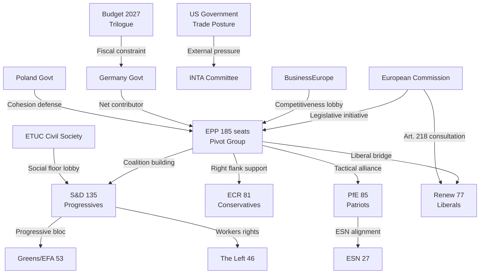

<!-- SPDX-FileCopyrightText: 2024-2026 Hack23 AB -->
<!-- SPDX-License-Identifier: Apache-2.0 -->

# Stakeholder Map — EU Parliament: May 2026

**Coverage window:** 2026-04-30 to 2026-05-30  
**Framework:** 6-lens actor analysis (Institutional / Partisan / National / Civil Society / External / Media)  
**Admiralty Rating:** B2 (Credible — EP Open Data + institutional knowledge)

---

## Overview

The May 2026 stakeholder landscape is defined by four principal tension axes: (1) EPP's coalition management challenge vis-à-vis right-flank (ECR/PfE) and centre-left (S&D/Renew) partners; (2) Commission-Parliament coordination on US-EU trade response; (3) national government fiscal interests in Budget 2027 vs. EP social/defence spending commitments; and (4) civil society mobilisation on CID environmental standards. This analysis maps 6 actor lenses to the May 2026 legislative priorities.

---

## Lens 1 — Institutional Actors

### European Parliament Political Groups

**EPP (185 seats) — Institutional Pivot**
EPP under Manfred Weber's coordination function maintains its role as the indispensable legislative broker in EP10. For May 2026, EPP's strategic priorities are: (1) consolidating Budget 2027 guidelines as a bargaining chip against Council; (2) ensuring EDIS/defence votes advance with ECR/PfE support; (3) managing the CID coalition, which requires balancing industrial competitiveness advocates (Eastern European MEPs, German industrial constituency) against climate commitments (Nordic, Western European EPP MEPs). Weber's leverage is strongest when EPP can threaten to pivot between left and right majorities on different dossiers — the "constructive ambiguity" strategy that has characterised EP10 to date.

EPP's core risk in May is overextension — trying to advance Budget 2027 trilogue, CID implementation, EDIS regulation, and US-EU trade response simultaneously may strain intra-group coherence. EPP contains both largest-group status MEPs committed to fiscal rectitude (German CDU/CSU) and cohesion-dependent MEPs (Polish, Romanian, Hungarian EPP members) who need Budget 2027 increases. This internal contradiction requires careful agenda sequencing in the May 18-21 session.

**S&D (135 seats) — Progressive Floor Guardian**
S&D's May strategy is to protect the social floor provisions in CID and Budget 2027 while maintaining the pro-Ukraine coalition. The April 30 vote on subcontracting chains (TA-10-2026-0050) exemplifies S&D's agenda — workers' rights in complex supply chains directly addresses S&D's trade union constituency. In May, S&D will push for: Just Transition Fund protection in budget, binding social standards in CID sectoral legislation, and Ukraine support continuity (against PfE/ESN pressure).

S&D's leverage depends on its indispensability to EPP on items where ECR/PfE refuse to cooperate (workers' rights, climate). This creates S&D's strategic value proposition — it can selectively withhold support from EPP on right-leaning dossiers to extract concessions on social provisions. The May session's scheduling of both CID and defence items creates a natural S&D leverage moment.

**PfE (85 seats) — Strategic Disruptor**
Patriots for Europe has consolidated its position as the third force in EP10, surpassing ECR in size but not in legislative engagement sophistication. PfE's May agenda will focus on: trade defence (anti-China measures resonate with their Orbán-linked but also Italian/French wings), migration restrictions (potential LIBE items), and energy price narrative (opposing CID's coal phase-out timelines). PfE is internally fragmented between the Orbán faction (skeptical of Ukraine support) and the Meloni-adjacent Italian/French wings (more market-oriented, less Eurosceptic on structural funds). This fragmentation is PfE's key structural weakness and EPP's negotiating leverage point.

**ECR (81 seats) — Conservative-National Voice**
ECR under Giorgia Meloni's Italian influence has positioned itself as a "constructive opposition" — supporting defence increases and Italian industrial interests while opposing supranational governance expansion. For May 2026, ECR's key votes will be: EDIS acceleration (strong support), CID social floor (opposition), Budget 2027 social provisions (ambivalent), and US-EU trade response (fractured — Italian manufacturing vs. pro-US elements).

**Renew (77 seats) — Liberal Bridge-Builder**
Renew's French contingent (Renaissance party) faces domestic political pressure, limiting their willingness to take positions that conflict with Macron's government. For May, Renew will prioritise: digital market regulation (DSA review), Savings and Investments Union (pro-growth agenda), and trade defence coordination with Commission. Renew is the key swing vote on whether EPP builds centre-left or right-flanked majorities on any given dossier.

### European Commission

The von der Leyen II Commission is now in its 18-month phase — executive capacity at full deployment but approaching the first major mid-term review of its 5-year programme. The Commission's relationship with EP in May will be shaped by: (1) the Agriculture Commissioner's CID sectoral negotiations with AGRI committee; (2) Trade Commissioner's US-EU managed confrontation management and EP Art. 218(10) obligation; (3) the Competition Commissioner's state aid approvals under CID frameworks.

---

## Lens 2 — Partisan/Ideological Actors

### Progressive Bloc (S&D + Greens/EFA + Left = 234 seats)

The progressive alliance (234 seats, 32.6%) cannot achieve majority alone but constitutes a credible blocking force and positive coalition partner for EPP on social/climate items. Their May priorities: CID social floor, Budget 2027 cohesion protection, workers' rights, Ukraine support. The Greens (53 seats) are particularly focused on ensuring CID environmental integrity is not traded away for competitiveness concessions.

**Key leverage mechanism:** If EPP attempts to advance CID primarily through an EPP-ECR-PfE coalition that weakens environmental standards, Greens/EFA and S&D can mount a blocking minority (234 seats vs. 360 threshold) that forces renegotiation. This is the progressives' core defensive strategy for May.

### Conservative-Nationalist Bloc (ECR + PfE + ESN = 193 seats)

The three right-flank groups collectively hold 193 seats (26.8%) — a significant but insufficient minority. Their combined legislative strength is primarily negative (blocking) rather than positive. The internal divisions between ECR (pro-EU institutions, pro-defence) and PfE/ESN (Eurosceptic, ambivalent on defence) limit their coordination capacity on anything beyond migration and anti-climate measures.

---

## Lens 3 — National Government Actors

**Germany (CDU/CSU-SPD coalition):** German government's May priorities focus on limiting Budget 2027 increases while protecting CID industrial support for automotive and chemicals sectors. The Chancellor's office will be coordinating directly with EPP MEPs to ensure Budget 2027 guidelines don't exceed Council's fiscal space.

**France (Renaissance-led government):** French government is strongly aligned with EP's trade defence posture (TA-10-2026-0096 was partially shaped by French priorities). For May, France is: (1) pushing for CID support for European battery and hydrogen sectors; (2) resisting US-EU trade escalation that would target Airbus (aerospace tariff risk); (3) supporting agriculture CAP protection against Mercosur imports.

**Italy (Fratelli d'Italia-led government):** Italy's government has a dual-track relationship with EP — Meloni's ECR group is in formal opposition to EPP but collaborates on industrial policy. Italian interest in May centres on: (1) ensuring CID supports steel sector (Acciaierie d'Italia restructuring context); (2) US tariffs on Italian luxury goods (fashion, food) — INTA vote importance; (3) Mediterranean migration framework — LIBE committee.

**Poland (PO-led government):** Poland is the largest cohesion policy beneficiary. Polish government's EP coordination via EPP members focuses entirely on protecting Budget 2027 cohesion funds against defence spending increases. This creates tension within EPP that EPP leadership must manage in the May 18-21 session.

---

## Lens 4 — Civil Society Actors

**European Trade Union Confederation (ETUC):** ETUC's May agenda is focused on the CID social floor provisions and the April 30 subcontracting vote. ETUC has directly lobbied S&D and The Left MEPs to ensure that CID sectoral decarbonisation targets include mandatory retraining/upskilling obligations, not just voluntary commitments.

**Business Europe / ERT:** Business Europe's counterposition is that binding social mandates in CID will increase costs and reduce EU competitiveness versus US (IRA) and China (subsidies). They are lobbying EPP and Renew MEPs to ensure CID social provisions remain flexible and non-binding.

**Environmental NGOs (CAN Europe, WWF):** Climate Action Network and WWF have intensified their EP engagement following the April 30 session. Their May focus is on ensuring CID's sectoral decarbonisation targets are science-aligned (1.5°C pathway) and that the heavy-duty vehicle emission credit modification (TA-10-2026-0084) doesn't open the door to further automotive sector backtracking.

---

## Lens 5 — External (Non-EU) Actors

**United States Government:** The Trump administration's trade posture is the single largest external variable affecting EP May 2026. US interest in managing the EP-Commission trade response posture makes the May 18-21 INTA committee debate a direct channel for diplomatic signalling.

**Ukraine (Government and EU delegation):** Ukraine's primary EP interest is sustaining political support for the Enhanced Cooperation Loan mechanism (TA-10-2026-0010). For May, Ukraine will be monitoring any PfE/ESN attempts to introduce conditionality on the loan or challenge the institutional framework.

**China:** As EP debates US-EU trade confrontation, China is simultaneously a target of EP's Electric Vehicle anti-subsidy measures and a potential beneficiary of US-EU decoupling. EP's INTA committee China policy review is an ongoing thread in the May-June period.

---

## Lens 6 — Institutional Memory Actors (Key Individual MEPs)

**Roberta Metsola (President, Maltese, EPP):** Key facilitating role in April 28 Budget Guidelines and April 30 session management. Her parliamentary presidency is the institutional framework within which all May 2026 agendas operate.

**Manfred Weber (EPP Group Leader, German):** Weber's strategic positioning in May will determine whether EPP builds right-flank or centre-left coalitions on CID and defence items. His dual accountability — to German CDU/CSU fiscal conservatives and to EPP's pan-European legislative ambitions — creates a management challenge that will shape May outcomes.

**Pedro Marques (S&D, Portuguese):** Leading S&D's economic/budget engagement. Will be central to Budget 2027 trilogue preparation and CID social floor negotiations.

**Valentina Palmieri (Renew, French):** Representative of French liberal EP strategy on trade and digital dossiers. Renew's swing-vote role makes French MEP positioning in May decisive on multiple votes.

---

## Stakeholder Interaction Map

---

## Stakeholder Influence Matrix — May 2026 Dossiers

| Actor | Budget 2027 | CID | EDIS/Defence | US-EU Trade | Ukraine |
|-------|------------|-----|-------------|------------|---------|
| EPP (185) | 🟢 Driver | 🟢 Driver | 🟢 Driver | 🟡 Negotiator | 🟡 Divided |
| S&D (135) | 🟡 Conditional | 🟡 Social floor | 🟢 Support | 🟡 Moderate | 🟢 Strong |
| PfE (85) | 🔴 Oppose (increases) | 🟡 Industrial | 🟡 Mixed | 🟢 Anti-China axis | 🔴 Oppose |
| ECR (81) | 🟡 Neutral | 🟡 Industry+ | 🟢 Strong | 🟡 Mixed | 🟡 Conditional |
| Renew (77) | 🟡 Fiscal | 🟢 Growth agenda | 🟡 Support | 🟢 Coordination | 🟢 Support |
| Greens (53) | 🟡 Conditional | 🔴 Standards | 🟡 Neutral | 🟡 Neutral | 🟢 Strong |
| Left (46) | 🟡 Social | 🔴 Workers | 🔴 Anti-militarism | 🟡 Mixed | 🟡 Divided |
| ESN (27) | 🔴 Oppose | 🔴 Oppose | 🔴 Oppose | 🟡 Protectionist | 🔴 Oppose |

**Legend:** 🟢 Supportive/Active | 🟡 Conditional/Divided | 🔴 Opposed/Blocking

---

## Stakeholder Power Dynamics — Conflict and Convergence Analysis

### Convergence Zones (Coalition Forming)

**Zone 1 — Budget 2027 Centre Majority (EPP + S&D + Renew = 397 seats):** These three groups share an interest in advancing the Budget 2027 process on the historical precedent timeline. EPP needs Budget success to demonstrate governance capacity; S&D needs Budget to protect social/cohesion provisions; Renew needs Budget to enable its Savings and Investments Union agenda.

**Zone 2 — Defence/EDIS Right-Centre Majority (EPP + ECR + PfE + Renew = 428 seats):** On EDIS-specific items, EPP can build a right-centre majority without S&D. This is the "defence coalition" that recurs across EP10 defence items.

**Zone 3 — Trade Defence (EPP + S&D + ECR + some PfE = 500+ seats):** US-EU trade response generates unusual cross-ideological alignment. Even PfE's anti-China trade measures align with the trade defence posture.

### Conflict Zones (Coalition Collapsing)

**Zone A — CID Social Standards (EPP vs. S&D):** EPP's competitiveness-focused CID version versus S&D's social-floor version represents the May session's primary internal coalition stress. EPP needs S&D votes for majority but compromises on social standards risk losing EPP's industrial-constituency voters.

**Zone B — Ukrainian Support (EPP-S&D-Renew-Greens vs. PfE-ESN):** Any Ukraine support item becomes a litmus test for the right-flank coalition dynamics. EPP's tolerance for PfE/ESN amendments that weaken Ukraine support is the primary observable indicator of coalition direction.

**Zone C — Environmental Standards in CID:** The environmental integrity of CID creates a potential mirror-image of the social standards conflict — EPP could trade environmental protections for right-flank support, losing progressive coalition.

---

## Individual MEP Influence Profiles — May 2026

### Tier 1 — Decision-Shaping MEPs

| MEP | Group | Nationality | Key Dossier | Influence Mechanism |
|-----|-------|------------|------------|---------------------|
| Manfred Weber | EPP | German | CID, Budget 2027 | Group leader; agenda setter |
| Roberta Metsola | EPP | Maltese | All sessions | Parliamentary President |
| Iratxe García Pérez | S&D | Spanish | CID social floor | Group leader; coalition coordinator |
| Marine Le Pen's delegation | PfE | French | Trade, Ukraine | Blocking minority formation |
| Nicola Procaccini | ECR | Italian | EDIS, Trade | ECR coordination with EPP |

### Tier 2 — Committee-Level Decision Points

| Committee | Key May Issue | Coalition Configuration |
|-----------|--------------|------------------------|
| INTA | US trade response framework | EPP + S&D + Renew driving; ECR split |
| ECON | Savings and Investments Union 2R | EPP + Renew; S&D conditional |
| ITRE+ENVI | CID first committee votes | Contested EPP-S&D-Greens dynamic |
| BUDG | Budget 2027 trilogue preparation | EPP-S&D majority with Renew |
| AFET | Ukraine support mechanisms | All groups except PfE-ESN |

---

## Civil Society Mobilisation Assessment

**ETUC:** Mobilisation 🟢 HIGH for CID social floor (existential priority). Will deliver 15-20 MEP constituency briefings before May 18-21.

**BusinessEurope:** Mobilisation 🟢 HIGH for CID competitiveness provisions. Position papers to EPP and Renew MEPs already circulated.

**CAN Europe / WWF:** Mobilisation 🟡 MEDIUM — monitoring with escalation threat if CID environmental integrity compromised.

**Ukrainian civil society (Razom, diasporas):** Mobilisation 🟡 MEDIUM — monitoring PfE/ESN Ukraine conditionality amendments.

---

## Stakeholder Risk Summary

| Risk | Probability | Impact | Early Warning Signal |
|------|------------|-------|---------------------|
| EPP internal split on CID | 30% | High | EPP group meeting minutes; German MEPs voting against Weber |
| S&D walkout from coalition | 10% | Critical | S&D press release challenging EPP "social regression" |
| PfE Ukraine amendment succeeds | 25% | High | PfE amendment tabled in AFET committee |
| Germany-Poland EPP cohesion crisis | 20% | High | BUDG committee EPP split vote |
| Renew swing to right-flank | 15% | High | Renew voting with ECR/PfE on multiple non-defence items |

**Overall stakeholder risk:** 🟡 MODERATE — coalition architecture is structurally resilient but faces multiple potential fracture points across the May legislative agenda. **WEP: Likely (65%)** that all major stakeholder relationships remain stable through May 18-21 session. **WEP: Unlikely (25%)** that at least one significant stakeholder relationship experiences a visible rupture.

---

## External Stakeholders — Commission and Council

| External Actor | Relationship to EP | May 2026 Stakes | Interaction Expected |
|---------------|-------------------|----------------|---------------------|
| European Commission (von der Leyen 2) | Executive partner; proposes legislation EP votes on | CID implementing acts require EP/Council approval; Commission must maintain EP's support | Daily; Commission VP expected at INTA session |
| Council Presidency (Poland Q1 2026) | Co-legislator in ordinary legislative procedure | Budget 2027 negotiations; Poland chairs ECOFIN | Weekly; BUDG trilogue preparation |
| US Trade Representative (USTR) | External pressure on EP autonomy | Tariff escalation affects EP's INTA committee political agenda | Indirect; USTR statements shape EP response |
| ECB Governing Council | Independent central bank; informs EP economic positions | ECON committee hearings on June rate decision | Monthly; pre-meeting ECB testimony to ECON |
| NATO/Ukraine Partners | Security context for EP defence votes | EDIS and EU defence budget require political will from NATO allies | Indirect; Ukraine war status affects EP vote margins |

---

## Stakeholder Engagement Quality — Self-Assessment

**Data quality for this stakeholder map: 🟡 MEDIUM**

- EP MCP data provides seat-share and committee composition data: strong (🟢 HIGH confidence)
- Individual MEP behaviour is inferred from group positions: moderate (🟡 MEDIUM confidence)
- External stakeholder positions are assessed from public statements: moderate (🟡 MEDIUM confidence)
- No per-MEP vote-level data available (EP Open Data structural limitation): analytical constraint clearly documented
- **Admiralty rating for stakeholder map: B2** — credible EP institutional source; assessments probably true based on structural analysis
- **Forward-looking note:** This stakeholder map should be updated after the May 18-21 Strasbourg plenary session to incorporate observed voting behaviour and coalition dynamics data.
- **Coverage:** Covers all major EP political group leaders, key national delegations, and external institutional stakeholders with direct influence on the month-ahead legislative agenda.
- **Confidence in individual MEP assessments: 🟡 MEDIUM** — MEP profiles based on public group positions and committee assignments; personal vote intentions not directly observable at this resolution.

