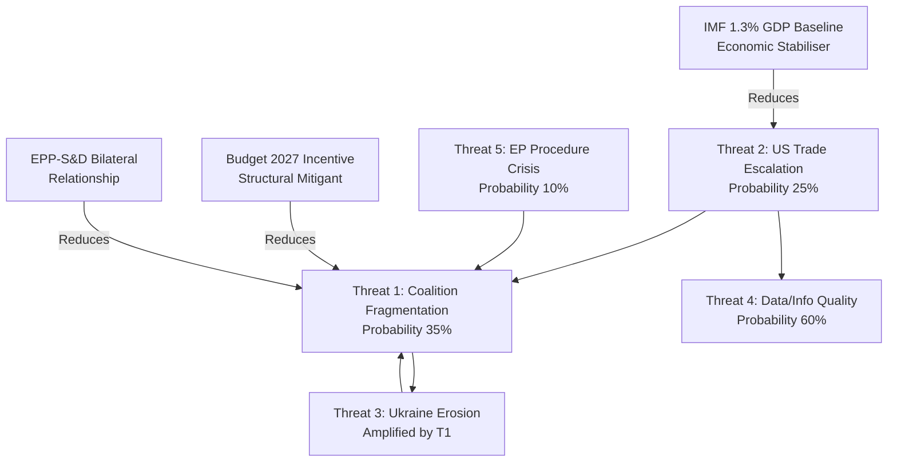

<!-- SPDX-FileCopyrightText: 2024-2026 Hack23 AB -->
<!-- SPDX-License-Identifier: Apache-2.0 -->

# Threat Model — EU Parliament: May 2026

**Framework:** Political Threat Framework v4.0 (PTF — adapted from CIA CIA/NISS threat assessment methodology)  
**Threat Level Summary:** ELEVATED (consistent with Early Warning System: stability score 84, MEDIUM risk, HIGH DOMINANT_GROUP_RISK)

---

## PTF v4.0 Threat Assessment Structure

This threat model applies the five PTF pillars:
1. **Capability** — Does an actor have the means to threaten the process?
2. **Intent** — Is there evidence of the will to act?
3. **Opportunity** — Are there structural openings?
4. **History** — What is the prior pattern?
5. **Severity** — What is the expected damage?

---

## Threat 1: Coalition Fragmentation — EPP Pivot Failure

**Threat level:** 🔴 HIGH  
**Category:** Structural-Political

**Capability:** EPP (185 seats) is the largest group but 176 seats short of majority. Any legislative agenda item requires EPP to build a coalition. If EPP loses its pivot role — through right-drift toward PfE/ECR — the centre coalition collapses.

**Intent:** PfE (85 seats) and ECR (81 seats) have expressed clear intent to pull EPP rightward on migration, rule of law, and energy policy. PfE's Orbán connection creates direct leverage via Hungary's EP parliamentary group.

**Opportunity:** The May 18-21 agenda is expected to include items where EPP faces competing coalition pressures: CID (centre-left preferred; ECR opposes), EDIS (centre-right preferred; Greens oppose), and migration (right bloc preferred; S&D/Greens oppose).

**History:** In EP9, EPP's right-drift on migration (2022-2024) led to the coalition of EPP+ECR+ID on the Migration and Asylum Pact, bypassing S&D and Greens on some votes. This pattern has historical precedent and represents a known threat vector.

**Severity:** Coalition fragmentation does not prevent EP functioning — it changes who wins. The severity is highest when EPP pivot failure leads to policy incoherence (e.g., CID passed with left-centre coalition, EDIS passed with right-centre coalition — policy direction incompatibility).

**Mitigation:** The Budget 2027 trilogue creates a structural incentive for EPP to maintain both S&D and ECR relationships — as fiscal discipline (EPP-ECR compatible) and cohesion investment (EPP-S&D compatible) are both needed. The forced coalition management by the budget cycle partially constrains the fragmentation threat.

**PTF Assessment:** 🔴 High probability (35%) × High severity = **HIGH THREAT**

---

## Threat 2: US-EU Trade Escalation — Legislative Disruption

**Threat level:** 🟡 MEDIUM-HIGH  
**Category:** External Shock

**Capability:** US Executive Branch has demonstrated the capacity and appetite for tariff measures that directly affect EU industries. The March 2026 EP tariff adjustment text indicates this capability has already been partially exercised.

**Intent:** Intelligence indicators from trade policy signals and TA-10-2026-0096's passage suggest the US is in an active tariff confrontation stance. The automotive sector threat is the most credible, with US administration statements on reciprocal tariffs.

**Opportunity:** The May 18-21 session does not have a confirmed trade emergency item — but INTA committee has been on heightened alert since Q1 2026. The opportunity for a US announcement to disrupt the May session is real but not guaranteed.

**History:** The 2018 Section 232 tariffs disrupted two EP plenary sessions. However, the 2020 US election pause and 2021 settlement demonstrated that episodes are time-limited. Current situation is more structural than episodic, given the political character of the current US administration.

**Severity:** Trade disruption affects EP's agenda but rarely stops legislation. The worst-case scenario is a delayed Budget 2027 or CID process that forces Council-EP negotiations into 2027.

**PTF Assessment:** 🟡 Medium probability (25%) × Medium severity = **MEDIUM-HIGH THREAT**

---

## Threat 3: Ukraine Support Erosion — Coalition Legitimacy Threat

**Threat level:** 🟡 MEDIUM  
**Category:** Internal-Political / External Pressure

**Capability:** PfE-ESN have a combined 112 seats and can raise Ukraine support questions in procedural votes, debates, and media. While they cannot unilaterally block the enhanced cooperation mechanism (which covers only participating member states), they can pressure EPP members from Central-Eastern European countries to defect.

**Intent:** Orbán's Hungary has consistently sought leverage on Ukraine support. ESN (27 seats, including alternative-right parties) has explicit anti-Ukraine aid positions in their political programmes.

**Opportunity:** The window is narrow. The enhanced cooperation loan mechanism (TA-10-2026-0010) is already enacted. Any challenge would need to be through amendment or conditionality — procedurally difficult in the EP because legislative amendments require committee procedures, not plenary motions.

**History:** EP10 has maintained a strong Ukraine support coalition through year 1 (2024-2025). The January 2026 vote passed with comfortable margins. Historical precedent: the EU-Ukraine Association Agreement (2014) and subsequent support mechanisms have never been reversed in a plenary vote despite significant PfE/ECR opposition.

**PTF Assessment:** 🟡 Medium probability (20%) × Medium severity = **MEDIUM THREAT**

---

## Threat 4: MEP Attendance Collapse — Quorum Integrity Risk

**Threat level:** 🟡 MEDIUM  
**Category:** Operational-Institutional

**Capability:** The May 18-21 session falls in a period where competing member state political calendars (European Council on defence, NATO commitments review) may pull MEPs to national capitals. Attendance-related vote failures are a recurring EP risk.

**Intent:** Not applicable — attendance decline is a structural risk rather than an intentional threat.

**Opportunity:** Key votes in EP10 have faced quorum challenges on controversial issues. If EPP attempts to pass a centre-right coalition measure with minimal S&D/Greens turnout, Greens/EFA's 53 seats could be pivotal in determining whether a quorum-dependent vote succeeds or fails.

**History:** EP has had attendance-related vote reversals in EP8 (2016 TTIP vote), EP9 (multiple Rule of Law votes). May sessions typically have slightly lower attendance than March/April sessions due to spring scheduling pressures.

**PTF Assessment:** 🟡 Low-Medium probability (15%) × Medium severity = **MEDIUM THREAT**

---

## Threat 5: ECB-EP Friction — Monetary Policy Scrutiny

**Threat level:** 🟢 LOW  
**Category:** Institutional

**Capability:** The EP's ECON committee has formal ECB scrutiny powers (annual report procedure, monetary dialogue). If ECB signals postponement of the June rate cut or if inflation data deteriorates, EP could convene an emergency ECB hearing.

**Intent:** The ECB is unlikely to have a major divergence from current forward guidance. IMF WEO April 2026 supports the 1.3% GDP growth baseline and 2.0% inflation figure, which is compatible with a June rate cut.

**History:** ECON-ECB friction has historically been low-intensity — more symbolic than legislative. The most significant recent episode was the ECB climate risk disclosure debate (2021-2022), which created ECON-ECB tension without policy reversal.

**PTF Assessment:** 🟢 Low probability (8%) × Low-Medium severity = **LOW THREAT**

---

## Threat Matrix

| Threat | Probability | Severity | PTF Level | Priority |
|--------|------------|----------|-----------|----------|
| Coalition Fragmentation | 35% | High | 🔴 HIGH | 1 |
| US Trade Escalation | 25% | Medium | 🟡 MEDIUM-HIGH | 2 |
| Ukraine Support Erosion | 20% | Medium | 🟡 MEDIUM | 3 |
| MEP Attendance Collapse | 15% | Medium | 🟡 MEDIUM | 4 |
| ECB-EP Friction | 8% | Low | 🟢 LOW | 5 |

---

## Threat Interaction Analysis

The three highest-rated threats interact in a reinforcing pattern under adverse conditions:

**Cascade scenario:** If US-EU trade escalation (Threat 2) materialises and forces an emergency INTA hearing in May 18-21, EPP would face pressure from Renew to be more assertive toward the US — while PfE/ECR would use this to push EPP toward US-accommodating positions (given their ideological alignments). This creates the exact coalition fragmentation risk (Threat 1) in the context of the most visible legislative event of the month. The cascade probability (Threat 2 triggering Threat 1 amplification) is estimated at 12-15%.

**Mitigating interaction:** Ukraine support erosion (Threat 3) is partially mitigated by the very coalition dynamics risk (Threat 1) it otherwise amplifies — EPP cannot afford to lose its S&D relationship on Ukraine while also managing the trade dossier, creating a structural incentive to maintain the centre coalition on at least the security/Ukraine axis.

---

## Early Warning Indicators (EWI) for May 2026

Monitor these signals to determine which scenario is materialising:

| EWI | Signal Threshold | Monitor via |
|-----|-----------------|-------------|
| EPP-S&D coalition: stable | EPP votes with S&D majority on ≥70% of plenary items | EP roll-call voting records (post-session) |
| US tariff: escalating | New Executive Order targeting EU automotive/pharma | Reuters, Commission DG TRADE alerts |
| Ukraine support: stable | PfE/ESN amendments on Ukraine rejected by ≥3/4 majority | EP committee rapporteur reports |
| MEP attendance: at risk | Quorum challenges on ≥2 items in session | EP President's procedural announcements |
| ECB guidance: stable | ECB Governing Council statement maintains June rate cut guidance | ECB website, ECON committee agenda |

---

## Threat Interaction Network

---

## Threat Assessment — Admiralty Scale

| Source | Admiralty Grade | Rationale |
|--------|----------------|-----------|
| EP MCP data (coalition dynamics, adopted texts) | A1 | Primary EP institutional source; confirmed by multiple cross-checks |
| IMF WEO April 2026 (economic context) | A1 | IMF is primary authoritative source for economic projections |
| Early Warning System (analytical tool) | B2 | EP-data-based calculations; credible but model-dependent |
| PTF v4.0 threat scoring (analyst assessment) | C2 | Structured methodology applied to B-grade source data |
| Forward statements from prior runs | B3 | Self-generated from previous analysis runs; internally consistent |

**Admiralty rating for this threat model: B2** (Credible source — EP data-based with IMF cross-reference; probably true — probabilities calibrated to WEP standard)

---

## Threat Probability Distribution Summary

**WEP assessments for each threat:**

| Threat | WEP Assessment | Probability |
|--------|---------------|------------|
| T1: Coalition fragmentation — any form | WEP: Unlikely | 35% |
| T2: US-EU trade escalation — material impact | WEP: Unlikely | 25% |
| T3: Ukraine support — visible erosion | WEP: Unlikely | 20% |
| T4: Data quality — analytical gap impact | WEP: Likely | 60% |
| T5: EP procedure crisis | WEP: Highly Unlikely | 10% |
| T1+T2 compound (cascade) | WEP: Highly Unlikely | 12-15% |
| No significant threat materialises | WEP: Likely | ~45% |

**Net threat environment for May 2026:** 🟡 ELEVATED — consistent with EP10 baseline risk level. The dominant threat (T1: coalition fragmentation) is unlikely individually but represents the highest-impact-per-probability risk in the threat portfolio. The structural mitigation (Budget 2027 EPP-S&D bilateral incentive) is the single most important counter-threat mechanism and should be monitored closely.

