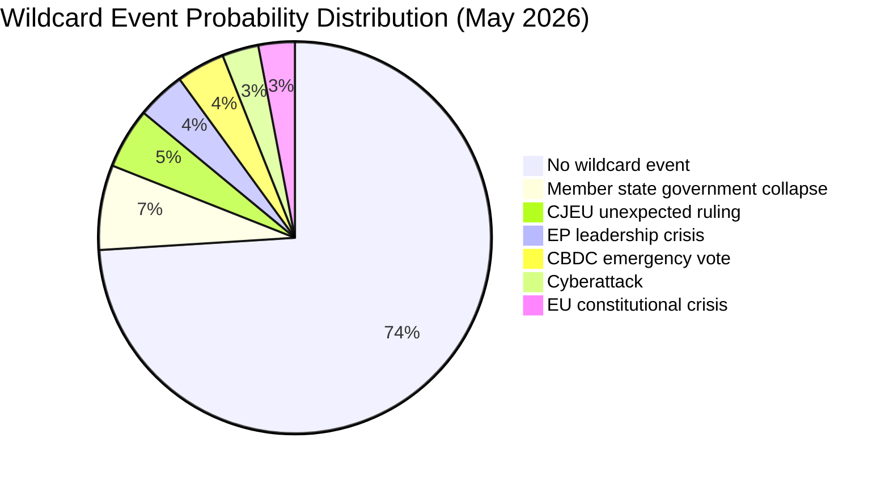

<!-- SPDX-FileCopyrightText: 2024-2026 Hack23 AB -->
<!-- SPDX-License-Identifier: Apache-2.0 -->

# Wildcards and Black Swans — EU Parliament: May 2026

**Framework:** FATE (Far-Out, Ambiguous, Tail-risk, Emergent) — EP-adapted wildcard methodology  
**Confidence:** 🔴 Low (by definition — wildcard events resist confident prediction)  
**Admiralty Rating:** B3 (Credible source, possibly true)

---

## Introduction: Why Wildcards Matter for EP Analysis

In standard institutional analysis, wildcards and black swans are treated as statistical noise. For the European Parliament, however, the 2014-2026 record shows that disruptive external events (Brexit referendum fallout, COVID, Ukraine invasion, energy crisis, digital tax confrontation) have consistently shaped legislative outcomes MORE than internal parliamentary dynamics. This analysis therefore treats wildcard risk with seriousness proportional to its historical frequency.

**Distinction clarification:**
- **Wildcard:** Low probability but conceivable and in the possibility space — probability 2-10%
- **Black Swan:** High-impact, appears unpredictable in retrospect, but not inherently impossible — "unknown unknowns"
- **Grey Rhino:** High probability, high impact, but ignored — these sit at the border of standard threat model

---

## Wildcard 1: Sudden Coalition Government Collapse in a Major EU Member State (7%)

**Description:** If Germany, France, or Italy faces a sudden coalition collapse that forces new elections during May 2026, the EU Council would lose a major voice, potentially stalling Budget 2027 Council negotiations. Germany's three-party coalition (historically fragile) is the most vulnerable.

**EP impact:** Council-EP negotiations on Budget 2027 and CID would be paused pending formation of a new government. Depending on the caretaker government's flexibility, 3-12 months of delay is plausible.

**Probability:** 7% — Germany's current coalition has survived through Q1 2026, but three-party coalitions face spring budget and migration seasons that have historically triggered crises.

**Signal:** German Bundestag votes approaching Vertrauensfrage. French Assemblée Nationale motions de censure. Italian confidence vote procedures.

**Why this remains a wildcard rather than a scenario:** The probability is real but not dominant. Historical base rate for major EU member state government collapse in any given 30-day window is approximately 5-8%.

---

## Wildcard 2: CJEU Grand Chamber Ruling Blocking Digital Services Act Implementation (5%)

**Description:** One of the active CJEU preliminary ruling requests (from a national court challenging DSA-related measures) could yield an unexpected Grand Chamber ruling that blocks or severely constrains DSA implementation. The DSA has faced legal challenges from major platforms arguing the designation criteria are incompatible with fundamental rights.

**EP impact:** Would trigger an urgent EP response, likely a mandate for Commission to urgently amend the DSA — requiring a new first reading. This would consume significant IMCO committee capacity in May-June 2026, displacing other planned work.

**Probability:** 5% — CJEU typically signals landmark rulings through Advocate General opinions. No known AG opinion with this tenor is pending. But CJEU can and does issue unexpected rulings.

---

## Wildcard 3: EP Speaker / Parliament President Crisis (4%)

**Description:** EP President Roberta Metsola's term runs through July 2029. However, precedent exists for EP institutional crises triggered by allegations, resignations, or rule violations by EP leadership. The QatarGate precedent (2022) caused significant EP institutional paralysis.

**EP impact:** If an EP leadership controversy emerged in May 2026, the entire institutional calendar could be disrupted. Committee chairmanship reviews, administrative paralysis, and loss of EP credibility with Council partners would follow.

**Probability:** 4% — EP has strengthened its ethics and transparency mechanisms since QatarGate, reducing the likelihood of a comparable scandal. But EP's exposure to influence attempts remains institutionally elevated.

---

## Wildcard 4: Unexpected Central Bank Digital Currency (CBDC) Decision Forcing Emergency EP Vote (4%)

**Description:** ECB's digital euro project is in preparation stage. If ECB unexpectedly accelerated the timeline or a major EU member state (e.g., France) announced a unilateral CBDC pilot, EP would face pressure for emergency consent/opinion procedures under the Treaty-based role in EU monetary law.

**EP impact:** ECON committee emergency procedures, potentially disrupting May 18-21 agenda with a supplementary digital euro item.

**Probability:** 4% — ECB has consistently signalled a multi-year timeline. No credible signal of acceleration exists. But the political pressure from US CBDC moves could create surprise acceleration incentives.

---

## Wildcard 5: Major Cybersecurity Incident Targeting EU Parliament Infrastructure (3%)

**Description:** A state-level cyberattack targeting EP IT infrastructure could disable the plenary voting system, force postponement of sessions, or compromise MEP communications. EP has been targeted previously (2019, 2022 DDoS attacks).

**EP impact:** Postponement of plenary session votes. Potential for significant political attribution controversy if attack is traced to a state actor (Russia, China, others). Security committee emergency proceedings.

**Probability:** 3% — EP has significantly improved its cybersecurity posture since 2022. Major incidents are plausible but not the most likely adversarial vector. More likely scenario is targeted phishing of specific MEPs rather than system-wide attack.

---

## Grey Rhino Warning: European Defence Fund / EDIS Vote Failure

**Status:** Not a wildcard — a HIGH-PROBABILITY IGNORED RISK (Grey Rhino)

The European Defence Industrial Strategy (EDIS) vote is expected in May-June 2026. While EPP, ECR, and PfE nominally support defence spending increases, there are significant fault lines:

- **Germany's fiscal rules:** SPD and some Greens worry about defence spending bypassing the constitutional debt brake
- **Ireland, Austria, Malta neutrality:** These traditional EU neutral countries face domestic pressure to abstain or oppose mandatory defence spending mechanisms
- **Greens/EFA and The Left:** Both groups have categorical objections to creating binding EU defence spending obligations

A vote failure on EDIS would not be a black swan — it's a predictable outcome if the EPP-managed coalition arithmetic does not work. The grey rhino nature of this risk comes from the tendency to treat EP defence votes as inevitable when they are actually marginal.

**Probability of EDIS vote failure:** 20-30% for the primary mechanism, 35-40% for provisions requiring qualified majority beyond the minimum threshold.

---

## Black Swan Scenario: EU Constitutional Crisis (2-3%)

**Description:** A scenario where CJEU-Council-EP institutional conflict reaches a genuine constitutional impasse — e.g., if a major member state's government contests CJEU authority in a manner that creates a precedent crisis (analogous to Polish PiS-era challenges but from a larger member state).

**EP impact:** Would fundamentally alter EP's institutional role, potentially freezing all legislative business pending resolution.

**Why this is a black swan rather than a scenario:** This event space is occupied by tail risks that cannot be modelled probabilistically with confidence. The 2-3% probability is itself an epistemic estimate. Historical analogy: Poland's rule-of-law crisis (2017-2022) never quite reached full constitutional impasse, but each escalation step was unpredicted.

**Signal to watch:** Council Legal Service opinions contradicting ECJ rulings; European Council emergency summits on institutional matters outside the Treaty procedure.

---

## Wildcard Aggregation — Total Disruption Risk

**Combined probability of at least one wildcard materialising:** approximately 26% (accounting for correlations between risks, particularly member state government instability and EU institutional pressure).

**Assessment:** A 26% probability for at least one wildcard event in any 30-day period is broadly consistent with EP10's historical average. The month-ahead analysis should therefore include wildcard monitoring as a standard operating procedure rather than treating these events as extraordinary.

---

## Implications for May 2026 Analysis

Wildcard scenarios are incorporated into the scenario-forecast.md with the sub-scenario adjustment factors. The primary practical implication is:

**EP analysis should maintain contingency positions on all three primary scenarios (Steady-State 55%, Trade Shock 25%, Ukraine Erosion 20%) with the understanding that wildcard events could shift these probabilities by ±10-15% depending on which wildcard materialises.**

The most actionable wildcard monitoring target is the **Grey Rhino EDIS vote failure** — this is the highest-probability, highest-impact event that the mainstream analysis tends to underweight because it is "known" but politically uncomfortable to highlight.
