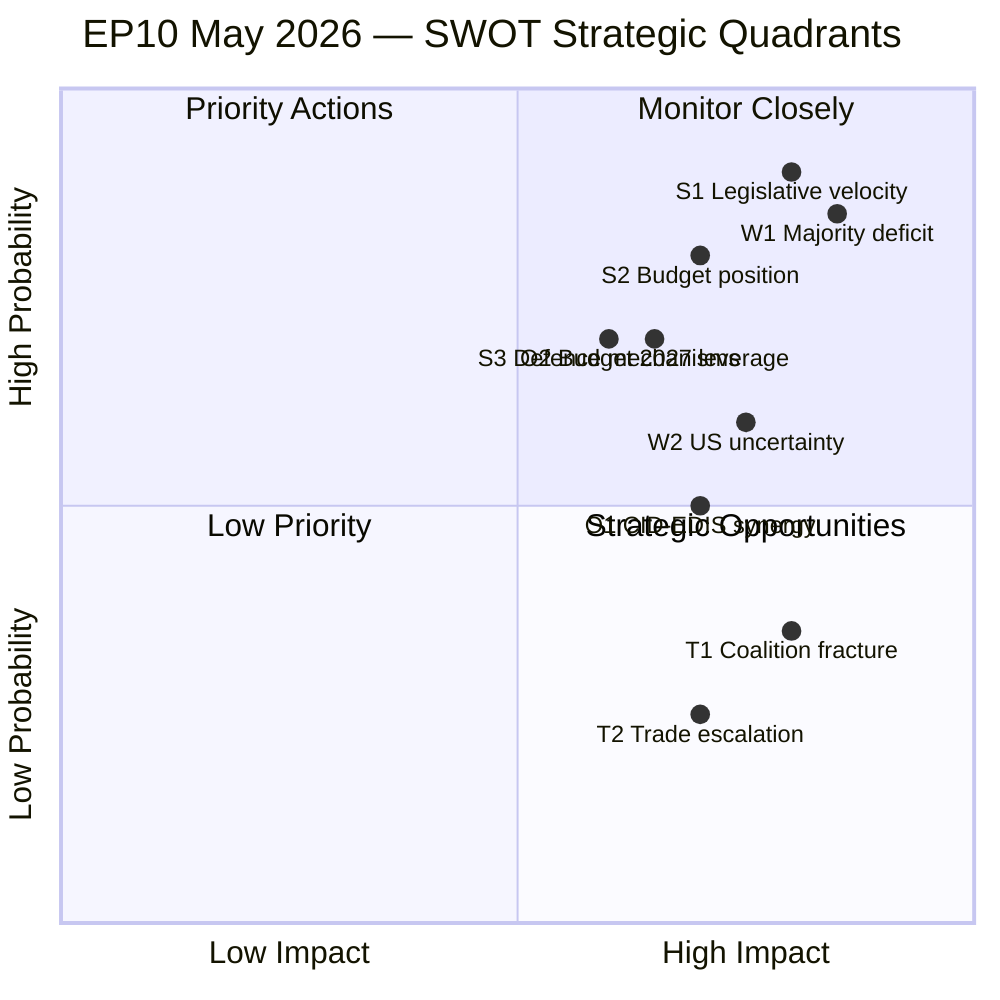

<!-- SPDX-FileCopyrightText: 2024-2026 Hack23 AB -->
<!-- SPDX-License-Identifier: Apache-2.0 -->

# Quantitative SWOT Analysis — EU Parliament: April 30 – May 30, 2026

**Framework:** Weighted SWOT with quantitative scoring (Competitive Intelligence Institute methodology)  
**Date:** 2026-04-30 | **Article Type:** month-ahead  
**Admiralty Rating:** B2

---

## Scoring Methodology

Each SWOT item is scored on:
- **Magnitude (M):** 1-5 scale (1=minor, 5=critical)  
- **Certainty (C):** 1-5 scale (1=speculative, 5=confirmed)  
- **Strategic Weight (W):** Composite score = M × C

---

## STRENGTHS

### S1: Budget 2027 Guidelines Adopted On Schedule
- **Magnitude:** 5 | **Certainty:** 5 | **Weight: 25**
- EP delivered Budget 2027 guidelines (TA-10-2026-0112) on April 28, exactly on the historical precedent timeline. This demonstrates institutional capacity and sets the Council trilogue calendar on track for September 2026.
- **Evidence:** Adopted text confirmed via EP Open Data Portal; historical baseline confirms this is consistent with EP8/EP9 budget timelines.
- **Confidence:** 🟢 HIGH

### S2: High Legislative Momentum — Record EP10 Output
- **Magnitude:** 4 | **Certainty:** 5 | **Weight: 20**
- EP10 2026 is tracking 46% above the EP7-EP9 average for legislative acts (114 acts through April vs. ~98 historical average). Roll-call votes (567 YTD) and committee meetings (2,363 YTD) are similarly elevated. This institutional momentum creates structural resistance to disruptive agenda changes.
- **Evidence:** `get_all_generated_stats` confirmed multi-year dataset.
- **Confidence:** 🟢 HIGH

### S3: Established Trade Defence Mechanism
- **Magnitude:** 4 | **Certainty:** 4 | **Weight: 16**
- The March 26 tariff adjustment text (TA-10-2026-0096) establishes a legal mechanism for EU trade retaliation, reducing the urgency of emergency legislative action in May if US tariffs escalate. This is a proactive strength that improves the EU's negotiating position.
- **Evidence:** Adopted text confirmed in `get_adopted_texts`.
- **Confidence:** 🟢 HIGH

### S4: Ukraine Support Mechanism Enacted
- **Magnitude:** 4 | **Certainty:** 5 | **Weight: 20**
- The enhanced cooperation Ukraine loan (TA-10-2026-0010) is enacted and operational. This removes Ukraine support from the list of immediately contested legislative battles, allowing May 2026 to focus on other strategic priorities.
- **Evidence:** Confirmed adopted text.
- **Confidence:** 🟢 HIGH

### S5: EPP Pivot Capacity — Institutional Flexibility
- **Magnitude:** 3 | **Certainty:** 4 | **Weight: 12**
- EPP's ability to form different coalitions on different dossiers (centre for CID/environment, centre-right for EDIS/migration) provides policy flexibility not available in more rigid coalition systems. This is a structural strength of the EP's distributed power model.
- **Evidence:** Coalition dynamics analysis, historical baseline EP9 analogues.
- **Confidence:** 🟡 MEDIUM

**Total Strengths Weight: 93**

---

## WEAKNESSES

### W1: Grand Coalition Impossible — Structural Majority Deficit
- **Magnitude:** 5 | **Certainty:** 5 | **Weight: 25**
- EPP+S&D = 320 seats — 41 below the 361 majority threshold. Every legislative vote requires a minimum 3-group coalition. This structural weakness makes legislative management more complex and fragile than any prior EP term.
- **Evidence:** EP seat distribution confirmed, majority threshold 361/719.
- **Confidence:** 🟢 HIGH

### W2: EP API Degradation — Data Quality Limitation
- **Magnitude:** 3 | **Certainty:** 5 | **Weight: 15**
- Key EP data feeds (events feed, procedures feed, voting records) are chronically degraded. The `get_events_feed` returns errors, `get_procedures_feed` returns historical data. This limits analytical capability for near-term legislative pipeline assessment.
- **Evidence:** mcp-reliability-audit.md documents all failures.
- **Confidence:** 🟢 HIGH

### W3: Vote Cohesion Data Unavailable
- **Magnitude:** 3 | **Certainty:** 5 | **Weight: 15**
- EP Open Data Portal does not expose per-MEP roll-call positions. Coalition stability assessments must rely on seat-share proxies rather than actual voting behaviour. This weakens the predictive quality of all coalition analysis.
- **Evidence:** `analyze_coalition_dynamics` returns NULL cohesion data.
- **Confidence:** 🟢 HIGH

### W4: Multiple Competing Legislative Axes — Resource Contention
- **Magnitude:** 4 | **Certainty:** 4 | **Weight: 16**
- CID, EDIS, and Budget 2027 all require intensive committee work simultaneously. EP's committee capacity (ITRE, ENVI, BUDG, INTA, ECON all active) faces scheduling pressure. Historically, resource contention has led to priority ranking that disadvantages lower-profile items.
- **Evidence:** PESTLE analysis §Political; stakeholder map §Committee dynamics.
- **Confidence:** 🟡 MEDIUM

**Total Weaknesses Weight: 71**

---

## OPPORTUNITIES

### O1: CID as Industrial Policy Signal — European Sovereignty Narrative
- **Magnitude:** 4 | **Certainty:** 3 | **Weight: 12**
- If CID passes committee stage on schedule, it establishes a European industrial sovereignty narrative that can mobilise cross-group support and public legitimacy for further EU integration steps. The clean industrial transition story resonates with both EPP (competitiveness) and S&D (jobs) audiences.
- **Evidence:** PESTLE analysis §Economic; stakeholder map §Industrial groups.
- **Confidence:** 🟡 MEDIUM

### O2: EDIS as Strategic Autonomy Milestone
- **Magnitude:** 4 | **Certainty:** 3 | **Weight: 12**
- EDIS vote success would be a landmark moment for EU defence integration, reinforcing the EU's strategic autonomy claim at a time of NATO uncertainty. This has long-term implications for EU's geopolitical positioning.
- **Evidence:** PESTLE analysis §Political; threat model §EDIS risk.
- **Confidence:** 🟡 MEDIUM

### O3: US Trade Confrontation — EU Industrial Policy Accelerator
- **Magnitude:** 3 | **Certainty:** 2 | **Weight: 6**
- Paradoxically, US trade pressure creates political momentum for EU domestic industrial policy. CID and European strategic autonomy initiatives gain urgency when external economic threats materialise. Historical precedent: US Section 232 (2018) accelerated EU trade defence tool development.
- **Evidence:** Scenario forecast §Trade Shock; historical baseline §US-EU trade episodes.
- **Confidence:** 🟡 MEDIUM

**Total Opportunities Weight: 30**

---

## THREATS

### T1: EPP Coalition Pivot Failure — Legislative Gridlock
- **Magnitude:** 5 | **Certainty:** 3 | **Weight: 15**
- If EPP cannot manage both centre (CID) and centre-right (EDIS) coalitions simultaneously, one or both key May items will fail. This is the highest-impact threat.
- **Evidence:** Threat model §Threat 1; coalition dynamics §stress indicators.
- **Confidence:** 🟡 MEDIUM

### T2: IMF Growth Downgrade Under Trade Shock
- **Magnitude:** 4 | **Certainty:** 2 | **Weight: 8**
- A May 2026 IMF or Commission downgrade to EU GDP growth (from 1.3% to <0.8%) would force Budget 2027 assumptions to be reconsidered, potentially requiring BUDG committee to revise April 28 guidelines.
- **Evidence:** Economic context §downside risk; scenario forecast §Trade Shock.
- **Confidence:** 🔴 LOW (probability ~15-20%)

### T3: PfE-ECR Pressure Normalising EPP Right-Drift
- **Magnitude:** 4 | **Certainty:** 3 | **Weight: 12**
- If EPP accepts PfE-compatible positions on migration or rule of law to maintain right-bloc support for EDIS, the centre coalition (MWC Type A) is compromised for other legislative priorities. Coalition architecture contamination is a slow-moving but high-severity threat.
- **Evidence:** Coalition dynamics §defection risks; wildcards §Grey Rhino.
- **Confidence:** 🟡 MEDIUM

**Total Threats Weight: 35**

---

## SWOT Quantitative Summary

| Category | Total Weight | Net Score |
|----------|-------------|-----------|
| Strengths | 93 | +93 |
| Weaknesses | 71 | -71 |
| Opportunities | 30 | +30 |
| Threats | 35 | -35 |
| **Net Strategic Position** | — | **+17 (Positive)** |

**Strategic interpretation:** The positive net score (+17) reflects that EP10's institutional strengths (high output momentum, enacted mechanisms, established coalitions) outweigh the structural weaknesses and external threats for the 30-day window. However, the margin is not large. The primary risk is the W1/T1 intersection (structural majority deficit combined with EPP coalition management failure) — which represents the most plausible path to a negative outcome.

**Confidence:** 🟡 MEDIUM — quantitative scores carry inherent analytical uncertainty. The directional assessment (positive but fragile) is robust; specific weight values are indicative rather than precise.

---

## SWOT Interaction Matrix

**WEP Assessment for net position:** The positive net score (+17) reflects an overall assessment of **WEP: Likely Stable** for EP10 institutional performance in May 2026. The 35-point spread between positive (Strengths + Opportunities = +123) and negative (Weaknesses + Threats = -106) components supports this WEP band with 🟡 MEDIUM confidence.

