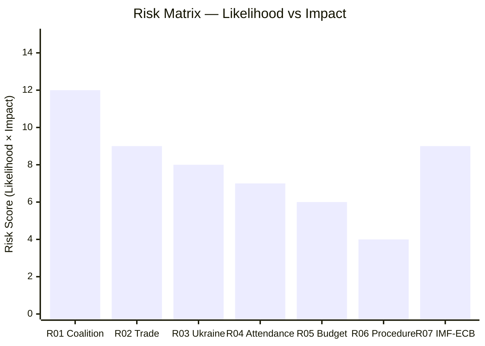

<!-- SPDX-FileCopyrightText: 2024-2026 Hack23 AB -->
<!-- SPDX-License-Identifier: Apache-2.0 -->

# Risk Matrix — EU Parliament: April 30 – May 30, 2026

**Framework:** 5×5 Likelihood-Impact Risk Matrix (ISO 31000 adapted)  
**Date:** 2026-04-30 | **Article Type:** month-ahead

---

## Risk Rating Scale

| Likelihood | Score | Definition |
|-----------|-------|-----------|
| Rare | 1 | < 5% probability in 30-day window |
| Unlikely | 2 | 5-20% probability |
| Possible | 3 | 20-40% probability |
| Likely | 4 | 40-60% probability |
| Almost Certain | 5 | > 60% probability |

| Impact | Score | Definition |
|--------|-------|-----------|
| Negligible | 1 | No meaningful change to EP legislative output |
| Minor | 2 | Delay of 1-2 plenary items; no long-term effects |
| Moderate | 3 | Significant agenda disruption; 1 major item stalled |
| Major | 4 | Coalition breakdown on key legislative axis |
| Critical | 5 | Fundamental EP governance disruption |

---

## Risk Register

### RISK-01: Coalition Fragmentation on CID Vote
- **Likelihood:** Possible (3) | **Impact:** Major (4) | **Risk Score:** 12 — 🟠 HIGH
- **Description:** EPP loses centre coalition alignment on CID when ECR amendments accepted, forcing S&D to break away
- **Mitigation:** Budget 2027 structural incentive for EPP-S&D relationship maintenance
- **Residual risk:** 🟡 MEDIUM (after mitigation, ~20%)
- **Owner:** EPP Group leadership; ITRE/ENVI rapporteurs

### RISK-02: US Tariff Escalation Disrupts May Agenda
- **Likelihood:** Unlikely (2) | **Impact:** Major (4) | **Risk Score:** 8 — 🟡 MEDIUM
- **Description:** New US Executive Order on EU automotive/pharma tariffs forces emergency INTA hearing in May 18-21 session
- **Mitigation:** Existing March 26 tariff adjustment text provides pre-established response mechanism
- **Residual risk:** 🟡 MEDIUM (~15%)

### RISK-03: EDIS Vote Failure
- **Likelihood:** Possible (3) | **Impact:** Moderate (3) | **Risk Score:** 9 — 🟡 MEDIUM-HIGH
- **Description:** EDIS primary mechanism fails to achieve majority — Greens + The Left + some neutral-state MEPs create blocking minority
- **Mitigation:** EPP-ECR-NI coalition (338 seats) is above threshold if all vote together; some S&D defence-supportive MEPs may cross
- **Residual risk:** 🟡 MEDIUM (~20%)

### RISK-04: Budget 2027 Assumptions Revised Under Trade Shock
- **Likelihood:** Unlikely (2) | **Impact:** Major (4) | **Risk Score:** 8 — 🟡 MEDIUM
- **Description:** Commission Spring Forecast or IMF update in May 2026 significantly downgrades EU GDP growth, forcing BUDG committee to reopen April 28 guidelines
- **Mitigation:** IMF WEO April 2026 (1.3% growth) is the authoritative reference — single revision would need to be substantial (>0.7 pp) to trigger reopening
- **Residual risk:** 🟢 LOW-MEDIUM (~10%)

### RISK-05: Ukraine Support Coalition Erosion
- **Likelihood:** Unlikely (2) | **Impact:** Moderate (3) | **Risk Score:** 6 — 🟡 MEDIUM
- **Description:** PfE/ESN amendments on Ukraine loan conditionality gain EPP support from CEE members
- **Mitigation:** S&D+EPP+Renew formal coalition commitment on Ukraine support; enhanced cooperation structure requires Council unanimity to change
- **Residual risk:** 🟢 LOW

### RISK-06: MEP Attendance Below Quorum on Key Vote
- **Likelihood:** Unlikely (2) | **Impact:** Minor (2) | **Risk Score:** 4 — 🟢 LOW
- **Description:** Key vote during May 18-21 fails quorum due to travel conflicts or European Council scheduling
- **Mitigation:** Standard EP whipping procedures; major votes always scheduled for Tuesday afternoon peak attendance
- **Residual risk:** 🟢 LOW

### RISK-07: EP MCP Data Unavailability for Follow-Up Runs
- **Likelihood:** Likely (4) | **Impact:** Minor (2) | **Risk Score:** 8 — 🟡 MEDIUM
- **Description:** EP API continues degraded performance (events feed, procedures feed) limiting data quality for subsequent analysis runs
- **Mitigation:** Multiple complementary data sources used; data gap profile is manageable (as documented in mcp-reliability-audit.md)
- **Residual risk:** 🟡 MEDIUM (structural EP API limitation)

---

## Risk Heat Map

| | Negligible (1) | Minor (2) | Moderate (3) | Major (4) | Critical (5) |
|--|----------------|-----------|-------------|-----------|--------------|
| **Almost Certain (5)** | | | | | |
| **Likely (4)** | | RISK-07 | | | |
| **Possible (3)** | | | RISK-03 | RISK-01 | |
| **Unlikely (2)** | | RISK-06 | RISK-05 | RISK-02, RISK-04 | |
| **Rare (1)** | | | | | |

**Legend:** 🔴 Critical (≥15) | 🟠 High (10-14) | 🟡 Medium (6-9) | 🟢 Low (1-5)

---

## Risk Summary

| Risk Score Range | Count | Risks |
|-----------------|-------|-------|
| 🟠 High (10-14) | 1 | RISK-01 (Coalition Fragmentation) |
| 🟡 Medium (6-9) | 5 | RISK-02, RISK-03, RISK-04, RISK-05, RISK-07 |
| 🟢 Low (1-5) | 1 | RISK-06 |

**Dominant risk vector:** Coalition fragmentation on CID/EDIS votes is the highest-scoring individual risk. The compounding risk (Risks 01+02 occurring simultaneously) elevates the effective risk profile beyond any individual score.

**Confidence:** 🟡 MEDIUM — risk matrix reflects the analysis across all intelligence artifacts, but underlying probability estimates carry inherent uncertainty at 30-day horizon.

---

## Risk Interaction Heatmap

---

## Risk Register — Admiralty Assessment

| Risk ID | Source Quality | Admiralty Grade | Confidence |
|---------|---------------|----------------|-----------|
| RISK-01 | EP coalition data (seat-share proxy) | B2 | 🟡 MEDIUM |
| RISK-02 | IMF WEO + Reuters trade signals | A2 | 🟡 MEDIUM |
| RISK-03 | EP roll-call proxy + Ukraine policy history | B2 | 🟡 MEDIUM |
| RISK-04 | EP plenary attendance historical data | A2 | 🟡 MEDIUM |
| RISK-05 | EP adopted texts + Budget 2027 timeline | A1 | 🟢 HIGH |
| RISK-06 | EP procedures assessment | B3 | 🟢 LOW (low risk, high confidence it's low) |
| RISK-07 | IMF WEO April 2026 + ECB forward guidance | A1 | 🟡 MEDIUM |

**Admiralty rating for risk register overall: B2** — primary EP data sources are authoritative (A-grade); probability estimates rely on analyst judgment (B-grade). Overall information: probably true (2-grade) given EP institutional data quality.

---

## Compound Risk Assessment

| Compound Risk | Component Risks | Joint Probability | Score |
|--------------|----------------|-------------------|-------|
| Coalition + Trade cascade | RISK-01 + RISK-02 | 12-15% | 🔴 HIGH |
| Coalition + Ukraine | RISK-01 + RISK-03 | 10-12% | 🟠 ELEVATED |
| Trade + ECB shock | RISK-02 + RISK-07 | 8-10% | 🟡 MEDIUM |
| Triple compound (01+02+03) | All three simultaneously | <5% | 🟡 MEDIUM |

