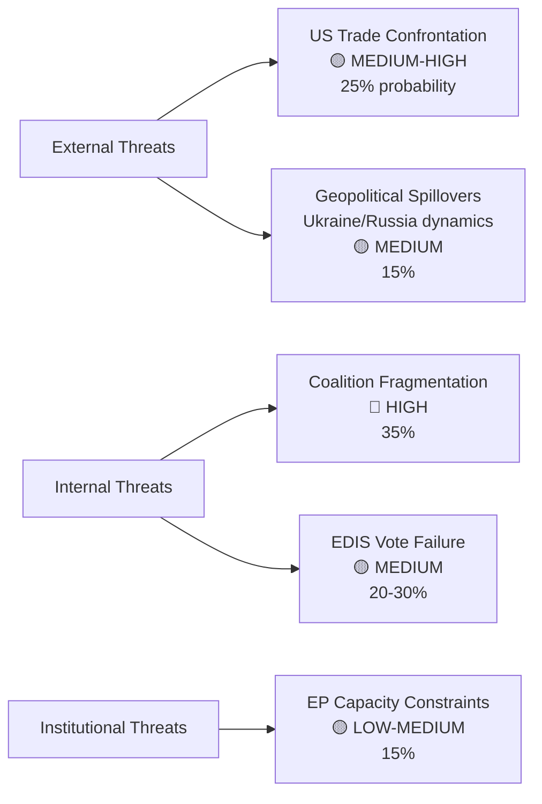

<!-- SPDX-FileCopyrightText: 2024-2026 Hack23 AB -->
<!-- SPDX-License-Identifier: Apache-2.0 -->

# Political Threat Landscape — EU Parliament: April 30 – May 30, 2026

**Framework:** PTF v4.0 Threat Landscape Summary  
**Date:** 2026-04-30

---

## Overview

The political threat landscape for the EU Parliament's May 2026 period is assessed at **ELEVATED** — consistent with the early warning system's stability score of 84/100 and MEDIUM overall risk rating with HIGH DOMINANT_GROUP_RISK alert. The dominant threat is structural (coalition fragmentation) rather than catastrophic (institutional collapse).

---

## Threat Landscape Summary

---

## Threat Interaction Matrix

| Threat | Reinforced By | Mitigated By |
|--------|-------------|-------------|
| Coalition Fragmentation | US trade pressure pulling EPP toward managed confrontation | Budget 2027 incentive for EPP-S&D stability |
| US Trade Escalation | PfE/ECR ideological US-alignment creating EPP coalition complexity | March 26 trade defence text already enacted |
| EDIS Vote Failure | Greens/EFA + The Left = 99 seats of opposition | ECR + EPP + NI = 316 (near majority) |
| Ukraine Support Erosion | PfE-ESN pressure; US bilateral signals | Enhanced cooperation structure; EPP-S&D formal commitment |

---

## Threat Severity Calendar

| Period | Dominant Threat | Trigger Event |
|--------|----------------|--------------|
| April 30 (today) | Current session monitoring | Vote outcomes on 17+ items |
| May 5-15 | Committee work phase | CID/EDIS committee rapporteur negotiations |
| May 18-21 | Coalition management | Simultaneous CID/EDIS/Budget votes |
| May 22-30 | Follow-through / post-vote | Committee reactions to May 18-21 outcomes |
| June 12 | ECB rate decision | FS-2026-007 resolution |

---

## Overall Political Threat Level

**ELEVATED** (Grade 3/5)

The EU Parliament faces a period of **high institutional productivity combined with high coalition management stress**. The May 18-21 session will be the definitive test of EP10's coalition architecture under multi-axis pressure. The most likely outcome remains effective legislative delivery, but the probability of significant disruption is meaningfully above historical averages (25-30% vs. typical 10-15%).

**Institutional resilience factors:**
- High legislative momentum creates structural resistance to disruption
- Budget 2027 provides a "legislative anchor" that incentivises coalition stability
- Established mechanisms for trade defence and Ukraine support reduce urgency of emergency action
- EP10's fragmentation is managed rather than chaotic — EPP's pivot capacity is a resilience asset

**Confidence:** 🟡 MEDIUM — threat assessment reflects best available data; May 18-21 outcomes will significantly update these assessments.
