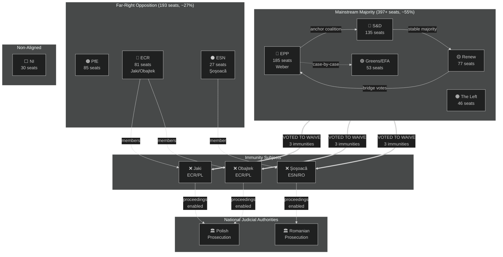

<!-- SPDX-FileCopyrightText: 2024-2026 Hack23 AB -->
<!-- SPDX-License-Identifier: Apache-2.0 -->

# Actor Mapping — EP Motions: April 28–29, 2026 Strasbourg Plenary

**Article Type:** motions | **Run Date:** 2026-04-30 | **Confidence:** 🟡 Medium
**Methodology:** Power-Interest Grid + Coalition Adjacency Map

---

## Actor Roster

### Tier 1 — Decision-Making Actors (directly shaped outcomes)

| Actor | Role | Position on Immunity | Position on Budget | Influence |
|-------|------|---------------------|--------------------|-----------|
| **EPP (185 seats)** | Lead majority | PRO waiver | PRO conservative guidelines | Very High |
| **S&D (135 seats)** | Coalition partner | PRO waiver | PRO social spending lines | Very High |
| **Renew Europe (77 seats)** | Coalition partner | PRO waiver | PRO balanced guidelines | High |
| **JURI Committee** | Procedural authority | Recommended all 3 waivers | N/A | High |
| **BUDG Committee** | Budget authority | N/A | Drafted guidelines | High |
| **Patryk Jaki (ECR/PL)** | Immunity subject | Opposes own waiver | Opposed budget | Low |
| **Daniel Obajtek (ECR/PL)** | Immunity subject | Opposes own waiver | Opposed budget | Low |
| **Diana Şoşoacă (ESN/RO)** | Immunity subject | Opposes own waiver | Opposed budget | Low |
| **Manfred Weber (EPP/DE)** | EPP President | Aligned with waiver | Shapes fiscal priorities | Very High |

### Tier 2 — Significant Influencers (shaped agenda/narrative)

| Actor | Role | Stance |
|-------|------|--------|
| **ECR Group (81 seats)** | Opposition bloc | Opposed waivers, opposed budget guidelines |
| **PfE Group (85 seats)** | Opposition bloc | Opposed mainstream agenda |
| **ESN Group (27 seats)** | Far-right opposition | Opposed all waiver votes |
| **Greens/EFA (53 seats)** | Progressive partner | PRO waivers, PRO green budget lines |
| **The Left (46 seats)** | Progressive partner | PRO waivers, pushed social spending |
| **NI (30 seats)** | Non-attached | Mixed positions |

### Tier 3 — External Stakeholders (affected, not voting)

| Actor | Stake | Expected Outcome |
|-------|-------|-----------------|
| **Polish Prosecution** | Legal proceedings against Jaki/Obajtek | Enabled to proceed |
| **Romanian Prosecution** | Proceedings against Şoşoacă | Enabled to proceed |
| **PiS party (Poland)** | ECR's national partner, MEPs subject to proceedings | Domestic political damage |
| **Transport/logistics sector** | GHG accounting compliance burden | Compliance costs imposed |
| **Animal welfare NGOs** | Dog/cat welfare regulation | Policy objective achieved |
| **EU Budget Member States** | 2027 budget allocation | Budget negotiations triggered |

---

## Alliance Map (Mermaid)



---

## Power-Interest Grid

```
HIGH POWER
│
│    EPP ●    S&D ●    JURI ●
│
│    Renew ●                    Polish Prosecution ●
│
│    ECR ●   PfE ●
│
│    Greens●  Left●
│
│    ESN ●   NI ●          Animal NGOs ●
│
│                 Jaki●  Obajtek●  Şoşoacă●
LOW POWER
└─────────────────────────────────────────
     LOW INTEREST          HIGH INTEREST
```

*Actors toward HIGH POWER + HIGH INTEREST are the key pivot points; the three immunity subjects are HIGH INTEREST but LOW POWER (they cannot prevent their own waiver).*

---

## Coalition Stability Analysis

**Core Majority (EPP+S&D+Renew = 397):** Stable on rule-of-law votes. Diverges on:
- Social spending (EPP vs. S&D/Left)
- Climate ambition (EPP vs. Greens)
- Defence spending (EPP leads, S&D follows with conditions)

**Extended Supermajority (+ Greens+Left = 496):** Achievable on rights-based issues (immunity, democratic norms). Not available on budget fiscal lines.

**Far-Right Bloc (PfE+ECR+ESN = 193):** Outnumbered by ~200 seats on contested votes. Can delay via amendments and procedural challenges but cannot block final votes.

---

## Reader Briefing

**Who actually decides in the EU Parliament?**

Three party groups — the centre-right EPP (biggest group with 185 MEPs), the centre-left Socialists, and the liberal Renew Europe — together control more than 55% of seats. This is enough to pass almost anything they agree on. For sensitive votes like stripping immunity from colleagues, Greens and the Left usually also vote with the mainstream, making the majority even larger.

The far-right parties (ID-linked PfE, ECR with Polish nationalists, and the smaller ESN) are significant in numbers but lack the votes to block the mainstream. Their influence is mainly rhetorical — they can make noise, but the votes go against them.

The three MEPs who lost their immunity this week (Jaki, Obajtek, Şoşoacă) were all members of far-right groups and cannot vote against their own immunity waiver procedure. They were the subjects, not participants, in the key decision.

---

**Data Sources:** EP political landscape API 2026, current MEPs API, adopted texts April 2026. EP Open Data Portal, CC BY 4.0.
