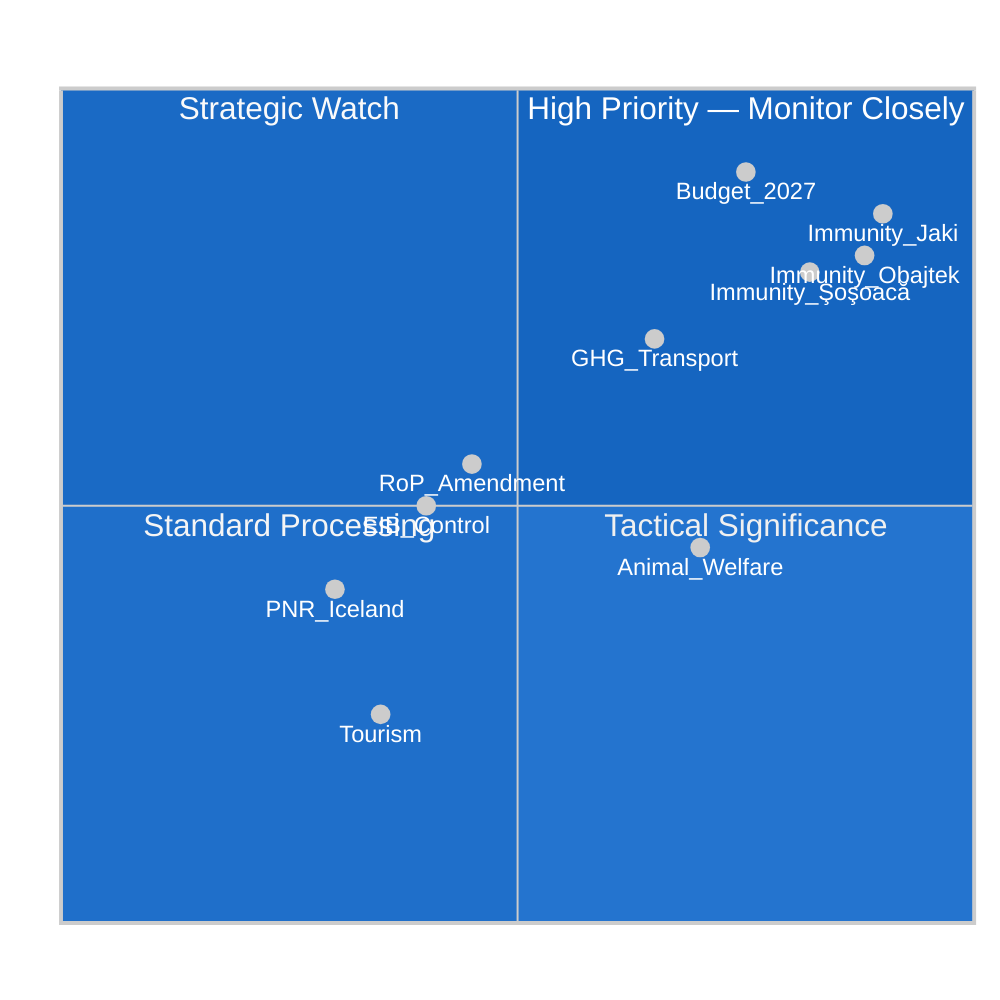

<!-- SPDX-FileCopyrightText: 2024-2026 Hack23 AB -->
<!-- SPDX-License-Identifier: Apache-2.0 -->

# Impact Matrix — EP Motions: April 28–29, 2026 Strasbourg Plenary

**Article Type:** motions | **Run Date:** 2026-04-30 | **Confidence:** 🟡 Medium
**Source:** EP Open Data Portal | **Mermaid Type:** heatmap/quadrant

---

## Event List

| ID | Motion | Date | Procedure |
|----|--------|------|-----------|
| E1 | Immunity waiver — Patryk Jaki (TA-10-2026-0105) | 2026-04-28 | PRIV |
| E2 | Immunity waiver — Daniel Obajtek (TA-10-2026-0106) | 2026-04-28 | PRIV |
| E3 | Immunity waiver — Diana Şoşoacă (TA-10-2026-0108) | 2026-04-28 | PRIV |
| E4 | 2027 Budget Guidelines — Section III (TA-10-2026-0112) | 2026-04-28 | BUDG |
| E5 | GHG Accounting for Transport Services (TA-10-2026-0113) | 2026-04-28 | ENV/TRAN |
| E6 | Welfare of Dogs and Cats (TA-10-2026-0115) | 2026-04-28 | AGRI/ENVI |
| E7 | Rules of Procedure — Agency Appointments (TA-10-2026-0118) | 2026-04-28 | AFCO |
| E8 | EIB Group Financial Control 2024 (TA-10-2026-0119) | 2026-04-28 | CONT |
| E9 | Performance-Based Instruments Transparency (TA-10-2026-0122) | 2026-04-28 | BUDG |
| E10 | Tourism & Cultural Heritage (TA-10-2026-0123) | 2026-04-28 | TRAN/CULT |
| E11 | EU Budget Discharge — Committee of Regions (TA-10-2026-0132) | 2026-04-29 | BUDG/CONT |
| E12 | EU-Iceland PNR Agreement (TA-10-2026-0142) | 2026-04-29 | LIBE/AFET |

---

## Stakeholder Impact Matrix

| Stakeholder | E1 Jaki | E2 Obajtek | E3 Şoşoacă | E4 Budget | E5 GHG | E6 Animal | E7 RoP | E8 EIB | Net |
|-------------|---------|-----------|-----------|---------|------|---------|------|-----|-----|
| EPP Group | +3 | +3 | +3 | +4 | +2 | +2 | +3 | +2 | +22 |
| S&D Group | +4 | +4 | +4 | +3 | +3 | +3 | +2 | +2 | +25 |
| Renew Europe | +3 | +3 | +3 | +3 | +3 | +2 | +2 | +2 | +21 |
| ECR Group | -4 | -4 | -1 | -2 | -2 | +1 | -1 | 0 | -13 |
| PfE Group | -2 | -1 | -1 | -3 | -3 | +1 | -1 | 0 | -10 |
| ESN Group | -1 | -1 | -4 | -2 | -2 | +1 | -1 | 0 | -10 |
| Greens/EFA | +3 | +3 | +3 | +2 | +4 | +4 | +1 | +1 | +21 |
| The Left | +3 | +3 | +3 | +1 | +3 | +4 | +1 | +1 | +19 |
| Patryk Jaki | -5 | 0 | 0 | 0 | 0 | 0 | 0 | 0 | -5 |
| Daniel Obajtek | 0 | -5 | 0 | 0 | 0 | 0 | 0 | 0 | -5 |
| Diana Şoşoacă | 0 | 0 | -5 | 0 | 0 | 0 | 0 | 0 | -5 |
| Polish judiciary | +5 | +5 | 0 | 0 | 0 | 0 | 0 | 0 | +10 |
| Romanian judiciary | 0 | 0 | +5 | 0 | 0 | 0 | 0 | 0 | +5 |
| Transport/logistics | 0 | 0 | 0 | 0 | -3 | 0 | 0 | 0 | -3 |
| Animal welfare NGOs | 0 | 0 | 0 | 0 | 0 | +5 | 0 | 0 | +5 |
| EU citizens | +2 | +2 | +2 | +1 | +2 | +4 | +1 | +1 | +15 |

*Scale: -5 (highly negative) to +5 (highly positive); 0 = neutral/no impact*

---

## Heat Map (Impact Intensity × Political Significance)

---

## Cascade Effects

**E1–E3 (Immunity Waivers) → Cascade Chain:**
- Short-term (0–30 days): National judicial proceedings against Jaki, Obajtek, Şoşoacă can proceed; ECR and ESN face internal solidarity test
- Medium-term (1–6 months): ECR group credibility on rule-of-law issues tested; potential PiS-linked MEPs under further judicial scrutiny
- Long-term (6–18 months): If proceedings result in conviction or significant legal action, ECR's positioning on rule of law fundamentally compromised; EP precedent strengthened for judicial cooperation

**E4 (2027 Budget Guidelines) → Cascade Chain:**
- Shapes Commission's draft budget (expected Q2 2026)
- Trilogue negotiations with Council will reference EP's guidelines as opening position
- Defence spending signals: ReArm Europe context means defence lines in budget will be contentious in Council
- Climate spending: Green Deal line items under negotiation pressure from Council majority

**E5 (GHG Transport) → Cascade Chain:**
- EU logistics and freight sector faces compliance timeline pressure
- Feeds into supply chain regulatory burden debate (EPP deregulation wing vs. Green Deal advocates)
- International trade implications: non-EU freight operators subject to EU market entry rules

---

## Reader Briefing

**What this means for citizens:**

The April 28–29 votes show the EU Parliament acting on three distinct fronts simultaneously. First, on **judicial accountability**: MEPs voted to strip parliamentary immunity from three colleagues facing legal proceedings at home — a powerful signal that the EP will not be used as a legal shield by politicians facing accountability at the national level. Second, on **next year's EU budget**: Parliament laid out its priorities for 2027 spending, reflecting ongoing debates about defence investment, climate action, and regional development. Third, on **everyday regulation**: new rules on how transport companies must account for their carbon emissions, and EU-wide standards for tracing pets, reflect the EP's continuing role as regulator of daily European life.

The high attendance (663 of 719 MEPs present on April 28) indicates these were contested, meaningful votes — not routine procedural business.

---

**Data Sources:** EP adopted texts API 2026, plenary sessions API MTG-PL-2026-04-28/29. Attribution: EP Open Data Portal, CC BY 4.0.
